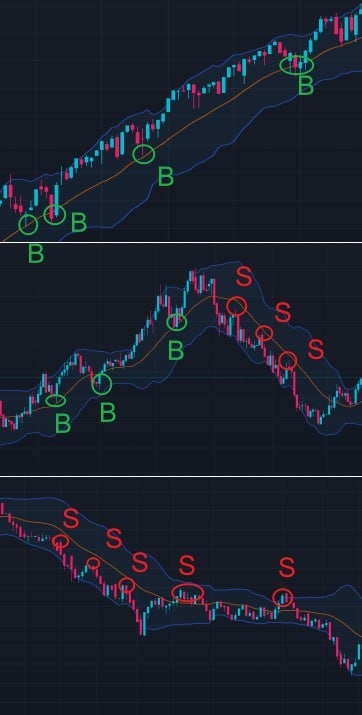

# Trading Secret: Bollinger Bands

To excel in investing, one must return to basic logic, making our investments more relaxed and effortless.

How can we minimize risk and maximize profit? Technical learning is essential.

## 1: Clear Trends

### Clear Trend Characteristic

A great scholar of the past, Mr. Jesse Livermore's core investment philosophy—trend trading—is still widely used by traders around the globe today.

Its key points include:

1. Prices move in the direction of least resistance.
2. Prices move in the direction of the trend.
3. Once a trend is established, it is hard to change.

When all three bands of the Bollinger Bands move upward or downward, it indicates a clear trend characteristic. Therefore, prices are likely to continue in their original direction.

Hence, in trading, we can follow the trend:

- When prices are in a clear uptrend, buy on dips (go long).
- When prices are in a clear downtrend, sell on rallies (go short).

## 2: The Strongest Adjustment Pattern

### The Strongest Adjustment Pattern

In trading, we rarely encounter this pattern: when the upper Bollinger Bands is running horizontally, but the middle and lower bands are still trending upwards.

It represents that the price is in an adjustment phase.
This is an hourly trend chart for $NVDA. When segments A, B, C, and D exhibit such a pattern, the stock price slightly adjusts before continuing its strong upward trend.

## 3: Horizontal Movement

### Horizontal Movement of Bollinger Bands

Practical experience is the best way to teach, whether with EIF tokens or the stocks we hold, all serving as excellent case studies for learning.

- When all threeband of Bollinger Bands move horizontally, the main strategy is to sell high and buy low: sell near the upper band and buy near the lower band.
- This is especially effective the first time the price touches the upper or lower band.
- The larger the price difference between the upper and lower bands, the greater the volatility, the larger the profit range, and the greater the value of the trade.
- Many times, the upper and lower Bollinger Bands will not show a very complete horizontal movement pattern. As long as the middle band is in a horizontal state, this strategy can be used.

## 4: Expansion Pattern

.

### Expansion of the Upper and Lower Bands

When the upper and lower  Bollinger Bands move in opposite directions and the distance between them increases, this is called the expansion pattern. It's a typical trend acceleration pattern.

Joining a trend as it accelerates can significantly reduce the time of the trade, thereby increasing trading efficiency.

Short-term traders need to be decisive in buying and selling when capturing accelerated market movements, and the timing of entry is crucial.

Taking going long as an example:

- The moment of Bollinger Bands expansion, which is when the price breaks above the upper band, is the best buying point (B).
- The time to sell is when the Bollinger Bands can no longer expand (the distance between the upper and lower bands does not continue to widen) (S).

As shown, starting from S1, the distance between the lower and upper bands no longer expands, and the distance from S to S1 is the largest, with the distance decreasing thereafter.

Thus, if point B is the buying point for traders with a trend acceleration style, point S would be the optimal selling point.

## 5: Contraction Pattern

### Contraction of the Upper and Lower Bands

- When the upper and lower bands of the Bollinger Bands move in opposite directions and the distance between them decreases, this is known as the contraction pattern. It's a typical characteristic of a slowing trend.
- In this pattern, both buyers and sellers enter a rest state. As the distance between the upper and lower bands narrows, the volatility of the price decreases, leading to diminishing profit opportunities and reducing the value of trades.
- Therefore, when this pattern occurs, we can choose to refrain from trading, as waiting occupies most of the trading time.
- After the price adjustment is complete, a new trend will emerge, so the contraction of the Bollinger Bands' upper and lower bands will gradually welcome new opportunities.
