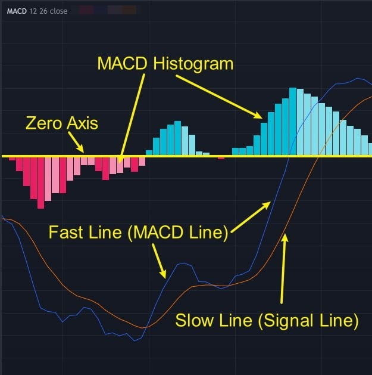
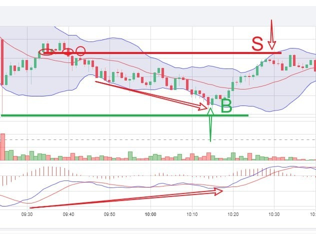
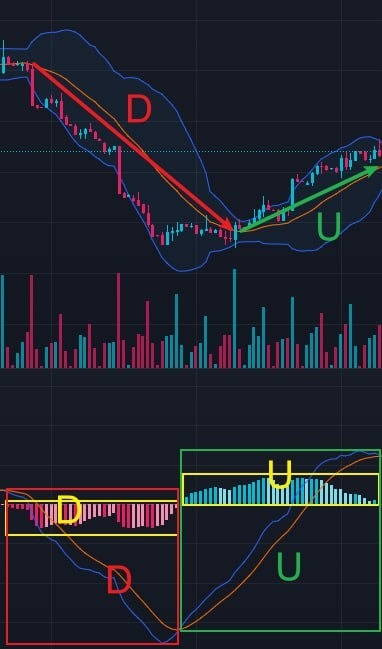
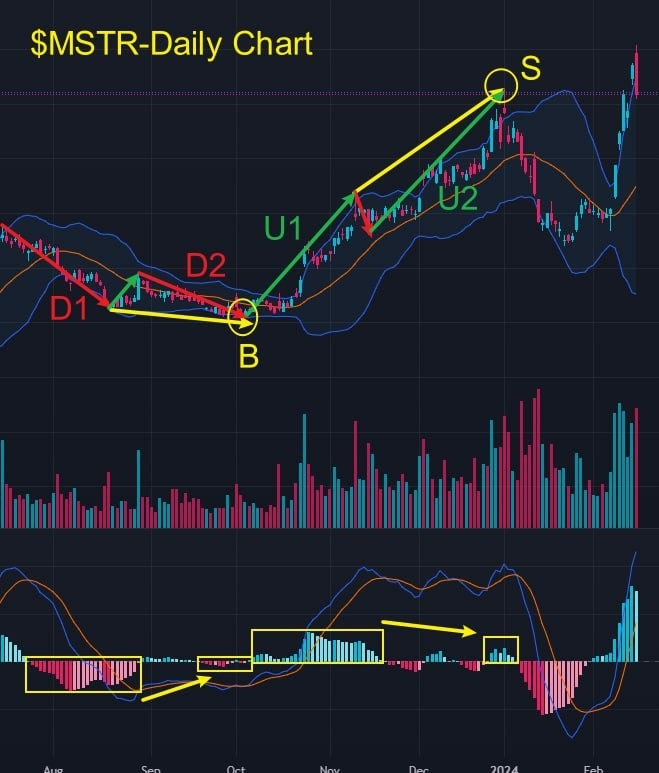

# Basic Applications and Trading Secrets of MACD

> The **MACD** technical indicator is very important. It is a crucial part of **AI ROBOTICS PROFIT 4.0** because of its wide practicality. If *Bollinger Bands* provide a framework for trend analysis then *MACD* is the core basis for accurately determining in which phase a trend is and where the buy and sell points are.

**Moving Average Convergence Divergence (MACD)** is a moving average convergence/divergence indicator, which is a widely used technical analysis tool for judging the trend of stock or other financial asset prices and the buy and sell signals of the market.

MACD consists of four parts:

* **Fast Line (MACD Line):** Calculates the difference between the short-term (12-day) and long-term (26-day) exponential moving averages.
* **Slow Line (Signal Line):** Calculates the moving average of the fast line, usually for 9 days.
* **MACD Histogram:** Drawn from the difference between the fast and slow lines.
* **Zero Axis:** The positive and negative values of the MACD Histogram are separated by the zero axis.

The zero axis of MACD can be used to determine the turning points of price trends. Combining MACD with Bollinger Bands will produce a magical chemical reaction.
In "Basic Applications and Trading Secrets of MACD 1," I will focus on sharing how to use MACD to judge the start, continuation, strengthening, weakening, and end of trends.

## Practical Example

This morning's trade was very straightforward, as shown in the diagram, where we used a 1-minute trend for execution.

It involved some techniques that have not been shared before.

I encourage everyone to follow my thought process to build an impression, and I will share these key points in subsequent courses.

1. The rationale for buy point B:
    * The price was near the support line, which is determined by the lowest point of the candle on the left.
    * The MACD's Signal Line and MACD Line were moving upwards while the price was moving downwards, indicating a classic 'bullish divergence' pattern.

2. The rationale for sell point S:
    * The price was near the resistance line, determined by the demarcation line when the price fell on the left.
    * The MACD Histogram was shortening above the zero axis, indicating a decrease in buying strength, hence a weakening upward trend.

The entire contract trading process lasted about 15 minutes, with a return rate of over 70%, very relaxed and efficient!

## 1 - Judging Trends

The Ai4.0-Trading Signal Decision System includes four important technical indicators, with Bollinger Bands and MACD being two commonly used standard indicators, while the other two are customized.

Attentive friends might have noticed that I often use a combination of Bollinger Bands and MACD for technical analysis.

This combination simplifies technical analysis significantly, allowing for the determination of the trend phase, such as the formation, strengthening, weakening, confusion, and ending of a trend. MACD is used to precisely identify these stages.

1. Most of the time, when the MACD Histogram is positive and the Signal Line and MACD Line are trending upwards, the price is in an uptrend, as shown in the U section of the diagram.

2. When the MACD Histogram is negative and the Signal Line and MACD Line are trending downwards, the price is in a downtrend, as shown in the D section of the diagram.

## 2 - MACD Histogram and the Strengthening and Weakening of Trends

* A MACD Histogram shortening indicates a weakening trend; lengthening indicates a strengthening trend.
* During a trend, the MACD Histogram's move from negative to less negative often forms a buying point; a move from positive to less positive often forms a selling point.

Consider using $NVDA's daily chart to reflect on a question: why did I recommend buying on January 8th, and still advise holding firm today?

One key point is the application of the change in the MACD Histogram's negative values and its relationship to buying points, as discussed today.

Another point is that currently, there is no price break below the middle Bollinger Band and no divergence pattern at the top.

## 3 - Divergence between MACD Histogram and Price

* In an upward trend, when the price is making new highs while the area of the MACD Histogram is shrinking, this indicates a top divergence pattern, often signaling that the upward trend may soon end.
* In a downward trend, when the price is making new lows while the area of the MACD Histogram is shrinking, this indicates a bottom divergence pattern, often signaling that the downward trend may soon end.

In the daily chart of $MSTR:

* The MACD Histogram in segment D2 is smaller than in D1, ultimately forming the buy point B.
* The MACD Histogram in segment U2 is smaller than in U1, ultimately forming the sell point S.

Currently, there is no top divergence pattern, so from the perspective of medium-term trading, it is advisable to continue holding the position.
