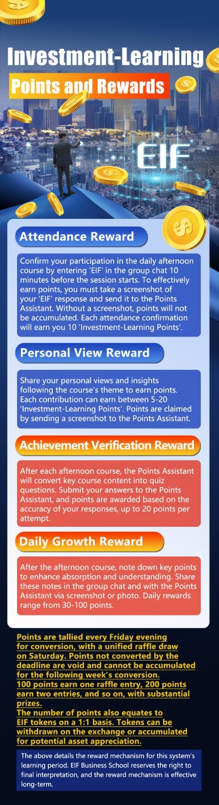

# Monday 20240129

## 08:38AM

Morning Review

Dear Friends,

Thank you all for gathering here today, a special day as the luxurious feast of EIF Business School – the 14th session of our internal sharing course (AI Robotics Profit 4.0) officially begins! We are stepping into our 14th year together, and this year is destined to be a year of soaring heights!

This week is another crucial one: Wall Street is engaged in intense discussions about the timing of interest rate cuts; five major companies - $AAPL, $GOOGL, $MSFT, $AMZN, and $META - will release their quarterly reports this week; and significant data such as the U.S. January ADP Employment Report, Federal Reserve Rate Decision, and Non-Farm Payrolls are soon to be announced...

Therefore, this week could mark the start of a new profit cycle in the stock market.

During today's opening ceremony, I will be giving away 6 important benefits!

## 08:48AM

First, let's briefly outline today's market and trading strategy.
US10Y has fallen close to 1%, providing an excellent buying opportunity for stock indices.

Investment portfolio $MSTR, $NVDA, $TSLA:

- $MSTR, the price surged last Friday with a doubling of the daily trading volume, which can be seen as an establishment of a mid-term turning point.\
This stock will have strong explosive power in the short term, hence it will be our key focus!

- A good retracement buying point appeared on the 15-minute trend chart of $NVDA.

- Cathie Wood, the founder of Ark Investment Management, has been aggressively increasing her position in $TSLA for two consecutive days, injecting excellent market sentiment into the stock.

Overall, today's investment environment is favorable, and the stock portfolio can appropriately increase its position, maintaining around 40%.

New members to the group can consult my assistant for the detailed stock selection rationale and strategy of this portfolio.

## 09:01AM

Every friend who comes to the investment market has a great dream, and 'AI Robotics Profit 4.0' will lead us to greatness!

I am Linton Quadros, the founder of EIF Business School. Once again, welcome everyone to the opening ceremony of this internal sharing session!

In 2008, after experiencing the ultimate turning point in my life, I attempted to summarize my investment philosophy and trading skills, and began to focus on quantitative trading. Out of gratitude to my mentors and friends, and inspired to teach and educate, I founded EIF Business School in 2011.

In 2018, seeing the impact of artificial intelligence on quantitative trading, I started to develop a system encompassing machine learning, neural networks, data sensing, signal decision-making, AI trading, and expert and advisory services in AI trading decision-making and investment advisory - AI Robotics Profit 4.0!

## 09:08AM

As the 'AI Robotics Profit 4.0' system is about to be launched, there is a plethora of information available online. If you are new here, you can learn about us through our official website or by searching for 'EIF Business School' or 'AI Robotics Profit 4.0'.

This internal training session (14th), has started earlier than any of the previous ones. The reason for gathering everyone back and establishing more communication groups is to accelerate the market launch of the 'AI Robotics Profit 4.0 (AI4.0)' investment system application.

Before its launch, we need to build a broader market presence and, more importantly, gather extensive testing data. This is going to be an exciting process!

I need the help of each and every one of you, as this data is more valuable than thousand of recommendation letters!

## 09:27AM

Therefore, I hope each and every one of you will join me in this valuable period before the launch of the AI4.0 investment system application.

I will guide you through its structure and operating principles, lead you to profit in the investment market, acquire some valuable practical and testing data, and achieve considerable returns in the great bull market spurred by the upcoming Federal Reserve rate cuts!

For this purpose, I have made thorough preparations. On one hand, to ensure everyone enjoys a more comfortable experience during the upcoming wonderful journey, and on the other hand, to achieve perfect data analysis in all aspects.

Once again, I thank all members of EIF Business School for their dedication, our more than 20 excellent partners and their hardworking staff, and all new and returning students for joining us!

With great honor, I hereby announce the official opening of the 14th session of the EIF Business School internal sharing ceremony!

## 09:40AM

Next, it's the joyful moment to receive the 6 grand benefits of the opening ceremony!

Benefit 1: Top 10 List of Hot Investment Targets in 2024.

To excel in stock investment, it's crucial to choose a good investment environment.

On one hand, the start of the Fed's rate cut cycle this year provides a bullish market environment; on the other hand, selecting high-quality stocks is key to success.

This Top 10 list, selected by AI4.0-Expert and Investment Advisory System, conservatively estimates an average growth rate of over 200% for these stocks this year!

You can obtain them through my assistant.

Benefit 2: ‘AI Robotics Profit 4.0 (AI 4.0)’ Investment System Course.

This is one of the most anticipated contents, and I will start sharing from today.

It's not just about understanding the operation principles of the AI4.0 investment system, but most importantly, it represents a profitable method – a way for beginners to quickly become experts!

This benefit is divided into two parts:

## 09:54AM

### Part 1: Practical Teaching

- 'Practice is the best teaching method' is our core teaching philosophy. All sharing starts from practical operations, with the core investment concept of pursuing greater returns while ensuring risk control.

- ‘AI 4.0-Ai Programmatic Trading System’ provides opportunities for high-success-rate trading signals in different markets.

- Objective and Commitment: The goal for this year's practical teaching is a total asset return rate of 300%!

If losses occur strictly following our shared trading strategies or signals, we take full responsibility.

### Part 2: Course Sharing

- Sharing key information from ‘AI 4.0-Expert and Investment Advisory System’, which includes crucial investment information for major markets, to grasp market directions accurately.

- Includes the complete tutorial of ‘Ai Robotics Profit 4.0-Trading Signal Decision System’, enabling learners to quickly transition from beginners to practical experts.

## 10:11AM

### Benefit 3: AI Robotics Profit 4.0 Internal Sharing Learning Incentive Mechanism

1. Overview of the Learning Incentive Mechanism
To facilitate rapid learning among all members and create an environment of 'healthy living, efficient investing, learning and sharing, joy and freedom,' this 'Learning Incentive Mechanism' has been established. Participation in EIF Business School's 14th session internal sharing group interaction earns 'Investment-Learning Points,' which can be used for prize draws, gift exchanges, and access to more 'AI Robotics Profit 4.0' usage rights.

## 10:18AM

### 2. Rewards

- 2.1 There are several ways to earn 'Investment-Learning Points', which include: Attendance Reward, Personal Opinion Reward, Achievement Verification Reward, and Daily Growth Reward.
- 2.2 In this internal sharing session, the top 10 participants with the most points will receive the following rewards:
  - The top three performers will receive one-year access to the 'AI Robotics Profit 4.0' institutional version, valued at $1 million.
  - Those ranked 4th to 10th will receive one-year access to the 'AI Robotics Profit 4.0' personal version, valued at $50,000.
- 2.3 Points earned can be exchanged for EIF/USDT tokens, with exchanges occurring once a week. The value of these tokens is expected to increase significantly as the listing of the 'AI Robotics Profit 4.0' investment system approaches.
- 2.4 Additionally, each week, participants earning 100 points can enter a prize draw, with each 100 points offering one entry. The draw is conducted on the Business School's official lottery webpage, accessed through a code provided by the EIF internal sharing group's assistant.
- 2.5 The lottery takes place every week from the close of the stock market to the weekend, with special rules and arrangements during major holidays or planned days.

## 10:32AM

The methods to earn 'Investment-Learning Points' and details about the lottery are as shown in the image.

You can learn more about these details through my assistant, especially the 'Points Assistant'.

### Benefit 4: Mysterious Gift - valued at over 1500 USD

Please contact and tell my assistant that those willing to participate in the three pre-listing stages of the AI 4.0 investment system can cumulatively receive 500 EIF tokens at different stages.

EIF tokens were listed in February 2019 at our strategic partner ICHCOIN cryptocurrency trading center, which has obtained a RIA financial license from the U.S. Securities and Exchange Commission, a financial license from the National Futures Association, and an MSB license from the U.S. Financial Crimes Enforcement Network (FinCEN).

With the market attention brought by the implementation of the AI 4.0 investment system's listing plan this year, it is conservatively estimated that the EIF token's price increase will exceed 500% for the year.

Based on the current price of 0.6 USD per token, the value of 500 EIF tokens is expected to surpass 1500 USD this year.

## 10:50AM

### Benefit 5: Use Rights for the AI 4.0 Investment System Application

All participants of this session (14th) of the internal sharing can receive one-year personal version use rights of the AI 4.0 investment system application (valued at 50,000 USD).

Outstanding participants can receive one-year institutional version use rights (valued at 1,000,000 USD).

### Benefit 6: Opening Ceremony Lottery

Friends who participate in today's opening ceremony can get one chance to participate in the lottery on the business school's official website. The prize list mainly includes:

- An investment target with an expected 500% increase in 2024 - EIF Tokens.
- Prizes valued at 2300 USD.
- And more.

You can obtain these six major benefits and inquire about details by sending a private message to my assistant via Telegram or WhatsApp.

For example, obtaining the 'Top 10 List of Hot Investment Targets in 2024', lottery codes, etc.

## 11:09AM

Recently, we have gained an edge through a portfolio of quality stocks, but this is just the beginning.

To achieve higher returns while maintaining good risk control, it's essential to optimize your investment portfolio.

If you are not clear about the future trend of the stocks you currently hold, you can send a private message to my assistant. She will help you perform a health check on the stocks using the AI4.0 system, thereby providing objective advice.

In the next two days, I will choose an appropriate time to share the most important stock's buying point with everyone. This will allow us to concentrate our positions and achieve high returns, so please be prepared!

Before the market closes, at 3:30 PM Eastern Time, I will start sharing the AI4.0 course.

After the afternoon course, we will conduct the opening ceremony lottery. You can obtain today's benefits in advance through my assistant or the points assistant. We will release business cards later, so please pay attention to add them.

See you later.

## 02:35PM

### Closing Commentary

Dear friends,

As the stock index continues to rise and break new highs, those who haven't yet built their positions should seize the opportunity to buy into my stock portfolio!

- Why does the stock index keep reaching new highs even amidst skepticism? What factors are driving its sustained growth?
- What important trading plans do I have for this week, and how should we prepare?
- The 'Ai Robotics Profit 4.0' investment system course officially begins today, and I will be sharing some vital content shortly.
- Today marks the opening of EIF Business School's 14th internal sharing session. After today's course concludes, we will initiate our first raffle of the week. How can you claim today's opening ceremony benefits?

I will be sharing these crucial details shortly. Stay tuned.

## 02:52PM

Every investment market is filled with various noises daily. To accurately understand the market's direction, it is crucial to clarify the core information and underlying logic.

If this is what you find yourself lacking, please consider pinning our group to the top. In this group, I share daily the essential content extracted from the 'AI 4.0-Expert and Investment Advisory System.'

At the beginning of this month, each of my forecasts for the stock index materialized into reality. Every identified buying opportunity was almost precise, which is a testament to the efficacy of the AI4.0 investment system.

With its guidance, our investment journey becomes significantly more manageable.

This unique value is unparalleled in the world. I am deeply grateful for your joining and support.

In the upcoming days, let us leverage innovative technology to achieve excellence, unite in our efforts, and share a successful future!

Next, I will interpret a professional piece of data for you all, to help understand the current macro-environment.

## 03:20PM

According to the Data Summarized by 'AI 4.0-Expert and Investment Advisory System':

1. January's bond issuance has broken the historical record set in 2017 of approximately $175 billion. Wall Street insiders suggest that more bonds could be issued by the end of the month.
2. We might witness a bond issuance volume of $200 billion this month.
3. The backdrop to this month's surge in bond issuance is the growing awareness among investors that the Federal Reserve has completed its rate hikes and may soon start cutting rates. This has driven bond yields lower, thereby reducing corporate borrowing costs.

I have repeatedly shared the reasons for the rigid negative correlation between U.S. Treasury yields and stock indices: they belong to different risk and return profiles.

For example, when U.S. bond yields decrease, the appeal of bonds diminishes, and investors may turn to the stock market seeking higher returns.

## 03:40PM

For example, when we look back and analyze the 1-hour trend chart of US10Y, we can find some of my recent views and logic:

- When the price approached the resistance line A, I predicted it would fall, and therefore the stock index would rise.
During this period, our stock portfolio performed very well.

- Currently, the price has broken below resistance line B, which has transformed from a support line to a resistance line, indicating that the stock index will continue to rise today.

This provides us with a favorable investment environment. Therefore, in mid-January, I predicted that the second profit growth point of the year would appear!

Friends who took the lead last week are now seeing returns in their stock accounts.

Survival of the fittest applies here. I will have important trading plans coming up, so please be prepared and continue reading.

## 04:05PM

Having grasped the direction of the stock index is like mastering the overall market environment.

However, when the stock index is rising, not all stocks will increase in value.

Likewise, when the stock index is not rising, some sectors will see their stocks collectively go up.

This phenomenon is common in global stock markets, regardless of how we categorize them.

Friends, the second profit growth point since the beginning of the year has already emerged. Shouldn't we pursue even greater profits?
Which sectors are expected to perform well in the near term?
This will be the main topic of my early morning share tomorrow.

Currently, I am focusing on several key sectors and targets. What should friends who want to seize this opportunity with me do?

I have two suggestions:

1. Optimize your investment portfolio.
2. Prepare more funds for investment in the stock market.

## 04:39PM

Each of us comes to the investment market with dreams. Having a good investment portfolio is key to our success!

By optimizing the investment portfolio, we can not only fully hedge market risks to pursue greater profits but also adapt to market changes to ensure financial goals are achieved within a set time frame.

For example, some friends have portfolios with dozens or even hundreds of stocks. Can this approach yield substantial profits? The answer is definitely no.

So, what should we do?

The answer is simple:

1. If we are optimistic about an industry, we only need to grasp the leader in that industry, so there's no need to buy multiple individual stocks.
2. If certain stocks do not fit the current market trend, it's better to temporarily remove them.

There's no need to waste time, as time is indeed wealth!

## 04:56PM

If you're unsure about how to optimize your investment portfolio, I have two effective suggestions:

1. Send a private message to my assistant, and let her use the ‘Ai Robotics Profit 4.0’ investment system to help you. She can perform a health diagnosis on your portfolio holdings and then provide objective advice.

2. Tomorrow morning, free up 30-50% of your portfolio and follow my strategy.

This is a standard operation in each of our internal sharing sessions, but for many new friends, it represents a significant opportunity:

- These stocks are the best of the best. If they can't help us achieve better profits, I believe there's nothing better.

- 'Practice is the best teaching method'. I will explain my course in this way, which is a shortcut to learning and improvement.

One of my students, in about five years, grew his account from an initial capital of 4 million dollars to 150 million dollars by establishing a mature trading system through one case study.

## 05:10PM

The core target that I will share tomorrow is very likely to achieve a rise of 160% within three months!

Therefore, I advise all friends to be prepared for this.

I reiterate the goal and commitment:

- The target for this year's practical teaching is a total asset return rate of 300%, making the operation of this stock crucial!
- We take full responsibility for any losses incurred strictly following our shared trading strategy or signals. This is our consistent teaching philosophy - Students' interests first!

Once the position in this stock is established, I will use the ‘AI 4.0’ investment system to track and operate it throughout the process.

Next, let me share with you the framework of this term's course.

## 05:20PM

Technical indicators are tools that quantify technical analysis. 'The Most Simplest Magical Technical Indicator' allows everyone to quickly determine trends, their strengthening and weakening, as well as their beginnings and ends (buying and selling points). Perhaps you could master them in just an hour.

Regardless of how prices fluctuate, whether your investment style is short-term trading or medium-to-long-term trading, 'GPTs Trend Following Strategies have established seven sets of models and strategies for us.

Its working principle is very simple: you just need to trade according to the conditions in the current trend and the corresponding model. These seven strategies enable us to easily grasp all different types of market movements!

'GPTs Trend Reversal Strategies' is a favorite among professional traders. It is a trading model that minimizes risk and maximizes profit, and it is an upgraded version of 'GPTs Trend Following Strategies'!

Mastering 'GPTs Integrated Strategy' is equivalent to mastering the entirety of the 'Trading Signal Decision System,' allowing you to become a master-level professional trader!

## 05:30PM

Today marks the grand opening of the EIF Business School's 14th internal training session, a momentous occasion given the session's critical role in testing, promoting, and publicizing the 'AI Robotics Profit 4.0' investment system application. To express our gratitude for the support of both new and returning friends, I am delighted to share 6 major benefits.

Have you claimed them yet?

Today, all attendees can receive a lottery code through the 'Points Assistant' to participate in the opening ceremony's lottery and stand a chance to win gifts valued up to $2,315.

Today's extra points reward:

Answer the following question to earn 50-100 'Investment-Learning Points': Watch the video on the homepage of EIF Business School, briefly describe our plan for this year, and share your thoughts and valuable suggestions.

## 05:38PM

New friends can learn about us through our official website (<https://excellencenet.com/>) or by searching for 'EIF Business School' and 'AI Robotics Profit 4.0' online.

1. Tomorrow morning during market opening, I will focus on recommending a stock expected to see a 160% increase in value within three months. How should we adjust our portfolio strategy accordingly?
2. What will be my primary investment direction in 2024?
3. How does the AI4.0 investment system analyze the market?
4. How to predict the price range of movements?

For an investment system with a success rate of up to 90%, this is a very simple proposition. Tomorrow, I will guide everyone through its mysteries: "The Most Simple Yet Magical Technical Indicator(1) - Bollinger Bands Basic Applications (1)".

Tomorrow morning during market opening, I will start sharing these important topics.

Have a great day!

## 07:47PM

> Brief video description:
First and for most, there was a lot of good stuff in the short video, and to focus on where EIF Business, it seems that in the coming year, EIF business school will become the most valuable year, whereas recognizing responsibilities, continually striving and rising, and have a sense of awareness of potential difficulties and believes that everything will get better and better and members shall also improve.

Optimism is a precious gift bestowed upon us by God. However, in the investment market, recognizing the situation and embracing the present with a sense of reverence is the best investment we can make for ourselves.

May we walk this journey together and build a wonderful future.
As a token of appreciation for your recognition, I am gifting you 100 Investment-Learning Points.

## 07:57PM

> My answer:
Utilizing the AI Robotics Profit 4.0 Investment System, created by Professor Quadros, we will learn the “lazy investor system” and the techniques of quantitative trading in diverse investment markets. Advances in artificial intelligence have improved the ability to utilize quantitative trading successfully, through enhanced precision, efficiency and information intelligence. Through the ongoing teaching of Professor Quadros, student investors will gain the knowledge and experience to become successful traders themselves.
>
> My thoughts are that this will be uniquely valuable information not available elsewhere, that can teach us the important principles of successful investing and an understanding of the technical indicators for success. My suggestions: Pay attention to the teaching as its not available elsewhere!! Practice what we are taught and learn success the right way! 😁

Of course, I fully agree with your perspective. Starting tomorrow, I will guide everyone to explore the magical mysteries of AI4.0. I hope that through learning, you can transform your investment approach.

As a token of appreciation for your recognition, I am gifting you 100 Investment-Learning Points.
