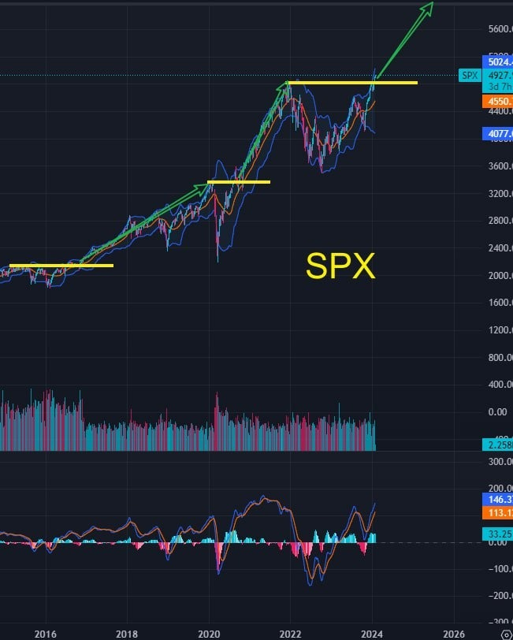
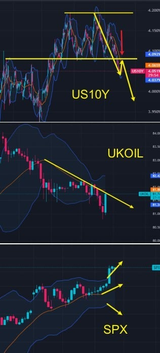
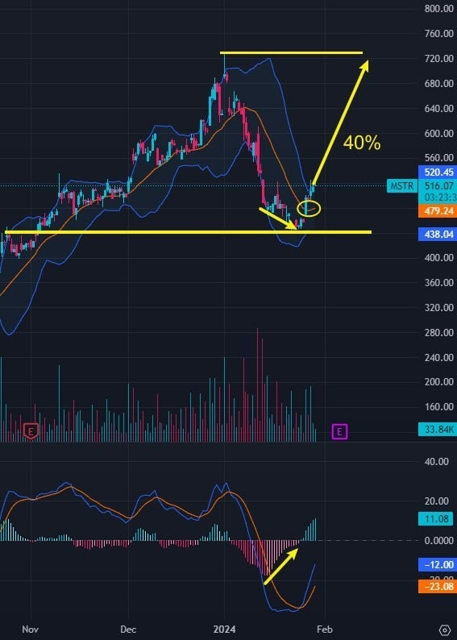
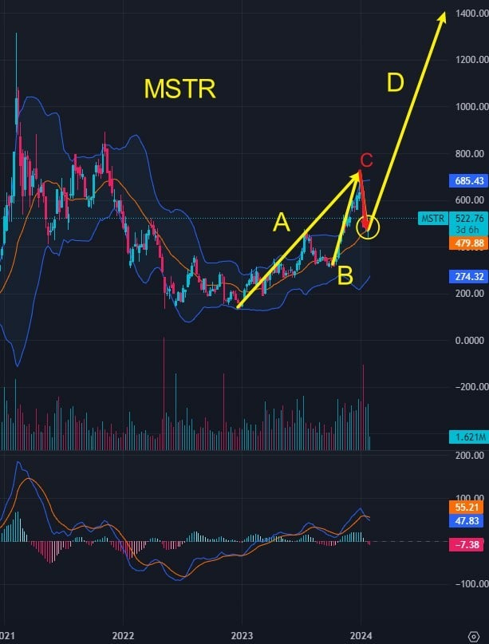
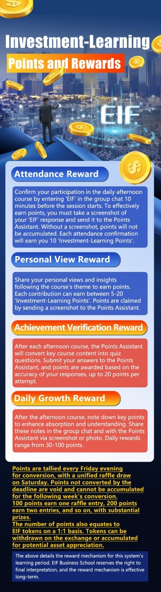
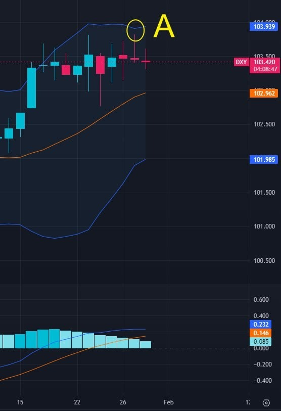
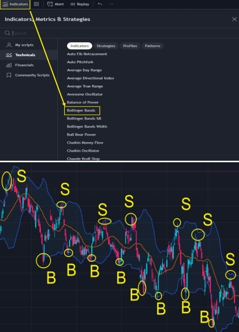
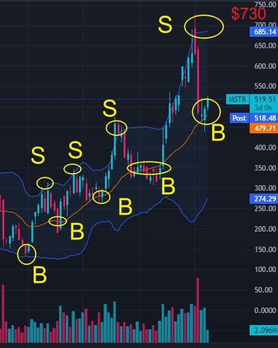
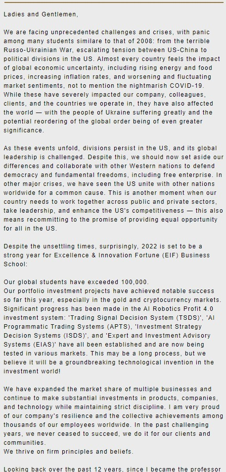

# Tuesday 20240130

## 08:37AM

### Morning Review

Good morning, dear friends.

I'm very happy that the 14th internal sharing session of EIF Business School is being held as scheduled. Did you receive the 6 important benefits?

Did the friends who participated in the lottery yesterday win anything?

Can friends who missed the opening ceremony still get these benefits?

The second profit growth point in the stock market since the beginning of the year has arrived, and today is an even more important day as I will introduce a stock with an expected 160% rise in three months!

So, what is the stock market environment like today? Is it suitable to build positions?

How does the AI4.0 investment system judge the market?
Which bull stock will I share?

How should our portfolio strategy be adjusted?

Later, I will share these important topics. Are you ready?

## 08:46AM

Firstly, as our friends get ready, let's take a look at today's market investment environment together.

To accurately grasp market trends, it's essential to clarify core information and logic.

According to today's summary from the 'AI 4.0-Expert and Investment Advisory System', the world's largest asset manager BlackRock has upgraded U.S. stocks from 'Capital Reduction' to 'Capital Increase'.

With further declines in inflation, the Federal Reserve's onset of rate cuts, and an optimistic macroeconomic outlook, more professional institutions expect the stock market rally to expand, undoubtedly adding strong momentum to the continued upward movement of stock indices!

This year marks the start of the Fed's rate-cutting cycle. In the weekly trend chart of SPX, the price has just broken through the resistance level, and it's expected to start a vigorous uptrend next.

Friends, how are you preparing to embrace this significant bull market?

## 09:11AM

Next, let's carefully examine the technical points of the 1-hour trend charts of several important targets through the 'AI Robotics Profit 4.0 (AI4.0)' investment system:

1. The 10-year Treasury yield has broken through a significant resistance line, initiating a new downward trend.
2. The international crude oil index shows a downward trend, with the middle Bollinger Band trending downwards.
3. The SPX Bollinger Bands' middle line indicates an upward trend, and the expansion of the upper and lower bands upward suggests the strengthening of this upward trend.

The US10Y and the international crude oil index show a high negative correlation with stock indices, undoubtedly providing a favorable environment for the continuation of the stock indices' upward movement.

In this afternoon's session, I will start sharing basic knowledge about Bollinger Bands.

Time is precious, and next is our time to build positions. Friends, please read the strategy and signals in detail.

## 09:34AM

The core bullish stock for the 14th EIF Business School internal sharing session: $MSTR.

1. For basic information about this stock, please refer to the 'Top 10 List of Hot Investment Targets in 2024', which provides detailed explanations.\
New friends can obtain this list through my assistant.

2. Strategy
    - 2.1 Position
    Currently, our investment portfolio consists of $MSTR, $NVDA, and $TSLA.
    \
    Today, everyone can actively adjust their positions, focusing on $MSTR. The portfolio's total position should not exceed 30%, with $MSTR's position reaching 15-20%.

    - 2.2 Buying Point
    In the 4-hour trend chart, a bottom divergence occurs above the medium-term support line. The Bollinger Bands' middle line is beginning to turn upward, establishing a medium-term buying point.

    - 2.3 Adding Position
    Add to the position when the price retests the 4-hour Bollinger Bands' middle line and breaks through the previous high of $730.

    - 2.4 Stop Loss
    Set a stop loss if the price falls below $440.

    - 2.5 Profit Target
    The short-term profit target is 40%, and the medium-term profit target is over 160%.

## 10:07AM

Why am I certain that $MSTR will experience a 160% increase in the next three months?

Let me explain my core logic through the weekly analysis chart of $MSTR:

1. The rise in segment A was primarily due to the establishment of a long-term bottom in the cryptocurrency market, signaling the start of a new bull market.

2. The increase in segment B was mainly driven by expectations that the BTC spot ETF would be approved by the U.S. Securities and Exchange Commission (SEC).

3. The decline in segment C was caused by the selling of profit-taking positions following the SEC's approval of the BTC spot ETF.

4. We are currently at the starting point of segment D's long uptrend, with the price just stabilizing at the middle Bollinger Band.

So, why will the trend in segment D be particularly strong?

## 10:39AM

Here are several crucial logics supporting my judgment:

### Core Logic 1: Cryptocurrency Bull Market Development Phase

Based on the historical trends of cryptocurrency bull markets, each cycle surpasses its previous historical high. Currently, the cryptocurrency market is in the development phase of a bull market.
If you need more clarity on this logic, feel free to message my assistant, or I can take some time to explain it in detail later.

### Core Logic 2: Institutional Push - The Engine of the Bull Market

The BTC spot ETF has already been approved by the SEC, and market trading volumes are expected to continue to surge.

Correspondingly, institutions must purchase a significant amount of BTC spot; otherwise, they would be in violation of SEC regulations.

Simply put, when institutions heavily buy BTC spot, the price of BTC will skyrocket, acting as the engine of the bull market!

## 10:42AM

### Core Logic 3: Core Assets

The 'Top 10 List of Hot Investment Targets in 2024' has already detailed the fundamental information about MicroStrategy ($MSTR).
Currently, they hold over $8 billion worth of Bitcoin, making them one of the companies with the largest Bitcoin holdings.

These core assets make them one of the biggest beneficiaries of the current cryptocurrency bull market.

### Core Logic 4: Timeline - The Bitcoin Mining Reward Halving is Approaching

There is increasing demand for Bitcoin in the market, but the halving mechanism reduces the supply of BTC.

This scenario will strengthen the bull market in Bitcoin, exhibiting a cycle of a major bull market every four years.
Every time a 'halving' event occurs, the cryptocurrency market experiences a significant surge in value. The next such event is scheduled for April this year.

## 11:09AM

So, it is almost certain that $MSTR will experience an explosive surge in value within the next three months.

Reaching a price of $1400 per share is an easily attainable target, which means a 160% increase in value is the minimum expected medium-term gain!

Based on the historical performance of Bitcoin in bull markets, it will continue to set new highs. My prediction for this Bitcoin bull market cycle is that BTC's price will break through $350,000.
Why do I have such a conviction? If this viewpoint holds true, it is also highly probable that $MSTR's price will surpass its historical peak of $3330.

However, that's not the main point I want to make today.

At this moment, some of you might be thinking the same as me: what if, within three months, $MSTR's price doesn't reach $1400, what now?

## 11:13AM

Here, let's establish a verbal wager agreement, which everyone can screenshot and save for reference, lol.

1. If within three months (before the close of April 30th), the price of $MSTR does not reach $1400, consider it my loss: I will compensate for the difference and expected profits through some means (calculated based on the number of $MSTR shares you currently hold).

2. If it does reach that price, consider it my win, and each of you who has purchased $MSTR will help me by introducing five friends to follow this AI 4.0 course and its future plans.

What do you think of this 'agreement'? Would you like to have some fun with it?

Why am I establishing such a wager agreement of a playful nature?
It's because only in this way will we pay more attention to this investment opportunity.

From this, you should be able to see the level of importance I place on this trading opportunity, this term's course sharing, and the future planning of the AI 4.0 investment system!

## 11:41AM

For those who have already purchased $MSTR following my strategy, please take a screenshot of your position and post it in the group, along with the keyword 'MSTR'. This will be considered as your participation in this verbal wager agreement. Also, send the screenshot to my assistant.

Let us all witness and oversee this playful yet educational wager!
Participants in this entertaining activity will receive an additional 10 'investment-learning points' today.

Yesterday, some friends messaged my assistant, saying they couldn't attend the opening ceremony due to work commitments and missed the chance for the draw.

Therefore, I announce that this week, each person will have two opportunities to participate in the draw:

1. Anyone who comes to our group this week to participate in the internal sharing will get one chance to participate in the draw.
2. Those who earn 'investment-learning points' through the 'AI Robotics Profit 4.0 Internal Sharing Learning Incentive Mechanism' can participate in the second draw of the week after the conclusion of Friday's course, in accordance with the rules.

## 12:02PM

To assist all members in swiftly enhancing their learning experience and to create an environment of 'healthy living, efficient investing, learning, sharing, joy, and freedom,' I have established this 'Learning Incentive Mechanism'.

Friends, you can earn investment-learning points according to the rules of this activity and submit them to the 'Points Assistant'.

Before the market closes, I will share two important topics:

1. Investment Theme: What is my main investment direction for 2024?
2. Course Sharing: How to predict price movement ranges using Bollinger Bands?

## 02:50PM

### Closing Commentary

Dear friends, good afternoon.

Today marks the first lesson of the 14th internal sharing session at EIF Business School. What important content will I share today?
We'll explore how the widening gains in emerging market currencies affect the U.S. dollar, the Federal Reserve's interest rate decisions, and stock indices.

Also, what's my primary investment focus for 2024?

How to use the knowledge from today’s course to judge the dynamics of held stocks?

Stay tuned as I delve into these significant topics shortly.

## 03:01PM

Before we dive into today's exciting topics, let's look at the above image, which shows the daily trend chart of the U.S. Dollar Index.
At point A, the price is near the upper Bollinger Bands. Consider the significance of this point in terms of trading strategy.

Many of you might be unfamiliar with what Bollinger Bands are. Simply put, they are an incredibly simple and practical technical indicator used by professional traders worldwide.

Today, I will introduce you to the first basic function of Bollinger Bands: determining the dynamic range of price movement.
Understanding this will give you a preliminary judgment on the trend of any investment target:

1. The core of technical analysis is to solve the problems of timing and range, meaning identifying buy and sell points and price fluctuation ranges.
2. Regardless of the trading instrument or time frame, prices most often move within the Bollinger Bands. This information provides an approximate range of price fluctuations, addressing the question of space.

## 03:13PM

As shown in the image, Bollinger Bands can be accessed in any stock viewing and trading software.

Since the price moves within the Bollinger Bands for most of the time, we can preliminarily determine the general range of its movement, as exemplified by the buying point B and selling point S in the chart.

Predicting the range of price movement is crucial in trading. By anticipating the potential space for price to rise or fall, we can better decide when to enter the market (buy) and when to exit (sell). This helps optimize profits and minimize losses.

Do you understand the significance of this concept and the guiding role of Bollinger Bands?

## 03:39PM

Let's delve into an important topic.

This week, the Federal Reserve will announce its interest rate decision, and today, the ‘AI 4.0-Expert and Investment Advisory System’ has highlighted an important development - the strengthening of currencies in emerging markets.

What impact does this have on the U.S. dollar, the Fed's interest rate decisions, and stock indices?

The relationship here is complex and intricate, but I'll provide a simplified explanation.

The strength of emerging market currencies often reflects the robustness and growth of the global economy. This stability diminishes the uncertainty in global financial markets, potentially making it easier for the Federal Reserve to consider lowering interest rates in the absence of significant internal economic pressures.

This scenario is favorable for stock indices.

Of course, there are many reasons why a strong emerging market currency benefits a potential rate cut by the Fed. I won't elaborate on all of them here, but it's important for everyone to understand this conclusion (if you wish to delve deeper, feel free to message my assistant privately).

## 03:52PM

So, let's revisit the daily chart of the US Dollar Index (I will continue to share investment techniques regarding MACD in the future).

So you can understand the key point here: when the price approaches the upper Bollinger Bands, is it highly likely to start declining?

With such a conclusion, what should we do?

If we're investing in the US dollar or bonds, shouldn't we consider reducing our holdings or even shorting at this point?
Similarly, is this situation favorable for perceptive investors to shift their funds to the stock market, thereby aiding the continued strength of stock indices?\
...\
Most importantly, can we continue to be bullish and take long positions in stocks? The answer is definitely yes.

Friends, this simple technical aspect of Bollinger Bands - dynamic space determining - isn’t it very valuable?

## 04:18PM

Technical analysis that lacks practical application is of no value, which is why our teaching principle includes a very important aspect: 'Practice is the best method of teaching'.

From the analysis of the weekly chart of $MSTR, do you now understand why I place such high importance and strongly recommend this stock?

1. The first buying point B was formed near the lower Bollinger Bands, and subsequent buying points were formed near the middle band.

    - Doesn't this suggest that the current moment is a very good buying opportunity?

2. The price, when it approaches near the upper Bollinger Bands, exhibits a selling point.

    - Therefore, could the first profit target for $MSTR be around $730?

This implies that in the short term, we could achieve about 40% returns with $MSTR. Do you agree?

Do you all understand how this conclusion was reached?

## 04:31PM

Of course, this is just a short-term trend and price forecast for $MSTR. My mid-term target prices are $1400 and $3300.

Tomorrow, I will analyze the logic behind these targets in detail.
In the meantime, think about what price BTC might reach in this bull market. When you have some answers, compare them with the logic I'll share tomorrow, and you'll understand why I place such high importance on $MSTR as a super bull stock!

Many of us make common mistakes when investing in stocks, such as:

1. Buying stocks when the price is at a high point.
2. Selling stocks that were profitable but end up in a loss.

Have these issues ever happened to you, friends?

Once we understand the role of Bollinger Bands in determining the dynamic space of price movements, won't we be completely free from these concerns?

## 04:53PM

A simple technical point can connect important investment ideas. When we understand more key knowledge points of Bollinger Bands, everyone can quickly become a practical master!

Everyone just needs to follow my instruction on $MSTR, and soon, you will become a practical master yourself!

Once again, welcome and thank new and old friends for joining and returning. I need all of your help to complete some work before the launch of AI Robotics Profit 4.0.

I may be quite busy recently. If you have any questions, you are welcome to send a private message to my assistant.

Last week we initially discussed the topic of how to invest well, and I shared some investment ideas and experiences.

Today we will discuss an important topic: What are the important investment directions in the stock market in 2024?

## 05:22PM

When sharing this topic, I can't help but think back to a letter I wrote to everyone in 2022 when the stock market continued to fall.

I strongly recommend that everyone read this letter on the homepage of our official website, because after reading it, you will definitely pay more attention to and have confidence in this year's investment.

At that time, when many people lost confidence, I led everyone to a very beautiful victory; now, the stock market is in a bull market, and we should have dreams!

This year, the Fed's interest rate cuts will lead to a strong bull market.

Through the first opening ceremony benefit I gave you-Top 10 List of Hot Investment Targets in 2024, I believe you should understand my investment direction, right?

The investment directions that I am personally more optimistic about include: real estate, consumption, technology stocks, financial stocks, public utilities, automobiles, etc.

## 05:38PM

Investing in $NVDA is equivalent to investing in artificial intelligence!

Investing in $TSLA is supporting a great visioneer!

Only by investing $MSTR can we achieve our dreams!

If artificial intelligence is the way of life for people in the future, then blockchain technology has the greatest potential to lead the fourth industrial revolution, and the cryptocurrency industry is a masterpiece of blockchain technology!

So, three of my Top 10 lists are cryptocurrency-related.

Why am I convinced that BTC will rise to $350,000 in this bull market?

Is it really possible that MSTR will reach $1,400 in three months and break out of its all-time high of $3,330 in this bull market?
Due to time constraints, I will reveal my core logic to everyone in tomorrow's session, and use the AI4.0 investment system to interpret the market.

## 05:53PM

Welcome again to our new friends. Anyone who participates in this week's group sharing will have the opportunity to win two lottery draw chances.

Engage in learning activities and earn investment learning points. Through the 'Points Assistant', you can have the chance to win prizes worth $2,220!

Today's Achievement Verification Rewards:

1. Illustrate with a drawing that the price mostly operates within the Bollinger Bands. The price near the upper band constitutes a selling point, and near the lower band constitutes a buying point. (Earn 20 learning investment points)
2. Read the letter I wrote to everyone on the homepage of the Business School's official website (<https://excellencenet.com/>). Considering the benefits of the upcoming Federal Reserve rate cuts this year, how do you plan to make your investments? (Earn 20 learning investment points)

Have a pleasant day!
