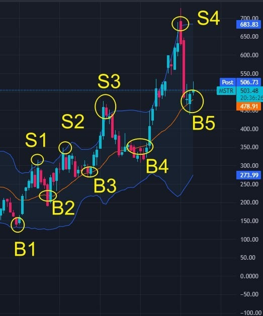

# Thursday 20240201

## 08:38AM

### Morning Review

Good morning, dear friends.

Welcome to the new members. This week, everyone has two chances to participate in the lottery to win gifts worth over $2,000, investment targets with a 5x growth expectation, and many more prizes.

I am delighted to see many friends' learning achievements from yesterday. Sharing is a virtue, and sharing leads to progress!
I've noticed that the overall quality of the students in this session is very high. I encourage everyone to actively participate in the group discussions. I will pay special attention to those who perform exceptionally well and will regularly reward them!

Although I am usually busy, I will offer more opportunities for individual interactions to those who study diligently and show outstanding performance.

## 08:38AM

### Important Information

Yesterday, I emphasized the positive aspects of the FOMC interest rate policy meeting, concluding that we should 'follow the overall bullish trend, and consider stock index pullbacks as short-term buying and adding positions opportunities.'

Today's economic data is favorable for stock indexes, so we can continue to buy and add positions in our most important core practical bullish stock, $MSTR.

In the 2-hour trend chart, the middle Bollinger Band is trending upwards, and the price is retesting the middle band and support line.

Based on the knowledge shared yesterday - using the resistance function of Bollinger Bands to determine buying and selling points, the current situation presents an excellent short-term buying opportunity.

Strategy:

- Position: 30% of the total assets.
- Short-term target: $730, an expected rise of about 40%.
- Medium-term target: $1,400, an expected rise of about 170%.
- Bull market target for this round: $4,136, an expected rise of 716%.

After purchasing, please send a screenshot of your position to my assistant for better strategy and signal tracking.

## 8:56AM

Yesterday, we discussed several important topics:

1. The four bull market driving factors of $MSTR.
2. Interpretation of the FOMC interest rate policy meeting: It is evolving in a direction favorable to the stock market.
3. The potential price targets for Bitcoin and $MSTR in this round of the cryptocurrency bull market.
4. Using Bollinger Bands' resistance function to determine buying and selling points.

Friends who missed yesterday's learning progress can access and watch yesterday's investment notes through my assistant or our official website.

Today, in the morning market and before the close (Eastern Time 3:30 PM), I will discuss the following topics in more depth with you all:

1. Interpretation of the latest economic data.
2. What judgment and strategy will the AI4.0 Investment System provide for today's market and our holdings?
3. Why is this bull market for $MSTR certain to be strong and powerful?
4. How to use Bollinger Bands to judge trends?

## 09:07AM

First, let's discuss the broader environment.

Today, I have selected two important pieces of data shown by the 'AI 4.0 - Expert and Investment Advisory System'.

1. Last week, the number of initial jobless claims increased by 9,000 to 224,000, higher than the previous value of 215,000 and the economists' forecast of 212,000.
Key interpretation: An increase in initial jobless claims can lead to economic slowdown, which might raise expectations for a Federal Reserve rate cut.

2. The AI4.0 system shows: In the past 74 years, whenever the stock market rose by 15% in the previous year (28 times in total) and had positive returns in January (13 times in total), the median annual gain for the S&P 500 index was 16%.

Key interpretations:

- As long as the conditions mentioned above are met, the Ai 4.0 system shows that in 92% of cases, the stock market's annual return is positive (the only exception was in 2018 when the Fed's balance sheet reduction led to the breakdown of this pattern).
- The system predicts that this year the SPX will rise to at least 5,500 points, which means at least another 13% gain.

## 09:25AM

Friends, what are your thoughts when you see this information?

If the stock index rises by 13%, then many bullish stocks will have double or even multiple times the returns. How much profit do you plan to make this year?

Many people fail to make money in a bull market because they lack patience and confidence; and without these two qualities, it's hard to succeed in any field. Do you agree with this view?

The strengthening expectations of a Federal Reserve rate cut and the higher forecasts of stock index given by the AI4.0 system both provide us with clear and strong evidence.

I believe this is helping everyone to eliminate market noise. To thank you all for your strong support before the launch of AI Robotics Profit 4.0 (testing, building popularity, and promotional activities), I will share more valuable information. Starting from practical applications, we will use profits to test the effectiveness and stability of the AI4.0 system.

## 09:48AM

If you have been following the AI4.0 system's judgments on bond yields and the VIX fear index in the last few days, you would understand the practicality of the AI4.0 system.

Both bond yields and the VIX fear index are highly negatively correlated with stock indices. Predicting their trends in advance can effectively forecast the movement of stock indices and help us prepare our trading plans in advance.

Chart 1 is the prediction made on January 29th for a continued bearish view on the 10-year bond yield (US10Y): the price falling below the support line and the lower Bollinger Band.

As shown in Chart 2, subsequently, the US10Y continued to fall, with the current price breaking below the support line again.

Chart 3 is yesterday's prediction for the VIX fear index: the price touching the upper Bollinger Band, indicating it met a resistance line.

In Chart 4, we can clearly see the VIX index falling.

Friends, isn't this both simple and amazing?

## 10:18AM

Due to the simplicity, practicality, and effectiveness of Bollinger Band, it has become a technical indicator commonly used by professional investors worldwide.
From 2008 to 2018, I was engaged in quantitative trading, attempting to develop a 'Lazy Investor System'. During that time, I tested every technical indicator countless times and discovered that Bollinger Bands and MACD were the most practical. I also developed unique insights, which I will continue to explore their mystery with you in our daily lessons!

But that's not all. Our research team has distilled the technical essentials of our expert team into two highly confidential and magical indicators - Neural Net Indicator and Vantagepoint A.I. Software, which you will all have the opportunity to learn about in the future.

Quantifying certain technical aspects is just the foundation; artificial intelligence and machine learning are the keys to the AI4.0 system. I firmly believe that this 14th session of internal sharing will lead us all to an unprecedented experience and great success!

## 10:39AM

Friends, please pay attention.

Chart 1 is the daily analysis chart of $NVDA, which I strongly recommended on January 8th: At that time, the price broke through the resistance line and the upper Bollinger Band, with the Bollinger Bands showing an upward expansion pattern.
This was followed by a strong performance, as shown in Chart 2, with a gain of over 20%.

So now, is the daily chart of the 10-year Treasury yield (Chart 3) displaying a trend opposite to that of $NVDA at the time?
And, as I predicted two days ago (on the 30th), that the US Dollar Index would fall, it has already started to do so.

Bonds and the US dollar are often seen as hedging instrument. When risk arises in the stock market, investors tend to exit stocks and move into the US dollar or bond market for safety, resulting in a high negative correlation between the two.
So, as the US dollar starts to decline and bond yields plummet, what kind of trend will the stock indices exhibit?

## 10:56AM

Currently, aside from the VIX fear index not significantly declining, both the US Dollar Index and bond yields have provided forward-looking guidance.

No doubt, today is a good short-term entry opportunity. If you agree with my logic, if you want to learn the AI4.0 system course better through practical application, and if you want to achieve a great victory like us, I strongly suggest buying or adding positions in $MSTR.

To emphasize:

1. A stock portfolio position not exceeding 40% is very safe, including $NVDA, $TSLA, among others.
2. I suggest you take a screenshot of your position and share it in the group, as well as send it to my assistant, to collectively witness and provide one-on-one strategy and signal tracking services.

## 11:16AM

Recently, due to the influx of many new friends, my assistant's chat is overwhelmed and even facing keyword limitations. Please understand if there are times when we cannot respond promptly.

Friends, to provide better service to everyone, you can add her WhatsApp and Telegram contact details later.

At the same time, I recommend that everyone takes good notes on the key points in the course. Doing so not only allows you to earn investment learning points to exchange for high-value gifts and participate in lotteries, but it also facilitates rapid improvement. I will focus on cultivating outstanding students.

To excel in investing, it's crucial to recognize trends clearly. Capitalizing on price differences within trends is the safest strategy.

So, what exactly is a trend? Are there any simple and effective criteria and methods for determining it?

Why am I currently particularly fond of $MSTR?

Before the market close (Eastern Time 3:30 PM), I will share the following two important topics:

1. Why is this bull market $MSTR certain to be strong and powerful?
2. How to use Bollinger Bands to judge trends?

## 02:36PM

### Closing Commentary

Good afternoon, dear friends.

Yesterday, when our stocks were in red, didn't many of you feel a sense of panic; and today, when the stocks turned green, did that emotion dissipate? It's just like the VIX index.

Yesterday, as the stock indices fell, I expressed my confidence from different perspectives such as 'Key points from the FOMC meeting', 'Following the major trend', 'VIX index price touching the daily Bollinger Band upper boundary - bearish'.

This morning, when the stock indices fell to their lowest point (Eastern Time 11:00-11:30 AM), I stated my firm stance from perspectives such as '10-year Treasury yield', 'Reviewing the outlook on the US Dollar Index - price touching the Bollinger Band upper boundary - bearish'.

These viewpoints represent my investment wisdom. When I share this wisdom, it's a 'gift'. Have you received it?

## 02:56PM

Today, I will share an extremely important perspective, and I'd like to start with the topic 'Love is giving, the essence of confidence is reliance, and faith comes from confidence'.

True love does not seek a return but is willing to contribute unconditionally to the happiness and well-being of others.
This insight comes from my experience in 2008, which many friends know about. During the financial crisis, I found myself in a deep abyss by short selling the stock market...

Yes, you read that correctly. Although many people think this is absurd, and now I also find it absurd, it's not laughable. Just like most retail investors, losing money in a bull market is the same idea.

Lol, in retrospect, I considered myself quite mature at that time, but now it seems my skills were also quite average. However, admitting my mistakes and recognizing others' excellence has never been difficult for me.

## 03:08PM

At that time, it was the selfless love from my mentor that awakened me, reignited my dream of rebuilding the 'Citty on a Hill', brought me back to the essence of investing, and made me trust in this beautiful and powerful country, ultimately leading me to the first peak of my life through adversity.

It was this inspiration that led me to the idea of spreading investment wisdom through the creation of a business school.
From the initial 'Lazy Investor System' in 2011 to the mature 'Quantitative Trading System' before 2018, and later, seeing the impact and prospects of artificial intelligence, I shifted focus to upgrade and develop the AI Robotics Profit 4.0 investment system you often hear about now.

Although the journey was fraught with hardships, at times being so financially strapped that my family suffered with me, these scenes are vivid in my memory.

Fortunately, it has lived up to expectations. With the effort of everyone involved, it has now achieved a valuation of hundreds of millions - you should see this through the price of EIF tokens and its whitepaper.

## 03:35PM

Therefore, once again, welcome and thank you to both new and old friends for joining and returning, to help me complete the most important phases before its listing: public testing, popularity accumulation, and promotional activities.

New friends can obtain six major benefits of this week's opening ceremony through my assistant. You can also earn points through our 'Learning Incentive Mechanism' to exchange for gifts and get two chances to win a grand prize worth $2,000 in this week's lottery.

There will be an even bigger lottery opportunity after tomorrow's market close, so please stay tuned.

I will pay special attention to and reward those who work harder. Friends with higher points will receive more guidance from me. When the time comes, I will have my assistant share my contact with you.

## 03:53PM

### Love is giving

This is what my mentor practiced, and I believe we at EIF Business School have always adhered to this life philosophy. Hence, we've established two important educational principles: 'Students' interests first' and 'Practice is the best method of teaching'.
Therefore, our business school does not prioritize shareholder interests like a listed company.

Although our development has been slow, each step we take is solid, and we do not seek fame as our priority.

I believe success is not measured by how much wealth one acquires, but by making one's family and many other families happier.

I see this as the essence of investing and the pursuit of success. This understanding from my career in investment makes me optimistic, happy, fulfilled, and content...

## 04:14PM

Understanding that 'love is giving, and the essence of confidence is reliance' can not only improve our relationships but also aid us in making better investments!

In the investment market, I believe confidence comes from data. We rely on data, and this is scientific.

The most certain thing about the investment market is that uncertainty always exists, and price fluctuations are unpredictable.

However, science can address these challenges. The core concept of my former quantitative trading was to calculate success rates using historical data of the model; while the AI4.0 system has machine learning capabilities, which is its scientific nature and unparalleled advantage.

Artificial intelligence makes our lives better, and the same goes for investing. This is what I am currently doing, and you will surely feel fortunate for choosing to stay here today.

I believe you are already beginning to appreciate the scientific charm of AI4.0, aren't you?

## 04:42PM

Investing in $TSLA during adversity leans towards supporting a great visionary, Elon Musk, besides (in fact, many institutions have been continuously buying $TSLA stocks these days), all recent judgments have been data-driven.

- For example when the whole market was panicking, the AI4.0 system interpreted the turning point of the FOMC meeting;
- Another example On January 8th, the AI4.0 system detected the relationship between $NVDA's price and the upper Bollinger Band;
- Precisely targeting when $MSTR's price was retesting the middle Bollinger Band on the weekly chart;
- Predictions on the VIX fear index; forecasting sell points S1/S2/S3/S4 for US10Y; and the dollar declining as expected.

These accurate judgments have helped us analyze the current state of the stock market and individual stocks well and predict future trends.

The techniques used are very simple, and today I will share even simpler yet very important lessons.

## 05:18PM

Not only that, yesterday I shared the four important logics behind $MSTR benefiting from the Bitcoin bull market (new friends can read my investment journal through my assistant or on the official website). And from the data of the past three bull markets, I concluded that:

1. Based on the historical minimum growth rate, the price increase of Bitcoin in this bull market could reach $350,000.

2. By equivalent proportion, the price of $MSTR could rise to $4,136.

The volatility of $MSTR is higher than that of Bitcoin, which is why I place such importance on the current buying point and am optimistic about its future prospects.

Later, I will supplement an important viewpoint with significant historical data about gold, to help everyone better invest in this key practical bullish stock.

## 05:46PM

Of course, there are two key points that everyone must understand:

1. Mid to long-term investments might not show results quickly, but I firmly believe these data will not disappoint us. Trusting in the data and the predictive ability of robot learning is essentially trusting in science. \
\
If you prefer short-term trading, you can message my assistant, and we can tailor strategies specifically for you.

2. When analyzing stock indices without mentioning specific stocks, my views on the indices already reflect my opinions on individual stocks.

For example, this morning, before concluding the share, I specifically analyzed the stock index and emphasized the importance of short-term pullback buying points.

We welcome your suggestions and are happy to accept them and genuinely help every friend.
Next, I will share a set of important data, followed by today's lesson.

## 05:56PM

I have studied the gold market for many years. For example, you can learn about an article I wrote last April on the official website under 'INVESTMENT KNOWLEDGE-Commodities'.

I have consulted a lot of materials, and this chart represents my core viewpoint on $MSTR, which I urge everyone to read and understand carefully.

The trend of Bitcoin before and after the launch of a Bitcoin spot ETF is highly similar to the trend of gold before and after the launch of a gold spot ETF.

Drawing from the historical process of the gold spot ETF, we can make some preliminary predictions about the future major trends of Bitcoin before and after the approval of a Bitcoin ETF.

## 06:11PM

### Stage 1

Before the approval of a BTC spot ETF, the market will have continuous expectations, considered bullish, leading to a significant price increase.

### Stage 2

Around the time of the BTC spot ETF's formal approval, the market may experience a slight surge.

### Stage 3

Shortly after the BTC spot ETF begins trading, there might be a significant drop after peaking, followed by a consolidation period to absorb more capital before accelerating upwards.

**Rationale:** Investors see the opportunity in the cryptocurrency bull market, continuously pouring into the BTC spot ETF market. These 11 institutions involved will need to purchase equivalent Bitcoin spot, thereby driving up Bitcoin's price.

We are currently in this stage.

### Stage 4

In the long term, the listing of the BTC spot ETF will open the gates for traditional capital to enter, becoming a significant catalyst for a Bitcoin bull market.

Just as after the launch of gold spot ETFs, the price of gold increased multiple times.

## 06:33PM

Believing in data is believing in science. The scale of capital in the investment market 10 years ago is incomparable to today's.
Gold's primary attributes are risk aversion and value preservation, which cannot be compared to blockchain, the core technology poised to become central to the fourth industrial revolution.

To achieve rapid compounding growth of wealth and financial freedom through investment, it's essential to catch the wave.
For instance, blockchain technology and artificial intelligence represent such trends!

In the future, I will supplement this area of investment knowledge, including topics such as blockchain, halving mechanisms, and the inevitable surpassing of the cryptocurrency market over the gold market.

My fondness for $MSTR is as strong as for $NVDA.

Seeing the impact of the launch of gold spot ETFs on the gold market, and considering Bitcoin's strong future prospects, do you now understand why I say this bull market for $MSTR is bound to be robust and powerful?

## 06:49PM

If we are bullish on it, what should we do?

Should we pay more attention to this bullish stock and the movements of the cryptocurrency market?

Should we optimize our investment portfolio and concentrate our positions to manage it well?

Tell my assistant your thoughts, as well as your understanding of today's lesson.

I want to see how many friends share my veiws, and I hope you can offer valuable suggestions, because EIF Business School belongs to the community, to every single one of you.

So, how should we manage this bullish stock?

You can find key insights in the upcoming AI4.0 course: How to use Bollinger Bands to judge trends.

## 07:02PM

Friends, have you ever had the experience where you held a super bullish stock, only to sell it and then see its price increase several times or even ten times?

The fundamental reason is that you may not have correctly understood what a trend is.

Bollinger Bands, as a classic of trend-based technical indicators, offer a simple, intuitive, and effective judgment of trends.
Generally, the middle Bollinger Bands represents the direction of the trend.

Trends can be classified into three types:

1. Uptrend: When the middle Bollinger Bands is trending upward, the price generally shows an uptrend.
2. Downtrend: When the middle Bollinger Bands is trending downward, the price generally shows a downtrend.
3. Sideways Trend: When the middle Bollinger Bands is moving sideways, the price generally exhibits a oscillating trend within a range.

For example, one of my favorite super bullish stocks, $NVDA, is annotated with three types of trends in its weekly trend chart.

## 07:19PM

### Apply what you've learned, today's Achievement Verification Rewards

1. As shown in the weekly chart of $MSTR above, please use the three basic techniques of Bollinger Bands shared: 'judging the dynamic space of price movement', 'determining buy and sell points through resistance', and 'judging trends' to try to develop a mid to short-term trading strategy. (You can earn 30 points in investment learning points)

2. Please express your views on the investment portfolio I shared, which includes $NVDA, $TSLA, $MSTR. For example, do you have confidence in this investment portfolio? Which one of these three bullish stocks do you prefer? Or any other thoughts or suggestions. (You can earn 30 points in investment learning points)

Tomorrow, we will interpret this answer during the trading session and share more profound investment themes to help everyone achieve great victory in this super bull market!

## 07:27PM

I'm very pleased to see everyone actively pursuing progress. Taking notes on the key points in the course not only allows you to earn investment learning points to exchange for high-value gifts and participate in lotteries but also facilitates rapid improvement. This session, I will focus on and cultivate some outstanding students.

You can communicate any thoughts with my assistant. To provide better service to everyone, please add her WhatsApp and Telegram later.

This week, any friend who joins the group can get two chances to participate in the lottery by taking part in the 'AI Robotics Profit 4.0 Internal Sharing Learning Incentive Mechanism'. Every day, please claim your corresponding points through the Points Assistant, to redeem equivalent prizes, and participate in the lottery.

Later, please add the Points Assistant's contact.

Tomorrow is Friday, and after the market closes, we will hold an important yet entertaining lottery event. Don't miss out, and come win gifts worth over $2000!

Have a pleasant day!

## 09:31PM

> So after the past 4 days I was not only skeptical about this opportunity, but I only invested a small amount of money into MSTR and Tsla.  I have see that both stocks have increased and believe in the professor opinion of bull market.  I honestly will be looking to increase my portfolio with more cash and getting a better return before the end of April,  which means I will be looking for 5 people to join this opportunity.  Thanks to the professor, and his assistant Evelyn, I am confident that this is a bull market

Price fluctuations, profit or loss are normal events; the logic behind the price movements is key.

When I strongly recommended $NVDA at the end of last year, it was quite controversial, but I believed in the logic behind AI4.0 system's choice of it. Given time, we achieved some success; I still view it favorably. Artificial intelligence is changing our way of life.

Indeed, this bull market is undeniable. $MSTR benefits not only from the bull market brought about by interest rate cuts but also from the strongest bull market in cryptocurrencies ever.
Believe in data, believe in science, reduce risk and chase profits by optimizing your investment portfolio, let's build a bright future together!

## 10:12PM

> Team,\
\
One of the things that I truly appreciate with EIF and this incredibly educational course and opportunity is our professor’s immense dedication to human aspects of trading - the core values of being involved in trading. We all know that the stock market is not about fairness. It’s a zero sum game and as a result when there are big winners, there are also big losers! If we all carefully and judiciously stick to professor’s intelligent and calculated analysis and follow them as instructed, we should expect fantastic results. That doesn’t necessarily mean that we, with 100% certainly,  will always gain monetarily but it definitely means that we will get better and better in handling trades as we learn and produce better results. It’s all about data!!! We need to measure, monitor and manage our own KPIs and KRIs (Key Performance Indicators and Key Risk Indicators). However, to handle the human aspect of the trading, we can and should share our successes and failures with one another. I feel honored to be part of this team and I hope we can act as such - one team! When one of us performs well, it’s good but when we all perform well, that’s great. This course is not about being good, it’s about going from good to great.\
\
Dear Professor and team, I’m truly proud to be included in this event. Thank you.

I'm truly grateful for your joining and interaction; your perspectives remind me of my life journey.

Success and failure are the norms of life, or perhaps failure is more commonly the norm, right?

Without enduring significant hardship, one can never appreciate the beauty of the world; without lessons from the investment market, one cannot achieve enlightenment and grow to love this profession even more. You are a very wise person!

## 10:17PM

Love is seen as an action and choice, not just an emotion or feeling.

Through giving, love establishes deep connections and mutual support among people.

Therefore, I share my masterpieces with everyone for free. Here, you can obtain key information to eliminate noise, strategies and signals, understand how AI4.0 system works, and quickly grow from a beginner to a practical expert, as well as obtain the future usage rights of AI4.0 for free, among other benefits.

My understanding of success is bringing more people back to the core of investment, making investing easier, and families happier; if I have the ability, why not make more families happier?

EIF Business School is just a regular platform, but it can achieve a lot for many people through one thing, and I believe this leaves no regrets in life!

## 10:21PM

Why can I express my views on the market openly and frankly in the group?

Because I fully recognize the big data analysis (analyzing the past) and machine learning (learning the future) capabilities of the AI4.0 system.

Simply put, I have great confidence in it. I feel safe and supported, so I dare to express my true self, share my inner thoughts and feelings. Just like what I said today, believe in data, believe in science.

This is not about right or wrong; it's about the future. Cherishing the present is how to win the future!

Once again, thank you for your thought, let Innovation, Excellence, Unity, Win-Win become our common pursuit, thank you!
