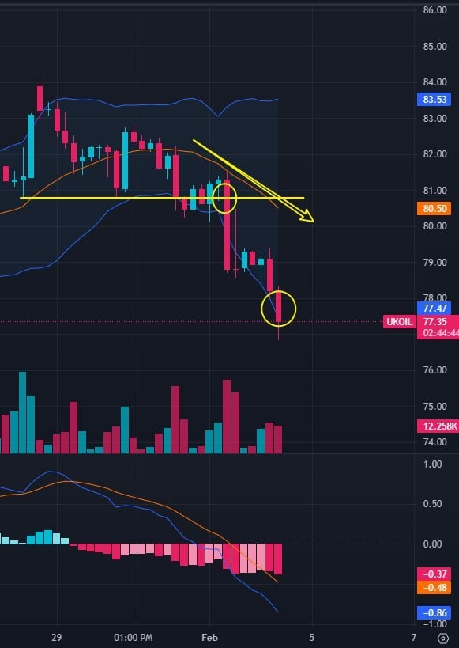
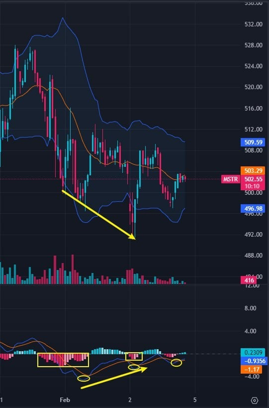

# Friday 20240202

## 08:43AM

### Morning Review

Good morning, dear friends.

I am very happy to see the letters and interactions from you all. Achieving goals through investment requires a process, and it's especially important to accumulate every day and maintain a positive, optimistic, and healthy mindset.

Today is an important day. After the market closes, we will hold significant lottery and point redemption activities to reward everyone for their learning this week and for supporting the recent work of the business school.

Additionally, it's important to note that the January unemployment rate and non-farm employment data have just been released, far exceeding expectations, leading to stronger bond yields and the US dollar index. This will likely increase market panic.

- Will this panic spread and intensify?
- Is today a time to exit or a new entry opportunity?
- How should we objectively understand the impact of this data?
- What adjustments should be made to the current investment portfolio strategy?

I will share these important topics later.

## 09:05AM

First, let's look at several important pieces of information displayed by the 'AI 4.0 - Expert and Investment Advisory System'.

1. The non-farm payroll data exceeded expectations significantly, with the Department of Labor's Bureau of Labor Statistics reporting an increase of 353,000 non-farm jobs last month. The data for December was revised up to an increase of 333,000 jobs, rather than the previously reported 216,000. Economists had predicted a job increase of 180,000. Following the data release, bond yields surged, and the US dollar strengthened.

2. Negotiations to reach a ceasefire agreement between Israel and Hamas are making progress, which could be a key step in ending the conflict.

3. Last year, the stock market had a strong performance, setting brilliant records. This momentum is expected to receive another strong push this year: publicly traded companies are anticipated to conduct more buybacks.

## 09:19AM

The non-farm payroll data is of utmost concern to global investors as it serves as a barometer of economic health, directly influencing the Federal Reserve's monetary policy and, consequently, the direction of global investment markets.

Therefore, it is the most important economic data!

Next, let's objectively understand the impact of this data, as well as the current sentiment and stage of the stock market.

Because a simple proposition is: if this data has a significant impact, it could lead to a phase high in stock indices, marking a time to exit; if its impact is weaker than expected, then it presents a good new entry opportunity.

Friends, do you understand and agree with this logic?

## 09:31AM

Today's non-farm payroll data was actually nearly double the forecast value. Logically, today's stock indexes and most individual stocks would have opened significantly lower and undergone a decline.
However, the market did not exhibit this behavior today; instead, stock indexes opened higher. Why is this?

### Reason 1: Progress in the Middle East ceasefire agreement, leading to a sharp drop in oil prices

A decline in crude oil prices would ease inflationary pressures, giving the Federal Reserve more room to adopt loose policies to support economic growth, thereby benefiting the stock market.

Taking the 4-hour trend chart of UKOIL as an example, prices successively broke through important support lines and the lower Bollinger Band, with the middle Bollinger Band turning downwards, indicating a typical bearish strengthening signal.

Weak oil prices are conducive to a rebound in stock indexes.

## 09:47AM

### Reason 2: The wave of corporate stock buybacks and the earnings of mega tech stocks exceeded expectations

Meta surged by 20%. Its Q4 earnings per share of $5.33 exceeded expectations, roughly tripling from $1.76 in the same period last year; it declared its first dividend of $0.50 per share and announced an additional $50 billion in stock buybacks.

Amazon rose by over 6%. Amazon's Q4 net sales were $169.96 billion, a 14% year-over-year increase, better than the expected $166.21 billion.

After a decline in buybacks in 2023, the scale of corporate stock buyback actions this year has reached a trillion dollars, due to the expectation of stronger profitability levels.

Stock buybacks, which help increase earnings per share (EPS) for US stocks, are considered a sign of undervalued stock prices and viewed as a significant positive development!

## 10:02AM

This means that the current stock market environment is improving. If it weren't for the impact of the non-farm payroll data, stock indices would have seen an increase of at least 2.5% today, and many individual stocks' gains could have exceeded 5% or even 10%.
Objectively speaking, the severe contrasting impact of the non-farm payroll data has been neutralized by stronger buying pressure. About half an hour after the market opened, the market had already absorbed this short-selling force.

Let's objectively define the impact of bullish and bearish factors:

1. The bearish impact of the non-farm payroll data is short-term. Even though it impacts the market, it is normally digested within a few days, and today's situation was resolved within the day.
2. A Federal Reserve rate cut is certain, expected around May, which is the most significant and long-term bullish factor.
3. The arrival of a stock buyback wave, driving stock indices to strengthen step by step this year.
4. The positive impact of mega tech stocks' earnings reports outweighs the negative impact of the non-farm payroll data.

This is the current situation. Friends, do you now have a clear understanding of the overall stock market environment?

## 10:17AM

So, despite the short-term rise in the US dollar and bond yields following the release of significant economic non-farm payroll data, altering their original trends, the stock index continues to maintain a healthy upward trajectory.

This is the charm of our stock market, supported by outstanding companies that sustain a long-term bull market.

In contrast, in developing countries and emerging markets, a stronger US dollar inevitably leads to a stock market crash, causing investors great distress.

This is one of the reasons why I love this market so much.

Next, let's analyze the situation of the investment portfolio together.

### $NVDA

Today, the stock price has reached a new high again. Starting from the beginning of the year when it was recommended (B1), the current return is around 30%, and it is advisable to continue holding.

The focus of this stock is no longer on how much to earn, as outperforming the market is inevitable.

Look at the 1 hour trend chart, where the profit space brought by the buying points B and selling points S is the key.

This is the essence of combining mid and short-term strategies, which I will focus on sharing in subsequent lessons.

## 10:32AM

### $TSLA

This is a great company that has faced many challenges in its development process, and its story remains one of the most fascinating and transformative tales in modern business history.
When talking about it, I often speak of dreams, a rare accolade in the stock market.

Although some recent bearish factors have not been completely eliminated, institutions have been entering the fray, indicating that we all recognize it's undervalued!

The buying point on the weekly chart still stands, so you can hold with confidence.

Mid to long-term investment styles often differ from short-term ones: short-term investment style emphasizes quick entry and exit to achieve excess returns, often seizing breakout buying points; mid to long-term investment style prefers buying during price drops to acquire cheap shares.

Which investment style do you prefer? Tell us, and we can help tailor a strategy just for you.

If you're inclined towards short-term investment, we could hold for a few days and wait for the stock price to rebound before selling, then switch to other bullish stocks for operations.

## 10:45AM

### $MSTR

Applying knowledge to practice, I'll now answer yesterday's 'Achievement Verification Rewards':

- In the weekly trend chart, the middle Bollinger Band is trending upwards indicates an upward trend.
- As the Bollinger Bands maintain an upward trajectory, the focus should be on long positions.
- The middle band of the weekly Bollinger Bands forms support and buying points, so it's advisable to buy on dips.
- According to the Bollinger Bands' dynamic space judgment function, sell when the price approaches the upper band.

This makes for a solid mid to short-term trading strategy. Have friends learned it?

$MSTR is an important practical target for this period, and you can confidently buy and hold.

Toadd, 'Students' interests first' is our core teaching philosophy. We will take responsibility if any unexpected results occur from trading strictly according to any trading strategy we share.

Next, I'll add an important perspective.

## 11:07AM

Yesterday, I analyzed the strong bull market triggered by the launch of the gold spot ETF a decade ago.

Compared to that, the cryptocurrency market, given its current era, better market environment, and high-tech attributes, is bound to outperform gold.

Therefore, in my previous viewpoints, I dared to make a data analysis and conclusion that Bitcoin would surpass $350,000 during this bull market.

The growth range of $MSTR will exceed that of Bitcoin.

- January 11 this year: The BTC spot ETF was approved, and currently, $MSTR's price is in the stage of successfully building a base after a decline.
- April: The 'halving' time window arrives.
- May: The Federal Reserve is very likely to start cutting interest rates in May.
- May: The Ethereum spot ETF is expected to be approved, thereby directly driving up the price of Bitcoin, and indirectly, $MSTR.

Each of these points serves as a strong driving force for the robust rise of $MSTR!

## 11:23AM

From the monthly chart of $MSTR, you can see my future outlook.
When these concentrated events occur around May, all of us will witness the birth of a crazy bull market, making now the best mid-term entry opportunity!

Therefore, friends, you can boldly buy or add to your positions!
This is the core reason why I dare to establish a 3-month 'entertainment wager agreement' with everyone!

Friends, to provide better service, you can add her WhatsApp and Telegram contacts later.

- If blockchain technology triggers the fourth technological revolution, what impact will it have on $MSTR?
- The secret to short-term trading: How to use Bollinger Bands to quickly judge trends?
- Important benefits this week: Weekend prize redemption and lottery.

Before the close (Eastern Time 3:30 PM), I will share these three important topics.

## 02:43PM

### Closing Commentary

Good afternoon, dear friends.

This week has been a busy one, a week of sowing seeds, and I believe our investment portfolio will soon see another round of profit growth.

At this moment, I feel there's nothing more important than taking the time to summarize our work for the week. Do you all agree with my viewpoint?

Friends have kept joining one of the most important internal sharing sessions in the history of EIF Business School, eagerly anticipating the arrival of the full internal testing phase of the AI4.0 system. In combination with our practical application, when is this plan expected to start?

To better handle our investments in stocks like $MSTR, what should we understand and how should we proceed?

How many investment learning points have you earned this week, and how will this week's most important reward redemption and lottery activities unfold?

In today's lesson, I will mention a secret to short-term trading, involving which technique with Bollinger Bands?
Later, I will share these important topics.

## 03:08PM

Time is precious, so let me first update everyone on the future work schedule: When is the full internal testing of the AI4.0 system expected to start? What will the scope of testing include?

1. When our investment portfolio achieves a certain foundation of profit.

Although friends who joined this internal sharing session about half a month ago primarily gained decent profits through $NVDA, many friends have returned and joined in the last week or so.

We have already completed the construction of our stock portfolio ($NVDA, $TSLA, $MSTR), but it has not yet fully moved beyond the breakeven point, for example, overall profits exceeding 10%.

Once we achieve this, we can enter the full internal testing phase.
So, friends who have gained an early advantage, please wait a little longer and look out for those who have recently joined, because unity leads to greater victories.

I predict our investment portfolio will see a short-term growth in profitability next week, and I will explain this point later in the technical analysis.

## 03:15PM

2. When everyone gains a foundational understanding of the operating principles of the AI4.0 system.\
\
The daily lessons we share will be the basic applications of the AI4.0 system. Understanding these will better help us complete trades, understand performance, and use the application when it goes public in the future.

3. In case of emergency situations that require hedging risks.
The AI4.0 system is a very comprehensive set of investment tools, with risk hedging being a basic function.\
\
Although the current stock market does not show adverse signs, should any arise, we are ready to initiate hedging mode. This is not only a good test of its defensive capabilities but also to protect the interests of us all!

4. Scope of testing.\
Based on the stock market and radiating to all markets, we will conduct public opinion surveys on one hand, and on the other hand, select the best direction and scope according to system data, all with the aim of better profitability!\
\
Moreover, to gather more data, it is necessary to increase the frequency of short-term trading. This way, we can obtain a larger volume of data.

## 03:38PM

Thank you again for everyone's support and participation.
Considering everyone's interests, how can we quickly achieve the first phase of foundational profit?

The first method is to patiently wait for a few days.
As mentioned earlier, our investment portfolio is expected to welcome a new profit growth point next week.

Taking the 15-minute trend chart of $MSTR as an example:

The current price has shown a bullish divergence with the MACD indicator (during the price fall, the MACD Histogram's area decreases, and both the MACD Line and Signal Line gradually move upwards. I will share more about this in upcoming lessons), which is a bullish signal.

So, if you've just joined and your cost price is between $490-$520, a bit of patience is needed, as short-term results are expected to be seen by next week.

## 04:00PM

The second way is to add short-term trading strategies.

This week, the SPX rose by +1.38%, and our investment portfolio's gains were as follows: $NVDA, +8.40%; $TSLA, +2.52%; $MSTR, +1.00%.

Although our portfolio outperformed the market, we can definitely do better.

How can we improve?

Do you remember the story I shared about one of my students?

It took him about 5 years to increase his capital from over $4 million to more than $150 million.

His approach was quite simple:

1. Divide the position into two parts.
2. Half is used for mid to long-term trading, holding firmly to grasp the mid to long-term trend
3. The other half is used for short-term trading, seizing opportunities in price fluctuations to increase profits.
4. Use options arbitrage at the appropriate time.

Next, I will share his approach with you, so we can better grasp new profit growth points next week.

## 04:18PM

Taking $NVDA as an example, it has shown a typical bull market trend, with many definite opportunities existing in the 30-minute trend chart.

These trends respectively could achieve gains of +5.59%, +2.34%, +2.60%, +4.87%, +3.27%, and +8.18%.

After buying on January 8th, the mid-term holding profit is around +30%; adding this portion of profit, the profit significantly increases, doesn't it?

The advantage of doing this is not just about increasing profits, but most importantly, minimizing losses when risks arise.

To be honest, some friends find this hard to understand, and due to recent busyness, I haven't signaled every such trading opportunity, but instead told everyone when the price hit a low point that it was a good time to enter or add to positions.

So, do you think we should add such trading methods next week?

## 04:34PM

Or to put it another way, if $MSTR exhibits similar short-term volatility and arbitrage opportunities, should we proactively seize these opportunities to increase profits, thereby quickly exceeding a 10% profit base?

Or, assuming the 30-minute chart shows $MSTR reaching $730 through these two methods, which trading approach would you prefer?

Although our portfolio has a good mid to long-term bullish outlook, it doesn't mean short-term trades are off the table.

Similarly, friends who prefer short-term investment styles should not think these types of stocks aren't suitable for them; on the contrary, to excel in short-term trading, one should ideally leverage stocks with a strong mid to long-term bullish outlook. Not only is the risk lower, but there are also always potential surprises, like with $NVDA.

Combining both is the most perfect approach, which briefly summarizes the trading model of my student's success story.

## 05:00PM

Returning to the first topic.
Once our profits reach a certain foundation, we can enter the 'full internal testing phase of the AI4.0 system', which is the focus of our current internal sharing session and what everyone is looking forward to.

Feel free to send your thoughts to this group or my assistant. Expressing personal opinions can also earn you rewards in investment learning points. We will make decisions after summarizing everyone's ideas.

While there are many good stocks and our investment portfolio includes three stocks of completely different investment styles to provide everyone with better choices.

This week I mainly explained the investment logic behind $MSTR, the main reason is that it will be the most important practical stock for this session.

If we do not understand the investment logic, it is like building a house on an unstable foundation. Can everyone understand this?

## 05:20PM

To excel in investing, one must be pragmatic and set aside speculation.

Dreams are not flights of fancy but stem from grounded data analysis.

For instance, the investment logic and story behind $MSTR are far more extensive than mentioned.

It's precisely because I have a deep and thorough understanding (just as I did with $NVDA last year) that I've given it a high rating and expectation.

Therefore, as I share this knowledge, I will gradually delve deeper and supplement these logics.

Friends will also see 'a more complete sky' with me (fundamentals, logic, and data).

At the same time, we must respect facts; where it stands and what stage it's in technical analysis is equally important.

This isn't just about capturing price differences; most importantly, candlestick charts reflect all information.
Trend trading is about following the trend.

## 05:34PM

So, I suggest everyone prepare in advance for next week's work, so you won't be caught off guard when the prices fluctuate.

Once you've determined your investment style, you won't ask questions like: Why sell half? What if the price falls? It has risen high, Professor, should I take profits?

It's okay, we progress together, every single one of us.

Next, we move into another core sharing segment for today: AI4.0 basic course sharing.

The secret to short-term trading: How to use Bollinger Bands to judge trend acceleration?

Everyone, please look at this chart and think: What characteristics do the Bollinger Bands show? What special significance does this short and rapid trend have?

## 05:49PM

When prices move outside the Bollinger Bands, they often experience accelerated increases (or decreases).

This trend is considered to be beyond expectations, driven by a high consensus in market sentiment. It is often because significant events/data have emerged, providing a short-term stimulus to prices.

Joining such a trend directionally can quickly yield excess returns in the short term, thereby reducing the difficulty of trading.

Therefore, before such buying and selling opportunities arise, short-term traders spend most of their time waiting. They wait for the emergence of buying points, selling points, or stop-loss points.

Short-term traders should be adept at seizing such opportunities, for instance, in areas A, B, and C in the chart: entering the market when prices break above the upper Bollinger Band allows for quickly obtaining  excess profit before prices return to within the Bollinger Bands.

## 06:02PM

This is a method of short-term trading. Friends, would you like to try such a trading method next week?

Taking $NVDA as an example, I have often signaled to buy when the price breaks above the upper Bollinger Band and also suggested buying or adding positions during minor price adjustments.

How should such stocks be sold then? For mid-term holdings, why are the last two selling points when the price falls below the middle band and the lower band?
In future lessons, I will gradually share these key strategies.

Learning is a process of long-term accumulation, continuous practice, and gradual progress. If you are busy at times, you can read my daily investment notes through my assistant or on the official website.

## 06:15PM

During the learning process, I recommend everyone take plenty of notes to share and exchange ideas with others.
The establishment of the 'AI Robotics Profit 4.0 Internal Sharing Learning Incentive Mechanism' is designed to encourage everyone to develop good habits.
Giving away EIF tokens, with such high current values and future potential, was a commitment made to society when EIF tokens were issued in 2019 (you can learn about this from the whitepaper), and we have always been committed to these original intentions.

So, everyone should truly value the opportunities you have received and those that are still to come!

How many reward points have you earned this week, friends? Go and check with the 'Points Assistant' to find out your points status.

This weekend, you can not only receive EIF tokens in 1:1 proportion to your points but also get a chance to enter the lottery with every 100 points according to the rules, and win gifts worth over $2000 together.

Due to the large number of participants, points will be exchanged today, and the lottery will take place tomorrow.

## 08:56PM

I'll end my conclusion and sharing just this much today. Thank you again for joining and supporting us. Before the AI4.0 system goes public, we need to complete comprehensive data testing, accumulate a wider popularity, and work together on publicity and promotion.

I hope that with our collective effort next week, we can quickly complete the accumulation of our first phase of practical returns, and then we can enter the most critical pre-launch phase - the internal testing stage, as soon as possible.

I will surely lead us all on a memorable and enjoyable journey.

Applying knowledge to practice, Achievement Verification Rewards: Please summarize this week's lessons and learning. (You can earn 100 investment learning points, which will be accumulated for next week.)

Have a pleasant weekend!
