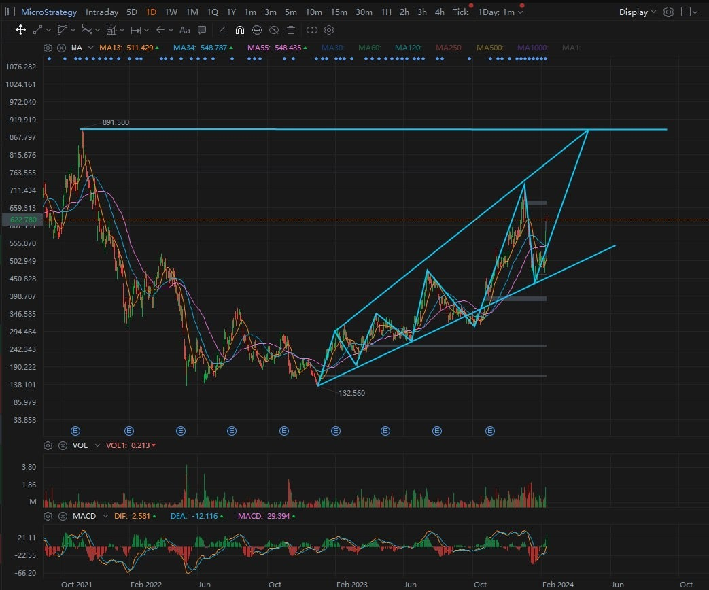
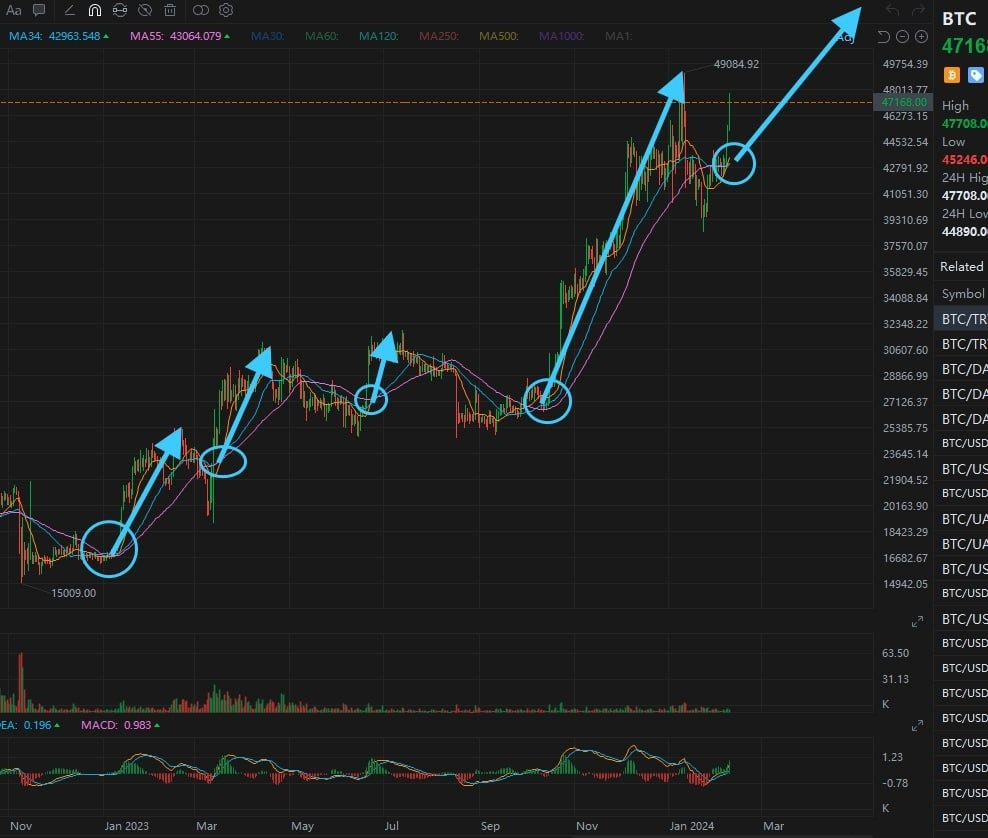
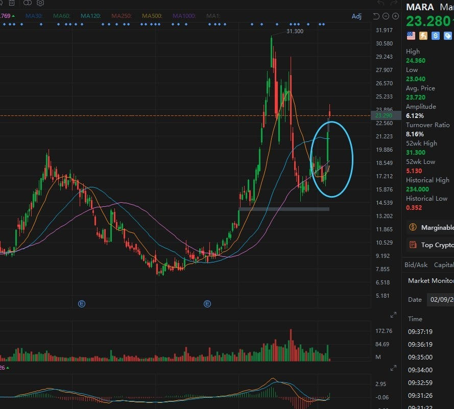
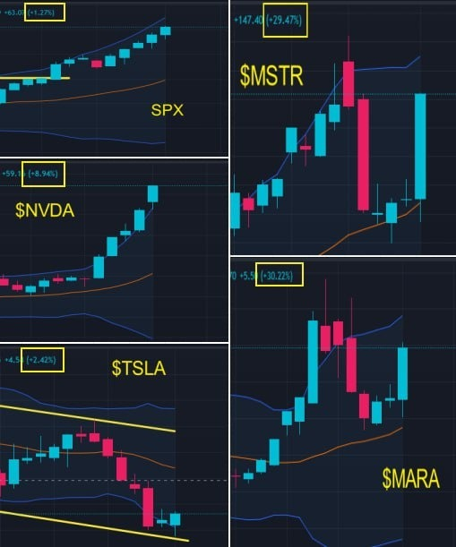
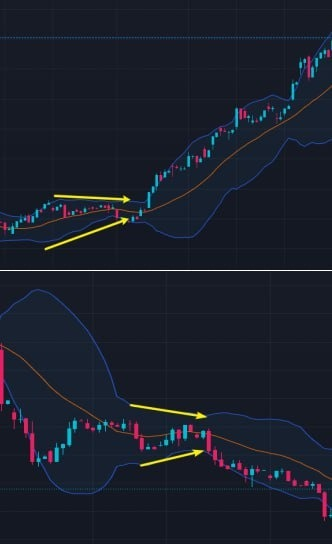

# Friday 20240209 (Guest: Noah Johnson)

## 08:29AM

### Morning Review (α&amp;β Strategy)

Ladies and gentlemen, good morning. I'm Noah Johnson. Today presents another opportunity to add to our positions. Did you seize it? Yesterday, our mentor went into detail about the predicament facing regional banks. The cryptocurrency market, due to its decentralized advantages, is being recognized by many professional institutions as an alternative to traditional banking, leading to a significant surge in the cryptocurrency market. The beneficiary stocks we shared outperformed, topping the market gains. Wow, what a pleasant surprise!

## 08:47AM

For those who might be arriving a bit late and wondering: Which stock should we invest in today? Or, is it time to increase our positions?
The accelerating trends of Bitcoin and Ethereum are crystal clear, not only reinforcing the expectations for a reversal but more importantly, showcasing their predictive power. The crypto beneficiary stocks we're holding, $MSTR and $MARA, are very likely to surpass their performance from yesterday.

At this point, there's no better option than these stocks. Take $MSTR, the quintessential beneficiary stock, as an example. Each bullish wave it rides is growing stronger, leading me to believe we can raise its target price to $890. If you're still hesitating, you're missing out on a golden period for earnings. Moreover, I believe it's still a good idea to increase our positions, provided the overall portfolio does not exceed 40%!

## 09:00AM

**Key Information 1:** Over the next few years, BlackRock's portfolio may include an increased amount of Bitcoin.

BlackRock is among the world's largest asset management companies, overseeing trillions of dollars in assets. Its significant asset size makes it a key player in the global financial market. Its Bitcoin Spot ETF (IBIT) now holds over $3 billion in Bitcoin.

This represents a crucial signal of institutional buying into Bitcoin. As the Bitcoin Spot ETF gets approved and launched, an increasing number of investors are getting involved. The related 11 institutions will need to continually purchase Bitcoin, which will drive up Bitcoin's price. The market is already responding to this, and this trend is expected to strengthen with this bull run.

## 09:11AM

Whether it's these institutions or the boss of $MSTR, they're all significantly increasing their Bitcoin positions. Are they foolish? In reality, this underscores Bitcoin's popularity as a mainstream investment choice. $MARA, as a mining company, also shows explosive potential in this bull market, with its daily chart showing MA13 turning upwards. The price has been continuously breaking above the golden moving average system MA13/34/55 in recent days, signaling a strong trend reversal, confirmation, and strengthening.

The trend of BTC is even more interesting. MA13/34/55 show a tight cohesion before diverging upwards. When comparing historical trends and the significance of this pattern, it's evident that such movements only occur at the start of every major bullish trend.

## 09:22AM

**Key Information 2:** NVIDIA is consulting with companies like OpenAI on chip design matters.

What I want to highlight here is that the understanding of market sentiment between mid-term and short-term trading often contrasts. Mid-term trading aims to capture lower buying points and longer-term gains, hence buying during periods of market hesitation or ambiguity, just like our mentor led us to continuously build positions in $MSTR as it began to bottom out. Short-term trading seeks certainty, so I prefer to participate when market sentiment aligns, aiming for quick entries and exits. For instance, today's positive news about $NVDA shifts market sentiment from this week's indecision to consensus, marking another short-term breakout buying opportunity. Similarly, surges in Bitcoin and Ethereum can lead to a strengthening of core cryptocurrency beneficiary stocks, presenting a relatively certain opportunity for short-term trading.

## 09:32AM

Friends adding my card have been asking about investment techniques for options. I believe the greatest tricks with options are leveraging small amounts for potentially large gains and hedging. When a certain trend is approaching, it's a powerful tool to see amplify profits; in times of risk, it serves as an excellent shield.

To excel in this area of investment, one must first understand key concepts like value, expiration dates, and strike prices. There are buyer and seller markets, involving buying call options, buying put options, selling call options, selling put options, and other combinations. In trading, risk management is crucial. It's important to allocate funds wisely, avoid putting too much capital into a single trade, and steer clear of excessive leverage. Stay closely tuned to market trends and factors that influence option prices, such as the underlying stock prices, interest rates, volatility, macroeconomic data, and more, and be adaptable.

If you're interested in short-term trading, I'd be more than happy to discuss and progress together. You can add my card later.

## 09:50AM

Folks, the AI ROBOTICS PROFIT system is about to be launched. From what I've gathered, our mentor is starting to prepare for an internal testing plan this week, which is a major benefit for all of us. If you're lucky enough to join this testing program, you'll definitely experience a different level of investment, like finding even better investment targets than $MSTR and $MARA. He's getting ready to communicate with partners, and this opportunity is surely rare and precious. So, I suggest you quickly reach out to his assistant to sign up and seize this unique chance.

Thanks, everyone. That's all from me today. Please stay tuned for more insights in my mentor's closing session.

## 02:31PM

### Closing Commentary

Dear friends, good afternoon.

Thanks to Noah for his fantastic shares this week, with both stock and options strategies achieving exceptional returns. Among these, $MARA saw a return rate of about 40%, while the bullish option strategies for $MSTR surged by over 800% and 1100%.

This morning, the summary of the relationship between mid-term and short-term buying points and market sentiment was very well done, including a breakout buying point for $NVDA, which once again reached a new all-time high.

In summary, last week was a week of sowing, and this week was a week of harvesting, not only aligning with my predictions from last week but also exceeding our set goals.
This week, the SPX rose by +1.33%, and our stock portfolio achieved the following returns: $NVDA, +8.57%; $TSLA, +2.54%; $MSTR, +28.33%; $MARA, 30.05%.

This deserves a round of applause for ourselves!
Friends, how much profit did you make this week?

## 02:57PM

Last week, many friends inquired about when the comprehensive internal testing of Ai4.0 would begin. I mentioned three prerequisites:

1. When our investment portfolio achieves a certain profit base.
2. When everyone has a basic understanding of the operating principles of the Ai4.0 system.
3. In the event of sudden situations that require risk hedging.

Based on this week's returns from our stock portfolio, the first condition has been met. Although fewer friends bought $TSLA and its performance is not yet satisfactory, many friends have made about a 35% return on $NVDA; our major holding, $MSTR, has overall exceeded a 30% return!

From the daily learning outcomes and verification from friends, many have very well mastered the basic knowledge of Bollinger Bands through recent live trading.

Therefore, I think it's time to accelerate our plan. How does everyone feel about this?

Have you already signed up through my assistant?\
Later, I will focus on sharing this topic.

## 03:10PM

First, let's take a forward-looking view of the market next week to better plan for the future.

The 'AI 4.0-Expert and Investment Advisory System' displays important information: our country's core CPI for the fourth quarter, after adjustment, maintains an annualized increase of 3.3%, with December's CPI month-on-month increase revised down from 0.3% to 0.2%.

CPI data is a crucial indicator for measuring changes in consumer price levels and inflation over a period, affecting the Federal Reserve's interest rate decisions.
The revision of CPI data might reflect a slowdown in economic growth or reduced inflationary pressures, potentially leading the Federal Reserve to reassess the economic outlook. If the economic outlook becomes uncertain or is adjusted downward, the Federal Reserve might adopt a more accommodative monetary policy, which means an increase in the expectation for rate cuts.

Federal Reserve officials have been looking for more evidence lately, which could be a strong case for rate cuts or an early reduction!

So, what should we do next week, friends? Should we prepare more thoroughly for this?

## 03:29PM

The focus of this session (14th session) of internal sharing is on the Ai4.0 comprehensive internal testing plan, which will determine the progress of the application's market launch.

The stock market is one of our core investment directions, and now we have sufficient conditions to implement this step of the plan. Are you looking forward to it?

Indeed, it's an exciting moment, both for friends participating in this session's testing and for future planning. This will be a historic progression!\
To better carry out this plan, I have focused on planning from three directions:

**Direction 1:** Mainly verify the stability of the AI4.0 system in guiding trades.

Recently, I've been observing and adjusting Ai4.0 data, and I have filtered out strategies with a high win rate. In certain market conditions, some models have success rates as high as 95%!

## 03:41PM

**Direction 2:** Chasing profits.
The focus here is on identifying high-volatility instruments, increasing frequency, and combining mid- and short-term trading styles to maximize profits.
For instance, a combination like $NVDA, $MSTR, and $MARA is excellent, but the targets or portfolios we ultimately determine will definitely be even better!

**Direction 3:** Reducing testing risks.

1. Select stable models.
Grasping certain market conditions, choosing high-volatility instruments (or portfolios), and strategies with high win rates are the foundation for chasing profits.
However, an even more crucial foundation is the stability model. I will give priority to strategies with a higher 'risk control coefficient'.

2. Finding sponsors.
Practical experience is the best way to teach and the best method for testing, as it makes us value every opportunity and data more.
But, as I've said, I can't let everyone take risks for my venture.

Therefore, I will solve the issue of testing funds through sponsors.

## 03:53PM

Our business school has a large number of students, and many institutions or financial entities hope to leverage our strength to increase their user base, so I will consider this matter.

However, I will proceed with the future testing plan step by step.

Therefore, the number of slots for the initial testing is limited, and everyone should cherish this opportunity. You can sign up through my assistant to secure your participation in advance.

Of course, my planning steps will primarily consider outstanding students, as I intend to cultivate some friends.

They are diligent and have great potential, which is unrelated to age or profession.

In my view, everyone has their own personality and strengths. The key is how to utilize these strengths; moreover, investing is a very good profession!

This weekend, I will finalize this matter and inform everyone of the good news as soon as possible.

## 04:09PM

To express my gratitude for your support, I promise: every participant in this testing plan will receive a one-year personal license for the 'AI Robotics Profit 4.0' investment system application (valued at $50,000)!

Now, let's move on to today's course share: Bollinger Bands Trading Secret (5) - Contraction of the Upper and Lower Bands.

- When the upper and lower bands of the Bollinger Bands move in opposite directions and the distance between them decreases, this is known as the contraction pattern. It's a typical characteristic of a slowing trend.
- In this pattern, both buyers and sellers enter a rest state. As the distance between the upper and lower bands narrows, the volatility of the price decreases, leading to diminishing profit opportunities and reducing the value of trades.
- Therefore, when this pattern occurs, we can choose to refrain from trading, as waiting occupies most of the trading time.
- After the price adjustment is complete, a new trend will emerge, so the contraction of the Bollinger Bands' upper and lower bands will gradually welcome new opportunities.

## 04:28PM

### Applying Knowledge, today's Achievement Verification Rewards

1. Please summarize this week's lessons and offer valuable suggestions for the upcoming testing plan. For example, if you are fortunate enough to participate in the testing, how much profit do you expect to make each week? (can earn 50 investment learning points.)

2. Review the recent trading processes of $NVDA and $MSTR, and identify the time points when we started to build positions after the 'contraction of the Bollinger Bands' upper and lower bands. (can earn 20 investment learning points.)

How many points have you earned this week, friends? Go check with the 'Points Assistant' to see your points status.

This weekend, not only can you exchange points for prizes, but every 100 points also gives you a chance to participate in the lottery to win highly valuable gifts.
Due to the large number of participants, exchange points today for the chance to enter the lottery tomorrow.

Have a great weekend!
