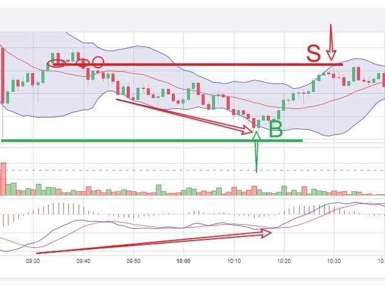

# Tuesday 20240213 (Guest: Noah Johnson)

## 08:29AM

### Morning Review (α&β Strategy)

Ladies and gentlemen, good morning. I'm Noah Johnson. Congratulations to those selected for the AI ROBOTICS PROFIT 4.0 internal testing who achieved over 23% profit on the first day. Wow, that's incredible, turning $500 into over $616. Keep an eye out for more trading signals.

Yesterday, our mentor shared seven bullish logics in the cryptocurrency market and the concept of a lucky February. Indeed, this market is getting stronger, leading the stock market. So, how should we understand and operate from both mid-term and short-term trading perspectives? I believe this is a concern for every one of us.

## 08:45AM

From a mid-term trading perspective, cryptocurrency beneficiary stocks are definitely bullish, as our mentor mentioned, we are currently in a bull market phase. So, from a mid-term standpoint, holding stocks and adding positions when prices dip is the strategy. For instance, we can use the regional bank index KRE, a contrarian indicator for cryptocurrency stocks, as a reference. When it hits resistance, it could signal another opportunity to add to our positions.

However, from a short-term trading perspective, today might be a time to reduce stock positions and diversify the portfolio because the CPI data exceeded expectations, which is unfavorable for stock indices and recently risen stocks. So, if you're worried about giving back profits from your stocks and fear not knowing when the next buying opportunity will come, consider reducing your holdings by 30-50%.

## 08:56AM

> CPI data exceeded expectations, lowering expectations for an interest rate cut. This is bad for the stock market. It would be wise to reduce your position in some stocks that are rising right now!

You read that right, it is to reduce positions, not to clear positions. This is just to control risks and preserve profits. It’s not that the market is failing or that stocks can’t continue to rise. It’s that they need a short-term correction to complete the selling of profit-making orders and the entry of new buying orders. Therefore, today we can take advantage of the intraday stock price surge to reduce our positions in stocks that have risen sharply.

So in this atmosphere of rapid change in market sentiment, many people are easily confused. Some people may think that they should increase the number of put options for hedging. But I don’t think so, because investors who missed this round of surge will choose to buy, so the intraday decline will be relatively limited, and panic will make you sell at the lowest point.

So, what would I do?

## 09:13AM

I'd employ the "α&β Stock Strategy" which means diversifying risk through a portfolio of stocks. Stocks that have surged too aggressively will always have a correction due to high deviation rates, and emerging sectors will be picked up by market investors in turn.

However, I wouldn't opt for financial or insurance sectors, as they lack explosive potential; those are the choices of fund managers, who aren't necessarily looking to maximize profits! Whenever I find myself in this situation, I'm always reminded of the healthcare and consumer sectors. Is it possible to choose offense on the basis of defense? This has always been an exciting topic for me. Beyond cryptocurrencies and artificial intelligence, I have a particular fondness for biotechnology and gene editing.

## 09:18AM

Today, my recommendation for the new addition to the portfolio is $CRSP. You can use the funds from the recent reductions to invest in this stock.

The convergence of five major technology platforms—artificial intelligence, public blockchain, multi-omics sequencing, energy storage, and robotics—is synergizing to potentially accelerate the global economic growth rate from an average of 3% over the past 125 years to over 7% in the next seven years.
As a supporter of gene editing, $CRSP is a leading company in this field. Recently, the company's Casgevy received approval from regulatory bodies in both the UK and the US, becoming the world's first approved CRISPR gene editing therapy.

Financially, this biotech company holds over $1.9 billion in cash. Despite its rising stock price, it is still far below its level from a few years ago.

1 hour trend chart shows the price retesting near the golden moving averages MA34/55, presenting a good buying opportunity.
If you decide to buy this stock, please send a screenshot to me or the mentor's assistant so we can assist you with strategy tracking.

## 09:48AM

Did you see the third trading signal shared by the assistant to the mentor in the Telegram channel just now? Yesterday, a friend asked me what the target of this internal test is and why it can generate significant profits in a short period. Simply put, it's a Bitcoin contract, simpler than stock options contracts, and in just a few minutes, it has already gained over 70% in profit. This is the advantage of combining deterministic opportunities with Bitcoin contracts. It can significantly increase profits on the basis of spot trading.

## 10:02AM

I'll share a bit about the profit mechanism. Our usual stock purchases are spot transactions, where $100,000 can equivalently buy $100,000 worth of stocks, which then belong to you. Cryptocurrency spot transactions work similarly. Ordinary spot transactions are quite straightforward, but they have two downsides: you can only profit when the stock price rises, and they require a significant capital investment with a longer investment period.

However, the advantages of contract trading are quite apparent, as, like options, it belongs to financial derivatives. With just a small amount of contract margin, you can achieve profits several times higher than in spot trading. Their typical characteristics are low cost, low loss, and high return, or it can be understood as 'limited losses, unlimited gains.'
Compared to stock options trading, cryptocurrency contract trading is more flexible, with longer available trading times, making it one of the main investment methods in the cryptocurrency market.

## 10:15AM

Many friends have just used around ten minutes to gain around 80% profit. How about everyone's profit situation? We can share it in the group. Let's discuss together the opening price, closing price, trading duration, and other related issues.I carefully studied the internal testing plan and the recent contract trading. Two key points stood out to me as crucial.
First the criterion for judging the success or failure of the plan. It mentions that if there is a loss during the testing period, it would declare the testing plan a failure which shocked me!

Perhaps my prolonged absence during my travels resulted in me not keeping up with the latest developments in AI ROBOTICS PROFIT 4.0. As far as I know, the mentor chooses no more than 2 trading signals for testing each day, aiming to select the most deterministic opportunities. The success rate of these strategies must be extremely high for him to make such claims which aligns with his conservative approach.

## 10:28AM

What truly astonishes me is that its performance has undoubtedly reached a highly refined stage which is what all of us have been eagerly anticipating.
To the 1000 fortunate individuals among you this might seem like an extremely effortless process, with this trade lasting around 10 minutes and yielding over 70% profit. However it's not merely a simple trade it's the culmination of the efforts of dozens of workers over more than five years. I believe that in the near future when you see it, it will be flawless and perfect!

I just studied this trading instruction, which applied the techniques of MACD. Friends this technical indicator is very important. It is a crucial part of AI ROBOTICS PROFIT 4.0 because of its wide practicality. If Bollinger Bands provide a framework for trend analysis then MACD is the core basis for accurately determining in which phase a trend is and where the buy and sell points are.

## 10:34AM

It's like giving a profit machine wings to soar. After learning the MACD-related courses from the tutor I created my core strategy - the α&β stock strategy. This was my core strategy in the past years, and other strategies were built on this foundation. I saw yesterday that the tutor is preparing to share these courses. You all must study well, and I also plan to learn and elevate my investment skills with you. What magical methods were used in the trade just now? Let's all pay attention to the tutor's course during the closing period.

## 02:31PM

### Closing Commentary

Good afternoon, dear friends.

Thank you to Noah for the wonderful share this morning, timely alerting everyone to the short-term risks in the market: suggesting reducing holdings in stocks that have risen too much at relatively high levels, and by diversifying investments, allowing everyone to buy a both defensive and offensive gene editing bull stock - $CRSP.

Gene editing is a hot topic in biotechnology, and cryptocurrencies and biotechnology are currently very popular.

\$CRSP is a high-growth stock with excellent fundamental information.

Looking at the multi-period charts, it seems to be in a 'resonance' trend and is expected to become a star in the market in the short term.

If you missed the information in the morning, you can still purchase it now.

## 02:51PM

Did you see the dramatic changes in the market today?\
Stock indices fell, bond yields and the U.S. dollar index surged, especially the VIX fear index, which soared - breaking through the recent narrow trading channel.

The main reason for this sentiment is that today's CPI data showed that inflation pressures remain high, lowering the market's expectations for the timing of the Federal Reserve's first rate cut and the extent of rate cuts throughout the year!

* So, will this sentiment continue?
* What impact will it have on our held stocks?
* What data have we obtained from the test plan so far?
* What valuable information have we gained from it?
* Why has Ai4.0 been able to help us achieve such outstanding profits?
* What methods have we used?
* What new courses will I share today?

Next, I will share these important topics.

## 03:16PM

International crude oil prices are also rising, and these adverse factors together make the decline in stock indices today a very normal phenomenon. Therefore, using conventional thinking, it's highly possible for this panic sentiment to continue spreading!

But do we need to join the panic?

My view is very straightforward: When others are panicking, it's precisely the time for us to take action.

My confidence comes from four points:

1. Big Picture: A rate cut is inevitable.
2. Analysis of Key Points of the VIX Fear Index.
3. A quality portfolio will lead us to lead the market.
4. The stability and profitability shown in the Ai4.0 test data are the basis of our confidence to overcome all difficulties!

## 03:41PM

First, let's understand the first point.

You should go look at our official website's homepage, where I wrote a letter encouraging everyone during the stock market's significant decline in 2022.

At that time, we were not afraid. So why should we be afraid now?

Because a rate cut by the Federal Reserve this year is inevitable, the earlier one enters the stock market before the rate cut, the better, as it provides an early advantage.

Therefore, stock indices may temporarily drop slightly due to these negative factors, but the mid-term outlook remains bullish. So, isn't every dip a good mid-term buying opportunity, friends?

Next, let's look at the VIX fear index daily chart.
Below 20 points is still considered healthy, and historically, every time a daily candlestick has a long upper shadow, there's a high probability of a decline, which would correspondingly lead to a rise in stock indices, corroborating the first point's assessment.

## 03:56PM

Third, our portfolio consists of artificial intelligence, cryptocurrencies, sustainable energy, and biotechnology, which are all very high-quality options!

If such a combination cannot help us profit, there's only one possibility: we are in a bear market.

Friends, how much profit have you made from such a portfolio? How long did it take? Are you satisfied with the efficiency of such investments?

Of course, a very small number of friends who hold $TSLA have not yet made a profit.

Even though few have bought it and it occupies a smaller position in the portfolio, I still take this matter seriously.

My thought is, after our phased internal testing plan ends, if it does not bring good returns, I will give special consideration to these friends because it has indeed taken up our time, and time is money!

## 04:18PM

Indeed, this is precisely the fourth point I wanted to discuss.

Although there have only been a few trades, and the internal testing plan is still ongoing, I have set the strictest execution standards.

I do not allow any small probability events to occur, nor do I permit the factors leading to failure, thereby temporarily achieving considerable and stable returns!
I feel that at this stage, I have fully integrated with the data of the Ai4.0 system, a culmination of many years of dedication from numerous practical experts and researchers.

Of course, this also depends on our choice of the highest winning rate market based on the data from Ai4.0.
How to increase the success rate of each transaction?
Beyond technical analysis, another very important concept is the "margin of error."

Choosing a market or a product with higher certainty increases this margin of error, and thus, the win rate is higher.

## 04:50PM

In yesterday's "2024 Industry Outlook Report Summary," I discussed seven bullish logics for cryptocurrencies this year, which has significantly increased the popularity, certainty, and volatility of the cryptocurrency market.

This is the main reason why our stock investment portfolio and the "Ai Robotics Profit 4.0 Investment System Internal Testing and Learning Plan" have achieved good results so far!

Therefore, whether the stock market is in a bull or bear phase, with the help of Ai4.0, we will gain more profits than any other investors, which is our greatest source of confidence!

For those who have been shortlisted for the internal testing plan, please be aware that my assistant has already shared the fourth trading signal on behalf of me in the Telegram channel, and please ensure strict execution!

Next, I will use our practical case study to share the techniques discussed in the course, which is the best way to learn!

## 05:12PM

This morning's trade was very straightforward, as shown in the diagram, where we used a 1-minute trend for execution.

It involved some techniques that have not been shared before.

I encourage everyone to follow my thought process to build an impression, and I will share these key points in subsequent courses.

1. The rationale for buy point B:
    * The price was near the support line, which is determined by the lowest point of the candle on the left.
    * The MACD's Signal Line and MACD Line were moving upwards while the price was moving downwards, indicating a classic 'bullish divergence' pattern.

2. The rationale for sell point S:
    * The price was near the resistance line, determined by the demarcation line when the price fell on the left.
    * The MACD Histogram was shortening above the zero axis, indicating a decrease in buying strength, hence a weakening upward trend.

The entire contract trading process lasted about 15 minutes, with a return rate of over 70%, very relaxed and efficient!

## 05:31PM

The Ai4.0-Trading Signal Decision System includes four important technical indicators, with Bollinger Bands and MACD being two commonly used standard indicators, while the other two are customized.

Attentive friends might have noticed that I often use a combination of Bollinger Bands and MACD for technical analysis.

This combination simplifies technical analysis significantly, allowing for the determination of the trend phase, such as the formation, strengthening, weakening, confusion, and ending of a trend. MACD is used to precisely identify these stages.

Next, I will share a new course with everyone: Basic Applications and Trading Secrets of MACD (1-1) - Judging Trends.

1. Most of the time, when the MACD Histogram is positive and the Signal Line and MACD Line are trending upwards, the price is in an uptrend, as shown in the U section of the diagram.

2. When the MACD Histogram is negative and the Signal Line and MACD Line are trending downwards, the price is in a downtrend, as shown in the D section of the diagram.

## 06:06PM

Friends, if you feel that interpreting charts has become more challenging, then please pay attention to distinguishing what the Fast Line (MACD Line), Slow Line (Signal Line), MACD Histogram, and the Zero Axis are.
In yesterday's share, I covered these aspects. If you're still unclear about them, you can direct message my assistant or my excellent student, Noah Johnson, for inquiries.

Technical indicators are important quantitative bases for trend determination. The content I share is something you won't find in any investment book; it's the culmination of decades of trading data analysis.
For example, each component of MACD is very important, and every change is extremely meaningful, offering significant guidance for trading.

In subsequent courses, I will share more techniques daily, combined with practical trading experiences.

The fourth internal test trading signal was successfully completed, with many friends achieving a return rate of 100%!

For those who have not executed the trading signal, please pay attention to carry it out.

After completing the trade, everyone is welcome to share their trading results and joy!

## 06:31PM

Congratulations to the friends who participated in the fourth test, achieving an overall return of 62% in almost the same time frame, with the volatility of the ICH/USDT pair being higher, resulting in a return rate exceeding 100%.

59.43%! This nearly achieves our profit target of 60% and in a shorter time than expected, which exceeds my expectations!

This is the charm of using the Ai4.0 investment system to grasp certain trends and trading signals.

This is the advantage of cryptocurrency contract trading, which can yield substantial returns in a short time!

Tomorrow is the traditional Valentine's Day, and I wish every friend a happy holiday and a wonderful family time in advance!

Tomorrow, we will continue to work hard, striving to give everyone an important gift!

Tomorrow morning, Noah will keep sharing short-term live trading techniques with everyone, so please pay attention to the group information during trading hours.

Have a pleasant day!
