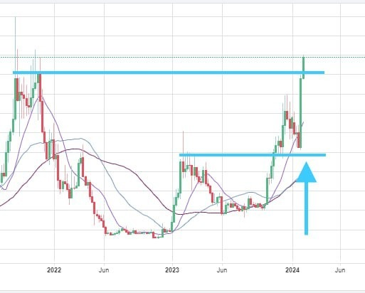
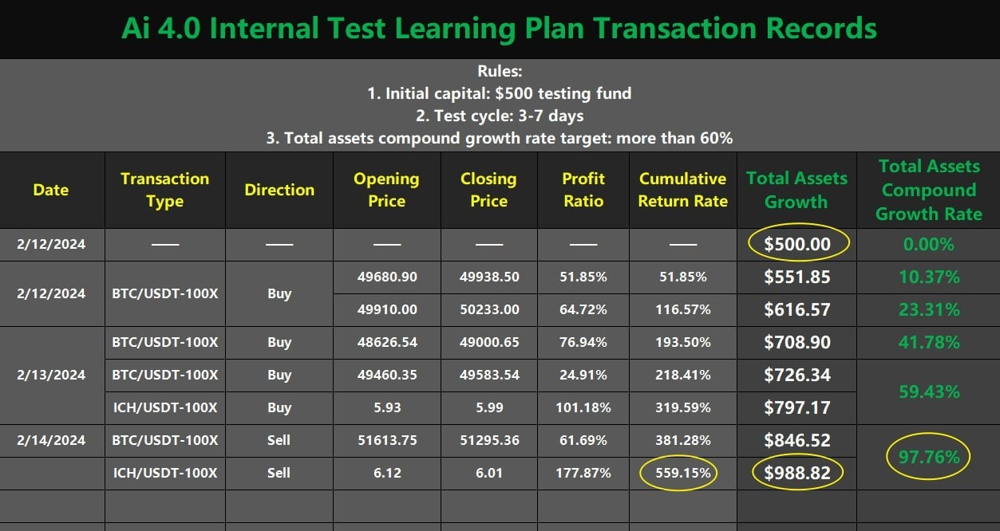

# Wednesday 20240213  (Guest: Noah Johnson)

## 08:34AM

### Morning Review (α&β Strategy)

Ladies and gentlemen, good morning. I'm Noah Johnson. Congratulations to those who were selected for the AI ROBOTICS PROFIT 4.0 internal test and achieved nearly 60% total asset returns in just two days. Yesterday, our mentor drew conclusions from four themes:

* Interest rate cuts are inevitable
* The VIX fear index signals the stock index will continue to rise
* Our quality investment portfolio will surely lead the market
* AI ROBOTICS PROFIT 4.0 is our strong support

Culminating in the insight that 'when others panic, it's our time to take positive action.' Indeed, our held stocks' average gain outperformed the market again today.

## 08:48AM

On February 9th, I expressed my view on raising the mid-term target price of $MSTR to $890. It seems that this cryptocurrency bull market is much stronger than we anticipated and the target price is expected to be reached soon. With the halving cycle approaching in April, the cryptocurrency bull market is expected to strengthen further. It's truly fortunate to have investments related to crypto.

Cryptocurrency still remain a significant part of our portfolio. It's incredibly fortunate to have the opportunity to participate in this bull market alongside the mentor. I'm excited and grateful for the mentor's invitation and the chance to share my investment insights with so many friends. It's my honor to be able to assist everyone!

## 09:01AM

Our portfolio's cryptocurrency beneficiary stocks have been particularly standout, with $MSTR and $MARA seeing gains of approximately +11.5% and +13.3% respectively. This success can be attributed to two key pieces of information.

Key Information 1: SEC Chairman Gary Gensler stated that the SEC's investor education responsibilities include Bitcoin.

Key Information 2: Federal Reserve Chairman Powell told Democrats on the U.S. House Financial Services Committee that a framework for stablecoins is needed. He also stated that Congress must approve a central bank digital currency.

## 09:11AM

The first piece of information follows up on the SEC's previous inclusion of Bitcoin under federal securities laws, marking another significant official statement. As the highest regulatory body in the securities industry, such declarations not only affirm cryptocurrency as a mainstream investment but also highlight its status as a core asset for many. As a premier platform for investor education, EIF Business School, in addition to testing and launching the AI ROBOTICS PROFIT 4.0 investment system, is actively advancing education in this area, setting a standard for the industry. Do you all agree with my viewpoint?

## 09:20AM

What is the stablecoin market? It is the commonly used USDT, etc. We often see that the last few letters in a cryptocurrency name are ‘USDT’, such as BTC/USDT, ETH/USDT, EIF/USDT, etc.

Simply put, it is a universal currency in the cryptocurrency market, just like the US dollar is universal in the world, and to some extent it can be understood as a token of the US dollar.

Investors who want to invest in cryptocurrencies need this universal currency. Just like investors in other countries who want to invest in our stocks must convert their currencies into U.S. dollars, USDT has gained widespread circulation in the cryptocurrency market.

As a stablecoin, its biggest feature is that its price must be stable and cannot fluctuate as much as Bitcoin and Ethereum, so people call USDT and USDC stablecoins.

## 09:31AM

Because stablecoins have stable prices and fast transaction speeds, they are ideal for cross-border payments and transfers. Compared with traditional international bank transfer or remittance services, using stablecoins can complete transactions faster, more convenient and cheaper.This important information released by the Federal Reserve is good for the development of stable coins; the faster the development of stable coins, the higher the circulation efficiency of the cryptocurrency market.

Bitcoin's halving mechanism is to curb inflation. Market demand is getting larger and larger, but output is getting smaller and smaller. This promotes the typical characteristics of a four-year bull-bear cycle in the cryptocurrency market. From the current statement by the Federal Reserve, it can be seen that the market demand for cryptocurrencies is increasing, and the demand for stablecoins is even greater.

This news is not only beneficial, but also highlights the strength of the bull market. Do you understand the above points? Next, we will focus on analyzing the holding stocks.

## 09:44AM

As our mentor said, the VIX index showed a long upper shadow on the candle chart yesterday, and the market outlook is bearish. The VIX index fell sharply today, and market sentiment was reversed.

\$NVDA continues to rise and performs strongly; $TSLA's golden moving average MA13 finally begins to turn upward, which is a signal that the bottom is in; $MARA surged 15% today, driven by Bitcoin, and MA13 crosses MA34. I am optimistic that it will break through the left Pressure line; $MSTR has successfully broken through the original short-term target of $730 and the pressure line on the left. MA13 has simultaneously broken through MA34 and MA55. This is a signal of trend acceleration. The latest short-term target price of $890 and the medium-term target price of $1,400 are expected to come soon!

## 09:52AM

The main purpose of adding $CRSP to the portfolio yesterday was to control risks. Short-term trading focuses on selling before uncertain emotions arise, while mid-term investment uses greater logic to digest these negative effects. This is the difference between mid-term trading and short-term trading.

Of course, all of us are more willing to see the balance between risk and profit. Gene sequencing, as a popular direction of biotechnology, is not only a pursuit of people's lives, but also a sector that investors are passionate about. Therefore, we often see cryptocurrency and gene sequencing taking turns rising. This is also the reason why we diversify investments yesterday to deal with unknown risks. Assuming that the cryptocurrency does not rise today, then there is a high probability that it will be the turn of gene sequencing. Our current combination framework will be more beneficial to our offensive and defensive balance.

## 10:0A1AM

\$CRSP technology is disruptive, and the genome editing cell therapy Casgevy provides the company with important commercial prospects. The European Commission has approved conditional marketing authorization for Crispr Therapeutics gene-editing therapy Casgevy. This brings unimaginable expectations to the stock price. There isn’t doubt that it has become an industry leader and one of the best growth stocks!

In the eyes of Wall Street $CRSP is a severely undervalued high growth stock. Judging from the weekly chart buying has accumulated and is ready to go. It isn’t very difficult to rise and rise sharply. If you want to synchronize with our trading rhythm and have not bought this stock, you can still buy it.

Just now, the instructor's assistant has sent the fifth trading signal in the Telegram channel. Please pay attention to the trading instructions among the shortlisted friends.

## 10:18AM

I heard that my mentor made an entertainment betting agreement with everyone at the end of last month when the price of $MSTR was around $500 the target price of $MSTR at the end of April was around $1,400 and the rate of return was expected to be 160% If the mentor wins everyone will introduce 5 friends to help promote AI ROBOTICS PROFIT 4.0 How many friends are participating in this entertainment agreement?

Now half a month has passed and $MSTR has increased by more than 50% I am very happy to see this win-win situation. What do you think?

## 10:45AM

With the smooth progress of internal testing the AI   ROBOTICS PROFIT 4.0 investment system EIF Business School and EIF tokens have attracted widespread attention in the industry. As you can see from the recent trend of EIF tokens the price backtests the important support line of the weekly line. Then it started to rise. The current increase has nearly doubled which is much higher than $MSTR, $MARA and BTC has broken through the pressure line on the left which highlights its value.

Friends if the pre-launch testing and publicity of AI ROBOTICS PROFIT 4.0 progresses smoothly coupled with the increasingly strong bull market in the crypto market driven by such multiple good news and initiatives EIF/USDT is The future value will be unimaginable.

## 11:05AM

I think that the mentor's target of a 500% increase this year is a rather conservative forecast. Therefore, I not only suggest paying more attention but also recommend firmly holding or increasing positions for those who already have holdings of the token. Of course you can also acquire it by obtaining stablecoins (such as USDT) in the cryptocurrency market.

Today marks the fifth internal test of contract trading signals which involve a combination strategy and have already accumulated seven transactions. One of the assets traded is the native token ICH/USDT on the ICHCOIN trading center typically found on high quality trading platforms. Major trading centers like Binance have their own native tokens which are akin to star players in a sports team. It's essential to keep an eye on this asset as well. Based on test data, its volatility exceeds that of BTC making it worthwhile for trading.

## 11:22AM

Bitcoin and Ethereum continue to show strength but stock indices are hesitating resulting in slight adjustments for our cryptocurrency holdings after significant gains. However, it's important for everyone to hold steadfastly as the future holds even better prospects for upward movement. Congratulations to those who bought $CRSP; their returns are expanding.

I've observed that today's internal testing trading signals utilize Bollinger Bands and MACD a combination that is sure to increase the success rate. I'm also in the process of relearning this course system preparing to enhance my alpha and beta strategies. How much profit can this trading signal generate? What methods are being employed? Let's collectively pay attention to the mentor's teachings during the closing hours.

## 02:41PM

### Closing Commentary

Dear friends, good afternoon, and happy holidays!

Thank you to Noah for his wonderful sharing this morning. He timely shared important statements from the SEC Chairman and the Federal Reserve Chairman, interpreted the significant positive news within those statements, and the core high-growth quality stock in the biotechnology sub-sector of gene editing - $CRSP, which he shared yesterday, recorded a strong performance today, with a gain of up to 10%.

This indicates that our portfolio has already secured leaders in four industries, making it relatively simple to achieve above-average returns, and we are already far ahead of 90% of market investors!

Why are they able to continue to strengthen despite the negative impact of CPI? Can their strength continue?

## 03:04PM

If you have carefully read my investment notes from yesterday, you would definitely come to a clear conclusion: their upward trend can definitely continue.
In yesterday's theme of "Do not join the panic," I mentioned: because it's inevitable that the Federal Reserve will cut interest rates this year, the earlier you enter the stock market before the rate cuts, the better, as this can secure an early advantage in the bull market.

Additionally, I conducted a qualitative analysis of our portfolio: they belong to leaders in artificial intelligence, cryptocurrency, sustainable energy, and biotechnology.

Today, I want to add that, except for $TSLA's performance not being strong enough, our portfolio stocks have completely become a benchmark in the market. If such a combination cannot bring more stable and substantial returns, then the only option would be to switch to another market!

## 03:23PM

I can even make a bold prediction that the sectors corresponding to our investment portfolio are very likely to become the four horsemen of this year's global stock market:

* The artificial intelligence sector represented by $NVDA will run throughout the year, becoming a stable and driving core of the stock indices!

* Although $TSLA is currently in a trough, when it rises, it will drive the revival of the entire sustainable energy industry and the new energy vehicle supply chain.

* The cryptocurrency industry represented by $MSTR and $MARA will become the most dazzling stars in this bull market!

* $CRSP, as a severely undervalued leader in the field of gene editing, may achieve more than a triple increase in expectations this year.

Haven’t you noticed from the monthly chart? The Bollinger Bands' middle band has just completed an upward turn, the bottom trading volume has doubled, surpassing the historical high of $220.20 within a year is not impossible!

## 03:40PM

Frankly speaking, when I say we are ahead of 90% of stock investors, this view is somewhat conservative.
Today, after talking with friends at Wall Street, they mentioned that our returns have surpassed all aggressive fund managers in our peer group. While I dare not be proud, I am indeed very happy!

Although Ai4.0 has helped us achieve a temporary and phased victory, everyone should be able to see that our grasp of the market's profit rhythm is very accurate.
For example, when we recommended $NVDA on January 8th, it drove the index and the entire market.

For instance, from mid-last month to the beginning of this month, we bought and added positions in $MSTR, then the entire cryptocurrency industry welcomed an explosion!

Dancing waltz, smoking cigars, drinking, talking to people... even breathing requires rhythm. Rhythm is the lifeline of profit; rhythm is everything.

You can understand it as Mr. Jesse Livermore once said: Timing!

## 04:03PM

The market reflects all fundamental information, and Ai 4.0 has helped us overcome all obstacles in both fundamentals and technical aspects!

Friends, are you satisfied with your current investment returns?

Today is a joyful day, not only because it's Valentine's Day, but also because it marks the successful completion of our first 'Ai Robotics Profit 4.0' investment system internal testing and learning plan!

In two and a half days, through 1000 trading accounts, two cryptocurrency contract trades, 5 trades, and 7 trading signals, and looking at the number of completions, nearly 7000 orders were made.

This created a total asset return rate of 97.76%, meaning the total assets of friends participating in the test (500,000 USD) nearly doubled!

Without a doubt, this is a great victory.

## 04:28PM

Process creates results, let’s take a closer look at the data:

1. The win rate is 100%\
This demonstrates the strategic effectiveness of the Ai4.0 system.\
If I increase the 'offensive coefficient' a little higher, my profits may eventually multiply exponentially.
There was not a single failed transaction. According to the original plan, this test was declared a success!

2. Average rate of return\
The cumulative return rate of the seven trading signals is 559.15%, and the average return rate of each trading signal is 79.88%.

3. Position\
Nearly every trade was controlled within 20%. This is a very small position size, so a total asset return rate of 97.76% is highly significant!

4. Capital growth\
The total assets of the $500 test account finally reached $998.82, which demonstrates the profitability of the Ai4.0 system.

5. Time\
The original plan was to complete 60% of the total asset return in 3-7 days, but we exceeded both targets.

6. Market and target\
The high volatility and certainty of the cryptocurrency market are fundamental to success.

7. Use of tools\
Cryptocurrency contract trading with the Ai4.0 system, the combination of these two tools creates magical results, with the short contract demonstrating the flexibility of this tool.

## 04:53PM

What do friends think about these data? Aren't they highly valuable?

In the spirit of 'a small group tests, the majority benefits' and 'minimizing risks, maximizing benefits', we launched this test.

Here, I especially thank our sponsor, ICHCOIN Trading Center, for their strong support, and all friends for their enthusiastic participation!

To ensure the validity of the data for this plan, I strictly selected some outstanding students to participate. Except for a few special cases, everyone's execution was very much in place, which laid an important foundation for the success of our test. Once again, thank you for your action!

To thank everyone, I announce:

1. The 1000 finalists in this round will additionally receive a one-year free personal edition of the Ai4.0 investment system application!
2. According to the rules, these profits belong to everyone. You only need to return the account and the test funds, and then you can withdraw the profits to your cryptocurrency wallet or bank card.

## 05:14PM

Friends, on this special day, receiving such a reward, I believe, is of commemorative significance!

The belief in professionalism as the sole content of one's calling, trusting that through hard work we can please God, and that diligence in wealth is the only means to rebirth.

This is not only the teaching of our ancestors but also a common value among many of us, and also the driving force behind realizing our great dreams!

Although the Ai4.0 system has not yet been launched, and we may need a few more months to complete some planning, today's data has given me unprecedented confidence and belief!

In my life, I have rarely felt this way; I am not good at expressing myself, and without any exaggeration, I even feel like I've become 20 years younger!

The success of this internal testing plan has also given myself a tremendous reward!

## 05:31PM

I am fully aware of how difficult it is for an ordinary person to achieve success in the investment market through decades of consistent effort.

After experiencing a significant turning point in my life in 2008, I began to understand the direction of my life.

I decided my life in quantitative investment and education, as well as later starting the development of the 'Ai Robotics Profit' investment system.

The hardships I went through are known and understood by no one; at my hardest times, I couldn't even afford rent...

To this day, as it enters the pre-launch testing and promotional phase, it all feels like a dream... because I know this is a tool that can change the fate of retail investors.

Perhaps it really is as revolutionary as some experts have evaluated.

At this moment, I'm not too worried about whether it can be launched. On the contrary, I feel relieved.

My struggle has set an example for my children, teaching them the power of dreams and the meaning of striving!

## 05:39PM

Of course, this does not mean the Ai4.0 system is perfect. We will continue to strive, create more opportunities and space, and allow more friends to participate.

So, I would like to thank both new and returning students for joining and coming back to participate in the historically significant 14th internal sharing session.

For those who participated in this internal test, we welcome your valuable suggestions for optimization or comments on Ai4.0 and your experience during this process!

Those who did not participate can continue to write to me or my assistant. After today's sharing, I will share my business card.

This is not just a test plan but also a learning plan, as practical experience is always the best teacher!
Once you have learned the methods in the trading signals, you essentially possess Ai4.0.

Most importantly, when you have the opportunity to use it in the future, you will be more skilled.

The process determines the outcome, so let's explore the new courses of Ai4.0 together.

## 05:56PM

Basic Application and Trading Secrets of MACD (1-2) - MACD Histogram and the Strengthening and Weakening of Trends:

* A MACD Histogram shortening indicates a weakening trend; lengthening indicates a strengthening trend.
* During a trend, the MACD Histogram's move from negative to less negative often forms a buying point; a move from positive to less positive often forms a selling point.

Consider using $NVDA's daily chart to reflect on a question: why did I recommend buying on January 8th, and still advise holding firm today?

One key point is the application of the change in the MACD Histogram's negative values and its relationship to buying points, as discussed today.

Another point is that currently, there is no price break below the middle Bollinger Band and no divergence pattern at the top. In future lessons, I will continue to share deeper knowledge.

## 06:16PM

Friends, to achieve financial freedom through investment, one must have a great dream!
Have you envisioned achieving financial freedom within the next three years or even sooner? How do you plan to achieve it?

Applying Knowledge, today's Achievement Verification Rewards:

1. Drawing:\
    * Based on the key points of "MACD Histogram and the Strengthening and Weakening of Trends," use a case study to find buying and selling points.\
    (can earn 20 learning investment points)

2. Market Survey:
    * How do the fortunate finalists feel about this internal testing plan?
    * What thoughts and suggestions do the friends who did not qualify for this internal test have?\
    (can earn 50 learning investment points)

3. Whose help would you prefer?
    * My assistant
    * Noah Johnson
    * or me?

At the end of today's session, I will have my assistant share our business card.
Feel free to write to us, let's work together and make EIF Business School a happy haven for everyone.

Have a pleasant day!
