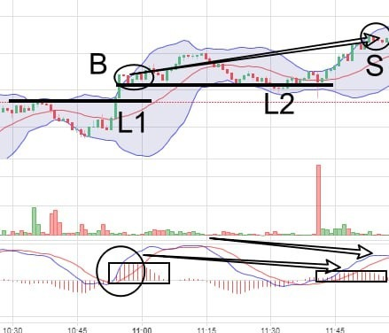

# Wednesday 20240221 (Guest: Noah Johnson)

## 08:27AM

### Morning Review （α&amp;β Strategy)

Ladies and gentlemen, good morning! Noah Johnson here. Thrilled to see the first trading signal of the AI-RP 4.0's second internal test was a success, and the EIF token price rose yesterday, just as I expected.

You might wonder why I'm not too worried about the recent stock prices. Whether the stock index will drop further is crucial because it's about the 30% potential earnings we could make in the coming month. More importantly, I have a strategy that can ensure us a profit of more than 100%. Today, I'll also lead you through the second trading signal of the AI-RP 4.0 test. Are you ready to welcome these important pieces of information and trading signals?

## 08:42AM

To gauge whether the stock index and our holdings might fall, I believe understanding $NVDA is key. Each of our carefully selected holdings represents sectors like artificial intelligence, sustainable energy, gene editing, and cryptocurrencies, whose mid to long-term investment logics are very clear. However, if the stock index falls, most stocks in the market will likely follow suit. Thus, $NVDA becomes a crucial factor influencing the stock index. Can everyone grasp this critical point? Why did $NVDA fall? Will it continue to decline? These questions become central to our understanding of the market and our investment portfolio, and I conducted an in-depth study yesterday afternoon.

## 08:52AM

**Key Point 1:** The risk of implied volatility reduction in the options market.\
Actually, in the options market, those betting against $NVDA are far fewer than those betting on its rise. However, there's concern that after $NVDA's earnings report is published, the implied volatility in the options market will decrease, leading to a drop in the price of call options for related stocks and thereby causing the stock index to fall.

**My perspective:** Options as insurance, hedging logic.\
Even though the options market leans bullish, concerns about an excessive drop in implied volatility are unnecessary. Call options provide strategic protection for investors, many of whom use them out of fear of missing out on investment opportunities by adding or reducing their positions just as stock prices might reach new highs. In reality, investors use options for effective hedging at a low cost, reflecting that bullish expectations are not unfounded. The cost of options is much lower than the actual stocks and won't easily affect the stock price trend. Therefore, changes in implied volatility have limited direct impact on stock prices.

## 09:08AM

**Key Point 2:** Concerns about $NVDA not exceeding expectations.\
The market doesn't necessarily view $NVDA's earnings negatively; rather, the worry is whether it can surpass expectations, especially with reduced demand from China. Such concerns are understandable.

**My Perspective:** Exceptional historical data, optimistic outlook.\
The global AI upgrade is boosting demand for $NVDA chips, likely dispelling all worries. $NVDA has exceeded expectations in 7 out of its last 8 earnings reports, with revenue growth between 10% to 20% in the first three quarters of 2023, far surpassing market predictions. AI giants like $ARM and $AMD also confirm strong chip demand with no signs of slowing down. All these factors clearly point to $NVDA's strong market position and optimistic growth prospects.

## 09:17AM

**Key Point 3:**  The stock price is too high.

**My Perspective:** Quality determines value.\
For instance, are brands like LV, Rolls-Royce, Lamborghini, or the institutional version of AI-RP 4.0 cheap?

**Key Point 4:** High volatility risk around earnings reports, prompting short-term investors to sell.

**My Perspective:** Facing low-probability risks for higher potential gains is worth it.\
The release of earnings report data could lead to a volatility of +/-11%, introducing uncertainty, hence profit-taking by short-term investors leading to a price drop.
However, I believe, with a -9% drop since yesterday, isn't it worth taking a -2% risk for a hopeful 20% gain? Pessimists always worry about what they'll lose, while optimists focus on what they'll gain. This is the macro perspective my mentor taught me!

## 09:34AM

While market predictions aren't always accurate, my money-making strategy remains unaffected, thanks to a meticulous hedging strategy. As our mentor emphasized yesterday, we need to maintain a macro perspective while closely following two key strategies:

* If $NVDA's stock price falls below the midline of the daily Bollinger Bands, immediately reduce the position by half; the closing price today in relation to the Bollinger Band's midline is crucial.
* Pay attention to whether a divergence appears on the daily trend chart, which has not been observed yet.

Moreover, as one of our major holdings, $MSTR benefits from two bullish market drivers. Even if the market pulls back, its decline is smaller than its peers, making it one of the most profitable companies in the cryptocurrency space. We have every reason to believe that as market panic dissipates, $MSTR is expected to hit the midterm target price of $900 I previously mentioned within a month, anticipating a further 30% upside potential.

These are key insights for midterm investors.

## 09:38AM

The latest short-term strategy and key portfolio updates are as follows.
Currently, BTC has touched the golden moving average MA13 and the recent support line for the first time, with a potential for a bottom rebound today. If you, as a short-term investor, are not satisfied with the recent performance of your portfolio, you can take advantage of the upcoming price surge to sell and follow the next strategy I'm about to share to achieve 100% profit within a month.

Yesterday, I shared five reasons why I'm optimistic about the price rise of EIF tokens. Today, I want to say that EIF tokens are facing a great opportunity to double! With the launch of the AI-RP 4.0's second internal testing plan, EIF/USDT has seen a surge in market attention. AI-RP 4.0 not only significantly improves the return on investment but also represents a major leap forward towards intelligent and personalized development in the investment education industry. For those seeking long-term growth and innovation-driven investments, EIF tokens are an exceptional choice.

## 09:49AM

Currently, the price of EIF/USDT is showing a strong upward trend, especially before and after the success of the first internal test plan of AI-RP 4.0, where the price has already doubled, with a continuation of the rise yesterday. With the commencement of the second internal test plan, involving five times the number of participants than before, we have every reason to believe that this testing plan will definitely succeed, given AI-RP 4.0's high win rate in the cryptocurrency market.

Therefore, the potential for EIF tokens to double again in a month is enormous, perhaps even faster and stronger! Isn't this what everyone wants to see? If so, then it can definitely be achieved; this is the truth of the investment world!

Are you willing to hold your current positions to achieve a 30% gain in a month? Or would you prefer to double your profits in less than a month? Therefore, I believe EIF tokens are not just a 'welcome addition' but also a strategy that offers both offense and defense. Now is the best time to invest, this opportunity is not to be missed!

## 10:00AM

### Please keep a close eye on our Telegram trading signals group - AI4.0 2nd Testing-VIP. The second trading signal has been released

To put it bluntly, in spot investments (like stock investments), EIF tokens represent an unparalleled certainty of opportunity. I'm always frank, fully appreciating what I endorse and showing no mercy to things I disapprove of.

For those who underestimate this trading opportunity, whether by not participating or by recklessly not following the guidance, you are not truly fighting alongside our mentor. You are wasting the precious opportunities that our mentor has worked hard to secure. If you cannot execute strictly according to the trading signals, I strongly suggest that our mentor revokes your participation rights. This is not just a matter of respect for the team but also a way of valuing every opportunity.

## 10:51AM

### My trade

## 10:52AM

Having observed the recent trading signal, it indeed appears very robust.

So, friends, the test funds you're using have been hard-won by the mentor, essentially backed by the reputation of EIF Business School and him personally. You should know from the academy's teaching principles how seriously the mentor takes his reputation. You must cherish such opportunities, which are beneficial not just for profits but also for learning.

Do those who aren't discipline and lack a sense of responsibility realize the serious impact they could have on the final test data? Suppose some individuals act contrary to expectations, affecting the test data. Wouldn't that extend the testing period? And how many engineers would have to work day and night to correct the data? Wouldn't this ultimately slow down the launch process of AI-RP 4.0? Isn't that a loss for everyone?

## 11:41AM

I must frankly express a serious concern: if our actions distort the test data, it could not only affect the future growth potential of EIF tokens but also adversely impact all of our interests. Many people have already invested in EIF/USDT and are actively increasing their positions; any inappropriate behavior from us could jeopardize this opportunity. Therefore, my forthright words today are meant as a warning for all to take this seriously.

The reason we're discussing this today is to emphasize one point: the opportunity to test the AI-RP 4.0 system is incredibly precious. We must approach it with the utmost seriousness and responsibility. Only by doing so can we deeply understand and master the essence of the AI-RP 4.0 system and leverage the tremendous potential it offers us. Let's all cherish this opportunity for learning and growth, ensuring everyone benefits from it.

## 11:48AM

### Congratulations, everyone

Through the second signal of the AI-RP 4.0 system's second test, we have collectively achieved over 60% profit, which once again proves the precision of the system and the power of our mentor's wisdom. This success is the result of our mentor's years of relentless pursuit and strategy accumulation.

Success is not by chance, but the crystallization of method and wisdom. Your curiosity—about this successful strategy, the details of contract trading, and the value of ICH/USDT—I will relay to our mentor. Please look forward to the mentor's in-depth sharing this afternoon, as we continue to march forward on the path of investment!

## 02:30PM

### Closing Commentary

Dear future investment masters of EIF Business School, a wonderful afternoon to you!

### Important Information

At the onset of this internal sharing session in early January, I highlighted the world's most important bullish stock - $NVDA.
Currently, it has finally broken below the daily middle Bollinger Band, mainly due to two concerns, its significant rise lately and market worries that its Q4 2023 earnings report might not exceed expectations.

According to our pre-determined strategy, if the price does not return above the middle Bollinger Band by today's close, we should sell half of our position. Please execute this strictly!

If the price strongly reclaims its position above the middle band in the coming days, we can consider buying back the portion sold today. This represents selling risk (uncertainty) and buying opportunity (certainty).

The reason for retaining half of the position is that only when a top divergence pattern appears on the daily chart can we consider its uptrend to be over.

## 02:52PM

\$NVDA undoubtedly occupies the center stage of the global stock market, and its recent performance has had a significant impact on global markets.

We are thankful to Noah for providing us with in-depth analysis; his insights are commendable.

Regarding whether to continue entering the market or adjust strategies tomorrow, we will closely monitor $NVDA's movements and the market's reaction to the Federal Reserve meeting minutes to make informed decisions.

Fortunately, we have the strong support of the Ai 4.0 Second Internal Testing and Investment Learning Program. As I've mentioned before, in the face of market uncertainties, we have prepared hedging strategies. Therefore, now is not the time for excessive worry; we should remain optimistic about the future.

We are about to start a highly valuable lesson, beginning with two specific practical case studies. This is an excellent opportunity to deepen our knowledge and enhance our skills.

## 03:09PM

This trade is based on a 5-minute chart. For ease of learning, I will explain the process of this trade by enlarging the candlestick chart, Bollinger Bands, and MACD:

1. When the Ai4.0 system was searching for trading signals, the price was already in an uptrend - the direction of the middle Bollinger Band was upwards, leading us to primarily consider going long.

2. When the price broke through the resistance line, the MACD Histogram increased above the zero axis, forming a buying point.

3. Subsequently, the price slightly retraced to the support line and the middle Bollinger Bands without breaking below, showing effective support.

4. The growth of the MACD Histogram slowed down, forming the first selling point.

At this moment, the order's profit exceeded 50%, so we sold early to mitigate risk and secure profits.

## 03:19PM

### Trade Summary

1. This trade is a typical example of a trend-following type, making the whole process relatively smooth. In trend trading, it's crucial to accurately recognize the direction of the middle Bollinger Band.

2. Breakout buying point: The price strongly breaks through important resistance or support lines.

3. MACD Histogram and the strengthening or weakening of the trend: The MACD Histogram shortening indicates the trend is weakening; lengthening indicates the trend is strengthening.

4. This trade utilized 10 sheet of contracts with 100X leverage, achieving an overall profit of over 51%, contributing to more than a 10% increase in total asset growth rate.

Overall, it was a relatively conservative trading style, making the profit process easy, comfortable, and efficient.

Let's move on to learn about the second trading signal.

## 03:33PM

This trade is on a 1-minute chart:

1. When the price of ICH/USDT strongly broke through resistance line L1, accompanied by the MACD fast line (MACD Line) crossing above the slow line (Signal Line), it formed a buying point.

2. Afterward, the price slightly rose then fell back to the support line L2 and stopped declining, showing the strong support function of L2.

3. As the price rose again, the area of the MACD Histogram showed a top divergence pattern compared to the left side, forming a selling point.

After selling, the price began to fall, making this selling point very precise.

## 03:46PM

Actually, in this morning's trade, we had an opportunity to add to our position, but I refrained from doing so, worried that some friends might not be sufficiently skilled yet.

The second trade's return was higher than the first, achieving an overall gain of more than 63%. The cumulative return of the two trades reached 114.81%, with a total asset compound growth rate of 24.22%.

That means the $500 test amount has grown to $621.12.
Considering the characteristics of the cryptocurrency market, these two trades are considered to be relatively robust models overall.

At this moment, some friends might have three common questions for further understanding:

1. What is contract trading? How does it differ from or have advantages over spot trading?
2. Why were we able to achieve high profit growth quickly and comfortably? How are gains and losses obtained or calculated?
3. Why did we choose the ICH/USDT pair for both trades? What advantages does it have?

Next, I will discuss these important topics with you all.

## 03:54PM

To understand contract trading, we first need to grasp the basic rules of spot trading and then make a comparison, which will quickly equip everyone with the relevant investment knowledge.

For instance, direct purchases of $NVDA, cryptocurrencies like BTC/USDT, EIF/USDT, etc., fall under spot trading. Buying them means you own the actual asset.

However, you can only profit when prices rise, requiring the full use of the invested capital for trading. A clear characteristic is that it lacks flexibility and capital utilization efficiency is lower.

When we choose varieties like BTC/USDT, ICH/USDT, etc., for trading in the contract market, it constitutes contract trading.
Its primary trading mechanism is the margin trading system, which simply means using a small amount of capital for trading to achieve expected or even exceed expected profits.

Some might compare it to stock options trading, but it's simpler than options.

## 04:05PM

After understanding the main features of cryptocurrency contract trading, let's illustrate with some examples:

1. Extended trading hours: The market operates 24/7.

2. High volatility: This is why the Ai4.0 system is fond of this market; high volatility increases the chances for profit.

3. Dual-direction trading mechanism: Investors can earn profits by going long (predicting the asset's price will rise) or short (predicting the asset's price will fall), enabling profit opportunities in any market condition.

4. Instant execution mechanism: High liquidity and instant execution offer much more flexibility than the order matching system in the spot market.

5. Perpetual trading mechanism: Unlike options, which have an expiration date, perpetual contracts can be held indefinitely until the investor decides to close the position.

6. No need to hold 'heavy assets': Different from spot trading, it doesn't require the actual exchange of cryptocurrency spot assets; investors trade contracts for future prices.

7. Leverage: This is the core, the margin trading mechanism, allowing for large profits from small capital and offering a limited loss but unlimited profit investment effect.

## 04:16PM

Friends, through these explanations, we can clearly see the significant differences between cryptocurrency contract trading and spot, options, etc., right?

It's especially important to emphasize that, due to the use of margin and leverage mechanisms in contract trading, it can amplify our profits as well as our risks; therefore, accurately seizing market opportunities and effectively controlling risk are key to successful contract trading.

This is precisely where the Ai 4.0 system exhibits its unique advantages. We have built several high-success-rate models, especially performing well in the cryptocurrency market, which is the main reason we chose this market for internal testing.

Through the examples shared just now, everyone should understand that to achieve efficient profitability in cryptocurrency contract trading, it is crucial to deeply study the Ai 4.0 course.

Next, I will show you how to calculate profits and losses in contract trading using actual data.

This will be an opportunity for you to gain a deeper understanding of contract trading and further explore the path to successful investing.

## 04:29PM

Let's assume I use $110$ USDT to buy a certain investment product at $6.4231$ USDT in spot trading and sell it at $6.4635$ USDT.

The return on investment (ROI) for spot trading would be: $[(6.4635 - 6.4231) / 6.4231] * 100\% = 0.62898\%$

The profit from spot trading would be: $110 * 0.62898\% = 0.691878$ USDT

Now, what if I use 110 USD to buy the same product with a 100X leverage contract?

Then, our ROI would be 100 times the original basis: $0.62898\% * 100 = 62.898\%$

The profit from contract trading would be: $110 * 62.898\% = 69.1878$ USDT.

From the above calculation, we can conclude that the ROI and actual profit from contract trading are 100 times those of spot trading!

This has already interpreted the process of the second trading signal.

At the ICHCOIN trading center, each contract trading product has a value of 1000 USDT for a none leverage contract.

Therefore, purchasing one 100X leverage contract requires: $1000 / 100 = 10$ USDT.

To buy $11$ 100X leverage ICH/USDT contracts, it would require $110$ USDT.

Have you learned how to calculate now?

P.S.: Transaction fees are negligible, which is their advantage.

## 04:56PM

By utilizing the highest success rate model of the Ai4.0 investment system to seize certain contract trading opportunities, it is possible to achieve high returns in a short period of time.
This is why all nine trades since the first internal testing to date have been able to achieve exceptional returns in a short period, with the entire process being fast, efficient, and comfortable!

Therefore, friends, do not miss any opportunity to earn money and learn. Let us explore more profit secrets and enjoy the pleasure and sense of achievement of investing under the guidance of Ai 4.0!

Some friends have privately asked me why we are using the ICH/USDT trading pair; I will later explain its unique value.

Friends, please pay attention to the signals in the 'AI4.0 2nd Testing-VIP' group; the third trading signal for this internal test has just been released!

## 05:07PM

Yesterday, after a thorough analysis of ICH/USDT, I discovered an unmissable gold mine!

This currency's volatility surpasses BTC/USDT, making it the major contributor to exceeding the 60% profit rate target in the first Ai4.0 internal test plan! Therefore, it has become the focus of our second internal test.

As the trading platform's native token, similar to Binance's BNB, ICH/USDT possesses unlimited potential for appreciation—imagine, BNB's value surged over 690,000% in just a few years!

This is not just a numbers game; the value behind it is immeasurable.

Early investors received huge discounts, user experience was greatly enhanced, the bond between the platform and its users was tightened, and user loyalty was unprecedentedly strengthened.
Native tokens are more than just assets; they represent the vitality and potential for growth of the platform. Strategies like token burning continuously increase its value, attracting attention from small individual investors to large institutions.

## 05:21PM

Therefore, what we observe is that such unique tokens belonging to trading centers generally do not appear on other trading platforms unless the trading center perceives a bottleneck in user growth.
ICH/USDT embodies the core value of the ICHCOIN trading center, and its scarcity will become even more pronounced as market recognition increases.

It's not hard to imagine, given the choice between native tokens, how many investors who missed out on BNB might turn to ICH/USDT?

## 05:29PM

Hence, I believe now is an excellent time to invest in ICH/USDT！
As the Ai 4.0 internal testing program progresses, its inherent advantages will draw more attention, indicating a further rise in its price and volatility. This is similar to the logic behind the rise of EIF tokens (EIF/USDT's price has doubled in less than a month)!

So, the critical question is, will its value in contract trading exhibit exponential growth, friends?

## 05:42PM

### My Trade

## 05:47PM

### Important positive news

\$NVDA's 4th quarter financial report for 2023 once again exceeded expectations.

The report shows that 4th quarter revenue increased by 265% year-over-year, and earnings per share surged by 765% year-over-year.  Due to the 4th quarter's performance and 1st quarter guidance exceeding analysts' expectations, $NVDA's stock price rose nearly 10% after market hours.

Therefore, tomorrow will be another day that ignites the entire scene, and the suppressed atmosphere will instantly dissipate; tomorrow will be a day to continue competing for the speed of stock price increase and profits.

Friends, do you believe how important data is? Are you sure you understood all the invaluable insights from the last two days' courses?

Noah will lead everyone towards a new trading journey tomorrow morning.

## 05:53PM

Congratulations to those who followed the third trading signal in this internal test and achieved over 50% excess profit!
Please cherish this rare opportunity; every signal from the Ai 4.0 system is an important chance for us to move towards stable profits and refine our trading skills. To be responsible for the test data, I will have my assistant review everyone's trading records periodically.

Applying Knowledge, today's Achievement Verification Rewards:

1. In the morning session, Noah's four core views on $NVDA and the entire stock market were validated. What are the core logics behind them? (worth 30 pts)

2. How much profit did you make from the recent trading signal? How was this profit calculated? Try to understand what method was used in this signal? (worth 20 pts)

3. Why is the contract trading value of ICH/USDT very high? What attitude are you prepared to adopt and face the upcoming challenges? (worth 20 pts)

I wish every friend here happiness and growth every day!
Looking forward to meeting all of you in tomorrow's sharing session!

Have a pleasant day.

## 07:41PM (Evelyn Smith)

### Important Reminder

To ensure everyone can smoothly participate in the donation activity, I've noticed some friends have questions about how to donate, especially regarding the donation platform's receiving addresses. To make it easier for everyone, I am hereby providing the specific ERC receiving addresses for the donation activity. Please donate to the following addresses to ensure your kind deeds successfully reach those in need. Thank you to each and every one of you for your generous support; your contributions will bring great help and hope to others.

ERC20 receiving address:

`0x4aAb2278a1325cFdbDF389e0664D100c74B95cf5`

Thank you again for your participation and support. Let's contribute our strength to society together!

## 08:03PM (Evelyn Smith)

Due to many friends messaging me privately, asking how to obtain customer service contact information, I'm currently unable to respond individually. To facilitate, I've decided to reply here collectively. If you need to contact customer service, you can do so through the following offline customer If you need to contact customer service, you can do so through the following offline customer service Telegram channel:

If you need to contact customer service, you can do so through the following offline customer service Telegram channel:

**Offline customer service Telegram:** <https://t.me/CS028>

If you need to contact customer service, you can do so through the following offline customer service Telegram channel: **[Offline customer service Telegram](https://t.me/CS028)** I hope this helps everyone.
