# Thursday 20240222

## 08:31AM

### Morning Review（α&β Strategy）

Good morning, ladies and gentlemen! Noah Johnson here. The circus that is Wall Street has finally quieted down, and $NVDA has once again proven wrong those who cry bubble without reading the reports. I think they really ought to come here and learn from our mentor what 'macro perspective' means. $NVDA's Q4 net profit soared more than 7 times year-over-year, with Q1 revenue guidance exceeding expectations, pre-market up by +12%, potentially adding $250 billion to its market value in a single day. Isn't this just what the mentor always says - that $NVDA's stock price increase lags far behind its earning capabilities! How could someone without an advanced macro perspective come up with such insightful conclusions? Friends, do you still remember the two strategies shared by the mentor and the four key points I made yesterday?

## 08:46AM

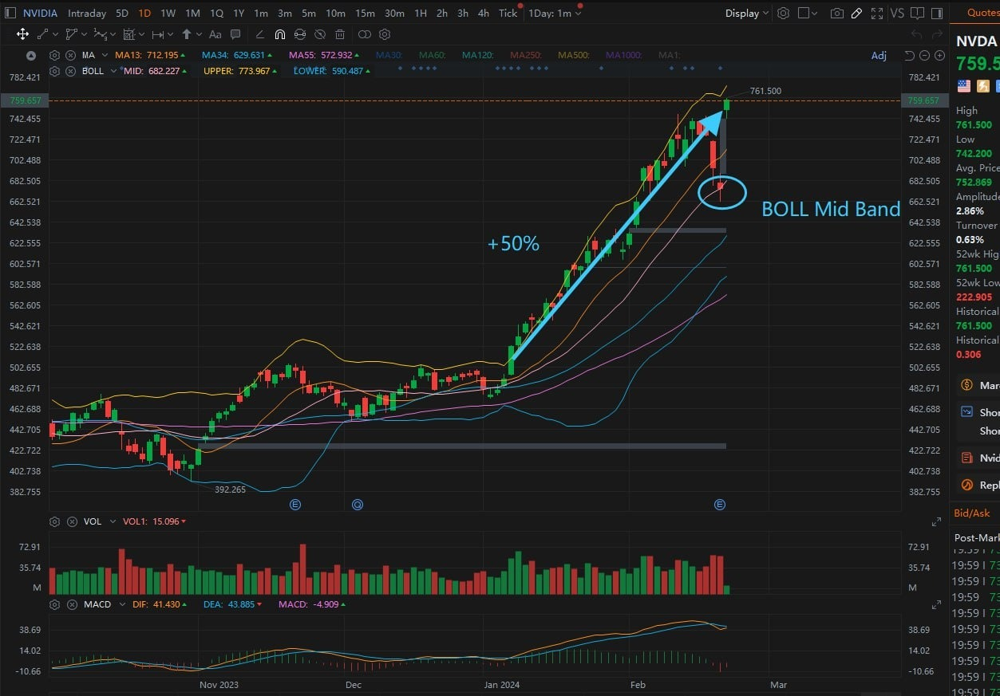

So, isn't learning crucial, friends? Our mentor had already set up a psychological defense line for those panicking - to reduce holdings when the closing price falls below the midline Bollinger Bands. Just before yesterday's close, the price rebounded to the Bollinger Band's midline. Although it was just a 0.2 dollar difference, this is a signal of a price counterattack. Did you catch that? So, aren't Bollinger Bands incredibly straightforward and practical?

The high sentiment around $NVDA's artificial intelligence will continue to boost market sentiment, with the VIX index dropping -7.3%. Moreover, the market has reached a tipping point, with giants racing to catch up to $NVDA, such as OpenAI CEO Sam Altman's seven trillion dollar semiconductor plan, with $MSFT, $GOOGL, META, and $AMD all making concerted efforts.

## 08:56AM

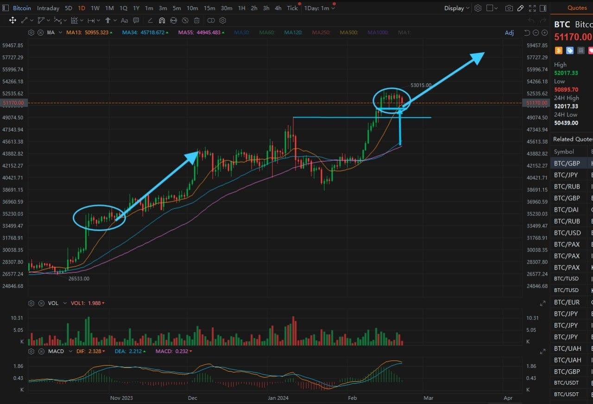

So, today is a day to continue holding our stocks. $NVDA, since the mentor's recommendation on January 8th, has already seen an astonishing return of +50%. BTC's retest of the MA13 and the short-term support line both provide upward momentum for cryptocurrency beneficiary stocks - our portfolio holdings $MSTR, $MARA. Therefore, we can continue to hold and observe subsequent changes before making decisions on short-term strategies.

## 09:23AM

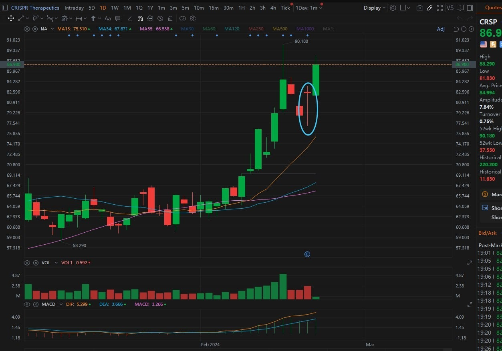

### Next, let's examine the significance of the long lower shadow on yesterday's candlestick for $CRSP

* A long lower shadow is often seen as a sign that buyers are beginning to take control of the market. After the price falls to a certain level, buyers step in, pushing the price up, thus forming a long lower shadow. This pattern indicates that although sellers tried to push the price down, the intervention by buyers prevented further decline and pushed the price up.
* The long lower shadow shows that the market refuses to fall further around a certain price level. This level might be an important psychological or technical support, where buyers enter the market in large numbers, showing resistance to further declines.

On February 7th, the long lower shadow for $MSTR laid the foundation for a price reversal. Similarly, yesterday's lowest price for $CRSP retested the support line and then rebounded, forming a candlestick with a long lower shadow. This can be seen as a signal of strengthening upward momentum, therefore, we can continue to hold this stock.

## 09:34AM

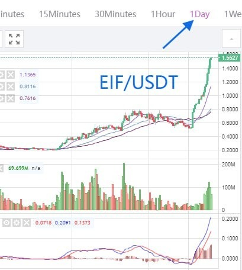

### Today's key recommendation: EIF/USDT

In terms of technological innovation, the development of the AI-RP 4.0 investment advisory system by EIF Business School marks a technological breakthrough in the field of investor education. This system provides personalized investment advice, meeting the market's urgent need for intelligent services.

Regarding market potential, AI-RP 4.0 not only can improve investors' return on investment but also indicates that EIF Business School's business model and profitability will be strengthened due to technological leadership. This innovation has a driving effect on the entire investment education industry, opening up broad development prospects for the company.

In terms of brand influence, with the launch and successful application of AI-RP 4.0, EIF Business School's brand recognition and market share are expected to significantly increase. This not only attracts more investor attention but also lays the foundation for its long-term growth.

Regarding investment value, EIF/USDT, as the incubator and funding source for the AI-RP 4.0 project, has already shown strong price growth. With the progress of the second internal testing plan and increased attention, its potential to double in the short term is enormous. Investing in EIF tokens now is expected to yield significant returns in the near future.

## 09:45AM

EIF tokens have demonstrated significant investment value due to EIF Business School's advancements in technological innovation, market potential, brand influence, and its close association with the AI-RP 4.0 project. At this stage, investing in EIF tokens is not just a recognition of its technological innovation and market outlook but also a strategic choice for capturing potential growth opportunities in the cryptocurrency market.

With the successful implementation of the AI-RP 4.0 investment advisory system testing plan, this asset has already achieved over 180% in gains. Amidst the stock index being at relatively high levels and the uncertainty surrounding the Fed's monetary policy causing fluctuations in the stock index, the advantages of EIF tokens as one of the most stable spot portfolio investments become apparent!

I believe, for those optimistic about the AI-RP 4.0 testing plan and its future development, they must feel the same urgency as I do – if we don't buy now, it will be too late.

I've set the mid to short-term target price for EIF/USDT at above 3USDT.

## 09:55AM

Friends who haven't yet accessed the investment channel for EIF tokens can get assistance through mentor's assistant; it's not too late to prepare now. When the momentum of $MARA's current rally weakens, you can sell $MARA and then increase your holdings in EIF/USDT. Therefore, seizing the opportunity early is crucial. I admire those friends who sold $MARA at $30 for their execution of short-term trading.

Yesterday, someone asked why EIF tokens are not in the contract trading market but only in the spot trading market. I believe the decision to focus EIF tokens on the spot market is a far-sighted strategy aimed at preserving token value and investor rights.

## 10:08AM

The volatility in the contract market is greater, whereas the spot market exhibits more stability. Thus, we can observe EIF's recent smooth rise, which would almost be imperceptible in the contract market. This effectively provides investors with a more predictable investment environment.

This stability attracts long-term investors seeking to avoid extreme market fluctuations. Focusing on the spot market helps prevent the disruptions of short-term speculative behavior, favoring the long-term growth of EIF tokens' value. This reflects EIF Business School's commitment to the sustainable development and technological innovation of EIF tokens, thereby boosting investor confidence. It also promotes a fairer, more transparent trading environment, safeguarding investor interests.

Therefore, limiting EIF tokens to the spot trading market not only demonstrates a comprehensive consideration for price stability, long-term value, and investor interests but also shows the project's determination to establish a healthy, stable, and continuously growing cryptocurrency ecosystem. This strategy not only provides investors with a safe and stable investment platform but also lays a solid foundation for the long-term development of EIF tokens.

## 10:14AM

Folks, please keep a close eye on our Telegram trading signals group - AI4.0 2nd Testing-VIP. The 4th trading signal has already been released.

Additionally, I recommend adding EIF/USDT to your investment portfolio. Do not use the $500 principal provided by ICHCOIN trading center for the second internal test of AI-RP 4.0 to purchase it, as this principal needs to be returned to the trading center.

Some friends DMed me asking how much to buy. I suggest you use the profits from your recent stock investment portfolio to establish positions in this new EIF/USDT investment portfolio. Consider whether to increase your position after the latest business developments from EIF Business School. I believe this approach to position management is quite reasonable.

## 10:30AM

Currently, the first three trading signals of the second internal test have achieved returns of 51.76%, 63.05%, and 51.01%, respectively, resulting in a total asset return of 36.47%. This showcases the strength of the AI-RP 4.0 system. Especially commendable is the execution shown by friends who joined the test for the second time, with some using their personal funds to achieve significant profits, such as some friends whose total profits have exceeded $500,000.

But remember, the core purpose of this test is to provide the mentor with rich data, not merely short-term gains. *Adhering to the testing instructions with rigor is far more important than fleeting profits. This test is not just about earning immediate returns; it's about helping the mentor perfect an investment tool that can bring us long-term stable income.

## 10:48AM

Therefore, I call on everyone to participate in each test with a serious and earnest attitude. Making money should not be rushed for immediate gains but should focus on the long term. Through this test, our goal is to master a method of stable profit, not just the small benefits in front of us. A successful test means that in the future, we will have a reliable tool for profit, which is much more important than short-term small gains.

Let's all work together with the utmost rigor and a responsible attitude to complete this test, not just for the immediate profit but for our shared future with our mentor. As a student of the mentor, I deeply understand the importance of following the guidelines, and I hope everyone can reflect on this and work together to achieve our common goal.

## 10:52AM

### My Trade

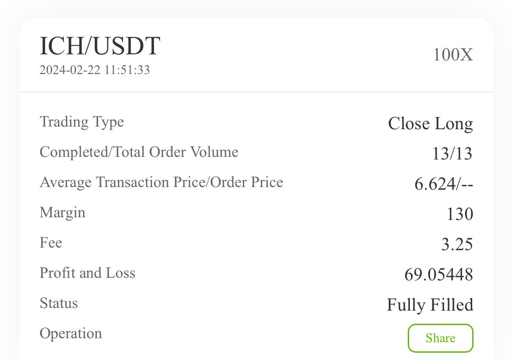

## 10:58AM

Objectively speaking, my path to success certainly couldn't have been achieved without the help of options and cryptocurrency contracts. At my most daring, I once managed a 30x return within a month. An even more impressive feat was accomplished by a friend of mine who, within six months, turned $10,000 into $30 million using cryptocurrency contracts. Such sharp insight is unmatched, and it also highlights the excellent opportunities available in contract trading within the cryptocurrency market.

However, I must caution those who do not operate according to requirements to deeply understand that what lies before us is not just an investment opportunity, but also a valuable learning experience. Leverage trading, while tempting with its promise of high returns, also comes with significant risks. This is especially true for those who have not yet mastered basic investment tools and strategies, such as Bollinger Bands. Acting with caution is paramount because your current level of trading expertise may not support such dreams. Learning is the key!

## 10:59AM

Our current high win rate is not a coincidence. It's the result of decades of investment wisdom from our mentor combined with the advanced technology of the AI-RP 4.0 system, a collective achievement of all our efforts. Therefore, any unauthorized operation is not just a waste of one's own learning opportunity but also an irresponsible act towards the entire testing plan.

To ensure the fairness of this test and the accuracy of the data, spot checks will be conducted. Any violation will face severe consequences, including the cancellation of test eligibility. This serves not only as a reminder to individuals but also as a warning to all participants: The correct learning attitude and respect for test data are the cornerstone of our path to success.

## 11:03AM

Let's all work together to maintain this pure space for learning and investing, approaching each operation with rigor and responsibility. Let's truly learn and master the essence of the AI-RP 4.0 system and together welcome a bright future in investing.

Congratulations to everyone for successfully completing the fourth test trading signal today, achieving good and stable returns.

How was this achieved? Please pay attention to our mentor's course this afternoon, and let's learn these exceptionally brilliant methods together.

## 02:52PM

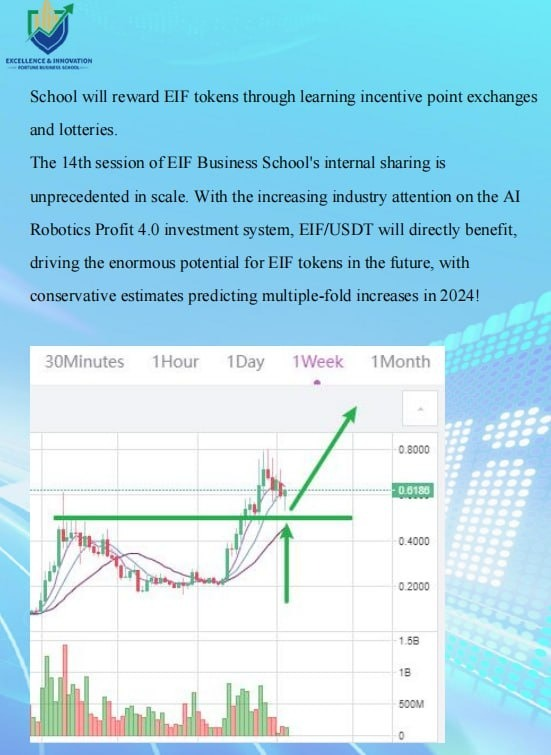

### Closing Commentary

Dear future investment masters of EIF Business School, good afternoon!

Thank you for Noah's insightful share this morning. He emphasized my mid-term holding strategy for $NVDA and my predictions for the cryptocurrency market, talking about the importance of learning and taking each test seriously. And he added EIF tokens to the investment portfolio.

Honestly, I am very clear on the value of EIF tokens, as it is the incubator for the Ai4.0 system; however, I am quite conservative and hope you can understand why I did not heavily promote it.

But, I do regret not sharing more of my thoughts on this matter, only having expressed some views in the ‘Top 10 List of Hot Investment Targets in 2024’. Now, its performance is outstanding, and I appreciate everyone's recognition and support. I believe it was a wise choice!

## 03:19PM

In today's market, our holding star—$NVDA, with its better-than-expected financial results, has once again ignited the enthusiasm of the entire stock market.
I have shared more than once my optimism about it, considering it a leader in the global stock market. Why is that? Simply put, $NVDA's profit growth rate far exceeds the pace of its stock price increase.

Artificial intelligence, blockchain, gene editing, sustainable energy, quantum technology, the Internet of Things... These technologies are disrupting our world and herald a beautiful transformation for future life.
For this reason, $NVDA and its peers have every reason to receive deep affection from investors and the extraordinary value bestowed by the market.

Given the current market enthusiasm, foreseeing $NVDA's stock price reaching $1,000 is not a distant dream.
This is not only a recognition of its revolutionary technological strength but also an anticipation of the limitless possibilities of the future.

## 03:33PM

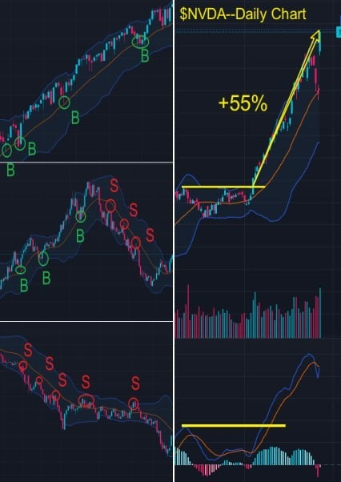

The practicality of Bollinger Bands is that it can clearly provide a basis for judgment. For example, yesterday, the price of $NVDA just rebounded to the daily middle Bollinger Bands before the close.

In 'Bollinger Band Trading Secrets - Clear Trend', I once said: The price runs in the direction of least resistance. In a clear upward trend, the middle or lower Bollinger Band is an excellent buying point.

Therefore, I use whether the price effectively falls below the middle Bollinger Bands as the core basis. By comparing and analyzing the charts, you can see the essence.

Congratulations to everyone, especially those who bought for the first time and have currently gained +55%.

So how should we sell in the market outlook? I had also predetermined a clear strategy: consider selling after the daily trend chart diverged from the top.

So, what is top divergence? You may read my investment diary. After learning these skills, the investment market is a money printing machine!

## 03:49PM

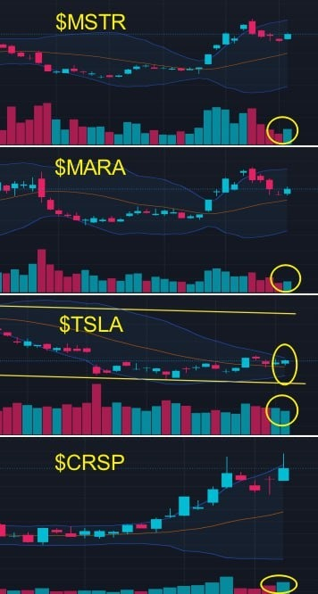

Let's now examine the status of our holdings using the daily chart.

For $MSTR and $MARA, the direction of the middle Bollinger Bands is upwards, and the price has stopped falling above the middle Bollinger Bands with an increase in trading volume. This is a positive signal, and we can continue to hold them and pay attention to the trend changes in BTC.

For $TSLA, although the price moved up today, there was no increase in trading volume. Currently, it is in a state where the upper and lower Bollinger Bands are contracting, which is an early formation indicating that the trend may soon change.

As it stands, the market has already digested the company's bearish news, and there is a high probability of an uptick in the market. If the trading volume does not increase next week, it means we still need to wait and then we can adjust our positions accordingly.

For $CRSP, there is an increase in trading volume accompanied by a breakout in the stock index and improved market sentiment. As a leader in gene editing, this stock is expected to continue reaching new highs.

## 04:07PM

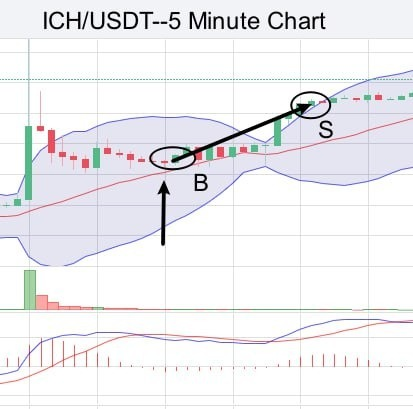

Next, let's solidify the practical case from this internal test.
This was a 5-minute trade, and the entire process was very robust:

1. After a strong rising candle appeared on the left side, it opened up the upward space for ICH/USDT, and the trend became strong. The Bollinger Bands started to turn upwards, and we focused on going long.\
At this point, we should look for either a retracement buy point or a breakout buy point.

2. The price began to fall back to the middle Bollinger Bands and then stopped falling. After that, the price started to rise, and we seized this buying opportunity at point B following the trend.

3. While waiting for profits, although the Bollinger Bands showed signs of contracting, the direction of the middle band did not change, so we held firm and allowed our profits to increase again.

4. When the MACD Histogram started to shorten above the zero axis, we locked in our profits in advance and sold to stop gain.

## 04:17PM

Friends, how much did you profit today? Have you learned to calculate the earnings from this trade?

The entire process of today's trade was incredibly smooth and efficient, demonstrating the advantage of trading with the trend. By seizing a small segment of a certain trend in a favorable market condition and leveraging the advantages of contract trading, it's possible to achieve extraordinary profits.

So, how do we grasp the certain opportunities within a trend? This becomes the key to victory.

The basic type of movement is 'N' shaped, and the pattern that appears between the high and low points indicates the trend is likely to continue. This is the problem that the Ai4.0 system addresses.

There are essentially two key aspects: one is to analyze past trends to assess whether a high-probability event might occur; the second is to predict what might happen. Between these two, we can identify certain opportunities.

Friends, please note, I am observing the data and will release the next trading signal at any moment.

## 04:21PM

The trading signal has already been released, please pay attention, friends.

Please follow the instructions strictly.
This trade is very important and will directly determine whether the plan can be completed ahead of schedule!

The trading signal has already been released, please pay attention, friends.
Please follow the instructions strictly.
This trade is very important and will directly determine whether the plan can be completed ahead of schedule!

## 04:37PM

For instance, this morning's trading signal was a retracement buy point.

Analyzing the past, various signs indicated that after stopping its decline, the price would rise again, hence identifying this buy point as an opportunity to purchase.

Closing positions early is based on predicting the divergence in the rise's strength, with a possibility of a decline, so we sold early after receiving the signal. Although the price rose a bit after selling, we sold the risk.

Summarizing (analyzing) the past and learning (predicting) the future is precisely what the Ai4.0 system is doing.

The content we learn every day is part of the Ai4.0 system, so isn't the current course very important, friends?

## 04:41PM

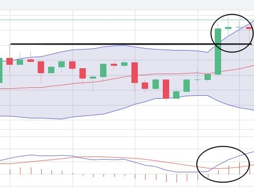

Taking the ongoing trade on the 5-minute chart as an example, this is a classic case of a breakout buy point.

When the price breaks through the main support line, accompanied by the MACD Histogram growing above the zero axis and the MACD Line crossing above the Signal Line in a typical pattern.
Let's all look forward to the performance of this trade!

## 04:48PM

### My Trade

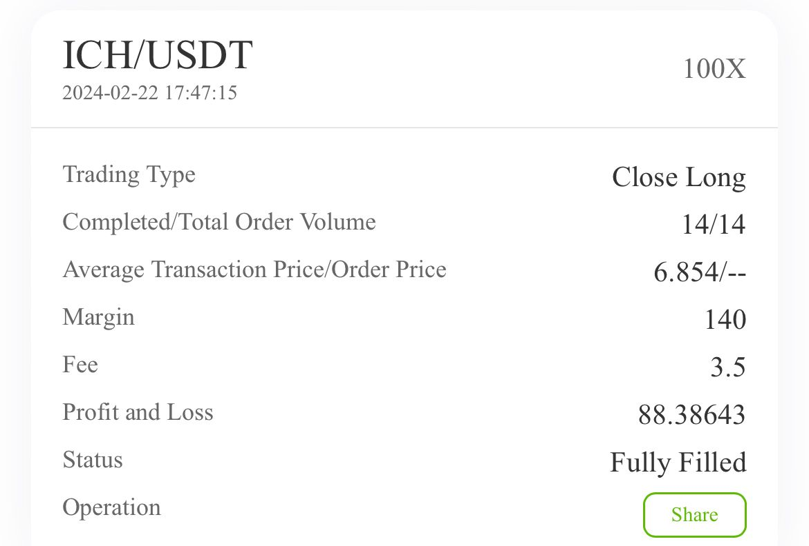

## 04:56PM

Dear future investment masters of EIF Business School, I am thrilled to announce that the recent trade was successfully completed, and our second internal testing plan has been a resounding success!

We conducted a total of 5 trades, with individual trade returns of 51.76%, 63.05%, 51.01%, 41.18%, and 55.25%, culminating in a cumulative return of 262.26%.

We utilized about 20% of the current test account's total funds for each trade, and the account has now grown to $813.22, with a total asset compound return rate of 62.64%.

This represents a completion of our 3-7 day goal of a 60% total asset return, exceeding expectations!

I am profoundly grateful for everyone's participation, as your involvement has made the results of this test significantly meaningful.

According to incomplete statistics, we obtained over 25,000 pieces of data, with an average total return rate exceeding 60%!

## 05:01PM

There's no need for everyone to post their profit screenshots, to avoid some friends missing out on key information.

Without a doubt, this is a tremendous victory!

The rise in stock price has propelled Jensen Jen-Hsun Huang into the global billionaires club—this is the power of technology!
The Ai4.0 system has allowed us to maintain a perfect record across 12 trading signals in two internal tests—this is the power of technology!

At this moment, like many of you, I feel time has flown by too quickly and the experience has been too thrilling to be satisfied. Perhaps there are few friends who have not fully followed these trades; what should they do?

What important plans will I have after completing this test? What significant benefits will I announce? What experiences should we have gained from this internal test?

Next, I will summarize this internal test and the investment learning plan. Please read carefully!

## 05:10PM

### My Analysis

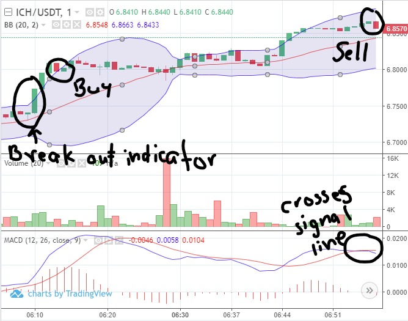

## 05:21PM

First, I will offer the first significant benefit.

Thank you to all friends for your participation; without you, this internal testing plan would not have been successful. The data from the test relies on human to complete, and the data from every test account is crucial.

25,000 tests - this data is extremely important! Everyone's effort is highly commendable!
Friends who participated in this test will receive a one-year personal edition usage right of the Ai4.0 system application after it launches (valued at $50,000).

Of course, there's also our EIF Business School team, everyone has been incredibly supportive, fully committed to this internal testing plan. Your professionalism is admirable, and it's an honor to work alongside you.

## 05:41PM

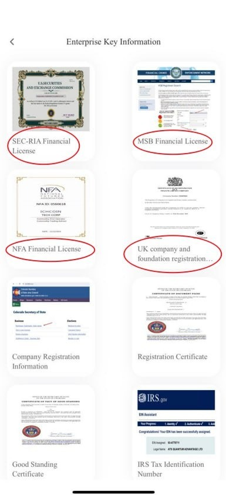

Once again, thanks to our sponsor - ICHCOIN Trading Center, for providing us with 5,200 accounts and $2.6 million in testing funds, thank you for your generosity.

This is an excellent trading center. They have obtained the SEC's RIA financial license, the National Futures Association (NFA) financial license, membership in the British Foundation, and the Financial Crimes Enforcement Network (FinCEN)'s MSB financial license.

You can find this information on their application's homepage under ‘Academy’ by clicking ‘Enterprise Key Information’.

They have a deep cooperative relationship with our Ai trading center. Friends interested in cryptocurrency investment might want to follow them.

We will have deeper and more important cooperation in the future, and I will share more with you when the time comes.

## 05:53PM

Why do I firmly said that just one loss can declare the test plan a failure? Behind this is my profound confidence in the Ai 4.0 system's precision in locking onto market opportunities.
Ai 4.0 has been meticulously crafted by a group of dedicated engineers and experts with practical experience, through nearly six years of round-the-clock effort.

From 1.0 to the current 4.0, it has continuously evolved based on my quantitative trading system foundation, with each version's leap soaked in the team's sweat and wisdom.
Its strength lies not only in interpreting the past but also in foreseeing the future—this is precisely the secret behind our high win rate.

If all goes well, within the next six months, you will witness the splendid launch of AI 4.0. All this is thanks to the team's indomitable and pioneering spirit.
Here, I want to deeply thank my team for their endless hard work towards this goal.

I promise, in future shares, you will see even more exceptional profit performance and consulting features from AI 4.0. Because we believe, AI 4.0 is not just a system; it is the key to unlocking the door to investment success. Let us together, welcome our future!

## 06:04PM

At this moment, the two things I most want to say are:

1. Cheers to the spirit of sharing joy, sorrow, labor, responsibility, daring to take risks, and continuously striving for progress together.\
Although the AI 4.0 system is not perfect, it is through our collective efforts and exploration of its shortcomings that it has become a true tool serving each of us.
Thank you, this loving community, for your team spirit. Let's make AI 4.0 even better together.

2. Learning is the master key to unlocking the door of wisdom!
In the turbulent and uncertain market, the opportunities revealed by the AI 4.0 system highlight the importance of technological power and deep learning.

It has opened the door to success for us, allowing us to share the rich rewards of investment together.
Therefore, mastering these scientific investment methods and tools is the key to our victory.
Let's learn and grow together, and create a better future with the power of technology!

## 06:12PM

Regarding the arrangement of test funds and profits:

First, for those partners who have completed the second round of internal testing with us, it's time to return the $500 test funds to ICHCOIN Trading Center.
After today's share, my assistant will provide their contact information, so you can better utilize this quality resource in your future investment journey!

As for the profits, you are completely free to choose whether to withdraw them to your personal crypto wallet or bank account, or to continue investing in EIF tokens.
My personal suggestion is to divide the profits into three parts: the first part to be withdrawn as a reward for your efforts; the second part to continue investing in EIF tokens, as both support for our business school and an investment in your beliefs; and the last part, I strongly recommend donating to charity.
As for how to allocate these three portions, it's up to you.

## 06:25PM

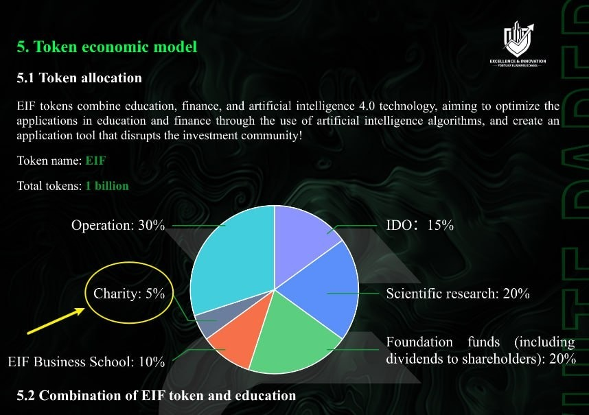

Investing is not just about the growth of wealth, but also a journey of self-redemption. At EIF Business School, we deeply believe in the power of charity, which is also what we promised in the whitepaper of EIF tokens.
My life was completely transformed in 2008 due to the inspiration from my mentor, and at that moment, I vowed to use my own strength to change the world.
Therefore, I founded EIF Business School, committed to bringing welfare to investors and students through education and the 'Ai Robotics Profit 4.0' investment advisory system.

During the COVID-19 period, our government distributed a large amount of relief funds as a way to help the public, earning more support from the people.
Elon Musk's products benefit humanity, making him a star CEO in the public eye.

I firmly believe that as the Ai4.0 system continues to be upgraded and perfected, it will become a star product that helps ordinary investors achieve self-redemption, opening the doors to new horizons.

Everyone who joins us will be a witness and beneficiary of this historic moment. Let's use the power of investment to bring more beauty and hope to the world together.

## 06:39PM

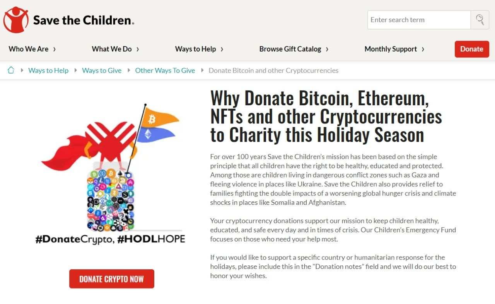

In this journey, love is our compass. Loving the world, loving everyone around us, is not only the beginning of self-redemption but also an art of living.
Ai4.0 carries our mission—to lead everyone towards self-redemption, to inject warmth into society, and to let countless families embrace happiness in life.

The power of love is boundless. Those who are generous at heart and willing to dedicate themselves to peace and beauty will sail through the ocean of investment, not only achieving success but also experiencing profound life transformations.
At EIF Business School, charity is our tradition, a part of our spirit.

This time, we have chosen to partner with ‘Save the Children’, allowing us to contribute to the world easily through cryptocurrency, whether anonymously or not.
Remember, Giving to Save the Children is one of the world’s best investments.

When this share ends, my assistant will share the charity link with everyone.
Let us together light up the world with love, letting more children feel warmth and hope.

## 06:47PM

Dear friends, I wonder, are you like me, deeply agree with these views?
If you have participated in our charitable action, please send a screenshot of your donation to my assistant. I promise, for your acts of kindness, we will have a special gift for you.

Although our donations may seem small, remember, no act of kindness is too small, and every action we take is a commitment to a better world.
This is not only an expression of confidence in the market but also a promise to our future:

1. We have the strength and confidence to earn more profits.
2. Through investment, we can not only improve our own lives but also bring more goodness to the world.

This approach reflects our reverence for investment and deep respect for the Ai4.0 system.
Ai4.0 gives us not just the ability to profit but an unprecedented strength and confidence.
I firmly believe it will guide each of us to new heights in our investment careers, making investing not just a means of accumulating wealth but also a process of enjoyment and happiness.
Let's move forward together, with our actions and love, to create a better tomorrow for ourselves and the world!

## 06:57PM

Dear partners, future masters of investment, with each victorious test, are you like me, feel an infinite longing and enthusiasm for the future?
Let's join hands to create a community filled with laughter and freedom, to show the world our strength.
Our dream is to establish Ai4.0 as a shining beacon in the industry, a guiding light for every seeker on their journey!
How do we reach this magnificent future?

1. Customized Learning
I will spare no effort to unveil the mysteries of Ai 4.0 for everyone, leading each friend to find their destiny in the ocean of knowledge.

2. Comprehensive Investment
With the success of Ai4.0's two rounds of internal testing, we move toward a broader investment horizon with confidence. Our goal is, before Ai4.0 goes public, to enable every supporter's earnings to reach the magnificent achievement of being able to purchase the Ai4.0 institutional version (valued at $1,000,000/year).

3. Rapid Launching
We will accelerate the pace of Ai4.0, making it a blessing for many more people. Each of us is the master of our destiny; let us surpass ourselves on the journey of investment.

## 07:05PM

As we conclude our Ai4.0 internal testing and investment learning program, we step into a new milestone. To make our future courses more vivid, practical, and responsive to every member's needs, I sincerely invite you to participate in a new journey—our satisfaction survey questionnaire.
This is not only a reflection on the past but also a plan for the future.

1. How satisfied are you with the investment test results of the Ai4.0 system in combination with the cryptocurrency market? Do you have any suggestions for improvement?

2. Based on our recommendations, how have your recent earnings been in the stock market and cryptocurrency market?

3. Considering your recent investment results and learning experiences, please share your views on the importance of learning investment knowledge and indicate the areas of investment and learning that interest you most.

4. What are your investment plans for this year? What profit goals do you hope to achieve?

5. In your future investment journey, what kind of support do you wish to receive from me, Noah, or my assistant, and Ai4.0?

Every step forward we take is inseparable from your insightful and valuable opinions!
Please share with us through private messages; my assistant will share our contact information with you later.

## 07:19PM

At this moment, my heart is surging because I see the fruits of our collective effort beginning to bloom.
For all of you, these 12 consecutive wins are not just victories in numbers but a testament to our deep understanding and precise control over the investment world.
Behind this are six years of sweat and perseverance, our relentless pursuit of dreams turning into reality.

In this moment filled with commemorative significance, I am filled with limitless confidence and eager anticipation for the future. I firmly believe that with the power of Ai4.0, each of us can stand at the pinnacle of life, welcoming those moments of glory that belong to us.
Let's join hands and move forward towards a brighter future, with each step we take brimming with confidence and glory!

Today, I am here to share my thoughts, hoping to inspire all of us to act together.
In a while, I will have my assistant share the link for charitable donations, our contact information, and the business card of the offline customer service staff at ICHCOIN Trading Center.

Thank you very much for your company. I wish everyone a pleasant day and see you tomorrow!
