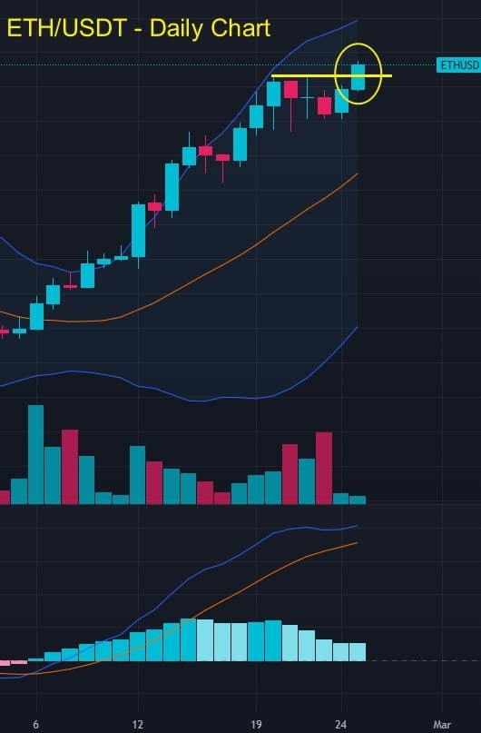
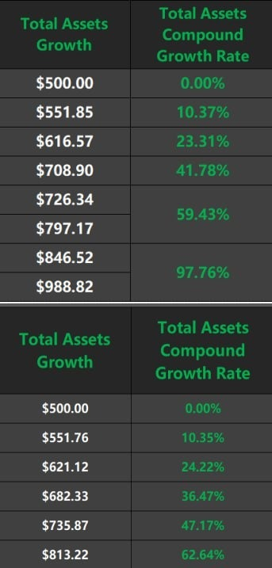
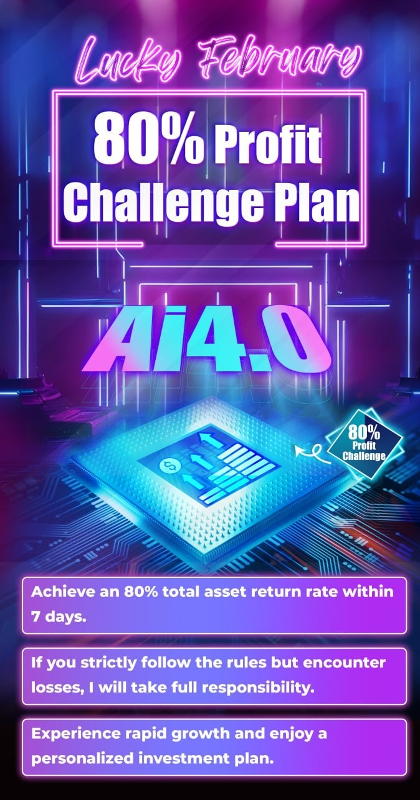

# Sunday 20240225

## 09:12AM

### Dear Future Investment Masters of EIF Business School, Happy Weekend

I hope this letter finds you well in the most enthusiastic and growth-hungry phase of your investment journey. I'm writing to share with you some of my recent observations, feelings, reflections, decisions, and an upcoming new challenge.
Firstly, let's discuss the recent internal test. We were fortunate to receive sponsorship from ICHCOIN Trading Center for this test, which was intended as an opportunity for learning, practicing, and growing together. However, it's regrettable that I noticed a very few friends failed to follow the instructions strictly, leading to losses!
This is not only a disrespect towards the funds but also a lapse in one's investment philosophy. In the world of investment, every decision is serious and significant, and every action directly affects our future. Poor investment habits act like a slow poison, the consequences of which should not be underestimated.

## 09:15AM

I am deeply comforted and proud based on everyone's survey feedback.
The enthusiasm displayed, especially the keen interest in the cryptocurrency market, along with the high anticipation for EIF tokens and contract trading, has far exceeded my expectations.
Honestly, I have never worried about our ability to excel in this area of investment; on the contrary, it's my forte.However, my concern has been that scattered focus might prevent me from taking care of some important matters.
As many of you know, I've been very busy lately, even sacrificing precious time that could have been spent with my family, for which I feel deeply sorry and uneasy.
Yet, seeing everyone's eagerness to learn, high self-expectations, passion for investment, and the determination to change your families' lives and destinies through investing has profoundly moved me.

## 09:22AM

Whenever I face difficulties, I always reflect on my life, pondering how in this rapidly changing world, we can not only survive but also thrive?
When I think of the bold statements I made when I stood back up in 2008; when I recall founding EIF Business School with the grand ideal of impacting people through education; when I remember those words, investment views, and values that inspired everyone during bear markets and lows... These scenes fast-forward through my mind like a movie, and I finally found the answer!
All these experiences remind me that our mission goes far beyond. Ai4.0 is not just a tool; it carries our dream of bringing happiness to more families.
After much thought, I've decided to meet the needs of most friends and have developed an investment plan that is both challenging and highly feasible: achieving an 80% total asset return rate within one week.

## 09:28AM

Firstly, let me summarize the thoughtful feedback from the second internal test survey:

1. Very satisfied with the returns from both internal testing plans and eager to learn more methods.
2. Both stocks and cryptocurrencies yielded good profits, with cryptocurrency investments showing higher returns in a shorter period. Everyone is almost universally in pursuit of better profit growth points!
3. There is a widespread agreement on the importance of continuous learning, with a particular interest in sharing more about investment knowledge and profit strategies in the cryptocurrency market.
4. Many friends have set higher profit goals and dreams for themselves, *which is highly commendable!
5. There is a desire to learn about, but not limited to, in-depth courses and applications of the Ai 4.0 system, sharing of Noah’s α&β trading system and the Golden Moving Average System (MA13/34/55), as well as personalized investment plans.

## 09:34AM

Since most friends have shown such a strong desire, and we are faced with the undeniable challenge of stock indices in the coming period - with $NVDA's better-than-expected earnings report and the Federal Reserve's impending interest rate policy adjustments, the market trend is showing a 'slow rise' pattern. This will lead to increased complexity in operations and higher difficulty in making profits, a reality we cannot avoid.
To meet the needs of most people, I have to consider such planning.

Every challenge comes with opportunities, and we are precisely at the fever pitch of market sentiment for the upcoming halving event: historical data shows that starting from February each year, the cryptocurrency market often welcomes a significant uptrend, making market opportunities more definite; and with the cryptocurrency market stirring again over the weekend, a better market is about to emerge, indicating that excellent profit opportunities are within reach!

## 09:38AM

After careful consideration, I've decided to launch an ambitious plan: the Lucky February 80% Profit Challenge Plan!

This plan includes the following parts:

1. Profit target and period.
2. Minimum entry requirement and its rationale.
3. Suggestions related to funds.
4. Rapid growth.
5. My expectations and personalized customization.

Firstly, let me explain the first point: I plan to lead everyone to earn an 80% total asset return in just 7 days!

In our first and second internal tests, we respectively earned total asset returns of +97.76% and +62.64%, and it only took us 3 days; therefore, under the upcoming favorable market conditions, with more ample time to achieve this goal, I am very confident. I believe that friends who have seriously gone through the internal tests all have this confidence!

## 09:42AM

To address all existing concerns objectively, I have set a minimum entry requirement of $5,000.
This means that some friends may not be able to participate, but why have I set it this way?

1. The minimum entry requirement is designed to balance the profit plan without consuming too much of my energy.
The internal training for this session, preparation for the Ai4.0 system's listing, and direct involvement in investment practice are all crucial tasks I cannot overlook!

2. It allows those with higher willingness and seriousness to participate; they will value the process more and, naturally obtain the most genuine and satisfactory results!
For example, behaviors that show a lack of respect for the test funds can be effectively avoided.

3. I hope that more people can afford to buy the institutional version of Ai4.0 (with an annual subscription fee of $1 million). In equal opportunities, larger capital accounts are more likely to achieve such a goal.

4. A larger investment means a stronger sense of responsibility.
When you invest more, I will respond with a hundredfold sense of responsibility, ensuring that every investment can yield satisfactory returns. I am full of confidence and believe me there might be surprises.

5. Reaching a certain level of capital is more beneficial for the plan's implementation because management efficiency will be greatly enhanced.
For instance, opportunities available for $500 investments are limited to 5-minute or 1-minute charts, which are less efficient in trading - the signals seen in these two internal tests were mostly of this kind, with relatively lower profits.

Yes, a 50% or even 100% return on a single trade is considered very small profit in cryptocurrency contract trading. However, the range of options and profit expectations for a $5,000 account will greatly increase!

## 09:57AM

### Third Point: Suggestions Related to Funds

**Suggestion 1:** Participate Using Profits\
If you have recently made profits in the stock market following our strategies, consider using this income to participate in this plan. This way, you'll feel more at ease since it's 'extra earnings working for you'!

**Suggestion 2:** Fund Allocation and Confidence Building\
Initially, you can participate with just a small portion of your funds, for example, 20% of your stock market value. This approach can help you gradually build confidence.
Once you have a deeper understanding and confidence in the market, you can gradually increase your investment amount to seek larger returns.
If you plan to invest more funds to seize this rare opportunity, feel free to contact us at any time so we can help you plan properly.

**Suggestion 3:** Asset Allocation and Learning\
Regardless of how this plan turns out, cryptocurrencies should be a part of your investment portfolio. This follows the mainstream investment direction and will make your investment journey smoother.
After each trade, I will share more methods and courses on utilizing the upgraded Ai4.0, something many friends are looking forward to.

**Suggestion 4:** Sell Off Junk Stocks\
According to incomplete statistics, a small portion of friends still have loss-making stocks in their portfolio, and some even hold 'junk stocks.'
If your portfolio still contains such stocks, it's time for a change because this is essentially wasting your time and money!
Investing this capital in our profit plan can not only recover losses but also potentially yield substantial returns.
Don't hesitate, contact us now to solve this issue together.

**Suggestion 5:** Quick Ways to Obtain USDT\
For friends unfamiliar with the cryptocurrency market, if you need to purchase USDT through bank transfers or other means, I recommend scheduling an appointment with ICHCOIN's customer service in advance.
The cryptocurrency market operates 24/7, 365 days a year, offering services even on weekends, especially through their offline customer service, allowing you to participate more quickly.
On Monday, I'll share more investment knowledge with everyone, including ways of capital flow in the cryptocurrency market.

## 10:08AM

### Fourth Point: Rapid Growth

1. Investment Attitude\
We are about to invest using our own funds. Thus, treating it as a serious business is crucial, as this is the foundation for sustained success.

2. Execution and Responsibility\
Firmly executing trading strategies and signals is our guarantee of success.
I cannot be responsible for the actions of those who do not follow the rules.
However, if you strictly adhere to the rules and still encounter losses, I will take full responsibility!

3. Continuous Learning\
After each trade, I will thoroughly analyze key technical points to help you grow quickly. Remember, the market is the best teacher.

4. Emotional Management\
Avoiding arrogance and impatience is vital in trading. Learning to remain humble and open-minded, stable emotions are key to becoming an investment master like Noah.
Are you ready?

## 10:18AM

### Fifth Point: My Expectations and Personalized Customization

1. My Expectations
    1. Investing in EIF Tokens After Profits\
    We encourage you to consider allocating a portion of your investment profits into EIF tokens. This not only contributes to the collective prosperity of our community but also directly reflects in the appreciation of EIF tokens, benefiting every community member. This is an opportunity for us to grow and develop together, allowing everyone's success to bring more value to the community.

    2. Referring New Supporters\
    After successfully achieving your investment goals, we cordially invite you to introduce at least 5 new partners to join our ranks. Doing so not only helps build a solid foundation for Ai4.0's future listing but also effectively expands our influence.
    Your referrals are crucial for the long-term success of EIF Business School and the Ai4.0 system; each share is a significant contribution to our future development.

2. Personalized Customization: Crafting Your Profit Blueprint\
We fully understand that each investor's background, availability, and goals vary, so we offer completely personalized investment plans aimed at helping you achieve at least an 80% asset growth target within a predetermined timeframe.

For instance, if your goal is to earn $80,000, based on this plan, you might only need to start with an investment of $100,000.

For those who are too busy with work to constantly monitor market dynamics, we suggest adopting a strategy that focuses on mid-term trading as the main approach, with short-term trading as a supplementary tactic.
This way, you can leverage the advantage of larger capital to find stable trading opportunities over longer periods. Even with reduced trading frequency, you can still safely and effectively reach or even surpass your expected profit targets while also minimizing risk.

## 10:24AM

Share your investment goals with us, and we will initiate a tailor-made path to success for you. Based on your financial situation, interests, risk preference, investment duration, and profit objectives, we will meticulously design an investment plan that is both efficient and straightforward. Our aim, through customized strategies and thoughtful guidance, is to ensure that your investment journey is both profitable and secure.

For instance, if your goal is to achieve capital appreciation in the short term, we might recommend increasing allocations to the cryptocurrency market and technology stocks, leveraging their high volatility for potential high returns.

Conversely, if you prefer long-term stable growth, we may suggest more bonds, index funds, and fixed-income investments (with optimistic returns) to diversify risks while ensuring steady returns.
Present us with your vision, and let our professional knowledge, experience, and advanced technology (Ai4.0 system) become the strong support behind your investment success.
Time is precious, so please act now.

## 10:29AM

I already sense that this plan will give birth to future Wall Street tycoons!

As we are about to embark on the journey of the "Lucky February 80% Profit Challenge Plan," this is not just an investment opportunity but also a journey of our collective growth and realization of dreams.
This is a moment to show your determination and readiness, a beginning for us to write a success story together!

What we pursue is not merely short-term profits, but through this process, to cultivate more professional, composed, and visionary investors.
Every friend who joins our plan is our precious partner, and we look forward to growing together and witnessing every step of success.
If you have any questions about the upcoming challenge, or need more guidance and help, please do not hesitate, contact us immediately.

## 10:36AM

We hope that by tomorrow morning, every participant will be prepared and in the best condition to embrace this challenge.
More importantly, please pay close attention to the important lesson in tomorrow's early market.
I will delve into the core content and strategies of the plan, helping you better understand and prepare for this challenge. This is a valuable learning opportunity and key to ensuring that we can achieve our goals together.
Now, it's time to take action. Let us move forward together, with aspirations for the future and a desire for success, ready to face the challenge and ready to meet a better version of ourselves.
The future is here, act now! We await you in the "Lucky February 80% Profit Challenge Plan," ready to create brilliance together!

## 10:38AM

