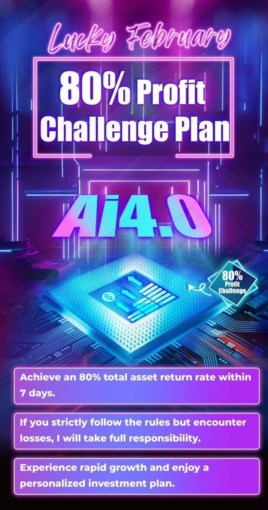

# Monday 20240226

## 08:20AM

### Dear Future Investment Masters of EIF Business School, Good Morning

I believe most of you have read the letter I shared in the group yesterday, right?
After thoroughly reading your survey feedback, I was deeply moved by your enthusiasm for the cryptocurrency market and your desire for high returns.
Despite my own multiple responsibilities, busy work schedule, and the increasingly precious time with my family, seeing your passion for investment and your firm belief in a better future life touched my soul deeply. I knew I had to do something.
Faced with the upcoming market halving event, which is not only a golden opportunity but also a turning point, I firmly believe that now is the best time for the market to offer an irresistible profit opportunity.
Therefore, I have decisively decided to launch the 'Lucky February 80% Profit Challenge Plan'.

## 08:30AM

To ensure that every participant is fully engaged, I have specifically set a minimum entry threshold. This is not only a test of the participants' seriousness but also key to ensuring that our team resources are optimized.
The heart of this plan is an ambitious goal—to achieve an 80% return in just one week.

Friends who have not yet participated still have the opportunity to join; this is a new starting point for us to grow and realize our dreams together. Let us stand shoulder to shoulder in this endeavor, which is my honor!

What kind of trading signals will we announce today? How can they be obtained?
With cryptocurrency receiving significant positive news, what kind of opportunities do we face in the coming month?
How should friends who do not have the entry ticket (pass) to invest in cryptocurrencies quickly acquire one?

I will share this important information later.

## 08:43AM

The Ai4.0-Expert and Investment Advisory System predicts that the core PCE price index annual rate for January, to be announced this Thursday, will rise by 0.4% month-on-month, marking the second consecutive month of month-on-month growth and breaking the basic downward trend of the past two years.
As a key indicator of inflation, this upward movement in data may increase inflation expectations, reducing the likelihood of interest rate cuts by the Federal Reserve, thus benefiting the dollar while putting pressure on stock indices.

This trend aligns with our previous analysis, expecting that before June, although the stock market will not see significant declines, it is expected to show a slow upward trend, meaning trading stocks will become more difficult.

Hence, in the current market environment, the "Lucky February 80% Profit Challenge Plan" is not only a precise prediction of future market movements but also an excellent opportunity to find profit margins amidst potential inflation expectations.

## 08:55AM

The SPX 2-hour chart shows the MACD Histogram shortening above the zero axis, indicating a short-term need for a price retracement. This week, we can take advantage of the surge in stock prices to reduce our holdings, eliminating stocks with weaker trends, such as $TSLA. Transfer 20% of the funds or the profit portion from the holdings to this profit plan!

In another piece of important news, the Ai4.0-Expert and Investment Advisory System indicates that the SEC is soliciting opinions on allowing Bitcoin ETF options to be listed and traded.
This is great news for the entire cryptocurrency market!
This move indicates that the SEC is releasing optimistic regulatory signals, opening the doors for cryptocurrencies. Bitcoin and other cryptocurrencies gain more recognition in the mainstream financial market, while also providing investors with new investment tools and risk management methods.
This will bring greater increments to the cryptocurrency market, making this bull market even stronger!

## 09:11AM

Let's examine the performance of BTC in February and March over recent years:

- In 2023, BTC's increase in February was +0.07%, and in March, it was +23.01%.
- In 2022, BTC's increase in February was +12.20%, and in March, it was +5.45%.
- In 2021, BTC's increase in February was +36.39%, and in March, it was +30.14%.

On average, the increase in February was +16.22%, and in March, it was +19.53%.
The corresponding value for 100X cryptocurrency contracts is 1622% and 1953%.

This month (February), the current increase is +20.62%, which is 1.27 times the average increase in February over the past three years.
The expectations for this bull market are stronger, leading to a conservative estimate that the increase in BTC in March this year will exceed 24.80%, with the value of 100X contract trading exceeding 2480%.
For the trading center's native token ICH/USDT, which we are more familiar with, the opportunity for profit in 100X contract trading is higher than 2480%.

## 09:36AM

Based on the data we obtained from the first two internal tests, the contract trading in the coming month shows huge profit potential, providing an excellent starting point for our "Lucky February 80% Profit Challenge Plan."
Therefore, I strongly advise everyone to continue preparing and seize the upcoming opportunity.

Once you are ready to join the challenge, my assistant will invite you to our Telegram group.
Currently, I am closely monitoring the analysis data from Ai4.0, anticipating that important trading signals may be released this morning. Each signal is crucial for achieving our profit goals.

For those new to the cryptocurrency market, converting cash into cryptocurrency might seem challenging. However, worry not, as C2C trading platforms provide an easy path for exchanging fiat money (such as US dollars) into cryptocurrency, making entry straightforward. I will soon share more details about this method.

## 09:45AM

Imagine you're a European investor keen on exploring the US stock market. To buy the stocks you desire, the first step is to exchange Euros for Dollars to make the purchase.
Similarly, if you turn your attention to the vibrant cryptocurrency market, then USDT (a cryptocurrency nearly equivalent in value to the US dollar), BTC, and ETH become your new 'dollars'.
Among them, USDT, due to its stability and wide acceptance, has become the mainstream medium in the cryptocurrency world.
Now, suppose you decide to join a promising profit plan but find yourself without USDT, the "pass." What you need to do is purchase USDT with cash to gain entry.

This is where C2C trading comes into play.

## 09:48AM

This process is simple and direct, just like buying and selling goods in the market. Through C2C, you can easily transform your cash into the "golden key" of the cryptocurrency market—USDT, thereby smoothly entering this exciting investment domain.
C2C in the cryptocurrency market typically refers to 'Customer to Customer' or 'Consumer to Consumer,' meaning transactions between consumers, or person-to-person trades.

C2C trading is a perfect embodiment of the decentralized spirit of cryptocurrency, with primary benefits including the elimination of high fees associated with traditional financial intermediaries, better privacy protection, more flexible and convenient transactions, and providing easy access to financial services for investors who may find it difficult to access them otherwise.
In short, C2C is the free market of the cryptocurrency world, allowing everyone to be both a buyer and a seller.

## 09:50AM

The working principle of C2C transactions is quite straightforward. Imagine C2C trading as similar to when you exchange your money for local currency at a currency exchange while traveling. The only difference here is that you're buying and selling cryptocurrencies like USDT with cash. Each time you complete a transaction with someone, the difference in exchange rates is how the exchanger makes money.

Considering the security and smoothness of transactions, platforms like the ICHCOIN trading center require each participating merchant to deposit a certain amount of margin. This is a protective measure aimed at ensuring the reliability of transactions and the integrity of merchants.
ICHCOIN carefully selects merchants that are active in trading, have high user ratings, and offer the best exchange rates to users, ensuring that every exchange you make is the most economical and safest.

If you still feel unfamiliar with this process, don't worry.
The offline customer service at ICHCOIN trading center acts like your personal guide or financial advisor, always ready to help you find the most suitable exchanger, ensuring your exchange journey is both smooth and secure. They are also available to answer your questions, ensuring your trading experience is both successful and safe.

## 09:55AM

### Why are C2C transactions so secure?

Every investor venturing into the cryptocurrency market for the first time questions the security of C2C transactions. However, a deeper understanding of their basic concepts and operational mechanisms naturally resolves these concerns about security.

Firstly, it's understood that these quality merchants are required to deposit a substantial security deposit with the trading center, often exceeding one hundred million dollars. This ensures their actions are under strict regulation, significantly enhancing transaction security.
This not only reflects their legal and ethical commitments but also ensures they provide optimal service.

Secondly, the ICHCOIN trading platform is fully regulated, for instance, by the United States Financial Crimes Enforcement Network (FinCEN), which oversees money services, cryptocurrency transactions, ICO issuances, foreign exchange, international remittances, and more.
In the US, companies engaged in these activities must obtain an MSB license to operate legally.

Therefore, although C2C transactions are direct trades between individuals, the strict regulatory backdrop ensures their high level of security. This mechanism guarantees both the freedom and safety of transactions, providing investors with a reliable investment environment.

## 09:57AM

For friends venturing into the ICHCOIN application domain for the first time, delving into its regulatory qualifications is not only a responsibility towards the safety of funds but also a crucial step in identifying a quality trading center. This process is filled with the joys of exploration and discovery.

ICHCOIN offers more than just exchange services compliant with MSB regulations; it also extends into investment advice and asset management domains. Its fixed-income financial products are among the jewels it offers, renowned for their high rates of return. Future fund planning and other services are under the strict regulation of the SEC-RIA financial license.

Additionally, its options products and services provided by Commodity Pool Operators (CPO) and Commodity Trading Advisors (CTA) are regulated by the National Futures Association (NFA) in the United States, holding an NFA financial license to safeguard its legality and security.

Those eager for further information can navigate to the "Academy" section on the homepage of the ICHCOIN application and select "Enterprise Key Information" for more comprehensive details.
Alternatively, consulting the offline customer service for more detailed information, such as inquiry methods, is also an option.

## 10:13AM

### Important Reminder

Friends, please be aware that I have just shared the first trading signal for our profit plan in the Telegram trading signal share group—(Lucky Feb 80% Profit Plan). Please make sure to check and strictly follow it.

## 10:47AM

Friends, just as I was helping you all navigate through these important investment logics and sharing trading signals, our heavily weighted stock $MSTR surged about +16%.
The returns on $MSTR and $MARA have generally reached +59% and +66%, respectively.

$MSTR has continued to increase its holdings by purchasing about 3000 bitcoins with approximately $155.4 million in cash over the last ten days.
This represents the current opportunity in the cryptocurrency market, with institutions and publicly traded companies actively increasing their holdings, signaling a strengthening bull market!

Many of us don't have $155.4 million, but that doesn't stop us from achieving higher profit rates than these companies and institutions.
Therefore, cryptocurrency contracts are our core tool for wealth creation!

## 10:52AM

Warm congratulations to all the valiant warriors who joined the "Lucky February 80% Profit Challenge Plan"! In just about 10 minutes, you have achieved a staggering 60% return rate, marking an exciting start to our challenge and demonstrating the unparalleled power of our strategy.

Currently, the market is unfolding an excellent panorama of profit opportunities, fleeting and requiring swift action.
I am full of confidence and believe that under the guidance of Ai4.0, this week will be filled with more surprises!

This afternoon, Noah will once again lead everyone, shoulder to shoulder, to continue forging ahead in the 'Lucky February 80% Profit Challenge Plan.'
For those friends who are not yet prepared, now is the time to catch up — opportunities wait for no one. Let's seize this moment together and achieve beyond expectations!

## 02:34PM

### Closing Commentary（α&β Strategy）

Ladies and gentlemen, good afternoon! Noah Johnson here. Today is an incredibly joyful day, isn't it? Our holdings have surged significantly, and we've easily secured our first victory in the LUCKY FEBRUARY 80% PROFIT CHALLENGE PLAN.

Eager to catch the second trading signal? So am I. I've prepared $5 million, standing shoulder to shoulder with you in this battle. Let's wait a bit, and I'll give you a heads-up about the opportunity for the trading signal as soon as it emerges.

## 02:42PM

Despite being overwhelmed by the impending launch of AI-RP 4.0 and the historic task of training the largest number of students ever, the mentor still found time to tailor the LUCKY FEBRUARY 80% PROFIT CHALLENGE PLAN for everyone. This is not only a response to everyone's eager desire for high-return investments but also aims to cultivate a group of loyal supporters of the AI-RP 4.0 institutional version within the business school.

Looking at the buzz around $NVDA last week and today's cryptocurrency frenzy, the timing of the mentor's plan is as precise as a seasoned cowboy catching a wild horse's reins.

This profit plan is a pivotal moment standing on the shoulders of giants, the best time to seize the current golden profit opportunity, and definitely not to be missed. For those who haven't joined yet, act fast. The C2C platform is swamped, but you can quickly book through ICH's offline customer service.

## 02:47

"SEC considering allowing Bitcoin ETF options to be listed?" Let me interpret this for you. Imagine, friends, this is like the crypto world's carnival suddenly announcing it's open for guests. This is not only a signal that Bitcoin has been formally invited to the financial mainstream ball but also means that we, the cryptocurrency investors, can put on more flexible dancing shoes to dance along with the market's music.

The market's dominators are finally lowering the barriers, inviting more dancers to join the feast, making the cryptocurrency dance floor busier and more mature. The SEC's move is like lighting a beacon for the entire crypto world, bringing new direction and hope. Overall, this is a historic moment, akin to surfers in the crypto world finally catching that perfect wave.

## 02:55PM

Folks, the bull market for cryptocurrencies is in full swing, with opportunities more tempting than ever before. So, the question arises, why not focus our main firepower on this fertile ground?
Regarding our holding strategy, I have a few suggestions for adjustments:

- First, let's sell off $TSLA and $CRSP and redirect those funds into the LUCKY FEBRUARY 80% PROFIT CHALLENGE PLAN. Honestly, I don't think there's much of a 'CHALLENGE' here, reflecting our mentor's steady personality. Based on the data from the previous two internal tests, achieving an 80% target should be a piece of cake.
- Next, let's continue holding $MSTR, $MARA, and $NVDA, as these youngsters still have a lot of potentials.
- Finally, let's use our recent profits to go all in on this profit plan.

## 03:06PM

If you're still hesitating, let me remind you of the situation last week. Remember my advice to keep holding $MSTR and $MARA? Recall my analysis of BTC, with the support line clearly drawn in that circle? And remember my analysis of $MSTR and $MARA, predicting the development and forecast of the golden moving averages? How many were hesitating about whether to sell at that time? I'll take the time to share my thoughts on MA13/34/55.

This means, as long as you humbly accept our advice, profits will come as expected, an undeniable fact. Today, I want to tell you that $MARA is set to announce its earnings after the market closes this Wednesday, and I'm optimistic about its performance exceeding expectations.
Weed out the weak and keep the strong; choose the better option. That's the truth of successful investing.

## 03:16PM

Folks, let me tell you why this LUCKY FEBRUARY 80% PROFIT PLAN is an event you absolutely can't afford to miss. We're mining for gold here, and it's the kind where you just need to follow the map to find the treasure.

Imagine, the mentor personally crafting your investment plan—this is essentially the bespoke suit of the investment world. Wear it, and you're the brightest star out there!

Our goal? Simple, to increase the total asset returns by over 80% within a week. In front of the goldmine that is cryptocurrency, this target is child's play.

And listen, the mentor's confidence and sense of responsibility are more solid than gold itself. As long as you follow the rules, even if there are waves, our mentor will be your rock-solid support.

## 03:31PM

Folks, why do I say you're lucky? Take a moment and let me share my story. Remember February 2021? Back then, BTC surged by 36%. It was at that time I used a modest starting capital of $500,000, employing the α&β leverage strategy, a branch of the mentor's academic work. Although I admit I didn't execute it perfectly—only making 30 times my investment, missing out on the perfect 50 times profit—it was that experience that made me fully understand that in the ocean of cryptocurrency, with our mentor's strategy as a compass, even a small capital can achieve substantial returns. This is the advantage of cryptocurrency contracts: limited losses but unlimited profits.

Losses? That's our bottom line promise, as long as you execute strictly according to the strategy, our mentor takes responsibility for you. So, I say you're luckier than I was, having our mentor's guidance and commitment, and also being able to learn practical skills within.

## 03:36PM

Indeed, in the investment market, achieving success independently often just requires one model, one opportunity, much like my α&β strategy, which was also realized during a practical engagement. A friend of mine, even more impressive, utilized the same approach to turn $10,000 into $30 million in just six months in this frenzied market. Isn't this the perfect demonstration of luck combined with wisdom?

And today, with AI-RP 4.0 and our mentor's dual guidance, this challenge plan is not only about financial growth but also a process of deep learning and personal development. Just as I learned from our mentor, it's not only about trading skills but more importantly, about decision-making ability and a broad perspective. As I mentioned last Thursday, a macro perspective.

## 04:06PM

I think our mentor is too conservative, advising you to use only 20% of the funds allocated for stock market investments or the recent profits from stock investments to participate in this profit plan.

This caution might stem from the mentor's consideration for those who might not be familiar with the mechanisms of cryptocurrency contract trading or those who are new to this market. Such a conservative approach, makes sense and can be seen as prudent. For many, the profits from recent stock market activities indeed exceed 20%, and reinvesting these earnings into another venture represents a way to let profits work for you, which is a sound business strategy.

Talking about conservative investments, I think the cryptocurrency market offering even better opportunities, such as fixed-income financial products offered by the ICHCOIN trading center, accessible through the 'Finance' section and 'Fixed' investment types list on their app, recommending 7-day or 30-day projects.

## 04:26PM

Alright, folks, we've closed out the trade. How much did you rake in?

The mentor's signal was designed with the risk tolerance of our friends with the least capital in mind, hence the fixed number of contracts. We operated and calculated with a 20% position. So, how much did a $5,000 account earn from this recent trade? What about a $50,000 or a $500,000 account? That's the key point. When faced with a great opportunity, why not invest more?

Some friends I see are still getting ready; you've got to hurry up. Each trading signal is not easy to come by and is a key step in building your success. In response to our mentor's call for a prudent investment philosophy, everyone should use 50% of the profits from this contract trade to buy into 'Finance-Fixed' investment products for either 7 days or 30 days. This is essentially helping you to save. For those unfamiliar, you might opt for the 7-day option.

## 04:49PM

Team, let's get moving. This isn't just a strategy, it's our collective signal. Once you're done, don't forget to share your success screenshots in the group. Let's review every piece of glory together.

Whether you're a newbie explorer joining us for the first time or a veteran who's fought alongside us twice, it's time to make a smart move. Take half of your spoils—50% of the profits—and securely shift it into our new strategy: financial products. This is our safe haven, ensuring that the hard-earned results can grow safely.

A salute to every teammate who took on the second trade signal today, congratulations on achieving about an 80% return. Together, we've crafted a legend of a 130% cumulative return rate, with a total asset return rate of 26%. What an incredible day!

## 04:59PM

Folks, if you feel like you haven't quite kept up with today's trading pace, don't sweat it; it's all part of the growth process. We all know everyone moves at their own speed, but what's important is that we keep moving forward. If you find yourself falling behind or your profits aren't hitting the mark, let me remind you, don't hesitate. Reach out to the mentor's assistant right away or shoot us a direct message. We're in this together, and we'll help you tweak and optimize your strategy to make sure you're speeding along with us on this track.

## 05:12 PM

For those gearing up to join the fray, remember, time waits for no one. We need to be proactive, like buying tickets in advance for the high-speed train coming our way. Remember, the game doesn't pause for anyone.

And for those who haven't stepped into the crypto world yet, getting in through ICHCOIN's C2C trading system is a swift and effective path. If you need help, the quickest way is through the offline customer service to get you matched up—they're like a Swiss Army knife that can solve any problem you encounter. Since some of you don't have their contact yet, I'll have them come out and say hi to everyone later.

As for the trading strategy we used today and how to catch more opportunities like this, stay tuned for our mentor's course tomorrow afternoon. I promise, it'll be a learning opportunity you don't want to miss.

Best wishes to all of you, may your days be filled with excitement. Folks, let's do this! See you tomorrow.

## 07:14 PM Evelyn Smith

🔔 Important Reminder!

📢 We will soon invite ICHCOIN offline customer service to explain important content to everyone. Please be sure to read carefully!

👀 If you have any questions or anything unclear, please feel free to contact me via DM, and I will answer your question asap!

## 07:29PM ICHC CS

Dear respected users and dear friends of EIF Business School, hello.

I am a VIP offline customer service representative from ICHCOIN trading center. I am very honored to serve you.

In our daily communication, I've noticed two frequently mentioned issues. To help everyone solve these problems more effectively, I want to provide a Firstly, regarding how to obtain cryptocurrency, I want to provide a quick guide.

Firstly, regarding how to obtain cryptocurrencies in circulation, such as USDT, we recommend you exchange through our C2C system. selected some merchants with excellent reputations (shield-level) for you. These merchants have not only paid a large deposit but also rank at the top in These merchants have not only paid a large deposit but also rank at the top in user reviews, offering the best exchange rate advantages to users. If you are worried about delays in response due to their busyness and some detailed rules during communication with these merchants, you need not worry. Contact me directly, and I will help you quickly resolve any issues encountered.

## 07:34PM

Secondly, if you are not yet familiar with ICHCOIN trading center, I am honored to introduce it to you. Since its launch in 2017, we have continuously updated and upgraded our system, committed to providing comprehensive services including cryptocurrency to fiat exchange, spot trading, contract trading, ICO trading, coin information, asset issuance, quality funds, and blockchain education. We strictly comply with regulatory requirements and have obtained the RIA license from the U.S. Securities and Exchange Commission, MSB license from Fincen, and CPO and CTA business licenses from NFA.

We are progressing towards becoming a leading global blockchain asset trading platform. Additionally, we have joined famous European foundations, continuously evolving towards a conglomerate direction to expand our global business scale. Our wealth management projects and the crypto funds to be launched in the future will operate under the strict supervision of institutions such as SEC, MSB, and NFA, ensuring the safety and appreciation of your assets

## 07:37PM

The SEC is the highest regulatory body in the U.S. securities industry, aimed at protecting investor interests through supervising trading activities. Our fixed financial management projects and the upcoming cryptocurrency funds, including hedge funds and financial planning services, will operate under the strict supervision of SEC-RIA license terms, ensuring your investments are safer and more reliable.

We also hold an MSB license, regulated and issued by FinCEN (Financial Crimes Enforcement Network), a bureau of the U.S. Department of Treasury. This enables us to legally provide currency exchange and remittance services. We strictly adhere to Anti-Money Laundering (AML) regulations and implement Customer Identification Program (KYC) procedures to ensure the legality and security of each transaction

## 07:38PM

## 07:59PM

To further enhance the diversity and professionalism of our services, we have also obtained a financial license from the National Futures Association (NFA) in the United States. This license allows us to provide trading and advisory services for futures, options, foreign exchange, and other derivatives. We have currently obtained Commodity Pool Operator (CPO) and Commodity Trading Advisor (CTA) business licenses, meaning we are qualified to operate commodity pools and raise funds for them, as well as provide professional advice on buying and selling futures, options contracts, and other financial products. We are also actively applying for additional business licenses to further expand our range of services

## 08:21PM

For more information about these licenses, or how you can inquire about the details of these regulatory bodies' licenses, feel free to message me privately at any time through the following contact methods.

Our mission is to provide outstanding service and ensure your investment journey is smooth and worry-free. Thank you for choosing our trading center; I will do my utmost to provide you with the highest quality service. Wishing you a pleasant investment experience, and I look forward to every interaction with you!

My Telegram：<https://t.me/CS028>

## 08:40PM

> Videos not uploaded

<video width="320" height="240" controls>
  <source src="../videos/2024-02-26_20.40.03_3dc468c6.mp4" type="video/mp4">
</video>

<video width="320" height="240" controls>
  <source src="../videos/2024-02-26_20.40.18_f15d4788.mp4" type="video/mp4">
</video>

## 09:04PM

Dear friends,

First of all, thanks to the ICHCOIN offline customer service for their share! Whether you are a newbie or a veteran, be sure to watch carefully, there is a lot to learn!

Today marks the launch of our Lucky February 80% Profit Plan. Under the leadership of Professor Quadros and Noah, we achieved two successful trades, both with huge success! Especially the one led by Noah in the afternoon, which yielded over 70% in profits! Astonishingly, on the first day of the plan's launch, we achieved an overall return of over 130%, with a total asset return rate of over 26%! This means if you participated in the plan with the minimum entry threshold of $5,000, you would have made a profit of $1,300 today! For $50,000, the profit would be over $13,000!

On the first day of trading, we have achieved such remarkable success. We believe that achieving an 80% total asset return rate in 7 days is completely feasible, and it might even exceed 150%!

So, for those who haven't prepared their funds yet, it's time to hurry! Time is money, and joining one day later might mean 20% less profit than others!

That's all for today. Good night to the family of EIF Business School!
