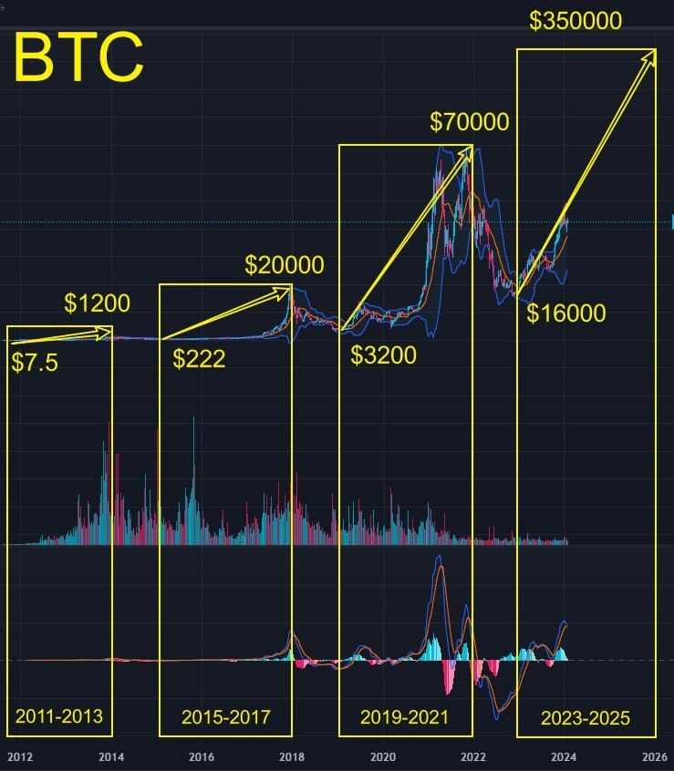

# Tuesday 20240227 (Guest: Noah Johnson)

## 08:34AM

### Morning Review （α&β Strategy）

Ladies and gentlemen, good morning! Noah Johnson here. Today, we're in for another day of soaring profits. Thanks to the good news yesterday, Bitcoin prices have continued to rise, now hitting the $57,000 mark. How much do you want to earn today? 10% or 60%? How are you planning to do it? Through stocks or crypto contracts? Do you have a clear understanding of your current holding strategy? With the LUCKY FEBRUARY 80% PROFIT PLAN, many have already achieved a total asset return of 26%. What about you? How much did you earn? In this profit plan, how do we balance the risk? So, today, I'll be sharing these important topics with you.

We'll move forward together, and if all goes well, robust trading signals will soon appear this morning. Are you ready? To ensure your earnings are not less than others under the same trading signal, keep a close eye on the messages in this group. I'll remind everyone the moment it's time.

## 08:44AM

Today, let's talk about VIX indexing , the so-called fear index. Hasn't it been full of surprises lately? Ever since February 13th, when our mentor told you all this index is going down, it's been on a downward trend, signaling to us that there's no significant risk of a major stock market crash. You guys are getting the hang of this, right? Remember, folks, it's not just a number—it lets you feel the market's mood and the overall trend.

Now, for today's main point, we still need to focus on cryptocurrencies. Like I emphasized yesterday, "weed out the weak and keep the strong - that's the royal road to investing." It's time to sell off $CRSP and $TSLA and shift those funds into crypto-related opportunities. Joining our profit plan or investing in EIF tokens are both solid choices that can bring new energy to your investment portfolio. What do you think, everyone? Do you agree with me?

## 09:04AM

Alright, folks, this is our moment to shine! Imagine we're standing at the threshold of a massive party, and the launch of Bitcoin ETF options is like the giant switch that's going to crank this party to its peak. And don't forget, the Bitcoin halving is right around the corner. The arrival of April is like a big gift handed to us. We're on the eve of a wave that's about to explode. $70,000? That's just the beginning.

We're not just talking about one percent or two in gains here. The current market price gives us at least a 22% upside. But what does that mean for us? With a 100X contract, guys, we're talking about a 2200% profit opportunity! Yep, that's 2200%!

## 09:10AM

Moreover, I bet the growth will be swift. Think about it, the native token of ICHCOIN exchange, ICH/USDT, its volatility is even higher than BTC. What does that mean? Bigger opportunities, crazier profit margins, far beyond 2200%!

Right now, we're in the execution phase of the "Lucky February 80% Profit Plan," with our mentor leading us to focus on the untapped gold mine that is ICH/USDT. An 80% profit target? For us, that's a piece of cake!

In the face of this 80% profit opportunity, the amount of capital you invest directly determines your returns. Imagine, if your goal is to make $100,000, according to our plan, you might only need a few trades to achieve it.

## 09:23AM

Don't forget, opportunity is fleeting, and time is money. Our profit plan is only for these 7 days, missing this rapid rise might mean no second chance. Thus, every day, every opportunity is precious, miss one and you're one short. And if Bitcoin rises quickly this time, I believe our mentor won't open a second chance like this, because there might be risks later.

So, I ask you, are you ready? Are you well-prepared for this profit plan? Time waits for no one, folks. We need to speed up and seize this opportunity. Don't let the future you look back on today's decision with nothing but a sigh.

## 09:35AM

When you realize this profit plan is a rare opportunity, and our mentor gives us a broader perspective, inviting us to understand how delightful it is to let profits work for us and be a relaxed investor. So, today I want to discuss a new topic: how to balance risk in this profit plan?

Imagine we're in a game of profits, using Warren Buffett's magic book of compounding interest. Each time we make money, we tuck these little treasure chests into high-yield fixed-income **financial products. The annualized yields of the 7-day and 30-day varieties are the highest; while the yields of ICHCOIN's financial products may not be the highest, they are above average in the industry. It's like finding a goldmine, except we don't have to sweat for it, the gold comes looking for us.

## 09:47AM

Now, let's talk about why these financial products can offer such high returns. Simply put, ICHCOIN trading center acts like that understanding friend who knows what you want and offers benefits because they too can make a profit. They thrive in the crypto market, knowing how to make money work for them, and then they share their cake with us. Think about it, who doesn't like to have a free piece of cake?

I've looked into it deeply, the folks at ICHCOIN earn through lending, transaction fees, mining, and investing in high-tech decentralized projects. Plus, they have a team of experts, ensuring they consistently achieve high returns.

## 09:56AM

Why would they want to share a piece of the cake with users? Well, that's where their clever strategy comes in. They're currently in a rapid expansion phase and want to attract more users, which means they're willing to spend a little now for a bigger return in the future. This strategy isn't new, but it's definitely effective, similar to what industry giants like Binance and Coinbase did in their early days. With the spring of cryptocurrencies upon us, exchanges worldwide are fiercely competing for customers. These rapidly growing platforms are willing to offer more benefits to users, which is one reason our mentor chose them as a strategic partner.

In simple terms, we're smartly making our money work for us, while also enjoying the benefits of these fast-growing trading platforms during their boom period. This is not just investing; it's an art, and those who understand it, truly understand it.

## 10:02AM

When discussing the joys of being a leisurely investor, it's essential to touch upon the core theme of "giving back." This profit plan is, in essence, a form of gratitude and reciprocation from our mentor for our long-standing support. Imagine the mentor warmly conveying, "Because of your support, let's create wealth together." Investing our earnings from the stock market into this plan is not just a reallocation of funds; it's like hitting the accelerator on the investment track, significantly distancing us from conventional investment methods.

Setting a $5,000 entry threshold has profound implications behind this strategy. Firstly, it symbolizes the participants' seriousness and commitment to the opportunity; secondly, it ensures that our team can focus resources and energy on those truly willing to engage in the AI-RP 4.0 project, jointly pushing towards a brighter future.

## 10:08AM

## 10:09AM

For those who may be concerned about insufficient funds, I want to convey that EIF Business School always treasures every investment and support. We fully understand that for some folks, reallocating funds requires time and planning. Therefore, my advice is to optimize your financial planning as much as possible to prepare for joining this important battle.

Now, let's discuss why using stock profits to join this profit plan is a wise choice. Observing that $CRSP did not see a significant increase in volume after a price breakout, and considering the uncertainty of mid-term trends and challenges under pressure that $TSLA is facing, these signs **indicate that it's becoming increasingly difficult to achieve significant growth in the current market environment. Therefore, we can completely exclude these stocks and shift this portion of the funds.

## 10:30AM

So, sliding our stock profits into the embrace of the LUCKY FEBRUARY 80% PROFIT PLAN is not just a savvy move in capital deployment but a prophecy of future wealth multiplication. Imagine, in this unpredictable market, you could be enjoying the splendors of life while calmly watching your wealth steadily climb. Isn't that the dream scenario everyone longs for?

Then, after profiting from contract trading, reinvesting half of those profits into fixed-income financial products with decent annual returns. This isn't just building an indestructible investment fortress; it's like unlocking a kind of compounding magic even more wondrous than Warren Buffett's strategy. What I want to share with you today is this art of balancing risk and reward, letting our profits work for us, and enjoying that serene investor life. This is not just a strategy; it's a supreme philosophy of life.

Do you all agree?

## 11:35AM

Congratulations to everyone for capturing the third trade signal in this profit plan and achieving an impressive cumulative return of 190% and a total asset return of about 38%.

At this opportune moment, with the SEC's latest proposal acting favorably, compared to BTC, **ICH/USDT offers better opportunities, combining to form a rare chance for wealth growth in front of us. Such results not only prove the effectiveness of our mentor's strategy but also highlight the scarcity of opportunities within the LUCKY FEBRUARY 80% PROFIT PLAN. Each opportunity that arises is unique, and missing out might mean it never comes again. Therefore, I want to emphasize the importance of seizing the moment; opportunities decrease with each one taken. Don't hesitate, now is the best time to grasp the opportunity and secure your entry into the profit plan.
Let's discuss the techniques used in our continuously winning strategy and listen to our mentor's teachings before the stock market closes.

## 02:32PM

### Closing Commentary

Dear future investment leaders of the EIF Business School, I hope your afternoon is filled with sunshine and inspiration!

First, I must express my deepest respect for Noah's presentation this morning. He not only thoroughly explained how to efficiently allocate high-yield financial products through the ICHCOIN trading platform to construct a robust and flexible financial defense line, ensuring a graceful balance between profit and risk, but also insightfully revealed the economic logic and profit potential behind this investment strategy.

Noah's insights are undoubtedly profound and forward-thinking, providing all of us with a valuable learning opportunity. Now, I ask you all, have you grasped the deep wisdom he conveyed?
Since yesterday, this strategy has become the soul of our profit plan. It demands that every member of our team must practice it with a rigorous attitude and firm execution.

Here, I am also closely monitoring the Ai4.0 data dynamics to ensure that I can timely convey the latest trading signals of the 'Lucky February 80% Profit Challenge Plan' to you all. I urge everyone to stay highly alert and prepared, ready to seize the upcoming, rare profit opportunities.

## 02:46PM

Time is precious, and today we have collectively witnessed the power of strategic wisdom and foresight.

\$NVDA's performance matched our predictions, with prices slightly falling then rising again, stabilizing the stock index. The market's leading sectors are primarily in gene editing and cryptocurrencies.

\$MSTR, by increasing its holdings in Bitcoin spot, has become the most dazzling star in the market, congratulations to all investors on their significant profit growth once again.

\$MARA, as a leader in the mining industry, has not only enhanced its competitiveness due to the industry threshold raised by the Bitcoin halving mechanism but also increased its mining profits along with the rise in Bitcoin's value. Its upcoming financial report is expected to exceed market expectations.

Our grasp of this round of cryptocurrency beneficiary stocks' market performance has been very precise, all thanks to everyone's trust and excellent execution.
We should give ourselves a round of applause, celebrate these hard-earned achievements together; let's encourage each other and work hand in hand to create a better future.

## 03:00PM

Many friends may continuously develop new worries as the stock price rises: will it continue to increase?
Do you remember the "entertainment bet" I mentioned on January 30th?

At that time, I said: "If by the end of three months (before the close on April 30), the price of $MSTR has not reached $1,400, consider it my loss: I will compensate for this price difference and expected profits (calculated based on the $MSTR shares you currently hold). If it does reach, then I win, and each of you who bought $MSTR will help me by introducing five friends to follow this Ai4.0 course and its future planning."

At that time, $MSTR was around $522.76, and many friends' average holding price was below this, currently, we are nearly halfway to our target, let's continue to hold, and I believe the market will give us a spectacular win-win answer!

## 03:10PM

Why do I dare to make such a promise with everyone? It's based on our judgment of the timing of this halving event. Historically, each halving event has triggered an irresistible bull market, a logic I believe we all understand, right?

As shown in the monthly chart of BTC, BTC's price has broken through the price concentration areas of several months in history, still possessing upward potential in the medium and short term because upward movement faces the least resistance.

This is our judgment on the medium and short-term trend. So, what about the medium to long-term trend? It's quite simple: follow the pattern of 'three years of bull market followed by one year of bear market.'
Therefore, $MSTR can be held in the medium to long term.
Today, I will share with you an even more important perspective: BTC will surpass gold as the world's premier asset class.

## 03:26PM

Gold's rarity makes it precious, and its stability makes it easy to preserve, making gold an important means of storing wealth. Simultaneously, gold is a financial asset with intrinsic value that never defaults.
Essentially, gold can counter credit risk, meaning when the entire financial system faces credit risk or there are issues with government bonds, people turn their attention to the most value-preserving asset, which is gold.

Gold serves as a safe haven and stabilizer, classifying it as a premier asset.

Currently, the market value of gold is approximately 13.711 trillion USD. The market value of BTC is around 1.102 trillion USD.

Moreover, the quantity of BTC is limited and will soon be fully mined; of course, gold also has a physical limit, but it is difficult to estimate. Based on this, BTC's potential for appreciation far exceeds that of gold.

With these understandings in mind, let's begin our calculation.

## 03:40PM

On January 31st, I calculated, based on data from several historical bull and bear markets, that the price of BTC in this bull market would reach at least $350,000.
According to the current price, when it reaches this value, BTC's market capitalization will be $6.755 trillion, rapidly approaching the total market value of gold.

With Bitcoin's increasing scarcity and the continuous highlight of its value, we firmly believe that, including this round, by the next bull market in 2029 at the latest, Bitcoin's market value will historically surpass that of gold.

Therefore, predictions that BTC's price could reach $500,000 or even $1,000,000 are entirely possible
In this context, if $MSTR maintains its current development strategy and model, it will undoubtedly reap significant benefits from this future surge in value. This fully affirms the decision-making wisdom and foresight of $MSTR and its investors.

Friends, do you feel incredibly proud and fortunate to have successfully grasped the starting point in the midst of this cryptocurrency bull market?

## 04:02PM

In this era filled with opportunities, we are standing at an unprecedented node of wealth growth.
Setting our sights on $350,000, the spot trading of BTC has unveiled a growth potential of over 500%.

When engaging in 100X contract trading, the potential profit space explosively increases to over 50,000%, accelerating our heartbeats and realizing the limitless possibilities of wealth growth.
Simultaneously, ICH/USDT—the native token of the ICHCOIN trading center—is on a fast-track trajectory, carrying vast expectations for appreciation, preparing to perform its legendary story on the cryptocurrency stage.
It is the core of whether we can achieve beyond our expected profit targets for this plan.

At this moment, we are in a golden profit cycle; on the track of wealth, every opportunity for exceeding profits is scarce and precious, and we must embrace this challenge with full enthusiasm and seize the opportunity!

## 04:11PM

Many friends have achieved significant results through personalized profit strategies communicated via private messages with me. This not only highlights the immense advantages of customized strategies but also reflects the importance of in-depth learning and precise execution.*

As previously emphasized, this profit plan is both a practice in financial investment and an opportunity for profound learning.
Full engagement, adherence to strategy, and understanding the logic behind each trade will cultivate more outstanding talents like Noah.

I urge those who have already achieved significant results to maintain their momentum, and those whose results have not yet met expectations not to be discouraged but to continue striving.
If you encounter any obstacles, feel free to communicate with me, Noah, or my assistant at any time. We will work together to solve problems and optimize strategies.

Now, let's review and consolidate the techniques and strategies applied in this morning's trading session.

## 04:25PM

From the 1-minute trend chart of ICH/USDT, we can observe that this is a classic trend-following trading strategy.

1. The price rapidly breaks through the middle Bollinger Band upwards, and the direction of the middle Bollinger Band turns upward, indicating the beginning of an uptrend, favoring long positions.

2. As the price breaks through the resistance line L, with the MACD Histogram continuously growing above the zero axis, indicating increasing buying pressure, a breakout buy point is formed. We follow the trend and create bullish contract orders.

3. Afterwards, the price maintains fluctuations and retraces to the support line L without breaking below it, proving the effectiveness of the support.

4. Subsequently, as the price rises near point S:

- The price reaches near the upper Bollinger Band, indicating it encounters resistance.
- The upper and lower Bollinger Bands begin to contract, indicating the trend may enter a period of adjustment.
- The MACD Histogram cannot continue to grow above the zero axis, predicting the arrival of a top divergence - the area of the MACD Histogram in region A2 will be smaller than in A1.
Therefore, we decisively choose to close the position.

This trade mainly utilizes breakout buy points and top divergence. Have you understood the essence of it?

## 04:29PM

### Important Notice

Friends, please be aware that I have already shared the fourth trading signal of this profit plan in the Telegram trading signal sharing group (Lucky Feb 80% Profit Plan). Please make sure to check and strictly follow it.

## 04:44PM

### Important Notice

Friends, please be aware, I have just shared a supplementary signal for the fourth trade of this profit plan in the Telegram trading signal sharing group (Lucky Feb 80% Profit Plan). Please make sure to check and strictly execute it.

## 05:08PM

Friends, in our recent trade, we employed a precise capital management strategy, utilizing our position in two increments, each approximately 20%, ultimately using about 40% of our position.

This strategy allowed us to maintain flexibility and safety of funds in the face of market uncertainty, achieving stable returns on the basis of strict risk control.

Today's operation profoundly reflects the core value of risk management. We hope everyone can deeply understand that excellent risk control is not only a shield to protect capital but also a sharp sword to advance steadily in a volatile market.

## 05:28PM

In the midst of that passionate trading atmosphere, we not only adeptly handled the market's subtle fluctuations but also, with our perfect strategy, achieved a remarkable victory that surpassed the profits of all our previous trades.

For the warriors who joined the "Lucky February 80% Profit Challenge Plan," this moment of splendid achievement is worth celebrating together!

So far, after four rounds of precise trade setups, we have spectacularly realized an astonishing profit rate of 240%, with a total asset return rate reaching an astounding 58%.

This means that if you initially invested $5,000, your pocket would now be $2,900 richer in pure profit; and for those friends who invested $100,000, your wealth has grown by $58,000!

This is the valuable opportunity the market has given us, filling us with confidence and anticipation to meet or even exceed the goals of this profit plan ahead of schedule!

## 05:36PM

### Important Strategy Notice

To establish a safety barrier for investments, fixed income financial products are a key part of our strategy.
I strongly recommend that after each member realizes a profit in contract trading, 50% of the profit should be conscientiously transferred into fixed income financial products in ‘Finance’ under ‘Fixed’, with a preference for investment periods of 7 days or 30 days.

This practice not only ensures the safety of funds but also guarantees the continuous appreciation of capital, which is an important step in our wise investment.
Please bear this strategy in mind and put it into practice, to jointly build an impregnable investment defense line.

## 05:47PM

While basking in the glory of today's victory, the trading opportunities of tomorrow quietly unfold their enticing prospects. At this moment, I especially encourage everyone to actively engage in self-learning, to continuously hone and enhance our trading skills.
Tomorrow, I will share more practical strategies with you all, and Noah will gradually reveal his trading system, helping us to be more composed in live trading.

Faced with the upcoming new challenges, I sincerely call on every like-minded partner not just to cherish the achievements of today but also to look to the future and make more thorough preparations for the upcoming trades.
Tomorrow, let us move forward together, pursuing not only the growth of profits but also the refinement of strategies and the elevation of personal skills.
In this era full of infinite possibilities, only through continuous learning and progress can we capture every fleeting opportunity and turn dreams into reality.
Let us meet tomorrow's challenges with full enthusiasm and ample preparation, embark on a new journey together, and create our own success stories.

Have a pleasant day, and I look forward to achieving more great results with everyone in tomorrow's trading!
