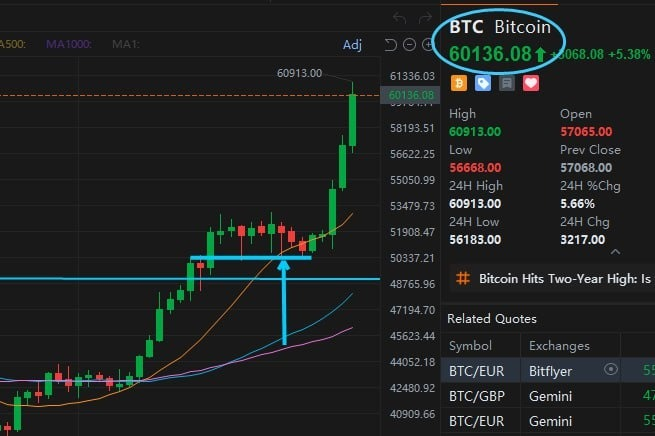
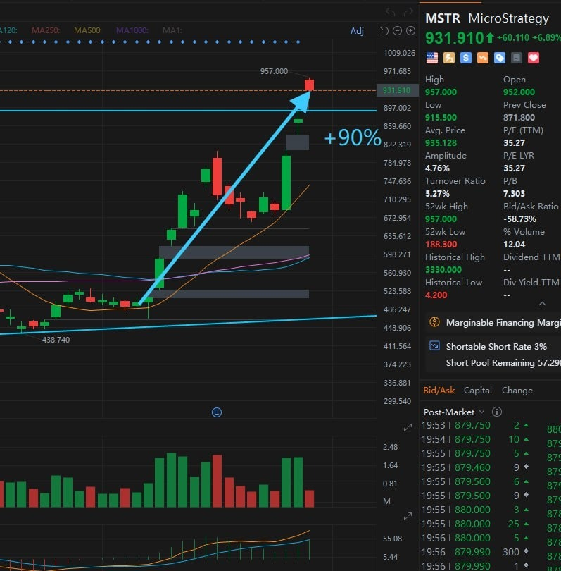
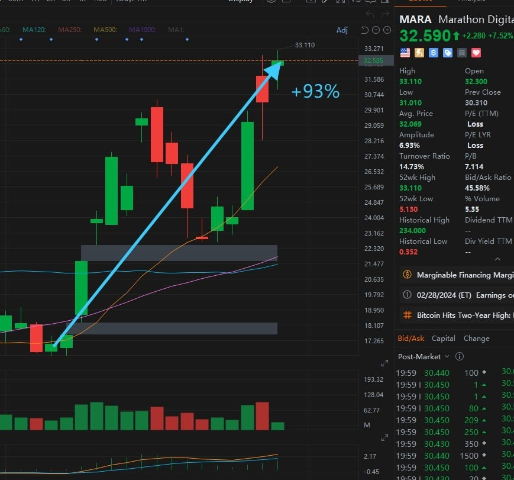
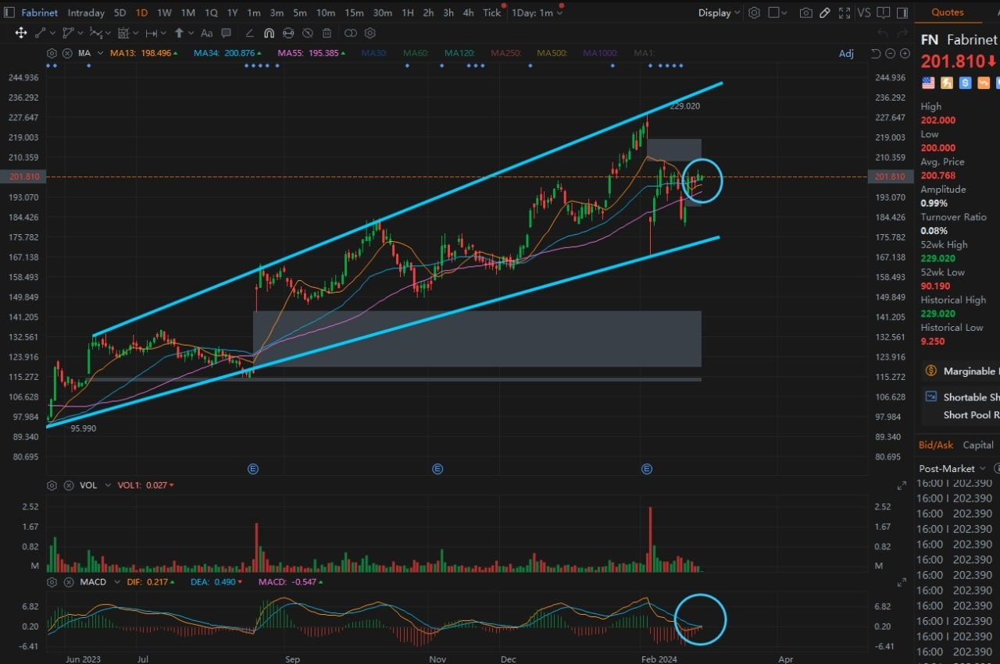
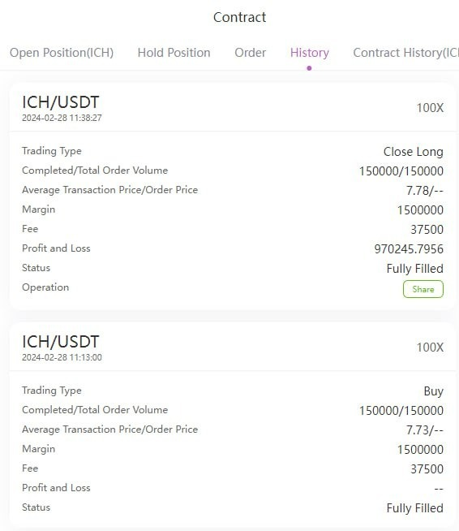
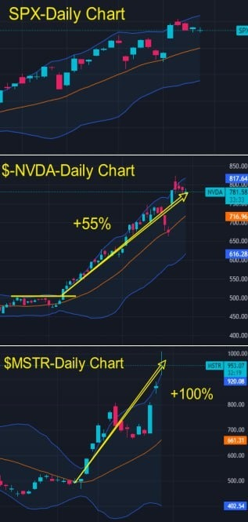
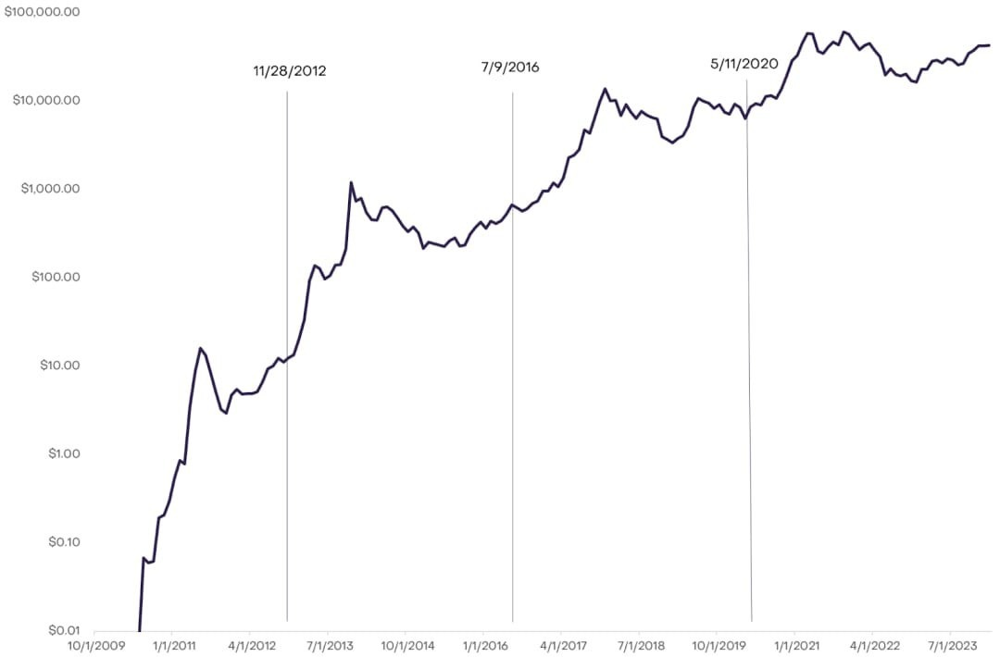
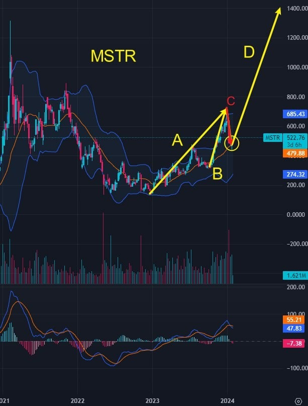

# Wednesday 20240228

## 07:42AM Evelyn Smith

### Dear friends, good morning

I have some exciting news to share with you! Last night, Bitcoin continued its strong rally and successfully broke through the $60,000 mark! The professor's earlier predictions are proving true step by step, so let's look forward to the performance of MSTR and MARA in today's early market!

With Bitcoin's surge, JPMorgan has also changed its view on cryptocurrencies. Although JPMorgan's CEO Jamie Dimon once criticized Bitcoin, they are now optimistic about Bitcoin's sustainability and growth potential.

JPMorgan's change of stance reflects the significant shift in market attitudes towards cryptocurrencies in recent years, with more and more institutional investors beginning to include cryptocurrencies in their portfolios, opening up more possibilities for the future growth of cryptocurrencies. This trend is also prompting other financial institutions to reassess their views on cryptocurrencies and may take a more active stance in the future.

Overall, JPMorgan's optimistic stance on Bitcoin shows that market confidence in cryptocurrencies is strengthening, and it also indicates that cryptocurrencies will become one of the more widely accepted investment options.

So, for those who have not yet prepared funds to join the Lucky February Profit Plan, it's time to hurry! Time waits for no one, let's look forward to this moment full of opportunities!

Additionally, later on, Noah will lead us to continue on the path to financial freedom, so please keep an eye on the messages in this group.

## 08:32AM

### Morning Review（α&amp;β Strategy）

Ladies and gentlemen, good morning! Noah Johnson here.
Guys, this bull market is absolutely insane, and right now, talking about any stock just doesn't compare to the heat of the cryptocurrency market. Bitcoin's price has blasted past the $60,000 milestone, and $70,000 seems just around the corner. The approval of Bitcoin spot ETFs, coupled with the upcoming Bitcoin "halving" event, has even the most conservative investors scrambling to buy this asset. This has triggered a historic demand for Bitcoin, and guess what? Our mentor led us right into this historic profit-making moment! Our portfolio holdings in $MSTR and $MARA have nearly doubled! How much did everyone make? Launching the LUCKY FEBRUARY 80% PROFIT PLAN at such a time feels like hitting a gold mine, doesn't it? The mentor's insight and timing are just too strong!

## 08:55AM

\$MSTR, our heavy hitter, is flirting with the $1000 mark - crazy, right? Wondering if it's time to cash out? And for those of you feeling a bit of FOMO for not scooping up more shares when it was lounging around $500, I get you.

Just sold off $TSLA and pondering where to funnel that cash next? And hey, if you missed jumping into the boat that is our LUCKY FEBRUARY 80% PROFIT PLAN, you might be kicking yourself right now. But don't sweat it - is there another way to get in on those juicy profit signals? What's the scoop with AI-RP 4.0 today? What kind of strategies and signals is it cooking up for us?

I know these are burning questions for everyone. So, today, I'm here to reveal some key insights and share some important perspectives that might help us make wiser choices in this opportunity-rich market.

## 09:09AM

Alright, let's talk $MSTR. Michael Saylor, the genius and co-founder of MicroStrategy, started stacking Bitcoin back in 2020, using it as a hedge against inflation and a solid alternative to holding cash. Just last week, Saylor was asked in an interview when the company might consider selling its Bitcoin stash. His response? "Why sell a winner?" Boom! According to a filing with the SEC on Monday, their latest buy was between February 15th and 25th, all cash deals. This bumps up their Bitcoin treasure chest to about 193,000 coins. At a cool $60,000 per Bitcoin, we're talking a market value over $11.5 billion. In my eyes, this software company's morphed into a full-blown Bitcoin company.

Now, Saylor's doubling down on BTC adding positions - is he just playing it fast and loose with his cash, or does he see something we don't? Think about it. Some folks are wondering if now's the time to dump $MSTR, but let me ask you this: you think you've made too much money or something? Anyone thinking of selling off the most legit Bitcoin beneficiary stock right now just isn't seeing the big picture. People are scrambling to buy what you're thinking of selling. So, my advice? Hold onto it like it's gold. Because, in a way, it indeed is.

## 09:25AM

Alright, folks, let's zero in on $MARA - they're about to drop their earnings report, and I'm betting it's gonna knock our socks off. Not just because I think they're gonna outperform expectations, but also 'cause they're riding high on the current crypto craze. And let me drop another bomb on you: looking at the Top 10 options trading volume, with Bitcoin smashing record after record, both $MARA and $COIN options are trading like hotcakes - the volume's through the roof!

So, what's my play here? Keep holding, folks. This ride's just getting started.

## 09:38AM

Alright, team, let's cut to the chase. You and I, we've seen our fair share of market swings, right? Been there, done that. But this whole saga with junk stocks? It's like watching money evaporate. Look at our golden geese, $MSTR and $MARA, soaring while those dead weights anchor us down. It's a no-brainer.

So, here's the scoop for those who've tidied up their portfolios, ditched the losers, and are sitting on some extra dough after following my lead. There's this stock, $FN, dubbed "Tomorrow's Titan" by yours truly. It's not just about shifting from the duds; it's about strategically placing your bets on something with a pulse.

## 09:51AM

Why $FN, you ask? This isn't just another stock. We're talking about a company that's rocketed over 60% this past year, thanks to its savvy AI strategy and its crown jewel status as a key supplier to $NVDA. It's in the sweet spot, ensuring a win-win no matter how the AI race pans out. Their tech is the backbone of advancements in machine learning and AI, making $FN not just a winner today but a titan tomorrow.

Technically speaking, we're looking at a breakout candidate here, with all indicators pointing north. If you're pondering where to allocate that spare change, $FN is your golden ticket to balancing risk and capturing the essence of the two hottest sectors: crypto and AI.

Targeting $230 in the short to mid-term with about 10% of your portfolio? Sounds like a plan. This isn't just about making a smart move; it's about making a strategic one, positioning ourselves at the forefront of both crypto and AI markets.

## 10:00AM

Hey team, been swamped with messages from you all itching to get in on the crypto contract trading game but feeling a bit out of your depth. Got a mix of folks here, some even gave our last couple of internal tests a whirl but couldn't quite get the hang of it due to tight schedules, watching others making bank while they sat on the sidelines. The big hold-up? It's all about dodging those risks.

So, I'm hearing a lot of you want to dip your toes with just a little cash, test the waters. You're asking if I could dish out some trading signals for a bit of a learning curve.

## 10:08AM

Here's the deal, though. To get this show on the road, there's a couple of things we got to square away. First, mastering contract trading isn't rocket science – a quick study session and sticking to the playbook should do the trick. But, I got to run it by our mentor first. We're talking a $5,000 minimum to get in the game, all to make sure we're all in it to win it. Last time, not everyone was taking the test funds seriously, and we're not about to let that slide and ruin EIF Business School's reputation.
If everyone's on board with giving it their all, and once I get the thumbs up from our mentor, I'm all set to share some killer trading signals from my 'α&amp;β' trading system right here. So, gear up, folks. It's time to prepare.

Folks, ever stopped to think why we're all here? It's not just about the thrill of the trade or watching numbers go up. It's about learning, growing, and mastering this game. That's what sets the winners apart from the crowd. And speaking of winning strategies, have you given any thought to the power of personalized plans? That's where the real magic happens.
The importance of learning cannot be overstated. Every trade, every trend, and every turn in the market is a lesson waiting to be learned. And it's those lessons that build the foundation of our success. But here's the kicker: personalized, custom-tailored plans take that success to a whole new level. Imagine having a strategy so in tune with your goals, risk tolerance, and financial situation that it feels like it's reading your mind. That's what we're talking about here.

Folks, please note, the trading signal sharing group on Telegram (Lucky Feb 80% Profit Plan) has just shared the 5th trading signal.

## 10:34AM

For those of you already reaping the benefits of our profit plan, think of this as your next big move. Doubling down on your commitment not only shows you're serious about your financial future but also opens the door to more trading signals and, ultimately, more profit. It's an opportunity to dive deeper, learn more, and earn more.

So, to my friends already on board, and to those sitting on the fence: now's the time to consider stepping up your game. Creating your own personalized plan, where the focus is on you, your growth, and your profits. Let's not just aim to*participate; let's aim to dominate. Prepare to invest not just your funds, but your faith in a system designed to amplify your success. Trust in the learning, trust in the customization, and watch as the doors to more opportunities swing wide open.

## 10:59AM

Alright, folks, let's dive deep and keep this momentum going. First off, let's talk numbers and efficiency. We've just wrapped up another round of trading, and the signals we caught this time were not just good, they were golden. Our cumulative return rate skyrocketed to an incredible 300%, and the total asset return rate hit 70%. We didn't just meet our profit plan goals; we're on the path to exceeding them. How's that for efficiency? How's your wallet feeling now, nice and heavy?

Now, after cashing in these victories, it's time to play it smart. Each time we complete a contract trade and pocket the profits, I suggest we take 50% of those winnings and invest them in either 7day or 30day fixed income financial products. Why? Because it's like strapping a top-of-the-line shock absorber to your investment portfolio. No matter how bumpy the market gets; your hard-earned cash is safe, providing steady momentum forward. Guys, this isn't just a strategy; it's our safety net, ensuring we perfectly balance risk while staying agile in the market.

## 11:12AM

The key takeaway: Keep your eyes peeled for our mentor's lesson at the end of the day. It's not just another session; it's the playbook on how we keep winning. Techniques, insights—they're all there, and that's what sets us apart. So, as we gear up for the next set of trades, make sure you're watching closely. Mastering these skills is crucial; it's how we keep our edge and the profits rolling in.

So, to sum up—reap those profits, wisely invest half to maintain a balanced risk, and never stop soaking up wisdom from our mentor. That's our triumvirate of success. Let's keep this winning streak alive.

## 02:38PM Linton Quadros

### Closing Commentary

Dear future investment leaders of EIF Business School, may your afternoon be filled with sunshine and inspiration!

The undisputed star of today's market is cryptocurrency, with BTC soaring to $64,000 at one point. As we anticipated, the milestone of $70,000 seems to be within reach.

The market index's retracement, our main holdings demonstrated extraordinary resilience, pushing our return rate to an exciting 100%!

This is a testament to our strategic insight. Friends, holding flagship stocks in the two most dominant fields of our era—Artificial Intelligence and Cryptocurrency (such as $NVDA and $MSTR)—don't you find the feeling of our profits rapidly increasing to be spectacular?
Please applaud our collective effort. I deeply admire your excellent execution and understanding!

## 02:53PM

If you've ever dreamed of changing your destiny through the robust bull market of cryptocurrencies, enhancing the standard of living for your family, then please pay close attention to what I'm about to share: What's unique about this round of Bitcoin halving?

We will delve into the essence of halving, its significance, and its historical impact on Bitcoin's performance. Next, we will examine the current landscape of Bitcoin and why the situation has changed drastically compared to just a year ago.

You will understand that every day in the next one and a half months is as precious as diamonds, and how I will guide each of you.

Let us embark on this journey together, with passion, a thirst for knowledge, and a deep appreciation for the opportunities before us. Your participation and pursuit of this topic will not only enrich your wisdom but may also change your financial future.

## 03:08PM

Dear future investment leaders, as our global economy stands on the brink of a significant turning point, understanding the profound opportunities before us is crucial. The synchronicity of the Bitcoin halving event with key macroeconomic moments is not merely coincidental; it's a call to action for savvy investors like yourselves.

Looking back to 2012, amid the storm of the European debt crisis, Bitcoin not only served as a beacon of resilience but also as proof of the enduring value of alternative assets, skyrocketing from $12 to $1100 by November 2013.

Fast forward to 2016, amidst the ICO frenzy injecting over $5.6 billion into emerging tokens, Bitcoin rode the wave of innovation, with its value exploding from $650 to $20,000 by December 2017.

Especially during the 2020 COVID-19 pandemic, as governments launched massive stimulus measures sparking inflation fears, Bitcoin became a fortress amidst economic uncertainty, soaring from $8600 to $68,000 by November 2021.

## 03:24PM

In the ever-evolving realm of cryptocurrencies, the significance of Bitcoin halving cannot be understated. This pivotal event halves the reward for mining new blocks, fundamentally altering Bitcoin's supply dynamics, creating scarcity that has historically catalyzed significant price surges.

This is not only a test of resilience and adaptability for miners and mining companies but also sets the stage for global investors to reassess Bitcoin's value.
As we shift our focus to the current state of miners and mining enterprises, we find ourselves at a time of extraordinary transition and opportunity. Despite the challenges brought by halving—primarily the reduction in mining rewards—mining businesses have displayed commendable foresight and innovation.

The significant increase in hash rate demonstrates the industry's resilience, highlighting a collective shift towards more efficient mining equipment and strategies.
Noteworthy financial maneuvers, such as Core Scientific's $55 million equity offering and Marathon Digital's ambitious $750 million mixed shelf offering, underscore strategic reserve enhancement, ensuring these enterprises can navigate the changing tides of the Bitcoin ecosystem smoothly.

## 03:38PM

Furthermore, the emergence of new technologies, particularly the revival of inscriptions and the introduction of BRC-20 tokens, signifies a transformative phase within the Bitcoin community. These innovations are sparking a cultural and technological shift, attracting a new wave of developers and investors interested in the potential for network expansion.
This evolution is crucial not just because it diversifies the Bitcoin ecosystem but also because it infuses the community with fresh perspectives and projects, promising to drive future growth.

Combining these elements—the impact of halving on supply and price, the strategic responses of miners and mining companies, and the infusion of new technologies into the Bitcoin ecosystem—we arrive at a compelling conclusion.
This bull market is characterized by a potent mix of efficacy and scarce opportunities, a rare confluence that offers unique and promising prospects for investors and participants in the cryptocurrency space.

Thus, the current cycle is not just another stage in Bitcoin's journey; it is a call to those who wish to seize the myriad opportunities brought about by these converging forces.

## 03:44PM

Future titans of Wall Street, we stand at a pivotal moment in the history of cryptocurrency. The approval of BTC spot ETF by the SEC marks a monumental shift in the market, coinciding perfectly with the Bitcoin halving, signifying an unprecedented macroeconomic opportunity unfolding before us!

Now, the approval of BTC options and ETH spot ETFs is just a matter of time. On the eve of this development, the market's *anticipation surges like a tide, signaling that the upcoming bull market will be robust and powerful.

From the doubling of our holding stocks' profits, you have already deeply felt this force

Remember, the cryptocurrency market is cyclical, exhibiting a pattern of "three years bull market, one year bear market."

Currently, we are in the midst of a once-in-four-years golden opportunity. History tells us that the market is most frenzied before the halving, making every day to come as precious as diamonds.

Let us join hands and embrace this moment, with our wisdom and courage, to seize this once-in-a-lifetime opportunity.

## 03:52PM

The right combination of market, timing, strategy, and tools is what truly creates legends!

Each one of you has the potential to become another Noah; why couldn't the next life-changing legend be you?

is the opportunity for each of you to reach the pinnacle of your life, with the next chance not coming for another four years.

If you're determined not to miss out, please pay close attention to what I'm about to share next: the supplementary plan for the 'Lucky February 80% Profit Challenge Plan'.

**Supplementary Plan 1:** I will have Noah guide everyone in contract trading during his sharing session, and he will share his α&amp;β trading system and method with you.

This is to satisfy your strong desire for investment opportunities in the cryptocurrency market.

However, I must reiterate: if you do not follow the instructions, we cannot be responsible for the outcome.
I urge some of you not to act rashly as in the second internal test. How can you expect others to be responsible for you if you are not responsible for your own funds?

Of course, if you strictly follow our trading strategy, I will personally guarantee to resolve any issues.

## 04:07PM

**Supplementary Plan 2:** Personalized Customization.

For those with foresight, eager to turn dreams into reality, and our esteemed potential supporters of the Ai4.0 system, personalization is not just an option; it's a higher-end vision and strategy for investment!

Since the start of our 14th internal sharing session, my goal has been crystal clear—not only to test the Ai4.0 system but more importantly, to cultivate a group of early supporters, especially those inclined towards the Ai4.0 institutional version.

My bold recommendation of $MSTR, betting on a +160% increase within three months, is a testament to our confidence in the Ai4.0 system. Remember my promise? "If you don't have $1 million, I will guide you to earn more than $1 million."

This is the power of belief in the Ai4.0 system!

## 04:17PM

On the investment journey, understanding the unique background, time constraints, and goals of each investor is crucial to our approach in customizing personalized investment plans.

Those friends with tight schedules, we have designed a strategy aimed at emphasizing mid-term trades supplemented by short-term opportunities, intended to deliver returns beyond expectations.

Given the current ICH/USDT shows greater volatility and growth potential compared to BTC/USDT, those who receive personalized plans can achieve an astonishing total asset return rate of over 60% with just 1-2 trades. This is the power of our meticulously crafted strategy, and the general feedback has been superb!

For investors with larger funds, trading using larger period charts is undoubtedly a more rational choice. This approach not only carries lower risk but also offers greater potential rewards. This is an undeniable fact.

## 04:28PM

Share your investment dreams with us, and let's embark on a journey tailored just for you. Based on your financial situation, risk preference, investment horizon, and return objectives, we will design an investment plan that is both efficient and streamlined for you.

Our goal is to ensure your investment journey is not only profitable but also worry-free, through customized strategies and meticulous guidance.

Let us reveal the powerful advantages of a personalized investment plan through a simple example: Imagine your capital doubled, which in turn doubles your investment efficiency, potentially quadrupling your returns. This is the significant advantage that our personalized investment plans can offer.

Moreover, for those who perform exceptionally well, I can secure your eligibility for the Ai4.0 system's presale rights.

## 04:31PM

### Important Notice

Friends, please be aware, I have just shared the sixth trading signal of this profit plan in the Telegram trading signal sharing group (Lucky Feb 80% Profit Plan). Please make sure to check and strictly execute it.

## 04:46PM

### Today's Achievement Verification Reward

A deep dive into the historical moments of Bitcoin's halving mechanisms and their intersection with significant **macroeconomic events has revealed the uniqueness of the current bull market. Why am I firmly convinced that, in the next one and a half months, every day will be incredibly precious, with the next opportunity waiting four years away? What is the logic behind this?

Facing this new investment landscape, what are your prepared strategies? Let's hypothesize, through contract trading, what *kind of profit potential would you face when BTC prices hit $350,000?

For the native token ICH/USDT, which surpasses BTC in both volatility and growth potential, what does its profit outlook look like?

How do you plan to embrace my 'Lucky February 80% Profit Challenge Plan' supplementary plan?
(Worth 50 pts)

## 05:33PM

Today, the use of the "One-Click Reversal" fully demonstrated the flexibility of cryptocurrency contract mechanisms. This is a market with mechanisms for both long and short trading, and unlike the matching mechanism of spot trading, contract trading employs an instantaneous execution mechanism, laying the foundation for flexible trading. The market's price and trend fluctuations are chaotic, and thus the signals also vary. Today serves as a classic example, also highlighting the Ai4.0 system's capability to adapt to complex and variable situations. Greater challenges only accentuate the value of the profit plan and the charm of this tools. Friends, have you learned this functionality of contract trading today?

## 05:53PM

Here, I extend my heartfelt congratulations to the friends who participated in this profit plan. With the victory of the sixth trading signal, we have collectively achieved an 80% total asset return rate!

Important Strategy Notice:

To establish a safety barrier for investments, fixed income financial products are a key part of our strategy.
I strongly recommend that after each member realizes a profit in contract trading, 50% of the profit should be conscientiously transferred into fixed income financial products in ‘Finance’ under ‘Fixed’, with a preference for investment periods of 7 days or 30 days.
Please bear this strategy in mind and put it into practice, to jointly build an impregnable investment defense line.

## 05:58PM

In this moment brimming with opportunities, we must continue to push forward and grasp this golden-level profit opportunity. For those who received personalized investment plans, I am delighted to see that many of you are nearing the returns of Noah.

Some of the most outstanding individuals have even achieved a total asset return rate of over 200%, which is an impressive feat of execution and achievement.

Through this process, we have deeply realized that those who are proactive will seize more opportunities and gains; whereas those who react slow will see significantly diminished returns.

Therefore, I urge everyone, in this once-in-four-years, most fervent period, to seize this rare opportunity; otherwise, you will deeply regret it.

## 06:10PM

I look forward to each of you being able to afford both the personal and institutional versions of Ai4.0 in the future, which will be priced at $50,000 and $1,000,000.
For those who cannot afford it currently, let us grow our wealth together by optimizing our investment portfolio. Follow our advice, proactively adjust the allocation of your investment portfolio, and move towards success together.

Tomorrow morning, I will invite Noah to lead us in implementing the supplementary plan for our profit plan and to demonstrate the effectiveness of his α&amp;β trading system and method, which has helped him achieve freedom in the investment market.

I must reiterate, strict execution is the key to success because there is nothing more important than stable profits in the world of investment. Please make sure to lock in tomorrow morning's session, as it will be a learning opportunity that is not to be missed.

Have a pleasant day!
