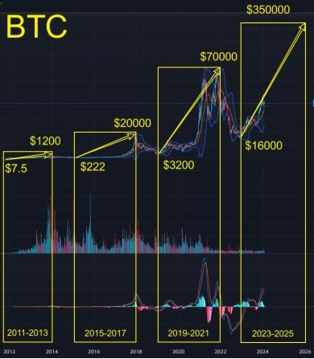
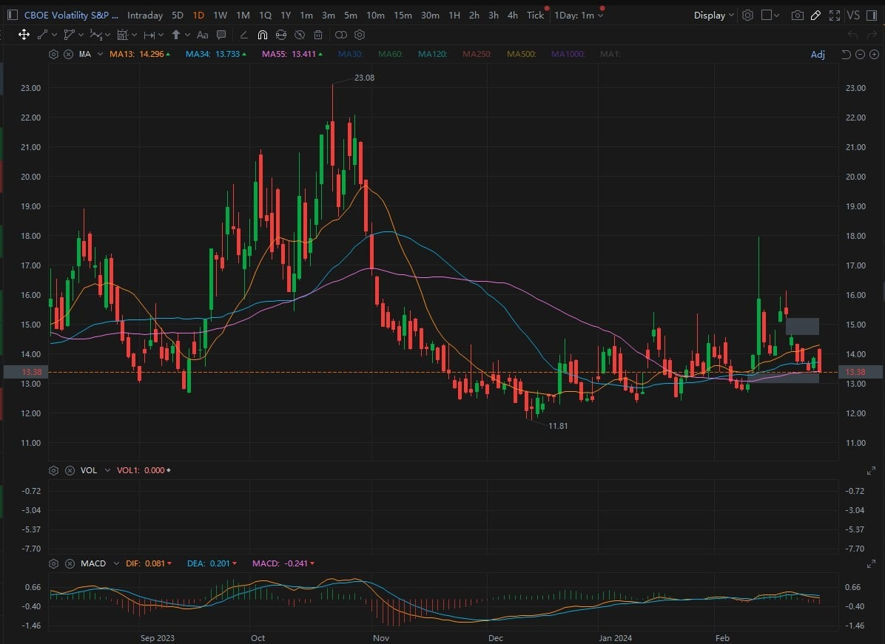
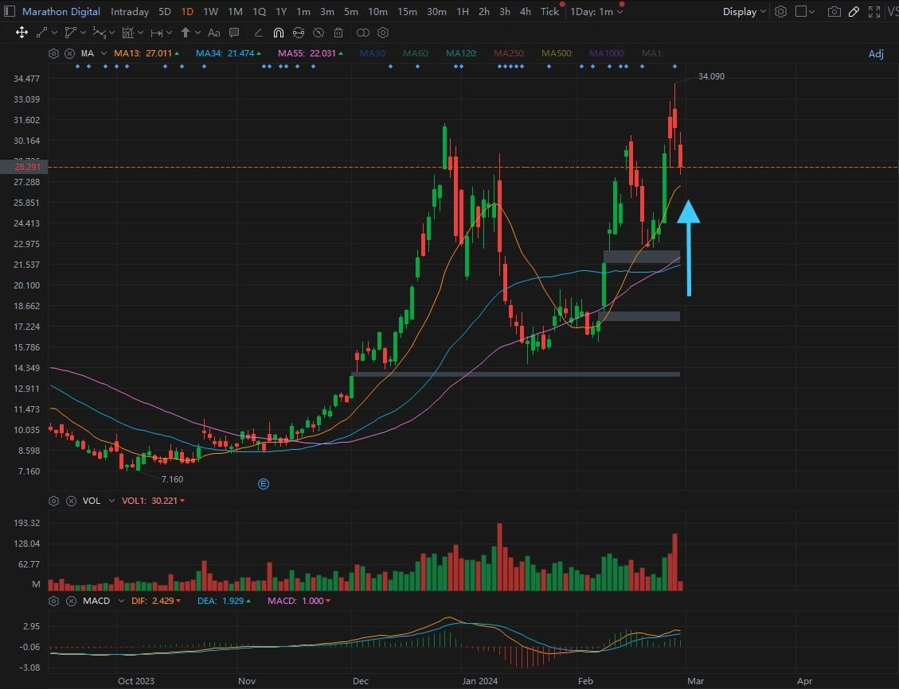
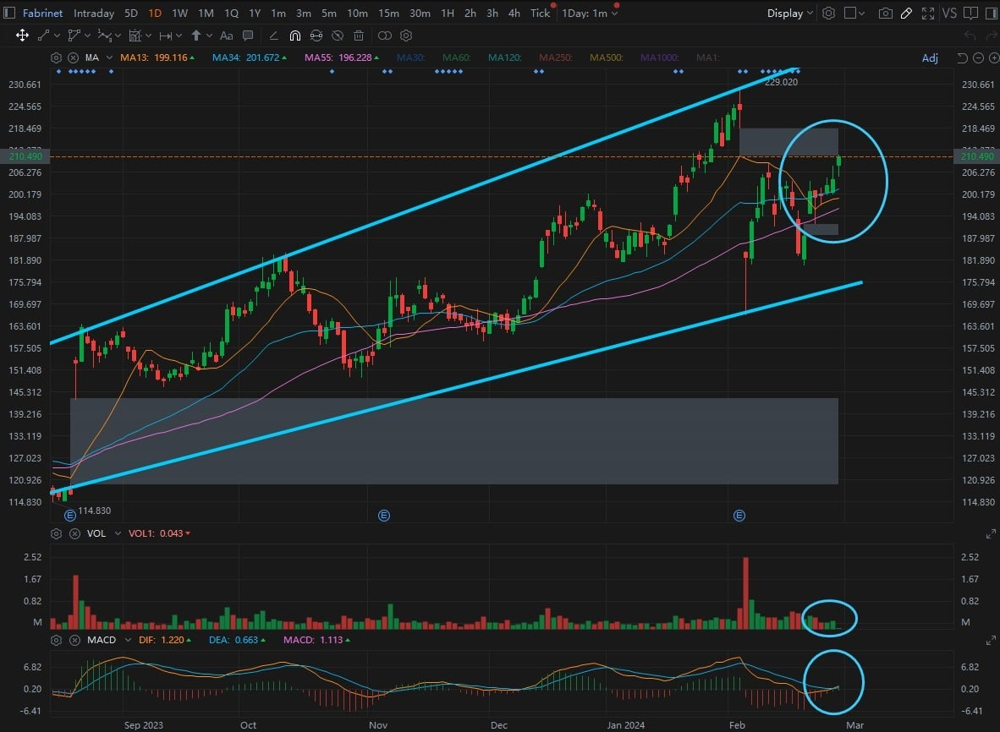
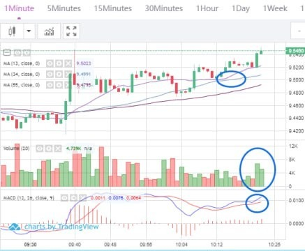
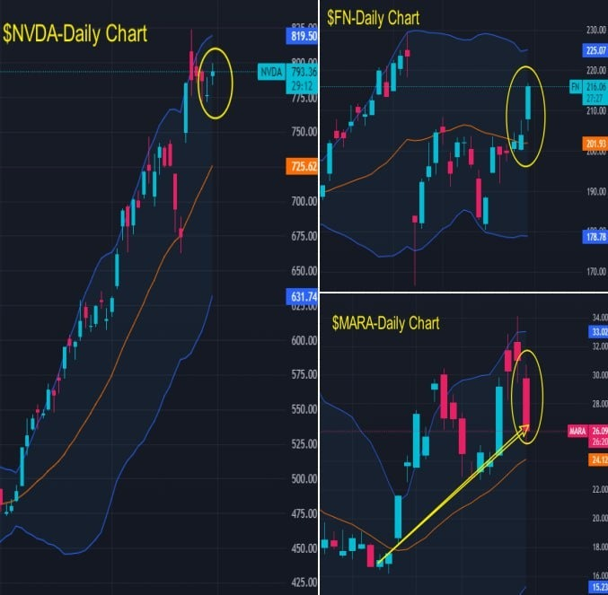
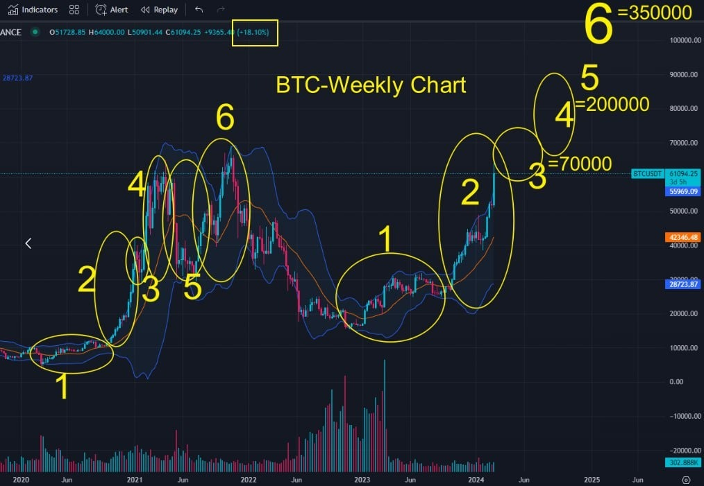

# Thursday 20240229

## 08:37AM

### Morning Review（α&amp;β Strategy）

Ladies and gentlemen, good morning! Noah Johnson here.\
Yesterday, our mentor laid out a roadmap right at the convergence of a massive macroeconomic event and the cryptocurrency halving cycle, painting the next one and a half months as precious as diamonds. But, if you ask me, what he shared is worth more than all the diamonds in the world:

- Take BTC halving cycle trends and predictions, for instance. It's like he's handing us the keys to wealth and freedom.
- Then there's the unique strength of this bull market. It's not just another cycle; it's a fortress built on solid ground.
- And let's not overlook the anticipation brewing around the approval of BTC options and ETH spot ETFs. It's the kind of suspense that beautifies the market with strong expectations.
- Lastly, the 'LUCKY FEBRUARY 80% PROFIT PLAN' supplementary plan. It's an open invitation for folks to grab onto wealth and level up together.
Every word from yesterday's talk is a treasure trove of wealth-creating wisdom, folks. It's time to pay attention and act on these golden opportunities.

## 08:46AM

Alright, team, per your request and with the green light from our mentor, I’m gearing up to guide us through some live contract trading opportunities in just a bit. Let's get prepare and ready to roll.
First thing's first, let's take a gander at the stock market and how our holdings are looking. We just got wind of the latest initial jobless claims numbers, and the data came in a bit higher than both the previous figures and the predictions. That's a bit of a downer for the dollar but a thumbs up for the stock indexes. Then, there’s the January core PCE price index annual rate that’s come in slightly lower than its predecessor, another hit for the dollar but a win for the stock indexes. So, the vibe in the market today is pretty upbeat, and with the VIX index taking a dive, it's all systems go for sticking with our stocks.

## 09:03AM

Alright, folks, let's talk about $MARA's earnings report. The company went from a loss of $3.13 per share a year ago to earning 66 cents per share. After adjustment, it had a loss of 2 cents per share, lower then analysts' expectations of a 3 cent profit per share. Because the earnings didn't exceed expectations, the stock price opened lower today. However, the fundamentals of the company are moving in the right direction. In the current bullish frenzy, this slight underperformance is like a tiny wave in the ocean—insignificant. It's still a hold.

## 09:15AM

\$FN, the one I recommended yesterday, keep this pattern in mind—it's the third type of buy signal in my α&amp;β long strategy:

- MA34/55 shows a bullish alignment.
- MA13 trends downward before starting to pivot upward around MA34.
- A medium to large bullish candle crosses above MA13 or stabilizes above it, accompanied by an increase in trading volume.
- MACD's DEA/DIF exhibits a bullish crossover.

These are the signals you want to watch for—they indicate potential profit opportunities. I know a lot of you have been waiting for me to share these technical analysis secrets, so there you have it. Keep faith in our holdings and pay close attention to these technical indicators. They'll be your ticket to making money in this bull market.

## 09:18AM

Alright, folks, it's go time for us to dive into the market and seize the opportunities waiting for us. Before we kick things off, let's get one thing straight about our position sizing. Normally, we go with a 20-30% position, but since this is our first rodeo together, we're gonna keep it tight and only use 10% of our positions. This isn't just a suggestion; it's a rule, and I expect everyone to follow it strictly.

I've got our mentor's assistant on deck to randomly check trading positions or the closing orders. And let me be clear, if I catch anyone not sticking to the plan, I won't hesitate to pull the plug on guiding these trades. This opportunity we've got, it's one we fought hard to get from our mentor, so let's not waste it. Get ready, and let's show 'em what we're made of.

## 09:22AM

Trading Signal:\
Contract: ICH/USDT\
Leverage: 100X\
Order Type: Market Order\
Position Size: 10%\
Direction: Buy/Long\
Please strictly follow this trading signal. After closing the trade, please send your order process (e.g., screenshots) to the WhatsApp group for verification.

## 09:35AM

I share this instruction because it aligns with my α&amp;β-Long Strategy-Class III Buy Point.
The quantitative conditions are:

- MA34/55 show a bullish alignment.
- MA13 starts to turn upwards near MA34 after trending downwards.
- A medium to large bullish candle crosses above MA13 or remains steadily above MA13, accompanied by an increase in trading volume.
- Bullish crossover occurs in MACD's DEA/DIF.

Please pay attention to each condition, as all are essential.

## 09:46AM

Trading signals:\
Close the position at the current price and take profits.\
Close the position at the current price and take profits.

## 10:05AM

Folks, let me tell you this, this trade we just pulled off? It's a prime example of going with the flow, a key play in our α&amp;amp;β-long strategy playbook. And guess what? This playbook, it's evolved from the quant models our mentor drilled into us, all part of the magic that is the AI RP 4.0 system.

Today, we nailed it by sticking right to those quant conditions. Whether it's the charts from today's trade or the patterns in $FN, I want y'all to etch them into your memory. There's a whole lot more where that came from because, as our mentor always says, the market's the best teacher there is. I gotta say, leading y'all through our first crypto contract trade and bagging a sweet 70% profit in no time? Man, it feels good.

So, remember those charts, folks. These quant trading strategies we're diving into? They're straight from the wisdom of our mentor, showcasing just how powerful and profound the AI RP 4.0 system really is.

## 10:23AM

Alright, crew, gather 'round. After we've scooped up those wins, it's time to anchor our gains. Here’s the play: Every golden nugget we mine from our contract trades, I say we put away half of that treasure into a 7-day or a 30-day fixed-income vault. Picture this – it's like we’re planting half of our harvest back into the ground, ensuring that no matter how wild the weather gets, we've got a steady crop waiting for us.

Folks, this ain’t just playing it safe; it's our blueprint for building a fortress around our fortunes. It's about making sure that while we're out there riding the waves, we've got a part of our loot buried safe on shore. So, I'm laying it out straight – this strategy is our bread and butter. Sinking half our profits into these short-term safety nets is not just about being cautious; it's our ticket to keep diving for pearls without worrying about the storm above.

## 10:36AM

Let me tell you how we made a killing with just a small step. We only used 10% of our position, and what happened? We bagged about a 70% profit.
In other words, in less than 30 minutes, our total asset return rate climbed by 7%. Think about it, if you had $10,000 in your contract account, you just made $700; if you had $100,000, that's $7,000. Gotta say, the efficiency is top-notch. Today was just a warm-up. The real deal is learning how to make money while actually making it. Practice more, and you'll definitely do even better than me.

In practice, everyone ponders one question: how can we make more money with less risk? That's the real essence of contract trading.

## 10:52AM

Alright, folks, let's dive a bit deeper into this whole big money game and why it's such a game changer, especially with the kind of personalized, tailor-made strategies we've been cookin' up here, all thanks to what I've learned from the professor.

You see, when we talk about minimizing risks while chasing after those bigger profits, the secret sauce is all about playing the long game in trading. Take that quick 1-minute trade we nailed – a sweet 70% profit, right out of the gate. Now, stretch that thinking to a 15-60 minute window, and boom, your profit potential could balloon by 3-5 times. And if you dare to dance with the daily charts? We're talking a profit boost of more than tenfold.

So, how do we saddle up for these bigger cycle trades? It boils down to understanding that bigger price swings come with their own set of risks. And here's where the big account folks have the edge. Trading the same contract size, a smaller account might feel the heat with every tick of price and profit fluctuation. But with a big account, trading on those larger time frame charts, those fluctuations barely make you blink.

## 11:08AM

This, my friends, is the power of playing with big money. It's exactly why folks in our custom, personalized groups are seeing returns north of 200%. By adapting to these larger trading cycles, we're not just gunning for higher profits with lower risks; we're staying cool as cucumbers through market ups and downs, gracefully growing our wealth.

And don't even get me started on this afternoon's session with professor. It's not just another meeting; it's our blueprint for continuous victory. The strategies, the insights – they're all laid out there, setting us apart from the rest. So, as we gear up for the next round of trades, make sure you're locked in and ready to absorb every bit of wisdom. Mastering these skills is key; it's how we maintain our edge and keep those profits rolling in.

## 02:32PM Linton Quadros

Closing Commentary

Dear future investment leaders of EIF Business School, may your afternoon be as bright and enlightening as the sunshine!

First and foremost, I must express my heartfelt gratitude for Noah's outstanding presentation this morning. With his expert skills, he demonstrated the effectiveness of his α&amp;β system, using one of its long strategies to bring us a 70% profit in just half an hour.

This not only proves the strategy's efficiency and smoothness but also highlights the core value of combining trend trading with contract trading—making transactions more convenient, improving the efficiency of capital use, and quickly achieving robust and significant excess returns.

Noah's trading system is comprehensive and profound, containing a full set of strategies that can unleash tremendous power when appropriately applied in trends. I encourage everyone to seek further knowledge from him, whether through private discussions or direct questions. I will ensure Noah shares more profound insights with all of you.

Later, I will share a significant wealth growth opportunity for this week—expected to achieve a 200% return. I urge you all to engage deeply, understanding the investment logic I am about to share.

## 02:47PM

Today's market dynamics have provided us with a clear narrative, primarily driven by advancements in the field of artificial intelligence.
This shift was largely influenced by initial unemployment claims and PCE data, naturally attracting substantial capital to major tech stocks, such as $NVDA.

Our navigational capabilities in the fields of gene editing, artificial intelligence, and cryptocurrency have yielded considerable returns, proving our timing and market foresight. As exemplified by the new portfolio recommended by Noah yesterday - $FN, representing a model of our successful strategy: effective rebalancing, reflecting the strategic rhythm we aim to maintain.

However, we must confront the minor setback encountered by $MARA, which experienced some retracement due to its earnings report not exceeding market expectations.
But, It is crucial to recognize that this is merely a transitional phase, with substantial improvements in the underlying fundamentals. This brief dip should be viewed as a potential springboard for future gains, rather than an impediment.

## 02:58PM

Friends, from a mid-term trading perspective, there are two key reasons why we can fully accept low-probability events:

Firstly, our foundation is substantial profits. Just this week, the stock has maintained a profit of about +10%, and since the purchase date, there has been a +65% profit. Considering stocks like $MSTR and $MARA, which are among the purest beneficiaries in the cryptocurrency space, naturally, there's a higher expectation for a mid-term bullish trend.
Secondly, the arrival of the halving cycle makes the market more frenzied, enhancing bullish expectations.

Therefore, even if there are impacts, they are expected to be temporary and not significantly affect our mid-term profits.

However, the recent outsized profit growth of our portfolio has taught us a valuable lesson in optimizing our investment strategy. How do we achieve this?
This is precisely what I want to share today. Understanding the insights I'm about to reveal could potentially increase this week's earnings by another 200%.

## 03:14PM

As we delve into the dynamics of the stock market, it's crucial to understand that due to its inherent trade duration and volatility limitations, it fundamentally lends itself better to mid-term strategies, this is key.
Our recent analysis and studies comparing trading performance have revealed some compelling insights.

For stocks, since January 8th, based on multiple indicators such as the position status of recommended stocks, average purchase price, closing price, and recommendation date, we witnessed the following returns: +57% for $NVDA, +3% for $TSLA, a surge to +101% for $MSTR, +65% for $MARA, +21% for $CRSP, and +6% for $FN.
This averages out to an overall return rate of about +42%, indicating a longer investment duration.

In contrast, in the cryptocurrency domain, EIF token showed a remarkable return of +190%; our first internal test yielded a profit of +97.76%, the second was +62.64%; while the general earnings in our current profit plan have exceeded +87%.
This translates to an average return rate of +109%, achieved over a significantly shorter period.

When we introduce the dimension of "total asset return rate," it becomes unquestionable that contract trading not only maximizes capital utilization but also provides optimal overall returns.

## 03:21PM

As dedicated investors, we constantly face a critical question, regardless of the trading strategy or style we adopt: how do we maximize profits while minimizing risks?
This question is the guiding principle behind every move we make on the investment stage.

Recently, under the guidance of the Ai4.0 system, we conducted nearly 20 trades in the cryptocurrency market, achieving victory in each one.
These successes are not coincidental but are the result of choosing strategies with higher "robust parameters," that is, strategies with lower risk.
This approach not only proves the system's stability but also showcases its extraordinary profitability.

Building on this foundation, we are now ready to dream bigger and forge new paths to wealth creation.
As I often tell my friends and colleagues, my vision in this sharing session is to kickstart your journey towards amassing wealth of at least one million dollars. I encourage you to become an advocate for the Ai4.0 institutional version.
According to preliminary statistics, the integration of the stock market with the Ai4.0 system has already helped many people achieve 20% of this ambitious goal.

## 03:32PM

Dreams set outstanding investors apart, while a lack of dreams may lead us to lose direction in the market's waves！

I have received many messages from you, filled with enthusiasm, asking: Can we rely on the cryptocurrency market and the Ai4.0 system to achieve or even surpass a profit target of one million dollars?
This question not only deserves our affirmation but also showcases our passion and foresight for the future.

Next, I want to highlight two key points for increasing profits:

1. Optimize the portfolio by increasing the proportion of short-term trading strategies.
2. Achieve a profit potential of 200% within this week.

The combination of Ai4.0 and cryptocurrency contract trading has proven its effectiveness, and we should further optimize in this direction.
Through the profitability and stability of Ai4.0, combined with investing profits in fixed-income financial products, we can build a solid risk management defense.
Therefore, I suggest we increase the investment proportion in the cryptocurrency market, which is not only a strategic adjustment but also an investment in our dreams.

## 03:51PM

We are facing an extraordinary opportunity, with profit potential exceeding 2000%!
The volatility of BTC in recent days has neared 10%, a factor that should not be overlooked. We are only 10% away from breaking the all time high of the previous bull market, and the $70,000 threshold could be reached within just a few days. This represents not only a tremendous profit opportunity but also marks a new starting point for BTC and a new node for wealth growth！

As illustrated, recalling the second phase of the last bull market, where volatility exceeded 30%, presented unparalleled opportunities. Based on calculations with 100x leverage, profit margins could soar to over 3000%.

Given that next week's volatility is expected to exceed this week's 18%, the Ai4.0 system thrives in high volatility markets.
This scenario underscores the immense potential before us, highlighting the hidden value in the upcoming third phase evident in these charts.
The Ai4.0 system's preference for high volatility markets is not merely a preference; it is a proven strategy.

## 04:01PM

The second key moment before us is the upcoming release of the Non-Farm Payroll data next week.
The significant fluctuations observed over the past few months highlight the importance of this update, expected to trigger huge volatility in the global investment markets.
We anticipate that next week's volatility for BTC could far exceed 18%, and in such a context, using 100X contracts, the opportunity for profit exceeds 2000%.

We must recognize that market responses often precede the release of such data.
This week's significant volatility serves as the best example of the market's anticipatory nature. As investors, it's crucial to understand and act based on market expectations.
Historical patterns, such as the stock market rebounding in anticipation of the Federal Reserve's rate cuts, or the cryptocurrency bull market starting at the beginning of 2023 ahead of the halving cycle in April 2024, emphasize the importance of proactivity.

Waiting for the data to be publicly released is equivalent to missing the opportunity.
Let's be prepared to take advantage of the tremendous opportunity promised by the upcoming Non-Farm Payroll data.

## 04:14PM

Therefore, the key to success in investing is not just having the right investment strategy or technique; more importantly, it is about seizing opportunities with unparalleled enthusiasm at critical moments!

With the release of Non-Farm Payroll data next Friday indicating a significant increase in market volatility, the question is not whether there will be opportunities, but whether you are prepared to seize them, rather than just being a bystander.
Considering the cryptocurrency market operates 24/7, 365 days a year, it provides a stage for those who are ready to participate.

My confidence in this weekend's major opportunity comes from a key observation: those who participated in the customized investment plan this week have already seen impressive returns—up to 200-300%.
Given this, achieving over 200% return by leveraging the upcoming weekend is not just possible; it is within reach.
We should not underestimate the power of strategic foresight and readiness to act. This weekend, extraordinary profit opportunities await those who are prepared to dive deep into it.

## 04:26PM

I strongly encourage everyone to seize this excellent profit cycle. Many outstanding investors like Noah understand the importance of maximizing profits when market conditions are favorable and choosing to travel and relax when they are not.

Given the time requirements for C2C transactions, being prepared in advance is particularly important. If you have already completed fund transfers, contact me or my assistant immediately, and we will help you start planning for weekend profits as soon as possible.

For the upcoming weekend's 200% profit opportunity, we plan to use only 10% of our investment position. Given the market's volatility, such an approach appears more prudent. Therefore, you should arrange your funds according to your personal profit goal.

Imagine, with the addition of this weekend's profit plan, what could our total asset return rate be for this week? This is what I call a "challenge," not just aiming for an 80% figure.
This is my fundamental attitude towards seizing opportunities!

Please note, I am constantly monitoring the data and will soon share the trading signal on Telegram.

## 04:29PM

### Important Notice

Friends, please be aware, I have just shared the eighth trading signal of this profit plan in the Telegram trading signal sharing group (Lucky Feb 80% Profit Plan). Please make sure to check and strictly execute it.

## 04:44PM

Congratulations to all who bravely participated and co-authored this profit legend! We have together climbed to a new height of a 99% return rate!

At this moment, let us not forget the iron rule of investment: offense and defense. I strongly call for cautious allocation of profits from each trade—safely investing 50% of the profits from this trade signal into fixed-income financial products, preferably with a term of 7 or 30 days.
This is not just a strategy but also wisdom, ensuring that the profits we work hard to earn, as vividly metaphorized by Noah, are "buried ashore"; witnessing our victory while also building an insurmountable defense line.

## 05:11PM

## Today's Achievement Verification Reward

Considering the significant opportunities highlighted yesterday regarding the halving mechanism, as well as today's roadmap for this round of the cryptocurrency bull market, if this represents a chance to achieve financial freedom, how are you prepared to face it?
Given the over 200% profit opportunity this weekend before the arrival of next week's non-farm data, how do you plan to seize it? What help do you need?

Please send your answers to me in a private message.\
(Worth 100 pts)

## 05:19PM

Dear friends, today, we delved into the golden opportunities within the current cryptocurrency bull market, highlighting an excellent chance to enhance our wealth.
I firmly believe that for many, earning a million dollars or even achieving financial freedom is possible. The 200% profit opportunity offered this weekend is a crucial step towards success.

I stress the importance of seizing this opportunity, the necessity of preparation in advance, and the wisdom of adopting prudent risk management strategies, such as investing only 10% of your position.
This way, everyone can plan their capital according to their profit goals, ensuring they are fully prepared for this objective.

## 05:25PM

In summary, now is the best time to invest in the cryptocurrency market. With careful planning and robust strategies, we not only hope to reap substantial returns in this bull market but also may achieve the ultimate goal of financial freedom.
Let's take this brave step together, seize the current opportunity, and welcome the success that belongs to us.

Tomorrow morning, Noah will continue to lead some friends in contract trading within this group. His α&amp;β strategy, an enhancement of my original quantitative trading method, has already brought him freedom.
Importantly, his deep understanding of options, especially cryptocurrency options, has become his secret to profiting in the cryptocurrency market. Please don't miss his sharing tomorrow morning.

Have a pleasant day!

## 09:00PM Evelyn Smith

Good evening, dear investment family💖!

On this dazzling night🌙, I am thrilled to share with you today's brilliant achievements🌟. This morning, under Noah's clever leadership, we embarked on an exciting contract trade using the α&β strategy, resulting in a staggering profit of over 70%💰. And in this vibrant afternoon, under the guidance of our respected professor, the signals from the AI4.0 system🖥 once again proved how wise our decisions were, bringing in nearly 100% profit. Throughout this period, we have been bravely navigating the seas of trade🌊, with each harvest meeting expectations, but believe me, this is just the prelude.

The moment that will make our heart pump has arrived — professor predicts that this weekend will bring a super trend🚀, with the potential to achieve up to 200% profit! Therefore, I secretly remind every one of our partners to gather as much capital as possible💼 in the next two days, ready to dive into this unprecedented feast. Remember, the more funds you prepare, the richer our collective profits will be.

Let us pray and hope together on this star-filled night✨, wishing every family member a sweet dreams💤, and wake up filled with hope to greet our upcoming success. Good night to all🌜, may you see treasures filled with gold and silver in your dreams💎
