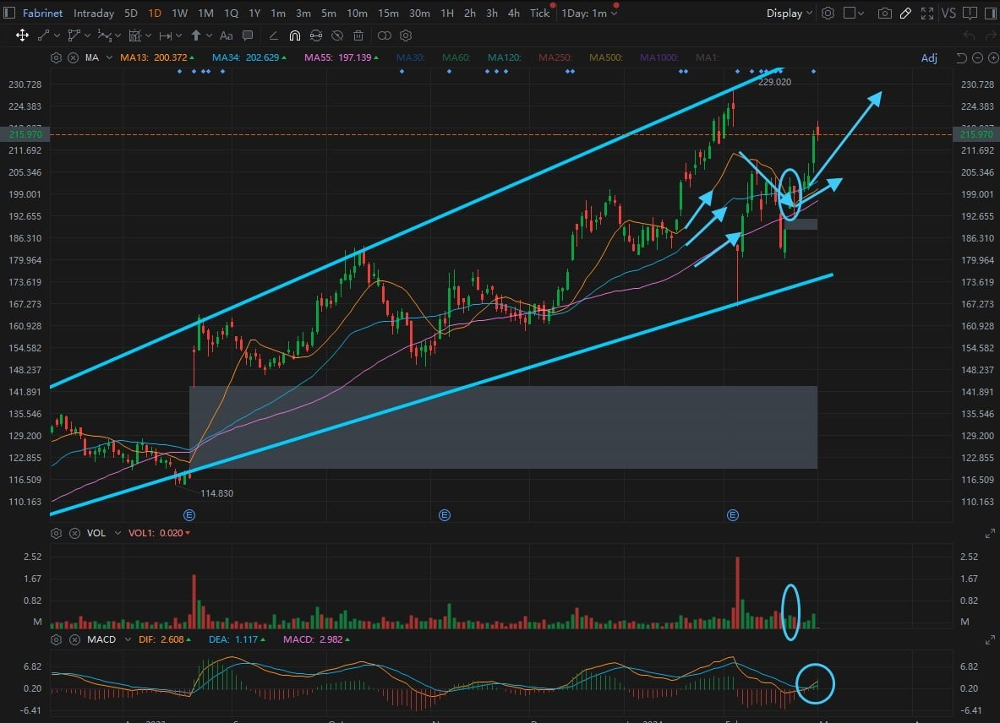

# Friday 20240301

## 07:53AM Evelyn Smith

### Good morning, dear friends☀

On this beautiful morning, I have some thrilling news to share with everyone. The world's largest asset management company, BlackRock, recently hosted a private event themed around Bitcoin. This not only signifies the growing interest of traditional institutions in Bitcoin but also symbolizes the expanding appeal of Bitcoin, rapidly moving beyond early adopters and blockchain technology elites to the general public. This is a significant shift in public opinion, indicating that Bitcoin may receive widespread participation from mainstream institutions in the future.

What's even more exciting is that BlackRock's quantitative analysts advocate for allocating up to 28% of Bitcoin in investment portfolios, which aligns perfectly with our beloved professor's advice to increase the proportion of cryptocurrency investments. This further proves that our investment strategy is heading in the right direction.

Now, more importantly, the 200% super trend this weekend is approaching fast, and we must hurry to get our funds ready today! Think about it, how much profit do you expect to make? This is an opportunity not to be missed, let's reach new heights of wealth together.

Later, Noah will continue to share his α&amp;β strategy with us and lead us in practical trading. Please stay tuned to group messages to ensure you don't miss any money-making opportunities. Let's look forward to a day filled with hope and gains! Good morning to all, may your day be filled with sunshine and success💰🌈.

## 08:37AM Noah Johnson

### Morning Review（α&amp;β Strategy）

Ladies and gentlemen, good morning! Noah Johnson here. Right now, I'm feeling an unprecedented surge of electricity— the tremble of future fortune. This Wednesday, our mentor not only unveiled the bull market bomb ignited by the convergence of macroeconomic tsunamis and the cryptocurrency halving cycle but also showed us that every minute of the next month and a half shines with the brilliance of diamonds; yesterday, he presented us with the map of this bull run, highlighting the golden opportunity before next Friday's release of the non-farm payroll data—one of the rare chances before the halving cycle.

At this moment, including the upcoming weekend, we stand at a new starting point, surpassing 200% in profits. I ask you, who would wants to miss out on this close-quarters battle that could completely change our investment careers?

Following our mentor's lead is the express lane to victory. Under his guidance, I bet the next month and a half (weekends included) before the halving cycle kicks in will be crazier and more spectacular than any carnival!

## 08:47AM

Folks, gather around, because today, I'm going to share a secret weapon that I've always considered my ace in the hand, an α&amp;β strategy application that completely changed my fate.Think about it, who's willing to share their most guarded secrets without holding anything back? I'll tell you, not many, and five years ago, I wouldn't have dreamed of doing this. But now, I'm ready to lay it all out.

Living at new heights has given me a fresh perspective. It's like being fortunate enough to stand atop a mountain, looking back on the climb, realizing that every step wasn't just for the breathtaking views but also to guide others in finding their way forward. That's where I stand today—true investing isn't just about padding one's own wallet but about enriching the entire community, sharing wisdom that can illuminate the journeys of millions. This is the enlightenment given to me by our mentor.

## 08:55AM

Today, I'm going to take you on a treasure hunt. Get ready to be amazed, because what I'm about to share is tailor-made for the cryptocurrency bull market, transcending traditional stocks, options, and crypto contracts—this is the α&β strategy applied to crypto options, refined by me over time. This isn't just a tip; it's a treasure, tested and proven, with a win rate of up to 98% under specific conditions!

Yes, it sounds almost too good to be true, but it is real. I don't just want you to see this; I want to lead you through an unforgettable feast. Today marks the beginning of this journey.

But first, let's take a look at today's stock portfolio to have a clearer understanding of the current strategy. After all, this is one of our main battlefields.

## 09:07AM

Alright, team, buckle up because we're sitting on a goldmine—Bitcoin leading the charge in global assets! The latest news? Money is flooding into tech stocks and Bitcoin spot ETFs like a tidal wave. Guess what? We're riding the crest of this wave, in prime position to make money.Cryptocurrencies are sweeping through Wall Street, with financial giants like Merrill **Lynch, Wells Fargo, and Morgan Stanley beginning to recommend their clients buy into cryptocurrencies. This has injected new vitality into the market. Hold tight to valuable stocks like $NVDA, $MSTR, $MARA, $FN, and keep holding. Folks, let's continue to look forward to our profits skyrocketing.

## 09:15AM

Today, I'll share a secret: why does $FN rise after we buy in? Do you remember the technical analysis chart when I recommended this stock? Let me reveal the secret—it's the same as the case we studied in yesterday's live contract trading tutorial, part of the 'α&β-Long Strategy-Class III Buy Point.' Do you recall the quantitative conditions?

* MA34/55 shows a bullish alignment.
* MA13 trends downward before starting to pivot upward around MA34.
* A medium to large bullish candle crosses above MA13 or stabilizes above it, accompanied by an increase in trading volume.
* MACD's DEA/DIF exhibits a bullish crossover.

That's the magic, and all this wisdom comes from our mentor's original philosophy on quantitative trading. With such strategies, we can not only predict market movements but also seize opportunities ahead of most investors, ensuring our profits while others are still hesitating.

## 09:24AM

Next up, today's most exciting topic. First, let's delve into this incredibly simple yet magical tool and investment vehicle - crypto options.
In investing, our primary concern is winning and not losing. Based on this, we consider factors like capital and returns, risk, time investment, complexity, and fun, among others.

Compared to headache-inducing stock spot trading, cryptocurrency spot trading, stock options, and crypto contract trading, crypto options are like a breath of fresh air. They're simple, straightforward, and, let's face it, they're actually fun.

First off, the simplicity of crypto options means you don't need to be a market guru to jump in. You don't have to worry about complex market analysis or minute price movements—just predict whether the price will go up or down. It's that simple.

## 09:39AM

Next, the barrier to entry is low. You don't need a ton of money to get started, making it possible for anyone to join the game, no matter how stacked your wallet is.

Then there's risk management. In crypto options, you know your maximum loss and potential return before making a trade. This transparency allows you to make decisions confidently and boldly.
It's particularly newbie-friendly. With specialized platforms (like ICHCOIN), you can easily start your trading journey without complicated sign-up or verification processes.

Last but definitely not least, there's the fun aspect. Crypto options are worth a shot if you're like me, always looking for simple yet engaging ways to invest. Join me, and let's find our place in this market full of possibilities!

## 09:54AM

Alright, let's make this as easy as a day at the beach. First up, open your app, and casually swipe to the ASSETS page like you're scrolling through your vacation photos. Now, lock your eyes on the CAPITAL ACCOUNT—that's where the magic of options trading happens, with real money, not the cash tucked away in your CONTRACT ACCOUNT.

If your CAPITAL ACCOUNT is looking a bit thin, like my fridge before grocery day, no biggie. Just slide some over from your *CONTRACT ACCOUNT. Think of it as packing your cooler before heading to the beach. Quick and simple, ensuring you're ready to soak up the sun and dive into the upcoming wave of opportunities.

## 10:10AM

After topping up your CAPITAL ACCOUNT, ease into STEP 2 like you're easing into a hammock. Open up the OPTIONS trading interface. Imagine it as a gateway to an adventure park, where every ride promises a thrill.
Next up, STEP 3, is like picking which roller coaster you want to ride. Today, we're going with the ETC/USDT 10M options trade. Think of it as choosing the wave you want to surf. You've surveyed the sea, picked the wave that looks like it'll give you the ride of your life, and now, you're ready to paddle out.

## 10:14AM

## 10:16AM

## 10:20AM

Navigating through the adventure park, you now arrive at STEP 4: making your judgment and choosing your direction. After careful analysis, I believe we'll see an uptick in the next 10 minutes. So, we hit BULLISH, confidently moving to the final transaction interface.

Now onto STEP 5, the final step, it's showtime: enter or select your investment amount. Since this is our first time with this trade, let's choose $300—both light and bold. Hit BUY NOW, and just like that, you're in the game.

While waiting for the settlement, you can watch how our bet unfolds in the WAITING FOR SETTLEMENT area. Don't forget, you can always review our trade story in MY SETTLEMENTS, hoping you'll look back on this moment with fondness.

## 10:25AM

Important Reminder:

ETC/USDT options 10M Bullish

ETC/USDT options 10M Bullish

ETC/USDT options 10M Bullish

## 10:37AM

Alright, team, let's get serious for a moment. Options trading, it's a high-risk, high-reward game, right? But how can we tilt the odds in our favor? After a decade of in-depth research, I've found the only way: by employing a strategy with an extremely high win rate. Imagine a strategy with a win rate of up to 98% under specific conditions. This is the precious gift I'm prepared to give back to the community and our respected mentor.

The strategy I'm sharing isn't just any strategy; it's the culmination of years of facing countless challenges. Here, I'll lead you on this insider journey, exploring the world of cryptocurrency, helping everyone navigate the path to financial freedom during the halving bull market. But I hope that each one of you is not just a follower but also a supporter and beneficiary of our mentor AI RP 4.0 institutional version.

In the days to come, I'll gradually unveil this strategy, ensuring you're prepared for the adventure that lies ahead.

## 11:18AM

Folks, still buzzing from that 86% profit we made last time? Adrenaline pumping? Feeling like you're just getting started? Well, you've got plenty of company. We can keep the conversation going, and if you're interested, I'm considering starting a private chat or a dedicated group—it'd make things easier for me and keep the good times rolling for all of us.
Now, let me sprinkle in some more excitement. First off, the strategy I mentioned isn't just any strategy; it's my secret sauce, the essence of my victories and triumphs in the crypto arena. It separates the real players from the spectators, the winners from... well, let's not talk about the losers. So, are you ready to dive deep and ride the waves with me? Shoot me a DM.

## 11:23AM

Folks, today and the coming weekend, we're embarking on an exhilarating journey. Our mentor has pinpointed a golden path to 200% profits, with Bitcoin and Ethereum primed and hinting at new opportunities on the horizon.

The strategy our mentor has crafted is wise and cautious: facing the upcoming weekend, we'll only be utilizing 10% of our investment positions. In this volatile market, such a decision is undoubtedly more prudent. Therefore, allocating your funds wisely, based on your profit targets, is key.

## 11:32AM

We know many of you are excited and eager to jump in but might be short on USDT. Don't let that be a barrier—a quick and direct solution is purchasing through C2C, and ICHCOIN's offline customer service can prioritize matching data for you, helping you prepare in advance. If you've already completed the transfer, don't hesitate to contact our mentor, so he can pave the way for you and devise a detailed plan asap.

Don't forget, there's also the mentor's class this afternoon. He might bring new plans, surprises, or insights on how to find new trading signals in this round of the profit plan and how to enlighten our investment wisdom. That's all from me today, folks!

## 02:35PM Linton Quatros

### Closing Commentary

Dear future investment leaders of the EIF Business School, may your afternoon be as bright and inspiring as the sunshine!

I want to express my deepest gratitude to Noah for his outstanding presentation this morning. He not only demystified the *world of options trading within the cryptocurrency market for us but also laid the groundwork for us to master this profitable skill.
Noah's achievements prove that students can indeed surpass their mentors. On his journey of quantitative trading under my guidance, Noah has refined and perfected his strategy to achieve an astonishing success rate of up to 98%.

This strategic capability has become his key to freedom, and I am incredibly proud to call him my student. I encourage all of you to see him as an example of what dedication and innovation can achieve.

Life always rewards those who do the right thing at the right time in wonderful ways. Aren't we standing at such a pivotal moment now? Let's seize this opportunity to write our own investment legends, agree?

## 02:51PM

Let's dive into the exhilarating performance of our portfolio this week. Witnessing such remarkable gains is not just thrilling; it cements our status as market leaders, far ahead of the average market performance.    Here's a quick rundown:

1. SPX showcased a steady climb with a +0.87% increase.

2. Our holdings painted a picture of exceptional gains:

    * $NVDA delivered a weekly gain of +3.8%, with a historical return soaring to +62%!
    * $MSTR astounded us with a weekly surge of +49.7%, and a monumental historical gain of +110%!
    * $MARA added to our joy with an +8.3% increase this week, accumulating a +55% historical gain.
    * The newly added $FN matched the rhythm with an +8.6% rise, both weekly and historically.
    * EIF Token broke records with a +38% weekly gain, pushing our historical earnings to an astounding +236%!

3. Strategic sales led to solid gains:

    Following Noah’s insightful call, we exited $CRSP and $TSLA at $87.1 and $203 respectively, capturing weekly gains of approximately +4% and +5%. Historically, these moves brought us +22% on $CRSP and +3% on $TSLA.

Congratulations, future masters of investment! Your achievements of the pass and this week have not just outpaced the market average—they've propelled us to climb on the king's throne of investment market. This continuous streak of surpassing expectations fuels our excitement and pride, and it should ignite a keen interest in the insights and strategies we will explore next. Let's keep this momentum, embracing our victories as we continue to lead and redefine what it means to excel in the market.

## 03:26PM

Market trends are driven by capital flows, and embracing diversified investments and optimizing our portfolio not only safeguards against potential risks and boosts investment efficiency but also maintains our joy and positions us for strategic decision-making. With the power of compounding, achieving financial freedom is only a matter of time.

The Ai4.0 system has provided us with foresighted guidance, becoming an unexpected delight in this internal sharing session. Originally, our internal testing was aimed solely at evaluating the Ai4.0 system's stability, to gather meaningful data for refining its overall performance before going public.

However, we've discovered that the machine learning capabilities of the Ai4.0 system far exceed human analytical speed. It has not only selected cryptocurrencies with higher certainty and greater profit opportunities for our testing battleground but, most importantly, after experiencing stable and superior returns, it has also led us to make the right decisions!

## 03:38PM

The current profit plan is the best testament to public insight and the power of collective intelligence. Responding to numerous requests, I formulated the "Lucky February 80% Profit Challenge Plan".

Initially, I had some concerns, but it turns out, my worries were completely unnecessary. This profit plan has exceeded my expectations in every aspect—thanks to everyone's A-class execution and the returns that surpassed expectations.

Therefore, it has become an unexpected highlight in our internal sharing sessions.

This achievement is not only our victory but also a celebration of the astute judgment and collective wisdom of all participants. Your participation and performance deserve the highest praise.

We are not just making profits; we are creating history. Let us be proud of this historic achievement in our internal sharing sessions, continually excited to break new records.

Together, we are not just participants in this journey; we are pioneers, opening a new chapter in the success story of EIF Business School！

## 03:53PM

On this fast track to prosperity, becoming the masters of our destiny is not just a choice but a necessity. Ignoring the clear opportunities before us is akin to betraying our own passion for life and the flame of our souls. As our forebears have said, diligence and relentless effort are the only ways to rebirth, and this culture of constant progress is deeply embedded in our DNA.

This weekend, we stand at a historic turning point, facing a significant opportunity brought by one of the most critical non-farm payroll data releases before the halving. This is the pivotal moment that will shape our future victories, inspiring us to significantly increase our earnings at the optimal time.

Moreover, I believe that leading everyone to exceed expected profits through Ai4.0 is the best way to nurture supporters for the institutional version.

Sometimes, it seems even goddess of fortune are smiling at us, signaling us to heed this call. Clearly, when we give our all, luck often favors the brave.
Now, as we persist in our relentless struggle, the market is offering us a valuable gift—a potent catalyst with the potential to change the rules of the game.

## 04:06PM

Ai4.0-Expert and Investment Advisory System latest alert: The SEC is reviewing a groundbreaking legislative proposal that would allow the listing and trading of options for Bitcoin ETFs, the Grayscale Bitcoin Trust (GBTC), and other trusts holding Bitcoin on the markets. The goal is to provide investors with more channels to access the Bitcoin market, meet their needs to use these products as hedging tools, and ensure trading rules are consistent with existing ETF options. The SEC will make a final decision within 45 to 90 days after the announcement.

The discussion of this proposal has already become a significant catalyst before the release of the non-farm payroll data, opening the door to a weekend of trading filled with passion and confidence.

Market trades often revolve around expectations, and the period before these expectations materialize is usually the best time to capture investment opportunities！

As the market gradually digests this potential change, we have every reason to remain positive and look forward to the enticing opportunities this weekend may bring.

## 04:14PM

I've been closely monitoring the Ai4.0 system's data, and everyone should be ready.

I will continue to lead us in "challenging" our unique Lucky February profit target!

Based on our previous discussions and assessment of weekend opportunities, to not miss out on this chance, we will aim for a higher target: a profit goal of 200% this weekend! Are you ready to join this challenge?

This time, we plan to trade using only 10% of our position. This is not only a significant profit opportunity but also a valuable learning experience.
How to achieve substantial profits with a smaller position size? I will employ more capital management techniques and combine short to medium-term strategies. The larger the capital, the greater our operational flexibility, allowing us to achieve excess returns faster and more stably.

For those friends who are nearly prepared, please contact me directly. Let's quickly get into the right state.

## 04:17PM

### Important Notice

Friends, please be aware, I have just shared the ninth trading signal of this profit plan in the Telegram trading signal sharing group (Lucky Feb 80% Profit Plan). Please make sure to check and strictly execute it.

## 04:19PM

### Trading order

🔰🔰🔰🔰🔰🔰🔰🔰\
When engaging in contract trading, please clearly identify the contract name, leverage ratio, order type, direction, and the number of contracts to avoid unnecessary losses. The trading signal is as follows:

▬▬▬▬▬▬▬▬▬▬▬▬▬▬▬▬\
📌Contract: ICH/USDT

🚀Leverage: 100X

🔥Order Type: Market Order

💵Number of Contracts: 100 sheets

📊Direction:  Sell/Short\
▬▬▬▬▬▬▬▬▬▬▬▬▬▬▬▬\
🔰🔰🔰🔰🔰🔰🔰🔰

-After closing the trade, please send the process of your order (e.g. screenshots) to the WhatsApp group for verification.

## 04:37PM

### Important Reminder

Now click on **One-click reverse**

Now click on **One-click reverse**

Now click on **One-click reverse**

Click the second button below the order **One-click reverse**

## 05:11PM

In the world of investing, the search for lights of certainty is always exhilarating. Thanks to the Ai4.0 system, its machine learning capabilities have allowed us to navigate the complex markets with ease, surpassing all our expectations.

Warmest congratulations to the future investment leaders who participated in the "Lucky February 80% Profit Challenge Plan." Through nine trades, we have achieved a cumulative return rate of 530% and an approximate total asset return rate of 120%!

We not only achieved our profit target ahead of schedule but also continued to pursue higher returns, reflecting our spirit of seizing opportunities and striving for higher peaks!

## 05:31PM

Now, let's adopt a more prudent strategy: invest half of the profits from this contract trade into a 7 day or 30 day fixed-income product.
This is not only a protection of profits but also the construction of a solid fortress for our financial security. This is not just advice but a comprehensive strategy and trading signal!
Our journey is full of challenges, but it is these challenges that shape us. Let's look forward to more opportunities and continue to move forward under the guidance of Ai4.0.

## 05:41PM

### Achievements, Goals, and Planning

Given the outstanding stability demonstrated by the Ai4.0 system in two internal test plans and the current profit plan, are you satisfied with your current earnings?

The profit goal of the "Lucky February 80% Profit Challenge Plan" has been far exceeded, reaching 120%. With the upcoming "halving" bull market and the significant opportunity presented by next week's most critical economic data—the non-farm payroll data, What total asset return rate are you aiming to achieve in next week's challenge? How do you hope we and the Ai4.0 system assist you?

Challenges propel us to rapid growth!\
Challenges make opportunities ubiquitous!\
Challenges are the secret to staying youthful and vigorous!\
Send your answers to me in a private message, and let's 'challenge' for our dreams together!

Have a pleasant day!
