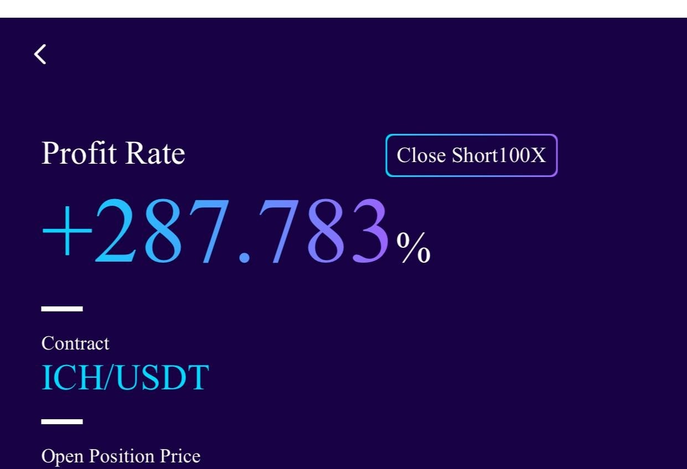

# Saturday 20240302

## 05:56PM Evelyn Smith

### Dear students

The trading instructions are expected to be released around 7:00 PM Eastern Time! Please make sure to stay tuned and be prepared to seize this once in a lifetime investment opportunity.

## 06:22PM Linton Quadros

### Important Reminder

I am currently monitoring the data from Ai4.0 and will soon release a trading signal, please be prepared.\
I am currently monitoring the data from Ai4.0 and will soon release a trading signal, please be prepared.

## 06:28PM

### Important Information

When conducting contract trades, please clearly identify the contract name, leverage ratio, order type, direction, and contract quantity to avoid unnecessary losses. The trading signal is as follows.

Contract: ICH/USDT\
Leverage: 100X\
Order Type: Market Order\
Position: 5%\
Direction: Sell/Short

After completing this trade, please send your order process (e.g., screenshots) to the WhatsApp group for verification.

## 06:50PM

### Important Information

to your position according to the the last trade instruction.\
That means using the same contract name, leverage, order type, direction, and quantity.\
Please strictly execute the trading signal.

> **NOTE**: I know that this message isn't clear, but that is how it was posted. I've asked for clarification.
>
## 07:04PM

### Important Information

This trade has reached our profit target, please close the position at the current price!\
This trade has reached our profit target, please close the position at the current price!

## 07:15PM

## 07:41PM

Congratulations to every partner who joined us on time for our 200% profit journey! This weekend, we did not just earn profits; we achieved a significant victory. Today's trade surprisingly locked in over 200% returns, pushing our 'Lucky February 80% Profit Challenge Plan' cumulative return rate over 730%, with a total asset return rate of about 140%.

We skillfully combined short-term and mid-term strategies, starting from a base position confirmed by short-term signals, and increased our position as the mid-term trend became clearer. This ensured that the trade was not only profitable but also an easy process. This strategy not only grew our wealth but also made the entire process enjoyable.

This success proves the brilliance of the Ai4.0 strategy and the precision of our team's execution. The stability and returns we experienced set new standards for our future challenges.

## 07:52PM

Why not pursue higher returns with a larger position size? This question leads us to ponder and summarize the art of capital management, risk control, and the timing of trading cycles.

The future of trends is always unknown; a buying or selling point on a 1-minute chart may evolve into a major rally or could just be a fleeting wave.

Today's strategy brings to light three points worth noting:

1. For those who didn't manage the operation well, do you know what problems you encountered? If you haven't found the answer, please message me privately.

2. The core of today's strategy lies not only in participation itself; more importantly, when better opportunities arise, how we can use our positions safely and reasonably. Ai4.0 provides us with clear guidance.

3. When the final results are before us, facing the same 10% position size and 200% return rate, the size of your principal determines your final profit.

## 08:03PM

The logic here is strikingly straightforward: on one hand, we meticulously manage risks; on the other, we ambitiously chase profits.
Under the umbrella of securing stable gains, facing identical trends and opportunities, the secret to balancing risk and reward lies in tailoring our trade size to our capital volume.*

Smaller funds often engage in the quicker tempo of short-term charts, while larger capitals have the bandwidth to embrace the broader fluctuations of longer-term cycles
The volatility and potential returns of these different approaches diverge significantly under the same risk management strategy. Can you grasp the essence of this strategy?

This, my friends, is the bedrock truth of the investment world: your initial capital shapes your potential returns, while your vision and capabilities carve out your achievements and stature within the market.
Let this insight inspire you, fueling your journey with wisdom and courage as we navigate the vast seas of opportunity together.

## 08:59PM

In the face of this strong bull market wave and the significant profit opportunities revealed by recent non-farm payroll data, I am constantly thinking about how to lead our students towards their dreams, cultivate more enthusiastic supporters for the Ai4.0 system, and offer the best help to every potential supporter.
Your insights and suggestions are crucial to us; please feel free to share your wisdom with me via private message.

Reflecting on the question I posed yesterday, every heartfelt response I received has deeply moved and inspired me. Clearly, the essence of a fulfilling life is the courage to challenge and the pursuit of excellence.
Given the extraordinary opportunity presented by the recent non-farm payroll data, what grand goals should we pursue next?

Let's embark on a journey of self-discovery, guided by our deepest desires. I invite you to share your decisions or thoughts with me.
Together, let's envision a future filled with bold 'challenges,' drawing strength from each other's ambitions. May this day be filled with the hope of new beginnings and the excitement of pursuing extraordinary!
