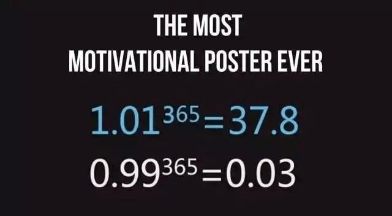

# Sunday 20240303

## 12:35PM Linton Quadros

### Dear Aspiring Titans of Investment at EIF Business School, Greetings on this fine weekend

I'm reaching out with the hope that this letter serves as a watershed moment in our collective journey toward mastering the art of investment, and perhaps, charting a course through the vast ocean of business at large.
After poring over an array of data – from your grasp of the market's pulse, evaluation of our recent strides in learning, to the dynamism shown in the 'Lucky February 80% Profit Challenge Plan', and including reflections on investment strategies and areas ripe for refinement – I've gleaned insights that are nothing short of inspirational.
Your fervor for learning, the milestones achieved thus far, and an unwavering dedication to investing have deeply impressed me.  While there's always room at the top for improvement, the collective performance I've witnessed has not only met but surpassed my expectations, planting the seeds for what could very well be a historic breakthrough.
This letter aims to further inspire everyone to challenge their dreams and life at a higher level, encouraging each of us to look more deeply at the possibilities laid out before us. Let us embark on this journey with renewed passion, ready to overcome challenges and seize the opportunities that await us.

## 12:38PM

In response to your invaluable feedback and inspired ideas, I'm thrilled to announce the launch of an exhilarating venture: the ‘Ai4.0 - Crypto Carnival - (200-500%) Profit Challenge Plan’. This initiative is a bold foray into the heart of the cryptocurrency boom, a strategic move to leverage the halving cycle's euphoria and the unique opportunities ushered in by the non-farm payroll data.
Spanning a decisive 10-day period, this plan is meticulously crafted to tailor profit targets ranging from 200-500% to each participant's specific scenario, embodying a personalized approach to triumph.

But this ‘challenge’ is more than a mere money-making endeavor; it's a testament to the incredible opportunities laid before us by the current cryptocurrency bull market. It underscores the bright future and historical duty bestowed upon our Ai4.0 system and EIF Business School by these transformative times.
Embark on this journey with us, where anticipation meets opportunity, and where every day is a step closer to realizing your financial dreams.   Let's dive into this ‘Crypto Carnival,’ embracing the spirited dance of the markets, guided by the innovative prowess of Ai4.0. Together, we stand on the brink of history, ready to seize the moment and carve our legacy in the annals of investment success.

## 12:44PM

In the heart of an unprecedented investment era, it's crucial we align our philosophy for the journey ahead. Here's a distilled essence of my thoughts:

1. The Art of Seizing Opportunities

    We are in the golden age of cryptocurrency, amplified by the halving mechanism and poised at the peak of profitable cycles. The upcoming non-farm payroll data promises to stir significant market volatility, offering a rare chance that's magnified in the context of the halving cycle.\
    This moment is unprecedented.

    Whether it's the impressive returns from our stock portfolio or the extraordinary profits from the cryptocurrency market, the evidence is clear: now is the prime time for cryptocurrency-related opportunities.
    For investors, failing to seize and challenge the present market opportunities is akin to squandering the essence of life itself.
    This sentiment echoes the collective desire and call to action among us all.

2. Reflecting on Data to Boost Confidence

    Let's take a moment to reflect on our extraordinary journey in the cryptocurrency market. Our initial two test projects yielded astonishing total asset return rates of 97% and 62%, respectively, proving our collective strength. Inspired by your enthusiasm, we embarked on the "Lucky February 80% Profit Challenge Plan," which further elevated our success to an amazing 140% return rate.

    Throughout these challenges, Ai4.0 became an absolutely reliable guide, providing 23 successful trade signals without a single failure. This record not only showcases the vast amount of lucrative opportunities within the cryptocurrency market; it represents a deep dive into strategic diversification of investments that garnered rich rewards. More importantly, it highlights our skilled market navigation under the guidance of Ai4.0, injecting new confidence into all of us.

    As we embrace these data, let them reignite your faith in our shared vision and strategy. May the memories of our past successes be the wind beneath your wings, propelling us together to greater heights.

3. This opportunity belongs not only to all of us but also to Ai4.0.

    On one hand, it serves as a real-world test of its practical guidance capabilities, which is why your support is crucial. On the other hand, seizing this chance aligns perfectly with our core teaching philosophy: putting 'Students' interests first' and embracing 'Practice as the best teaching method.'  It's about offering genuine help to our peers.

    Moreover, I'm keen on nurturing a robust supporter base for Ai4.0 post-launch, with subscription plans priced at $50,000/year for individuals and $1,000,000/year for institutions.  My aspiration for each of you is to leverage the diversified investment opportunities presented by this cryptocurrency bull market to earn profits well beyond the cost of both the individual and institutional subscriptions, especially the latter.

    This isn't just about investment returns;  it's about contributing to something greater.  By participating, you're not only helping yourselves but also supporting me and the Ai4.0 system.

4.Cultivating Talent: Our Shared Vision

    In the dynamic world of investment where practical experience reigns supreme, and the market serves as the ultimate lesson, our internal sessions have consistently spotlighted talents of Noah's caliber. As we stride into an era of rapid technological and financial evolution, and in anticipation of EIF Business School's collaboration with ICHCOIN Trading Center on a dedicated cryptocurrency fund, the cultivation of exceptional talent becomes not just a necessity but our collective mission.

    The imminent launch of the Ai4.0 Investment Advisory System marks a pivotal moment in our journey, laying the foundation of our competitive edge in the bustling fintech landscape. Yet, this is merely the beginning. Our vision extends beyond the immediate horizon, with ambitious plans for fund initiatives and talent development poised to define EIF Business School's legacy. I harbor the audacious dream of seeing EIF listed among the luminaries on Nasdaq, a goal I believe we are destined to achieve once we've solidified our groundwork in talent cultivation and technological innovation.

## 01:01PM

This isn't just my dream—it's a vision we share, a future we're building together. Among you, I see a wellspring of potential, a cadre of individuals whose brilliance and drive mirror the very essence of EIF's aspirations. Your journey here isn't just about personal growth;  it's about contributing to something far greater. By aligning with this vision, you're not merely pursuing success;  you're actively participating in the realization of a dream that extends well beyond the confines of our classrooms and trading floors.

Let's embark on this journey together, with voices raised and spirits high, to transform our shared aspirations into tangible realities. Your role in this venture is pivotal—not just as students or participants but as foundational pillars of a future where EIF shines as a beacon of innovation and excellence on the global stage.

## 01:04PM

As we reflect on our journey this week and during the previous tests, it's evident we've made strides, yet our aspirations reach far beyond.
The quest for excellence never ceases. How can we elevate our success from this week's profit plan?
The insights I've gathered - setting achievable goals, enhancing our execution, and catering to personalized needs - shine a light on the path forward, derived from both deep reflection and perhaps a touch of divine guidance.

1. Achievable Goals

    This week's triumph, a 140% total asset return rate, hints at the untapped potential awaiting us.
    The upcoming non-farm payroll data promises even richer opportunities, laying the groundwork for our ambition. It's a fundamental belief that a 200% return rate is within our grasp. Market transactions orbit around anticipations, with the zenith of investment opportunities emerging just before these anticipations come to fruition.

    Given the window of ten days (or possibly more) to capitalize on the market fluctuations triggered by the non-farm payroll data release, why not set our sights higher, say, on a 500% return?
    Thus, a target range of 200-500% stands not just as optimistic but wholly realistic. The question now turns to you: How much profit are you truly aiming for?

    This is our moment, a golden opportunity knocking at our door. The data doesn't lie—it's a beacon signaling a sea of potential waiting to be explored.

    

2. The Essence of Execution

    As we journeyed through the 'Lucky February 80% Profit Challenge Plan' this week, it brought our shared aspirations to the forefront. Yet, in the midst of our collective endeavor, it became clear that execution is where the true challenge lies for a select few. This observation isn't just a call for personal improvement but a reflection on our collective commitment to our community's standing and success.

    Let me share a simple truth with you: the power of compound interest is unparalleled, a concept so profound that Einstein regarded it as the world's eighth wonder. He remarked, "Compound interest is the eighth wonder of the world. He who understands it, earns it ...  he who doesn't ...  pays it."  
    This principle is not merely a key to our current profit plan; it's a gateway to transforming our investment journey.

    Understanding and leveraging compound interest means that with steady and thoughtful steps, surpassing expectations becomes not just a possibility but a reality.
    So, let's approach each action with the quiet confidence that by doing so, we're on our path to not just meet but exceed our profit targets.
    This isn't about grand gestures but about the consistent, mindful efforts that, indeed, make all the difference. Do you feel it too?
    That conviction, yes, with sincere execution, achieving our profit goals is within reach.

## 01:24PM

To better serve everyone and maximize the utilization of each person's capital under the principle of 'minimizing risk and maximizing profits,' I've introduced personalized plans.
The essence of these plans lies in creating tiered VIP groups based on account balances, where trading signals, frequency, and expected returns vary.

This tailored approach ensures that:

- VIP 1 Group\
    Funds: $50,000 to $300,000\
    Contract Trading Chart Period: 1-15 minutes\
    Number of Daily Trading Signals: 1-2 times (including options)\
    Total Asset Return Target: 200-300%

- VIP 2 Group\
    Funds: $300,000 to $1.5 million\
    Contract Trading Chart Period: 1-60 minutes\
    Number of Daily Trading Signals: 1-3 times (including options)\
    Total Asset Return Target: 300-400%

- VIP 3 Group\
    Funds: $1.5 million to $10 million\
    Contract Trading Chart Period: 5 minutes to 1 week\
    Number of Daily Trading Signals: 1-4 times (including options)\
    Total Asset Return Target: 400-500%

## 01:27PM

Dear future investment masters of EIF Business School, our pursuit is not only the growth of wealth but more importantly, giving back to society through our success, achieving win-win situations, and continually striving for innovation and excellence. We adhere to meeting everyone's personalized needs while not forgetting the significant mission of sustainable development.

Therefore, I propose that once we successfully achieve our profit targets for this plan, we start creating the ‘EIF-Community Fund’. We will allocate 10% of the profits to shoulder this noble responsibility together. This fund will be used for:

1. 30% to reward the hardworking group leaders, recognizing their contributions and leadership.
2. 40% to invest in nurturing potential trading prodigies, injecting fresh blood into our future community fund.
3. 10% to support charitable projects we collectively care about, reflecting our social responsibility.
4. 20% for future group gathering expenses, such as celebrating Ai4.0 going live, to strengthen our team cohesion.

I believe that through the ‘EIF-Community Fund’, we will not only witness the growth of wealth but also contribute more to society and together write our legend.
I hope every friend can support this proposal, making our team not only creators of wealth but also promoters of social progress!

## 01:30PM

While the perfect plan does not exist, we have found the key to efficiently utilizing funds, meeting personalized needs, and ensuring sustainable development. Now, let's discuss how to balance risk while pursuing returns.

Firstly, I want to propose a game-changing suggestion that could drastically affect our outcomes: reallocating our capital to be evenly invested in both the stock market and the cryptocurrency market.

Traditionally, our journey has been anchored in the stock market, where we champion the bullish spirit of our national stocks and disdain for bears.
However, the unfolding bull market in cryptocurrencies presents a landscape far beyond what we're accustomed to, brimming with potential. Imagine entering a realm where contract trading, spot trading, high-yield investments, and options are just the tip of the iceberg.
As your guide, I promise to unveil the mysteries of wealth awaiting those whose earnings ascend to new heights, once your returns reach a certain level.

This move is not just about seeking higher returns but also about staying current and seizing the opportunities the era presents to us. Don't wait to regret missing out on opportunities after they've passed; now is the best time to act!

## 01:33PM

Secondly, I refer to it as the 'Wealth Matrix'.

In our journey to seek returns, we must never lose sight of the balance with risk. Thus, it's not just a strategy but a wisdom distilled from deep reflection, aimed at achieving our wealth growth through rational planning while constructing a safe fortress for us.

The core idea of the 'Wealth Matrix' is simple yet powerful: whenever we make a profit through contract or options trading, we invest half of those profits into financial products, giving priority to those with a 30-day term.
These products not only offer the most optimal returns but also provide a solid safeguard for our investments. Such a strategy allows us to enjoy the rapid benefits brought by investments while also accumulating long-term stable returns.

In our investment portfolio, whether it's the stock market's hot stocks in cryptocurrencies and AI stocks, or the cryptocurrency market's spot trading, contract trading, fixed high-yield financial products, and options, all are carefully selected. This wealth matrix is designed to bring us above-expected returns.

## 01:38PM

Finally, promises and rewards.

- If you strictly follow our trading signals and still incur losses, I will take full responsibility. This is not just a promise; it has been my principle for the past 14 years.

- However, for those who fail to strictly execute our plan, I will not take responsibility.

- For the top 5 performers in this profit plan, I will reward them with a year of free access to the Ai4.0 institutional version.

- For those ranked 5th to 20th, I will provide a year of free access to the personal version.

- Moreover, all friends in various VIP groups who meet the profit criteria will have the opportunity to join the Ai4.0 presale group in advance and be among the first to experience the beta version of the Ai4.0 system.

## 01:43PM

Dear future investment masters of the EIF Business School, as we embark on this passionate journey of wealth growth together, I hope that by tomorrow morning, each and every one of you will be fully prepared and spirited to welcome the potential turning points and new wealth competitions in your life.

Please make sure to pay close attention to tomorrow's early morning session—an unprecedented profit plan launch ceremony. I will personally lead you to deeply grasp practical opportunities, sharing more profound, practical tips, and unique investment philosophies.
The time to wait is over; now is the time to act!

If you're eager to join this feast immediately, if you want to be fully prepared in advance, then please send me a private message right away.
Let's plan and prepare together, ensuring you're in the best shape to meet the challenges and share in the future's splendid achievements!

Best regards,\
Linton Quadros

