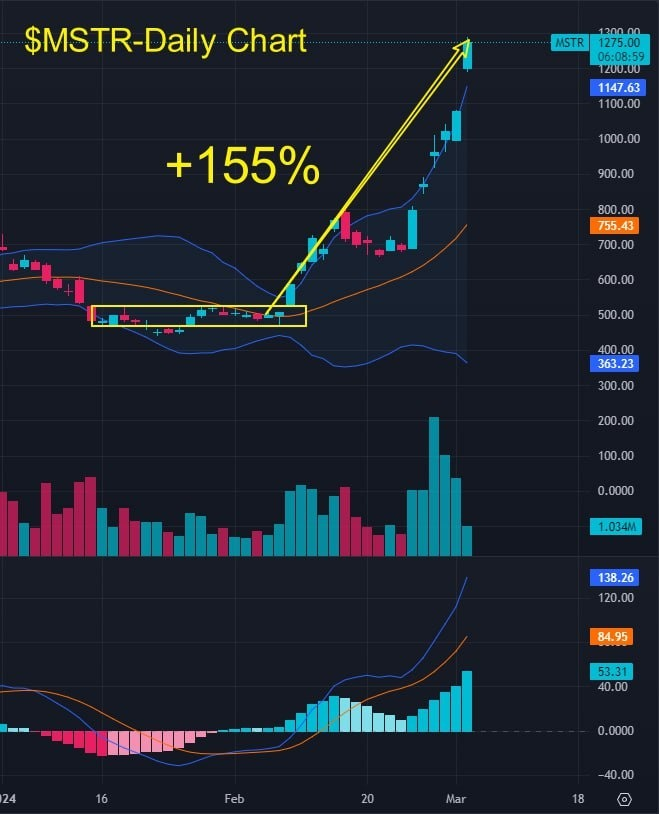
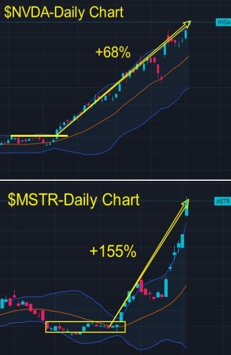
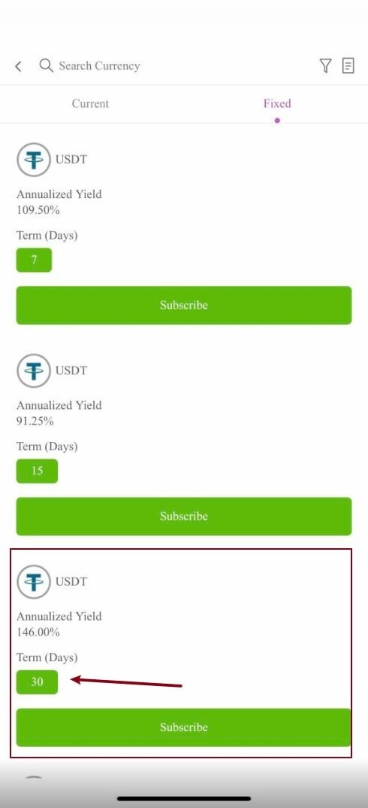
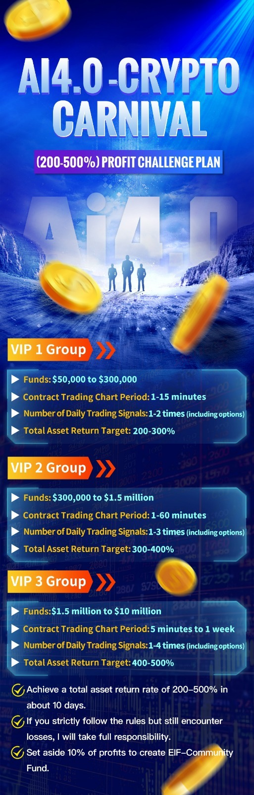
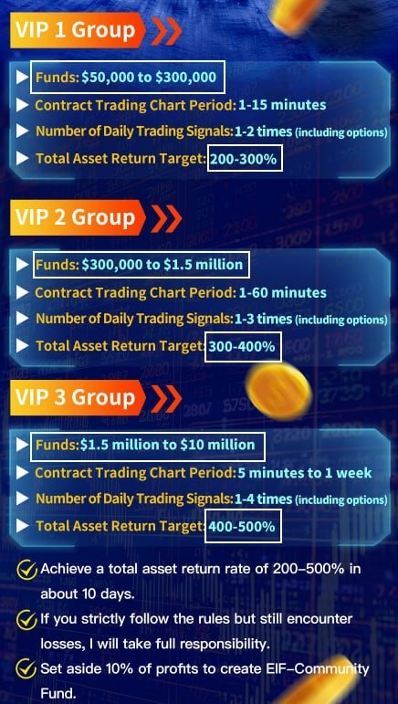
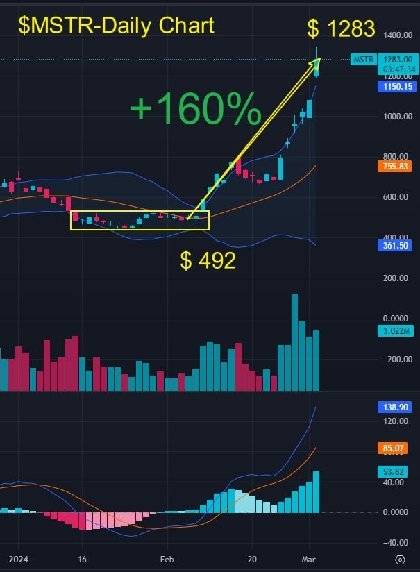
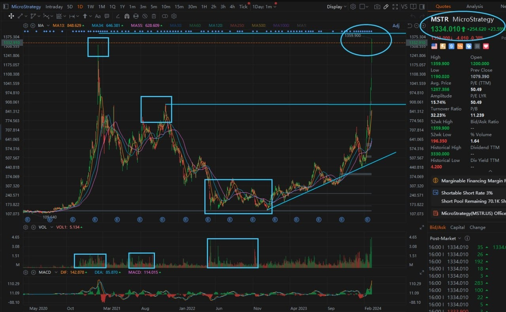
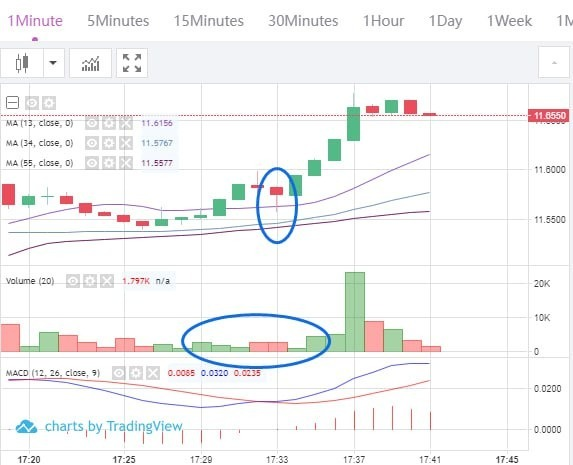
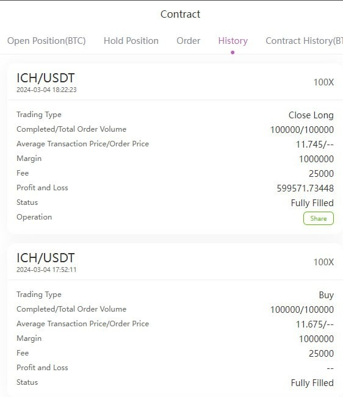

# Monday 20240304

## 07:44AM Evelyn Smith

### Dear EIF Business School family, good morning

I hope everyone is energized and ready to embrace a new day. Last night, Bitcoin (BTC) saw a significant rise, reaching a new high for this wave. This not only demonstrates the strong momentum of the cryptocurrency market but also fills us with anticipation for the performance of our holdings in MSTR and MARA today, believing they will make us proud as well.

Furthermore, the "Lucky February Profit Plan" has already exceeded our set goals. To continue this victorious momentum, the professor has launched a new profit plan, "Crypto Carnival," and has formed three new groups to focus on this plan. This is a new beginning, and the professor believes that with our effort and wisdom, we can achieve great success in this plan as well.

Please prepare your funds according to your profit expectations, and once ready, contact me or the professor to join the "Crypto Carnival" VIP trading group. Let's join hands and achieve greater heights in the "Crypto Carnival."

I wish everyone a wonderful day. Let's move towards new challenges and opportunities with confidence, carrying the good news of Bitcoin's rise last night. Good morning!

## 08:27 Linton Quadros

### Morning Review

Dear investment titans of the EIF Business School, good morning!

Did everyone see the letter I wrote yesterday in response to your calls, detailing the Ai4.0 - Crypto Carnival - (200-500%) Profit Challenge Plan? It includes the following key points:

1. Goal Setting: The plan aims to leverage the market volatility brought about by the cryptocurrency halving cycle and non-farm payroll data, setting a profit target of 200% to 500% for participants.

2. Personalized Plans: Tailor-made investment strategies according to the participant's capital amount, risk preference, and expected goals, ensuring everyone can find an investment path that suits them.

3. Emphasis on Execution: Highlighting the importance of following the plan. For participants who strictly adhere to the trading signals and incur losses, the person in charge of the plan will take full responsibility.

4. Reward Mechanism: Providing rewards for outstanding participants, including the opportunity to use the Ai4.0 system for free and the qualification to join the presale group to experience the beta system.

5. Creation of Community Fund: Upon the success of the plan, a portion of the profits will be used to create the “EIF-Community Fund” to support community development, including rewarding group leaders, nurturing new trading talents, charitable causes, and organizing gatherings.

6. Risk Management: Through the “Wealth Matrix” strategy, balancing the pursuit of high returns with risk by recommending a portion of the profits be invested in fixed income products to build a safety net.

7. Participation Initiative: Encourages everyone to actively participate, reallocating funds to invest in both the stock market and the cryptocurrency market, seizing the unique opportunities provided by the current cryptocurrency market (halving and non-farm payroll data).

In short, this plan aims to create unprecedented profit opportunities for participants by combining market opportunities, advanced technology (Ai4.0), and community strength, while promoting the joint development of individuals and the community!

## 08:59AM

Friends, goals are not set lightly, and even the best opportunities require our joint effort. This is a new beginning, and we will face new challenges! Let us pursue excellence together with a mindset of unity and winning, assisted by the power of innovation!

At this moment, I feel very fortunate to chase dreams with a group of talented, determined, passionate, and capable individuals. There's no greater happiness in life than this!

Many friends have already messaged me privately to discuss personalized plans, and many are getting ready in succession.
Today, I want to share three important topics with you:

1. A new round of opportunities has emerged, with two important trading plans and goals for this week.
2. How to safely increase profits?
3. I hope this profit plan can open a new chapter in wealth.
Please read carefully, as today's content involves many practical, actionable plans.

## 09:12AM

The latest news from Ai4.0-Expert and Investment Advisory System indicates that Morgan Stanley is interested in issuing a BTC spot ETF; the SEC will make a decision on Fidelity's Ethereum spot ETF application this Tuesday.

Undoubtedly, these are two events that enhance the bullish market expectations for cryptocurrencies. On Friday, I mentioned: Market trading often revolves around expectations, and before these expectations become reality, it is usually the best moment to capture investment opportunities.

Time is precious, so let me give a brief interpretation of these two events:
First, Morgan Stanley manages $1.3 trillion in assets. This move can be interpreted as bringing significant incremental expectations to the cryptocurrency market, leading to a sharp upward breakthrough of Bitcoin to $65,000.

Our core holding stock $MSTR surged again by about +18%, reaching around $1,270, just a step away from our 160% target ($1,400).
Congratulations to those holding positions for expanding your profits again, please continue to hold firmly.

## 09:21AM

Tomorrow, the SEC will make a decision on Fidelity's Ethereum spot ETF application, marking a crucial moment. Regardless of the outcome, it presents an excellent profit opportunity for us.

If the SEC decides to delay its decision, this is not necessarily bad news; instead, it's a signal for us to continue exploring potential. Ethereum's price will rise with new expectations. As we know, the formation period of expectations is often the best time to capture investment opportunities.

Conversely, if the SEC approves the ETF, Ethereum will undoubtedly undergo a revaluation and experience a surge in price. This short-term significant rise will surpass Bitcoin, bringing substantial returns to our portfolio. Of course, this might be followed by a short-term pullback, but it's precisely the moment for us to demonstrate our investment wisdom and strategy.

In either case, as investors, we should remain highly vigilant and prepared at this moment, ready to seize the upcoming opportunity. Before the non-farm payroll report, such chances are rare.

## 09:33AM

So, friends, this week, we stand at a crossroads filled with opportunities. I will personally lead the way, ensuring that we not only meet but exceed our 200-500% profit target, while also enabling every participant to learn valuable practical skills in the process.

1. This Week's Trading Plan

    1. Daily Trading Plan

        We will conduct at least 1-2 trading sessions daily, encompassing both the stock market and cryptocurrency contract and options trading. Through a series of carefully planned and robust operations, we will steadily progress towards our profit goals.

    2. Two Key Trading Moments This Week

        - Tuesday SEC Decision Day: The SEC's decision on Fidelity's Ethereum spot ETF will trigger a significant market reaction.
        I have prepared a trading plan with a potential profit of over 300%, aiming to seize this unmissable opportunity.

        - Friday Non-Farm Payroll Release: This presents a golden opportunity for us to achieve over 500% profit on a single trade.
        I will share a detailed trading strategy to ensure we can fully capitalize on this market dynamic.

        

2. How to Safely Increase Profits?

    1. Establishing a Wealth Matrix

        To gain a strategic advantage in the volatile market, establishing a wealth matrix is crucial. This matrix is meticulously planned, including a selection of investments from the stock market to the cryptocurrency market—covering AI and cryptocurrency-related stocks, spot trading, contracts, high-yield financial products, and *options—aimed at delivering returns beyond expectations.
        These are key strategies for increasing profits!

    2. Maintaining an Advantage Through Leaders

        1. Our portfolio performed exceptionally well today, especially our core holdings in the AI and cryptocurrency sectors, such as $NVDA and $MSTR, which saw significant increases of approximately +68% and +155%, respectively!\
        These core holdings have propelled our returns beyond 98% of investors. We remain firm in holding these stocks and recommend selling other underperforming ones.

            If the returns on your other holdings are less than half of our core positions, I advise you to sell them immediately and then message me privately. I will help you optimize your portfolio for better profit chasing.

            

        2. Implementing a Risk-Balanced Strategy is Essential, Utilizing High-Yield Financial Products

            ICHCOIN's financial products offer a golden opportunity for capital appreciation without the need for hard labor, providing stable returns.
            Through diverse profit models such as lending, trading, and mining, ICHCOIN is willing to share success with investors while ensuring high returns, reflecting its strategic wisdom during rapid expansion phases.
            Investing in these financial products is not just an opportunity for financial growth but an art of enjoying the dividends of the cryptocurrency market's development.

            After completing the preparations for the profit plan, immediately invest 20% of the total assets into a 30-day product.
            After each contract or option trade's profit, reinvest 50% of the profits back into these financial products.

            This practice is not just a suggestion but a key strategy of our investment philosophy and method. After purchasing, please share a screenshot for verification.
            This will enable me to guide everyone more confidently in pursuing profits. Do you all understand?

            

        3. Practical Implementation Plan

            After establishing the Wealth Matrix, I am ready to lead us all to confidently sail through the winds and waves! This week's learning is not limited to the basic courses of Ai4.0. Although the basic courses are extensive, the knowledge we currently possess is sufficient to handle 90% of the market opportunities. The key lies in how we flexibly apply it.

            Starting this week, I will guide everyone through practical learning to explore the deeper secrets of profitability, including:
            - How to utilize large capital for more precise trading operations.
            - Two methods to safely increase profits: increasing the frequency of short-term trades and combining mid-short term trading styles.

            Why do each of the personalized VIP groups have different trading frequencies and profit capabilities? This reflects not only the different capital accounts' adaptability to trading cycles but also involves deep skills in risk control and profit growth, all of which will be shared in our practical operations.

            Therefore, this week is not only a week of rapid profit growth but also a valuable opportunity to learn key investment knowledge. Please arrange your time reasonably and join us in our rapid progress forward!

## 10:42AM

Fellow students, future investment pioneers, supporters of Ai4.0. At this moment, with the market's fluctuations and the rapid growth of profits, I can feel the fiery passion in your hearts. This excitement and joy are the best rewards for our decisions and beliefs.

Now, we are at a significant historical moment, welcoming this once-in-four-years opportunity, starting our super-profit journey.
Do you, like me, feel this unstoppable enthusiasm?
I want to tell you, this profit plan is the gate towards our collective financial freedom, the beginning of changing our destinies！

Look at our current achievements, the moment that completely transforms our fate is within reach. We are like traveling in a starship, heading into the unknown, and the next stop might just be Mars. This is not only a pursuit of wealth but also an exploration and embrace of the future.

Therefore, I firmly believe, 'Ai4.0 - Crypto Carnival - (200-500%) Profit Challenge Plan', is not just a goal, but the starting point of our new journey.
At this moment, I am filled with passion and emotion, because our common dreams and beliefs are inspiring us to move forward!

## 11:02AM

Fellow students, future investment leaders, explorers of Ai4.0! Now, a clear blueprint pursuing profits but also pursuing a whole new way of life, a future that elevates the quality of life for each of us.

### VIP 1: A comprehensive upgrade in the quality of life

Imagine everyone being able to switch to the car of their dreams, wearing their favorite brand clothing without hesitation over the price.
Every travel destination we dream of no longer remains just a dream.
Social activities become a part of our lives, not a burden.
Everyone will become an owner of the Ai4.0 institutional version, making our investments more robust, with a considerable and stable income every year.

Our starting point may be ordinary, but our future will be anything but. Our goal is to provide our children with the highest quality education, associating them with future leaders from a young age.

### VIP 2: Life Accompanied by Luxury

In this stress-filled society, many hover on the edges of life. But now, we have the opportunity to change all that completely.
Imagine, just within this year, we could achieve a tremendous leap in wealth, moving from millions to tens of millions of dollars is no longer a dream.
This changes not only our quality of life but represents a leap across social classes.
With the support of the Ai4.0 system and business school, we are determined to add at least $10 million to our bank accounts each year.

### VIP 3: The Ultimate Dream of Freedom and Luxury

Seaside villas, enjoying retirement—these are no longer unattainable dreams.
Past big opportunities, such as non-farm payroll data and halving events, were just small steps in our wealth accumulation.
Our lifestyle will undergo a complete transformation, with travel options including private jets or yachts, and work no longer being the entirety of life.
With the help of Ai4.0, financial freedom is within reach, making money serve our lives, not dominate them.
Financial freedom means true freedom. When our deposits increase by tens of millions of dollars with ease, money becomes just a series of numbers, and real freedom is just beginning.
We no longer quibble over expenses; enjoying life becomes our only pursuit. This is the expectation and promise for every friend in the VIP 3 group!

## 11:33AM

Fellow students, future titans of investment, as we stand at the cusp of this era, capturing every opportunity for wealth growth, every market fluctuation is a test of our wisdom and courage.

Here, I reveal to you a new strategy that not only steadies our ship but also allows us to sail into the wind and pursue higher peaks.

1. Why do we need this strategy?

    - Tomorrow, the SEC's decision on Fidelity's Ethereum spot ETF could cause significant market volatility. This is an unknown risk we need to prepare for.
    - Our profits are accelerating, indicating that the trend is picking up speed, which could very well be a sign of major players distributing their holdings, triggering severe market fluctuations.
    - In $MSTR, many friends have already achieved the 160% profit target set since January 30th.
    - Faced with the latest profit plan, each of us has the opportunity to earn more.

    

2. New Balanced Offense and Defense Strategy

    - **Strategy One**: Implement profit protection and capital recovery.

        For example, if you've invested $1 million in $MSTR and now your profit has reached $1.6 million, making the total value $2.6 million. At this point, you only need to retain a base position of $500,000, selling off the remaining $2.1 million immediately.
        This action isn't limited to $MSTR but applies to all stock holdings.

    - **Strategy Two**: Pool funds to welcome the next wave of profit.

        After selling, transfer this portion of funds into our new profit plan, aiming for a 200-500% profit in the next 10 days. Imagine turning $2.1 million into $7.35 million!

3. Demonstrating Execution

    - After selling, proudly share your profit screenshots in the group. This is not just a celebration of your personal victory but also a testament to our team's execution.

    We stand at a new starting point, ready to set sail. This strategy is not just a prediction for the future; it is a declaration of our collective grip on destiny and victory over the future. It requires our wisdom, courage, and firm execution.
    Fellow students, let's navigate the market's waves with this strategy as our rudder, not only protecting our achievements but also drawing a more magnificent wealth landscape for the future.
    Now, let's take this step together towards that awe-inspiring, passionate future!

## 12:05PM

Dear students, as your investment guide, I am passionately calling out to each future investment master at this moment: Let us give our all and make thorough preparations for this profit plan!

Currently, although we have not caught any clear contract trading signals, please remain patient. This afternoon, Noah will continue to lead us in battling the market, searching for new opportunities.

I must reiterate that we must strictly follow the strategy we set this morning: execute our balanced offense and defense profit strategy.
This means we'll be selling off all profit portions of our current stock holdings and half of the principal; we'll use 20% of the funds prepared for this profit plan to buy 30-day financial products, thus protecting our profits, recovering some of the principal, and gathering funds for the next move.
This is not only a protection of wealth but also an investment in the potential for future profits!

## 12:08PM

At this moment, I hope you can envision a bright future with me: a future created through our collective efforts of wisdom and courage, a future where everyone can live their ideal life or even achieve freedom.

Imagine, starting with our current profit plan, how we will change our lives and those of our families upon success, realize those dreams that once seemed out of reach, and even give our once lost vibrant lives another chance!
In the face of the glorious tide of this era, this is precisely the mission carried by AI 4.0 and our generation!

So, please pay close attention to the group updates, and don't miss the strategy update this afternoon. Let us, with every solid step, write our future, embark on a new journey with wisdom and courage.
The future is here, let's welcome it together and create a brilliant chapter that belongs to all of us!
I am with you, dreaming together, advancing towards that beautiful future!

## 02:37PM Noah Johnson

### Closing Commentary（α&β Strategy）

Ladies and gentlemen, good afternoon! Noah Johnson here, bringing you the vibes of a sunny beach party right into our trading world. How's everyone feeling today? On cloud nine, I hope, because our core holdings are shooting through the roof! Take $MSTR, for example, handing us a whopping 160% gain in just about a month, and $NVDA, soaring with a +73% in less than two months. We're not just ahead of the curve; we're setting the pace, leaving Wall Street giants eating our dust.

And here's the kicker – responding to the call of our adventurous hearts, our mentor has crafted the CRYPTO CARNIVAL PROFIT PLAN, diving into this historic opportunity headfirst. We've got personalized investment strategies laid out and VIP groups set up. So, how much are you aiming to pocket in the next 10 days? $100,000? $500,000, or even crossing the million-dollar mark? I'm all geared up, folks. How about we turn this into a thrilling race?

## 02:49PM

Hey, team, seeing our mentor so excited this morning, you just couldn't block his enthusiasm! We're creating massive success, and it's not just optimism—it's because of the victories we've achieved together and our confidence in the future. This day is not just any ordinary day; it's a pivotal moment for changing our investment destiny. That proud voice of our mentor? It's because we're leading the trend.

Noticed some buddies haven't fully grasped our mentor's grand plan, so let me put it simply and directly—WEALTH MATRIX, that's our navigation chart. It's more than just a strategy; it's a map that, based on our risk preferences and market conditions, helps us find the best investment harbors.

So, are we ready? The WEALTH MATRIX isn't just a concept; it's the key to intelligently allocating resources and maximizing our wealth. Let's rally around this goal and move forward together.

## 03:02PM

Cutting right to the chase, let's go over the top three key strategies mentioned by our mentor.

Key Point 1: Harvest Profits

Those stocks with significant gains? Now's the time to sell off the profits and half the principal. Just like seeking *shade after sunbathing, we need to protect those earnings.

Key Point 2: Streamline Holdings

Those stocks not rising fast enough? Time to let them go. Our elite lineup will only keep $MSTR and $NVDA.*Like picking the best wave to surf, ensuring speed and excitement.

Key Point 3: Reallocate Funds

Invest the funds from sold stocks into our profit plan, with 20% going into 30-day high-yield financial products. It's like making sure we have enough supplies before an adventure.

Completing these means we've fully fortified ourselves. If you've already acted on this plan, or are ready to, tell the mentor right away. He'll lead us onwards to success. Let's meet the upcoming challenges and opportunities in our best form!

## 03:16PM

Alright, folks, let's talk about the smart move of selling $MSTR at its peak today. And, let's reinforce the crucial methods of spotting a winning stock.
Did any of you notice the strange happenings in the market today?

- $NVDA surged, but the stock indices struggled to climb. This divergence is a sign that the market bulls might be running out of steam. While not a bearish indicator per se, it hints at emerging problems.
- Cryptocurrency-related stocks led the market, yet there was significant division within—most stocks continued to fall, potentially dragging down the frontrunner $MSTR.

This not only showcased the strength of the leader but also highlighted how critical our mentor's decision was to avoid such risks for the first time.So, did everyone strictly follow this strategy and signal? Adhering to this strategy and signal is absolutely vital.

## 03:40PM

Selling $MSTR at its peak was nothing short of brilliant.   Here's a golden idea from our mentor's strategy treasure chest: When a stock successfully bottoms out at a historic low and then its trading volume breaks through to historic highs, you know it's set to dazzle.

Did you catch that?   Typically, at historic price highs, trading volume peaks due to intense debate and turnover.   At historic lows, it's usually at its lowest because sellers have run out of chips to sell, leading to a pattern of consistently low trading volumes.   $MSTR showed us the classic move—ample chip exchange at low points, indicating strong buying power ready to quickly take over the market chips, causing trapped sellers to rush out, thus creating such a classic pattern.

What have you learned from $MSTR?   Every success story needs just one case study, but how much have you grasped from the mentor's classic strategies?   Imagine, this week will be filled with many classic hands-on strategies.   Earning money while learning the ropes—what a joyful thing that is!

## 03:48PM

Hey, team, gather around because I'm about to share some secrets that's pure gold. This morning, our mentor brought us two key strategic insights, some real treasures.

Key Point 4: We need to focus on our capital advantage, executing with significant funds precisely. So, what are these advantages, and how do we use them? I believe our mentor will unveil these magical winning secrets this week.

Key Point 5: Increase the frequency of short-term trades, aligning with our trading style, to rapidly grow profits. Just like a sports car accelerating, with the right timing and combination, our profits can soar.

We're truly fortunate to have such a rare opportunity in front of us, coupled with the AI 4.0 trial phase and personal guidance from the mentor. These two aspects are at the core of combining money management and strategy. My α&amp;β system is based on these strategies—α looks at long-term trends, β looks at short-term fluctuations. Are you ready to dig into this treasure with me?

## 04:09PM

I'm here not just to join the treasure hunt; I'm upping my stake and following mentor's blueprint to maximize this profit plan. Remember how I told you about my options strategy reaching a 98% win rate under specific conditions? This week is our time to shine, especially with the upcoming non-farm payroll data release—a signal for us to make a killing.

Our mentor revealed that tomorrow, a 300% profit plan based on the SEC's decision on Fidelity's ETH spot ETF is coming our way. This is when market volatility becomes our playground, and through contract trading, we just need to catch a small wave to hit our target. Are you ready? If luck is on our side, we might just hit the jackpot. Excited yet?

## 04:17PM

Talking about a 200-500% return?  That's just our starting line.  This year has handed us a golden ticket, a leap into the realm of success we've dreamed of.  When we talk about embracing challenges, it's not just grand ambition—this is our roadmap to victory.  I've set a three-month sprint plan, targeting the golden opportunity of the halving event.  But if everything goes as smoothly as anticipated, we'll finish our mission sooner, and then, it's celebration time.

Not just any celebration.  I've got my eyes on a castle in Europe.  Yes, a castle, where tales of kings and queens meet our modern victories.  A few buddies and I are considering turning it into our private haven.  Unless an epic event like the launch of AI RP 4.0 calls us back to battle, I'm ready to retire early and live out the dream.

## 04:33PM

Alright, team, it's time to shout out our dreams and goals, loud and proud!    Life doesn't throw us these golden chances often, but when it does, grabbing it once is all it takes.    We're the lucky ones, not having to weather the storms our mentor faced.    Those kinds of setbacks?    They break the average, but forge the extraordinary.    This is the spark behind our mentor's rare excitement today, crafting this profit plan as a clarion call to action, telling us loud and clear what we must do, what we're destined to do.

This week marks the beginning of an epic chapter in our investment journey, and I'm not just confident—I'm shouting it from the rooftops: missing out now means losing that head start, just like those who overlooked $NVDA, $MSTR at the starting line.

Let's not be those who watch from the sidelines.    The time is now;    let's seize it, make our mark, and start this race with the wind at our backs.    Are you with me?    Let's dive into this week full throttle, turning dreams into reality.    This is our moment, team.    Let's make it legendary.

## 04:35PM

Folks, heads up, we just missed a rally on ICH/USDT, but there's another chance coming up after a price retracement. I'll be dropping contract trading signals right here in the group, so get ready.

## 04:41PM

### Trading Signal

Contract: ICH/USDT\
Leverage: 100X\
Order Type: Market Order\
Position Size: 10%\
Direction: Buy/Long

Please strictly follow this trading signal. After closing the trade, please send your order process (e.g., screenshots) to the WhatsApp group for verification.

## 05:06PM

Since the signal is being shared in this group and everyone's capital is different, I'm giving our trading signal based on the smallest timeframe—the 1-minute chart.

α&β-Long Strategy-Class II Buy Point
Quantitative Conditions:

- MA13/34/55 are in a bullish alignment.
- When price retraces to MA13, trading volume diminishes.
- A candle with a lower shadow appears, followed by an increase in trading volume.

Are you all able to match these quantified conditions with their corresponding positions and price relations on the chart?

## 05:21PM

### Trading signals

Close the position at the current price and take profits.\
Close the position at the current price and take profits.

## 05:53PM

Folks, I've got to share this with you—what we just experienced was merely the tip of the iceberg of the α&amp;β-Long Strategy. These strategies, learned from our mentor and further evolved with the magic of AI RP 4.0, have today effortlessly netted us a 60% profit by strictly adhering to these quantified standards!

The plan now is to channel half of these contract profits into a 30-day financial product. This move is a pivotal part of building our WEALTH MATRIX. It's as if, while we're surfing the waves, we've already safely buried part of our treasure ashore.

Let's post our closing results in the group so the mentor's assistant can help us review. Following such a strategy not only ensures more robust growth of our wealth but also makes this journey filled with fun and anticipation. Let's keep up the effort, strictly follow the WEALTH MATRIX strategy, and march towards higher goals together!

## 06:10PM

Alright, team, today's strategy was just the overture, the real show is yet to come. With our strict adherence to the α&amp;β-Long Strategy, we've locked in profits. But remember, this is just the beginning; the main course is yet to be served. Tomorrow's 300% profit plan is one of the two lavish feasts we have planned for this week!

Now, the key is for everyone to be ready for bigger challenges. If you've acted according to today's strategy, make sure to notify the mentor. He's getting ready to place us into personalized VIP/1/2/3 groups.
We're not just participating in a profit plan; we're chasing dreams. Tomorrow is our day, team. Let's seize the opportunity and make it ours; it's our playground. That's all from me today, folks! See you tomorrow.

## 09:05PM Evelyn Smith

Dear friends, good evening💖,

On this wonderful night, I am filled with passion as I share today's achievements with you all. With Bitcoin (BTC) continuing its upward trend, we've triumphed in the stock market and also achieved over 60% in impressive profits from our cryptocurrency contract trades. All of this success is the result of our team's wisdom and hard work, and everyone deserves to be proud and celebrate.

What's even more exciting is that our wealth matrix is now fully operational, and the three VIP groups have been completely formed. I'm very pleased to see that most of our students have met the financial requirements to join the trading groups, meaning we're about to make even greater leaps on this platform. For those who haven't prepared yet, please hurry up, make an appointment with C2C merchants in advance, exchange for USDT, and ensure you can join us to share in the future wealth growth.

On this cozy night, I want to wish everyone a good night. May your dreams be filled with beauty and hope, and when we wake up tomorrow, we will continue to move forward together, creating an even more brilliant future.

Please remember, each and every one of you is a valuable treasure to this team, and our success would not be possible without everyone's contribution and effort. Let's look forward to tomorrow's sun, as it will illuminate our path to success and wealth💕.

Have a wonderful evening, good night, dear friends.
