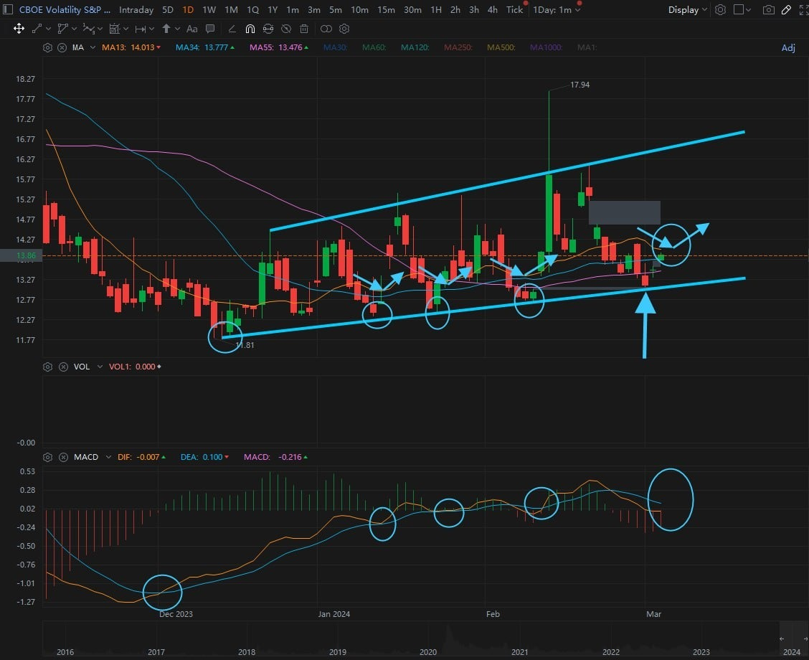
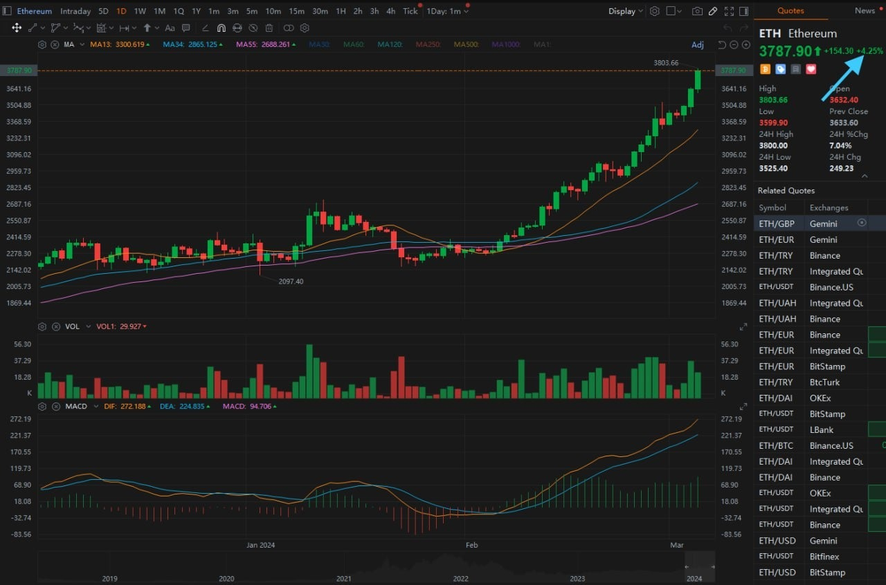
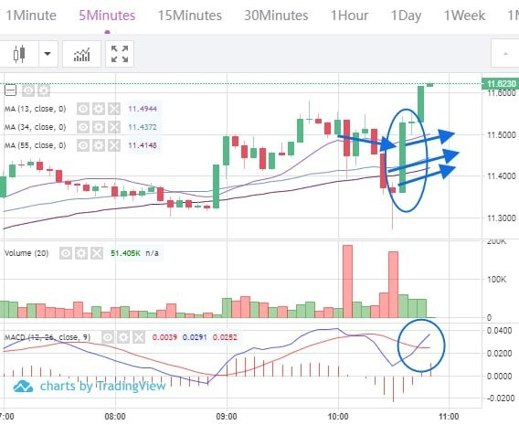
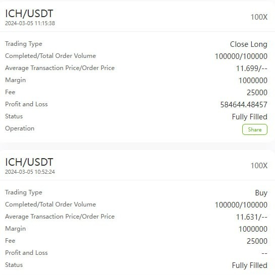
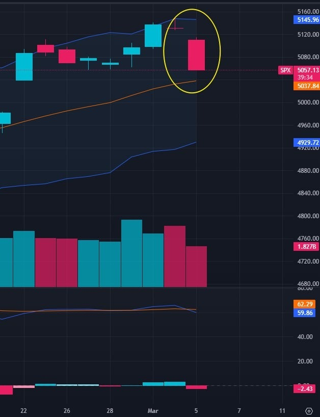
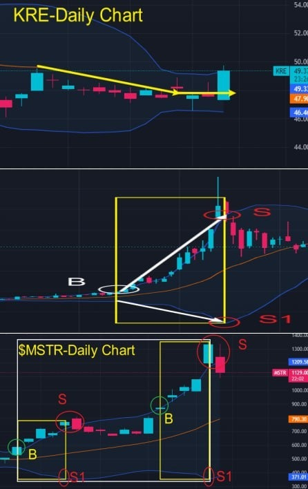
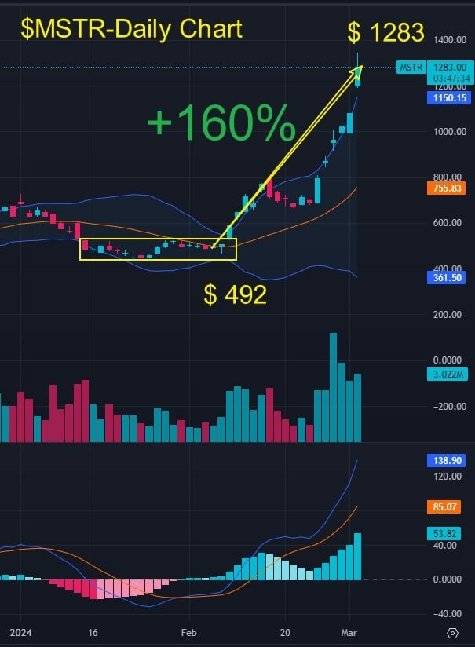
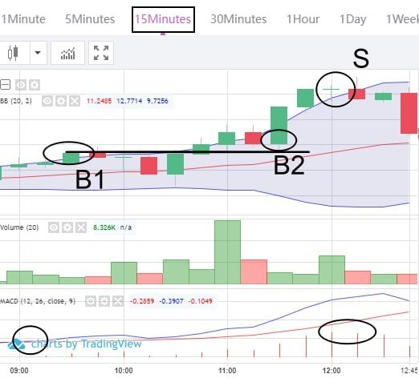

# Tuesday 20240305

## 07:52AM Evelyn Smith

### Dear friends, good morning💖

The Coinbase App has rapidly climbed in the rankings on the US App Store and is now at the 46th position in the free apps category. Just imagine, just a month ago, it was ranked at 479th! This remarkable leap fully demonstrates the current heat of the cryptocurrency market.

Such news is significant for us, proving not only the enormous potential of the cryptocurrency market but also indicating that now is the best time to invest. For those students who have not yet prepared their funds to join the VIP trading group today, my advice is: please hurry. We should not miss such a great opportunity. Let's ride this wave together, To the moon🚀.

I know following the pace of the cryptocurrency market can feel both exciting and nerve-wracking, but please believe that we are a united team. We will face challenges together and share success. Now is the time to act, let's get our funds ready, prepare to join the VIP trading group, and explore and grow together in this market full of possibilities.

May this beautiful morning bring you endless motivation and hope. Remember, we are not alone in this journey; we have each other, with common goals and dreams. Let's seize this opportunity to achieve our dreams of financial freedom.

Wishing you a wonderful day, full of gains and accomplishments. Good morning, dear friends💕.

## 08:33AM Noah Johnson

### Morning Review（α&β Strategy）

Ladies and gentlemen, good morning!  Noah Johnson here.  I'm here to bring you some exhilarating news.  The surprises just keep on coming!  Bitcoin has ascended to become the world's ninth largest asset, and the entire market is reveling in jubilation.  For us investors, aligning with the hottest investment trends can amplify our success, echoing the wisdom of our mentor.  This session at EIF Business School is not just another meeting;  it's a historic event, and we are the lucky ones bearing witness and playing a part in it.

Today is Tuesday, a day when all eyes are fixed on the SEC's latest developments, pivotal moments that will chart the course for ETH's journey ahead.  Our mentor is gearing up to guide members of the VIP group on a daring quest to clinch a 300% profit today, in what promises to be an epic trade on a larger time frame chart.  To my fellow VIP group members, let's stay alert to every message, every signal.  Let's prep ourselves for this challenge and opportunity!

## 08:48AM

First off, gotta say, our mentor's call to cash in on those stock profits and sell off half the principal yesterday was a stroke of genius.  It wasn't just about making our money work harder for us, which by the way, it's going to, thanks to the CRYPTO CARNIVAL PROFIT PLAN's potential for juicier returns.  But also, I reckon it was a savvy move considering the stock market might hit a bit of a flat line or dip in the short term (unless the non-farm payroll data throws the dollar for a loop).

Now, take a glance at the VIX index's daily chart.  From what I've pieced together, there are a couple of nuggets in there that really shine a light on my α&amp;β-Long Strategy.  Let's dive into those insights, shall we?

## 09:02AM

Alright, let's dive deep to ensure everyone can keep pace.  First off, what caught my eye is the price retracing to the uptrend line.  Historically, this line has been like a reliable friend.

Now, moving on to the second point, folks, here's where it gets exciting.  We're on the verge of triggering the α&amp;β-Long Strategy-Class III Buy Point.  For those hearing about this for the first time, this buy point isn't just any signal.  It's a beacon guiding us through the stock index's movements, with the following conditions lighting it up:

* MA34/55 showing a bullish alignment.
* MA13 trending downward before starting to pivot upward near MA34.
* A medium to large bullish candle crossing above MA13 or comfortably sitting above it.
* MACD's DEA/DIF showcasing a bullish crossover.

If these conditions align, it hints that the stock index might see a short-term pullback.  The signs this week are strong, with the non-farm payroll data set to play a pivotal role.

## 09:10AM

Alright folks, let's dive straight into some critical info: The SEC has pushed back its decision on the BlackRock Ethereum ETF proposal. This move was largely anticipated and we're not expecting a final nod or further delay on the spot Ethereum ETF until at least May.

This mirrors the approval journey of the BTC spot ETFs from history. As our mentor always says, the prime window of opportunity is right before expectations come to fruition. Just like the crazy bull market for cryptocurrencies before a halving cycle, the SEC's delay is actually a bullish signal for ETH.

And guess what?

ETH is on the rise today, providing a golden scenario for our profit plan this week - volatility is expected to spike even further.

So, what does this mean for our ambitious 300% profit goal for today's plan? It's becoming even more achievable. The stage is set, the conditions are ripe, and it's our game to win. Let's capitalize on this volatility and make the profit plan not just a goal, but a milestone we hit with flying colors.

Ready to make some waves?

## 09:29AM

So, whether it's from the perspective of capital utilization or short-term risk control, reducing our stock portfolio is necessary right now.

* $TSLA, after selling, plummeted; $CRSP dropped for three consecutive days after selling; then, after buying $FN, it rose for four straight days; $MARA has clearly fallen behind, notably weaker than $MSTR. Everyone could take the opportunity to sell at a high or even at the current price.

* $NVDA represents the index. If it doesn't rise, it's challenging for the entire stock market to go up. It's a global stock market leader, and we'll continue to hold it.

* $MSTR represents the best profit concept sector—crypto beneficiary stocks. The 20 day surge list is mostly comprised of low-priced stocks, but it broke through $1,000, making it the most authentic. The company announced a private issuance of $600 million in convertible preferred notes, intending to use the proceeds to buy more Bitcoin, which can be seen as positive news.

## 09:46AM

Friends, are you ready to embrace the thrilling challenges of this week? Our mentor has shared some significant trading signals in the VIP2/3 groups—trades based on larger timeframe charts. Hang tight, as I'll be sharing some quick trading signals in our group soon—trades based on smaller timeframe charts, like 1-5 minutes.

Now, let's talk about this week's profit plan. Our mentor has set us a goal for a total asset return rate of 200-500%. Honestly? I think it's a walk in the park. What do you think? Three key data-driven insights have bolstered my confidence.

* **Insight 1**: The magic of compounding.\
    Imagine, each trade netting a 10% return, ten consecutive trades would rocket our total asset return rate to 259%. With 20 trades, our compound growth rate would hit 672%. 10% might seem modest, but it's our golden ticket to exponential growth.

## 09:50AM

### rading Signal

Contract: ICH/USDT\
Leverage: 100X\
Order Type: Market Order\
Position Size: 10%\
Direction: Buy/Long\
Please strictly follow this trading signal. After closing the trade, please send your order process (e.g., screenshots) to the WhatsApp group for verification.

## 10:04AM

This is a 5-minute trading signal, aligning with the α&β-Long Strategy-Class III Buy Point:

* MA34/55 are in a bullish alignment.
* MA13 trends downward before starting to pivot upward near MA34.
* A medium to large bullish candle crosses above MA13 or remains above it, accompanied by an increase in trading volume.
* MACD's DEA/DIF shows a bullish crossover.

## 10:10AM

Alright, folks, let's hold steady, and I'll share two more insights right now.

* **Insight 2**: Recent trading data. Our first internal test program achieved a 97% total asset return rate in just three days; the second one hit 62% in three days; the Lucky February 80% Profit Challenge Plan completed in seven days, with a return rate of 139%. Adding these numbers up, we see an average daily return rate of 22.92%. Even without compounding, simply adding up, the total asset return rate could reach around 230% in about ten days. That's why many friends and I are confident in this profit plan.

## 10:15AM

### Trading signals

Close the position at the current price and take profits.\
Close the position at the current price and take profits.

## 10:17AM

* **Insight 3**: The boost from key data and events. For instance, today's event has pushed up the prices of ETH and BTC, creating significant volatility, which is the perfect time for AI RP 4.0 to make a killing. This week's non-farm payroll data will push market *sentiment to a climax, and as the halving cycle approaches, the cryptocurrency market will become increasingly frenzied. Missing such an opportunity, you'd regret it for at least four years. Thus, this is not just a profit plan but a moment to rewrite destiny.

So, with such analysis and market events driving us, there's no reason to doubt. This week is our golden opportunity to rewrite our financial future.

## 10:55AM

Guys, the VIP2/3 group has just released the second trading signal. Members involved, please pay attention to execute accordingly.

The contract trade we used on the 5-minute timeframe was swift and successful. Congratulations to everyone on achieving a nice profit, with some friends even surpassing 100%.

After completing the contract trade, please put half of your profits into a 30 day financial product. This step is crucial in our creation of the WEALTH MATRIX.

Let's continue to focus on today's 300% profit plan and pay close attention to our mentor's guidance at the closing time this afternoon. That's all from me today.

## 02:39PM Linton Quadros

### Closing Commentary

Esteemed future titans of EIF Business School, a delightful afternoon to you all!

Thanks to Noah, for the wonderful sharing this morning. He precisely analyzed the sharp rise in the VIX fear index using the α&β system, indicating an intensification of market panic and a decline in stock indices.

Through the 'α&β-Long Strategy', Noah led us to seize the opportunity in contract trading on the 5-minute chart, swiftly achieving about 60% in returns.

This achievement once again proves that in the financial markets, the right direction combined with the right knowledge is the key to rapid success.

Although Ai4.0's record of 26 consecutive wins only represents the past, but it provides us with strong confidence and anticipation for our future actions.

Just this week, everyone's minimum total asset gains have exceeded 12%, with earnings for VIP2/3 group members surpassing 42%.

Let us continue to maintain this momentum, move forward with determination, and pursue even greater victories!

## 02:54PM

Before we delve into the next batch of trading opportunities, let's first review the essence of today's stock market trading.

Here are two key knowledge points crucial for refining our trading system, understanding these can significantly improve our operating methods:

First, let's analyze the performance of the Regional Banking Index - KRE:

Cryptocurrency, as a symbolic application of blockchain's decentralized technology, stands in stark contrast to banks reliant on centralized financial systems, which include central banks' monetary policies, interest rate decisions, and regulatory frameworks. Hence, there exists a clear negative correlation between the two.

Observing the daily chart of KRE, we can see a medium-sized candlestick crossing the middle Bollinger Band, and the direction of the midline has changed. This forms a completely opposite trend to today's performance of cryptocurrencies and their beneficiary stocks, which is a focus we should pay attention to in the long term.

Next, let's discuss the second point: short-term selling points in the expansion pattern of the upper and lower Bollinger Bands.

As discussed in previous session, taking a long position as an example: if point B is the buying point for trend-accelerating short-term traders, then point S will become the best selling point.

Have you grasped these concepts?

## 03:16PM

Why are we able to pinpoint this short-term selling point so precisely?

I mentioned yesterday:“Tomorrow, the SEC's decision on Fidelity's Ethereum spot ETF could cause significant market volatility. This is an unknown risk we need to prepare for.Our profits are accelerating, indicating that the trend is picking up speed, which could very well be a sign of major players distributing their holdings, triggering severe market fluctuations. In $MSTR, many friends have already achieved the 160% profit target set since January 30th.Faced with the latest profit plan, each of us has the opportunity to earn more.”

Yesterday afternoon, Noah provided deep insights into the divergence between $NVDA and the stock indices, as well as the differentiation within the cryptocurrency sector.

Our response to changes in market sentiment is extremely timely. Most people executed very well, but for those who are slightly behind, it's time for self reflection!

## 03:25PM

Why reflect? Imagine, due to this error, how much wealth did you miss out on?

Among us, some friends have cleverly applied the compound interest formula, capturing the essence of changes from yesterday and today. Between selling stocks and seizing today's trading opportunities, their total capital return has increased by about 60%.

Yesterday, I shared in detail the 'New Offensive and Defensive Strategy': a strategy aimed at protecting profits and recovering principal. Through this plan, we gathered the fund of victory. We decided to sell all profits and half of the principal of $MSTR at about $1283; adopting the same strategy for $NVDA. We eliminated underperforming stocks, only keeping these two leading stocks, and transferred all these funds into the 'Ai4.0 - Crypto Carnival - (200-500%) Profit Challenge Plan'.

By comparing the reduction of stocks and increasing funds in the profit plan, we clearly see the significant effects of these two strategies on risk control and profit growth.

With this trading rhythm, what reason do you have not to become the next person to achieve financial freedom?

## 03:35PM

Today, I must seriously point out some of our obvious mistakes and offer harsh but constructive criticism.

Failing to strictly implement the strategy for $MSTR yesterday led to a 21% profit pullback today. Reflect on this: Is earning a 21% return in the investment market that easy? Are you not extremely regretful for missing out on a 60% growth opportunity due to this strategic shift?

Why did I advise you not to sell in late January, but this time strongly recommend a significant sell-off? Was my instruction not clear enough?

This contrast in guidance was deliberate, aiming to test your ability to adapt and execute decisively.

Each of us enters this market with money earned through hard work. Isn't that effortful? If you don't care about your investments, who else will?

If you cannot even fulfill such basic commitments and execute properly, how can you stand shoulder to shoulder with the outstanding individuals in this group?

The environment you are in determines the heights you can reach.

Look around; many of us will become, like Noah, or even surpass him, stars of Wall Street in the future. Do you really want to be left behind?

## 03:46PM

This issue is not merely about trading strategies or signal selection; it's about trading discipline.

As traders and investors, failing to promptly execute such clear instructions, do you know what consequences this brings? It's not just about how much less money you've earned.

The loss of consistency in strategy means your future adjustments will become increasingly difficult. Ignoring signals and discipline directly impacts your confidence, thereby hindering your professional growth

Long-term trading failures and capital losses can severely affect an investor's psychology and emotions, potentially leading to stress, anxiety, or even depression.

The impact of these emotions not only affects your trading performance but can also erode other aspects of your personal life.

The essence of investing is to make life better and happier.

Losing discipline and execution is scarier than losing capital because it could gradually turn you into a loser!

Success may come from a single case, but failure is often a habit.

## 03:58PM

Dear friends and future investors, let us consider this moment as a significant new beginning in our journey of life.

A path to success, filled with discipline, dedication, and decisive action, awaits us to pave. It is these fine values that will guide us to stand out among many investors and become true winners. Let our goal not only be to avoid failure but to become exemplars of victory!

Each and every one of you possesses the potential and hope to become a master investor of the future.

This week's non-farm payroll data is expected to bring significant market volatility, along with risks and opportunities. If you feel somewhat lost about your future investment path, I sincerely suggest you join our profit plan.

Our "Wealth Matrix" is not just an investment portfolio but a key to help you welcome stable and substantial revenue growth on the basis of robust risk control. Whether the market fluctuates greatly or slightly, it can find opportunities for profit for us.

## 04:19PM

In our shared investment journey, every small progress and victory is an important step towards our dreams. Every disappointment is a precious opportunity for growth, while each success is a solid brick in the construction of our dream palace.

Remember, we are not alone, because we have each other's company. Let's join hands, with wisdom and courage to meet every challenge together, to realize our dreams and future.

What I want to share with you is not just the profit plan but also the pressure that weighs heavily in my heart.You might only feel the joy of earning profits with my investment portfolio, without sensing the pressure behind it.

But please understand, this concerns the honor of our EIF Business School, my personal reputation, and the future of the Ai4.0 system.

believe you understand me well—I always remember our shared vows and dreams when facing challenges.

The Ai4.0 system is not just a tool for realizing dreams but also a bridge to happier families. We are the pioneers and beneficiaries of this dream coming true!

## 04:31PM

To precisely match the account funds of every friend harboring dreams with the market conditions, we have specially established VIP groups, committed to providing more personalized services and learning opportunities!

Although you might only need 10 minutes or an hour to reap a considerable return, our efforts behind the scenes involve continuously monitoring and adjusting data. All of this is to ensure that our trading principles are executed with precision, making every operation as close to perfect as possible.

1. Zero Error Principle: We pursue absolute certainty, striving for accuracy in trend and trade point selection to minimize risk.

2. Low Risk and High Return: Our practice has proven that through continuously optimizing trading patterns, low risk and high return can coexist.

3. Compounding Effect: We utilize the magic of compounding to maximize returns, ensuring every investment generates more value.

4. Portfolio Principle: By cleverly combining different trading methods and chart cycles, we have achieved the ideal state of "low risk, high return."

Our goal, through the perfect strategy of the "Wealth Matrix," is to bring everyone a low-risk, high-return investment experience. In this process, every step of our effort is to make your investment journey smoother, allowing every dream to have the possibility of realization.

## 04:43PM

For example, today's trade belongs to the VIP2/3 group, which is a trade on a larger cycle chart (15 minutes).

1. When the price begins to break upwards, accompanied by the MACD Line crossing above the Signal Line, it forms buying point B1.
2. Then, the middle Bollinger Band continues to trend upwards, indicating a healthy upward trend, laying the foundation for us to add to our positions.
3. When the price retraces to an important support line (often the previous high point on the left or the middle Bollinger Band), it forms buying point B2.
4. When the price's upward momentum starts to wane, such as when the MACD Histogram shortens above the zero axis, or when the price moves from outside the Bollinger Bands back inside, it forms selling point S.

Though this trade's duration is longer than that of short-term trades, the profit is very significant, with a total return rate of 300%. We utilized 10% of our position, resulting in a 30% growth in total assets!

This fully reflects the style and outcome of 'large capital, large cycles, small positions, low risk, high profit'.

## 05:12PM

In today's remarkable trading, we not only witnessed the operational advantages of large capital accounts but also explored a clear path to financial freedom.

As your guide, I am fully aware of this responsibility and mission. Today, I want to share with you how to utilize the unique advantages of VIP groups to amplify our profit potential.

1. Precise Capital Management

    First, successful investment begins with strict risk control. Our principle is zero mistakes. By investing in large cycle trends and using small positions, we maximize returns while minimizing risks.

    This morning's trade, which yielded a 300% profit, is just a taste of what's possible. This is not by chance, but the result of *precise calculations and strategic adjustments for every operation*.

    When you learn how to scientifically manage funds, even small investments can reap huge benefits.

    However, there are two prerequisites:

    * one is that you can't learn to swim without getting into the water
    * and the second is to ensure that the expected profit from the portion of capital you're using meets your satisfaction, otherwise, the trade still holds no value for you—this is the point I want to make next.

2. The Power of Capital

    In our VIP groups, each member possesses ample capital, laying a solid foundation for our victories in the investment market.

    Here, capital serves not only as our weapon for offense but also as our shield of defense.

    By leveraging the compounding effect and a diversified investment strategy, we have successfully achieved an ideal combination of low risk and high return.

    Let me illustrate the power of capital with a simple example. Suppose your goal is to earn $1,000 per day, as basic as our daily need for a certain amount of food and water.

    But if your principal is only $1,000 or $5,000, to achieve this goal, you might unconsciously increase your investment proportion, naturally increasing the risk as well.

    In contrast, if your principal reaches $100,000 or $1 million, then you only need to comfortably invest $5,000 or $10,000 to easily make $1,000, making the trading process as pleasant and relaxed as a walk in the garden.

    This is the perfect experience of offense and defense brought by the amount of capital.

    However, some might think this way of making money is too slow. If we start from the first internal test, win 26 trading signals consecutively, and each time only increase the total asset return rate by 5%, what would the final yield be?

    This calculation is not only exhilarating but also proves that increasing capital can indeed enhance our offensive power while solidifying our defense.

3. The Art of Offense and Defense

    In our VIP groups, members can demonstrate unparalleled sharpness in offense and solidity in defense during trading.

    This unique balance stems not only from our determination to maximize returns but also from our emphasis on the safety and continuous growth of capital.

    Such a balance is difficult to achieve for small capital accounts, which is a key distinction between us and other investors.

    This is not just a summary of the previous point but actually delves deeper into the issue of matching investment philosophies—a complex puzzle due to the different growth experiences of individuals.

    Although VIP groups may not completely solve this problem, for members with similar capital amounts, it can at least achieve a certain degree of ideological resonance.

    Imagine being in a VIP group with similar levels of capital; even if you are temporarily falling behind, couldn't you better improve yourself and learn the skills and art between offense and defense through interaction and exchange with other members?

4. Embracing Larger Trading Cycles

    We choose to engage in larger trading cycles because the opportunities they present far exceed daily fluctuations. By doing so, we can capture the market's true movements from a broader perspective, achieving a multiplicative increase in profits.

    For example, if a 1-minute candle chart has a volatility of 0.5%, then a daily candle chart might have a volatility of 5%, and a weekly chart might have 30% volatility. Calculated with a 100X contract, their profit spaces are respectively 50%, 500%, and 3000%.

    Everyone should understand from today's trade on the 15-minute chart, which yielded a return rate of 300%, that it far surpasses the volatility and opportunities of 1-5 minute trading cycles.

    So why is it difficult for trades within the 1-5 minute charts to achieve the return rates of trades on charts of 15 minutes or more?

    This involves not only the issue of volatility but also the decomposition of trends, how to obtain more trading signals through the combination of charts, and reducing the difficulty of trading, among other issues.

    I will discuss these with you tomorrow.

## 06:07PM

### Today's Achievement Verification Reward

1. How do you interpret the four trading principles I ensure to safely implement this profit plan?
2. How to use the advantage of capital to steadily expand profits?
3. This morning's trade used a 15-minute chart and earned a 300% profit. Why is it difficult for 1-5 minute chart trades to achieve such a return rate?
4. Taking $MSTR as an example, when I suggested everyone sell at $1283 yesterday and the stock price slightly increased, what was your mindset? Today, with a 21% plunge, how has your mindset changed? From the perspective of drawdown control and profit pursuit, please explain the importance of execution in trading!
(Worth 50pts)

Please send me your answers directly; I want to personally see your learning attitude and comprehension.

## 06:27PM

Friends, students, and future investment titans of the EIF Business School, on our journey to wealth, we will neither become complacent over temporary victories nor lose heart due to momentary setbacks.

Remember, behind success lies methodology, and failure has its profound reasons.

Idle theorizing is fruitless; only through the accumulation of practical experience can we gain true wisdom and growth.

This week, we are about to face even greater challenges and opportunities. I am fully prepared to lead everyone to seize profit opportunities exceeding 500%. This moment could be tomorrow or unexpectedly at any time.

In the face of this once-in-four-years opportunity, I will match every bit of your investment and enthusiasm with equal force.

I look forward to every friend becoming a loyal user and supporter of the Ai4.0 institutional version, wishing our partnership to last a lifetime.

As your guide and helmsman, I often reflect on whether I am qualified enough, but my mission has always been clear and unmistakable: to lead everyone to the summit of wealth.

Our VIP group is the battleship on which we sail together. Here, we are not just participating in trading; we are weaving each person's wealth legend with science and strategy.

I hereby sincerely invite you to join this magnificent journey and together write our glorious chapter. In the vast ocean of investment, let us set sail to meet those richer rewards and a more splendid future. Let us walk shoulder to shoulder, hand in hand, to create an unprecedented path to wealth.

Have a pleasant day, see you tomorrow!
