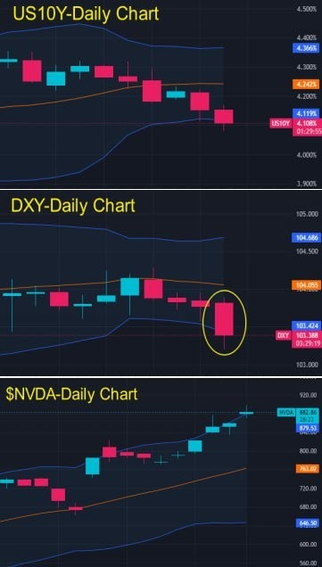

# Wednesday 20240306

## 07:49AM Evelyn Smith

### Dear friends, good morning💖

On this beautiful morning, I hope my greetings bring you joy for the day. Yesterday, Bitcoin (BTC) broke through an astonishing new high of $69K, and Ethereum wasn't far behind, surpassing $3900, reaching a new high since January 2022. These numbers are more than just digits; they prove that the cryptocurrency market is experiencing unprecedented heat.

In our wealth matrix, all three levels of trading groups have officially launched, with VIP2/3 groups achieving a remarkable 300% profit in large cycle level trades yesterday. This achievement is not just a victory in numbers but a symbol of our team's wisdom and hard work.

This coming Friday, with the release of the non-farm payroll data, the market will face another opportunity, expecting over 500% profit chances. This will be a moment to test our preparation and determination. Let's give it our all, fully prepare, and shine in this opportunity.

On this hopeful morning, I want to tell everyone that every day is full of possibilities, and nothing is impossible as long as we are prepared. Let's take yesterday's success to meet today's challenges, work together for our common dreams and future.

Wishing you a wonderful day, embracing each challenge with passion. Good morning, dear friends💕.

## 08:33AM Noah Johnson

### Morning Review （α&amp;β Strategy）

Ladies and gentlemen, good morning! Noah Johnson here. Yesterday, our mentor laid out a sophisticated plan for us: leveraging the benefits of the VIP group and savvy money management to achieve "low risk, high returns." He promised that our trust would be met with an equal measure of commitment from him. His attitude? It profoundly impacted us. We're filled with anticipation for the pre-halving cryptocurrency bull market and the opportunities presented by this week's non-farm payroll data. Yesterday, I mentioned the big news about ETH—expected to create significant waves. How shall we seize this wave of opportunity? That's what I want to dive into today. Are you ready?

## 08:46AM

Team, let's zero in on the recently released ADP report which fell short of expectations. Is it important? Absolutely crucial for both the Fed and us. The economic slowdown hinted at by ADP could signal that the Fed might implement easing policies to stimulate the economy. This report is a teaser for employment trends, a prelude to the non-farm payroll report. If non-farm mirrors ADP, imagine us riding the waves in the crypto market, effortlessly securing extraordinary profits. A 500% profit is within reach, isn't it? Let's stay tuned and prepare to make smart moves.

## 09:02AM

Like the starting gun of a race, the recent data release has sent the markets sprinting. Following the announcement, we observed the dollar and bond yields dipping, while the VIX index retreated. At the same time, stock indices, gold, crude oil, and cryptocurrencies all surged. These indicators, responding in concert to the announcement, underline the significance of this data, while market volatility has visibly increased. This week, with each passing day, the opportunities become more apparent, especially with Friday's non-farm payroll data looming large. Today is a day to *hold onto stocks, as opportunities in the cryptocurrency market surge; I'll be on the lookout for contract trading opportunities later. At this moment, as BTC and ETH prices rise, more robust trading signals require patience.

## 09:18AM

Facing the stocks we hold, what's our next strategy? Where lies the golden opportunity this week? Especially for us in the VIP group, how do we secure those extra gains? How to seize today's prime opportunities in real-time? These are the questions swirling in my mind, likely echoing in yours as well.

Here's my forecast for this week's market dynamics: The disappointing ADP data could be a harbinger for a dip in the non-farm payroll numbers. Both are pivotal to the job market, with ADP indicating a slowdown in private sector job growth, potentially signaling an overall employment growth deceleration. Moreover, many market investors and analysts might share this prediction, thereby adjusting their expectations for the non-farm payroll data downward.

Armed with such foresight, we've got a clear direction, making the strategy we adopt next all the more critical.

## 09:28AM

Let's start with a round of applause for the stellar performance of our star holdings—$NVDA and $MSTR today, exactly what we've been hoping for. Locking in those rich profits and then using the remaining positions to chase even more gains? It feels as carefree as a walk on the beach.

The SEC's delay in approving the institutional version of the ETH spot ETF, mirroring the journey once faced by BTC, signals *that before our expectations materialize*, there are ample opportunities to go long. Observing ETH's daily chart, the long lower shadow testing MA13, followed by today's rising engulfing candle covering yesterday's doji, is like the sunshine breaking through the clouds, showcasing the bulls overcoming the bears. Thus, we can hold onto our remaining $MSTR positions with peace of mind. So, how should we plan our sales moving forward? I'm about to reveal a core strategy to you all.

## 09:44AM

Imagine this: Through $MSTR's dazzling 160% profit, we've actually cashed out 80% of our position. What's left? A daring 20%—pure profit—riding the waves of future earnings. This move allows us to hold our positions with even more audacity.

It's a common scenario: many excel at finding the perfect entry points but hesitate at exits; that's the difference between the average and the masters. Now, let me share with you my α&amp;β-Long Strategy-Class I Sell Point. This strategy is your compass as you navigate the tumultuous seas ahead. Quantitative conditions include:

* MA13/34/55 in a bullish alignment.
* MA13 begins to pivot downward, the sharper the angle, the better.
* A medium to large bearish candle crosses below or settles under MA13.
* MACD's DEA/DIF shows a bearish crossover.

As long as MA13 shows no sign of pivoting, consider it a green light to boldly chase future profits.

## 10:02AM

Let's dive straight into the heart of this week's audacious 500% profit goal, and let me unveil a game-changing key point for you.

* **Key Point 1**: ICH/USDT far surpasses BTC and ETH in trading value.

    Why is this critical? It's like spotting a comet in the night sky that outshines the stars. Bigger leaps, smoother ascents, and a brighter future than any other token on the market. This isn't just an opportunity; it's our golden ticket. Since our first internal test began, most of our trades have revolved around this powerhouse, and guess what? Our win rate hit 100%. Many of us have seen our profits multiply several times over in just a couple of weeks. High stability, promising long-term trends, and rich short-term volatility—that's why ICH/USDT is the crown jewel of the α&amp;β strategy.

    

* **Key Point 2**: The essence of α&amp;β is to amplify short-term trading opportunities when a definite trend is established.

    This is precisely what our mentor emphasizes—the integration of mid and short-term trading opportunities. Has the mentor shared the concept of "trend decomposition" with you all? At its core lie two pivotal aspects: how to chase profits and how to control risks—eternal topics in trading.

    Take $NVDA as an example. Its daily chart is a deep dive into the N-shaped trend observed on the weekly chart, uncovering three trading opportunities on the daily, whereas the weekly chart presents only one. This showcases the magic of **decomposing trends**—our trading opportunities are multiplied, and buy/sell points can be pinpointed with greater precision.

## 10:30AM

Imagine, if instead of catching the wave right at its inception at point A, you seize the opportunity a bit later, at point B. It's a common scenario, isn't it? This is where the essence of contract trading really shines, illustrating how to delicately dance between ambition and caution.

Think about it: if you're too greedy at point A, overly heavy on your position, the dip from B to C could plunge you into the chilly waters of risk, or worse, into the abyss of loss.

This is where the advantage of the VIP group becomes crystal clear. It endows us with a dual advantage: seizing the rise from A to B and C to D, as well as the potential drop from B to C. Even if you start catching opportunities near point B, our strategic position planning ensures you won't be tripped up by risk.

## 10:41AM

Folks, this is precisely the essence of what our mentor conveyed yesterday: the finesse of capital management, unleashing the power of our funds, the dance between offense and defense, and the art of navigating broader trading cycles.

Imagine: Trend decomposition is like our treasure map, not just revealing a single treasure but offering us 10 to 40 golden opportunities every week. When we zoom out to capture the bigger picture, like yesterday's 15-minute chart strategy that brought us an astonishing 300% profit, delving into larger cycle strategies promises even higher returns. Do you see the profit pattern emerging?

With trend decomposition and the advantages of the VIP group, achieving our 200-500% profit target becomes a breeze. The VIP group essentially solves the puzzle of capital management, a strategy used by many large fund companies to manage traders and funds. Without a doubt, those who've joined the VIP group are fortunate. Let's collectively support EIF Business School's growth strategy and chart our course towards success.

## 10:52AM

Folks, take a look—the 5-minute chart for ICH/USDT has just showcased the α&amp;β-Long Strategy-Class I Buy Point, and it's on the brink of evolving into a Class II Buy Point. Get ready to move, and make sure you read the details of the trading signal.

## 10:58AM

### Trading Signal

Contract: ICH/USDT\
Leverage: 100X\
Order Type: Market Order\
Position Size: 10%\
Direction: Buy/Long\
Please strictly follow this trading signal. After closing the trade, please send your order process (e.g., screenshots) to the WhatsApp group for verification.

## 11:21AM

### Trading signals

Close the position at the current price and take profits.\
Close the position at the current price and take profits.

Folks, we just caught a wave on the 5-minute chart—a contract trading treasure suitable for all groups. A salute to all of you, as you've captured some sweet profits, with some even surpassing the 70% mark. Like surfers who've just conquered an exhilarating wave, let's make sure to secure our spoils of victory. After basking in the joy of our triumph, let's channel 50% of this trade's profits into a 30-day financial product, reinforcing our WEALTH MATRIX. This is our cornerstone for balancing risk, just like gearing up for the next big wave. This strategy isn't just a suggestion; it's our creed.

## 12:12PM

The tide is shifting in our favor, with a 500% profit opportunity from a single trade lurking beneath the surface this week. If you're ready for the next expedition, please allocate 20% of your funds to that 30-day financial haven and swiftly notify the mentor. He's poised to precisely plan our next treasure hunt.

How will our mentor guide us to further expand our spoils? Keep an eye on his share before the market closes. It's like waiting for the next big wave on the horizon—thrilling and hopeful. Let's ensure our execution is as sharp as our strategy, ready to navigate the market's waters with skill. That's all from me today.

## 02:36PM Linton Quadros

### Closing Commentary

Dear future investment titans of EIF Business School, good afternoon!

Thank you for Noah's inspirational share this morning, where he brilliantly elucidated the critical role of trend decomposition in pinpointing buy and sell signals and increasing trading opportunities.  He delved deeply into the positive impacts of ADP data on cryptocurrencies and the stock market.

Notably, by employing the 'α&amp;β-Long Strategy,' he led us to capture a contractual trading opportunity on a 5-minute chart and swiftly realize over 50% profit, vividly showcasing the strategy's effectiveness, timeliness, and precision!

Noah is a student I take great pride in, having surpassed me in many respects.  His commitment to giving back to the community and pursuing even grander dreams after achieving success is incredibly admirable and inspiring.

I often ponder, if life offered a restart, what kind of life would I choose?  Could I achieve what I have now?  While my commercial successes may not be grand, I hope to positively impact every member of EIF Business School through my actions.  Striving for dreams and happiness is a pursuit of immense value in itself.  Merely entertaining this thought fills me with profound satisfaction!

## 02:52PM

Today's market is undoubtedly positive, with ADP data exacerbating the pullback in the US10Y and the dollar index, allowing our remaining holdings in $NVDA and $MSTR to continue leading the market and related concept stocks with gains of +3% and +20%, respectively. This has caused the profits from our remaining positions to continue soaring, which is indeed heartening.

The Ai4.0-Expert and Investment Advisory System reports that NYCB's management recently announced significant weaknesses in monitoring and evaluating loan-related internal controls, leading to the replacement of its CEO. Consequently, Fitch has downgraded NYCB's rating to junk status, with Moody's further lowering NYCB's rating.

Fears of potential real estate loan losses and weak internal controls have led to a more than 40% cliff-like drop in today's stock price. The potential risks of small and medium-sized banks have reminded investors of last year's Silicon Valley Bank crisis, which is one of the core reasons for the explosive rise in the direction of cryptocurrency benefits today.

## 03:12PM

Students, as we navigate the vast waves of the current market, there is no doubt that our focus this week should be intensely fixed on the cryptocurrency market, a stage becoming increasingly lively as the halving cycle approaches.
We are poised to witness a surge of positive news, such as the SEC's delayed decision on the approval of an Ethereum spot ETF, undoubtedly fueling the market's eager anticipation for the future.

In the norm of a bull market, a plethora of catalytic events will emerge, not limited to the cryptocurrency market but applicable to any market, much like how any good news about artificial intelligence benefits $NVDA.
The heartbeat of the market thrives on the injection of fresh momentum, as precious as life itself, for it breathes in fresh air continuously.

This week, the most explosive driving force is undoubtedly the release of non-farm payroll data, which holds immense influence over the financial markets, especially on the cryptocurrency market.
I foresee this bringing volatility exceeding 10%, indicating that the profit potential in contract trading could surpass a magnificent peak of 1000%.

## 03:29PM

Friends, let's pause and imagine what a 1000% return on investment really means.

Through our application of Ai4.0, to date, we have successfully captured 27 consecutive trading signals, each resulting in victory.
Typically, we see returns of about 50%, as we mostly leverage opportunities from 1-5 minute charts. Therefore, a 1000% return is akin to experiencing 20 of such trading opportunities.

Suppose we trade with 10% of our portfolio each time; this means a single successful trade could double our account funds. So, I pose the question to you all, do you crave such opportunities?

Reflecting on yesterday, we've already made a foray into this wave of market trends, achieving up to 300% in profits from a single trade. Our next goal is to aim for returns exceeding 500%! Where and when will such opportunities emerge?

## 03:55PM

As we step into this market full of uncertainties, we must remain highly vigilant, especially around the release of non-farm payroll data, a time that often harbors significant market volatility.

As I analyzed yesterday, the power of capital is crucial in the capital markets. Through our in-depth discussions yesterday—covering topics like 'Precise Capital Management', 'The Power of Capital', 'The Art of Offense and Defense', and 'Embracing Larger Trading Cycles'—we unveiled the unparalleled advantages of our VIP group.

Therefore, during this non-farm payroll release period, members of the VIP group will have exclusive access to unprecedented opportunities. However, on which cycle charts these opportunities will manifest remains to be seen, as it is ultimately up to the market to decide.

I advise every prepared friend to proactively contact me in private, ensuring that we can be ready in advance, just as we did yesterday. By wisely allocating funds and precisely analyzing cycle charts, we can seize this opportunity accurately.

For those eager to partake in this week's opportunities, please be prepared and message me in a timely manner. Opportunities like this are rare, and the advantage of our VIP group lies in enabling us to start from a higher point, seizing these scarce and valuable opportunities.

## 04:15PM

Alright friends, as we await the trading signals, let me share with you a few key points that will directly determine each person's profit. Please read carefully!
As your guide, I am fully aware of this responsibility and mission. Today, I want to share with you how to utilize the unique advantages of the VIP group to magnify our profit potential.

1. The Broad Opportunities of Multi-Cycle Trading Participation

    Yesterday, I shared the logic behind the VIP group's ability to engage in larger trading cycle charts due to having more capital at our disposal.
    This morning, Noah illustrated the potential risks of small capital participating in large cycle charts through the N-type decomposition of trends

    So, friends, have you understood the advantage that VIP group members have in utilizing a "combined strategy" to participate in a broader range of trading cycles?

    To put it simply, increasing frequency in the short-term and utilizing medium-term trading to capture larger trend differentials are the two core strategies for achieving additional profits.

    Based on considerations for risk control, profit growth, and providing premium service to potential supporters of the Ai4.0 institutional version, I am making the following important decisions today:

    * **First**: Priority Trading Signal Sharing

        Even trading signals based on short cycle charts will be given priority to VIP group and higher-tier VIP group members. This approach aims to better serve potential supporters of the Ai4.0 institutional version, ensuring they receive the most valuable trading information firsthand.

    * **Second**: Sharing of Combined Mid-Short Term Strategy

        Depending on different market conditions and opportunities, I will share strategies that combine mid and short-term approaches in the respective VIP groups, to maximize the profit potential of VIP group members.

    * **Third**: Increased Trading Signal Sharing

        I will dedicate more time to sharing trading signals within the VIP group to increase members' chances of profit, striving to exceed the target earnings of this profit plan.

    * **Fourth**: Risk Prevention

        To minimize risks as much as possible, once a trading signal is shared and the trend confirmed, if the optimal buying or selling moment is missed, I will not share the trading signal in other lower-tier groups (such as the current group).

    > **Emphasis**:\
    The timeliness of trading signals is crucial. I do not want my trading signals to cause anyone to take unnecessary risks. This comes from a responsible attitude and is a commitment from me. I hope everyone can understand and support my decisions.

    Through these measures, I am committed to providing a more professional, efficient, and safe trading environment for the VIP group, while also ensuring that every member can achieve better growth and success here！

2. Ease and Efficiency of the Trading Process

    For VIP group members with larger capital, adjusting trading frequency proactively makes trading more relaxed, especially suitable for investors too busy for high-frequency trading.
    Through 1-2 carefully selected trades per week, even large-cycle trades can achieve above-average returns, with yesterday's 300% return rate becoming our confidence source in pursuing single trades exceeding 1000% returns.

3. Precise Capture of Certain Trends and Buying/Selling Points

    The VIP group provides a platform enabling large capital account members to focus on selecting and participating in trends and buying/selling points with high certainty. This strategy of waiting and choosing is a unique advantage for large capitals.

4. Reducing Trading Difficulty, Enhancing Trading Comfort

    Finding the perfect balance between offense and defense reduces the difficulty of trading, significantly enhancing comfort during the trading process.
    The support and strategic guidance of the VIP group allow large capital accounts to better balance offense and defense in trading, enjoying a low-difficulty, high-comfort trading experience.

## 04:56PM

Overall, by joining the VIP group, friends can not only learn and apply these efficient investment strategies but also achieve significant improvements in capital management, risk control, and profit maximization.

1. **Refined Capital Management**: By investing in large-cycle trends and employing small positions, achieve a balance between maximizing returns and minimizing risks.

2. **Strength of Capital**: Ample capital becomes our weapon for offense and shield for defense, achieving low-risk, high-return through the compounding effect and diversified strategies.

3. **The Art of Offense and Defense**: Balance maximizing returns with capital safety, showcasing the unique strategic advantage of the VIP group.

4. **Large-Cycle Trading Opportunities**: Opt for larger trading cycles to capture broader market trends and multiply profits.

5. **Priority Access to Trading Signals**: Lower the risk of trading and accelerate profit growth.

6. **Broad Participation in Trading Cycles**: The combination of mid-short term trading signals and positions enables members to participate in a wider range of trading cycles, enhancing profit potential.

7. **Ease and Efficiency of Trading**: Suitable for busy individuals, achieve excess returns through a selection of a few efficient trades.

8. **Certainty in Trend Capture**: Focus more on high certainty trends and buying/selling points, utilizing the unique advantage of large capital.

9. **Reduced Trading Difficulty**: Optimize offense and defense strategies, enhancing comfort and success rate in the trading process.

## 05:09PM

Therefore, I recommend every friend, who aspires towards investment success and wealth growth, to join our ranks and together pursue our dreams on the investment journey.
I hope that with our collective effort, upon achieving our goals, not only will I gain everyone's support for the Ai4.0 system pre-sale, but I also hope that we can all join the future 'EIF-Community Fund' plan.
We will allocate 10% of the profits to shoulder this noble responsibility together.

This fund will be used for:

1. 30% Reward to those hardworking group leaders, in recognition of their contribution and leadership.
2. 40% Investment in cultivating promising new trading talents, injecting fresh blood into our future community fund.
3. 10% Support for the charitable projects we collectively care about, reflecting our social responsibility.
4. 20% Allocation for future group gathering expenses, such as celebrations for the Ai4.0 launch, to strengthen our team cohesion.

## 05:20PM

At EIF Business School, charity is not only our tradition but also the core of our spirit.
Our actions—from the equity structure of EIF tokens, to our daily sharing, and the establishment and future planning of the "EIF-Community Fund"—all highlight our commitment and passion for charitable causes.

Imagine, while we freely exchange investment insights and enjoy wealth growth, there are still many people in the world who cannot even secure basic living guarantees.
This is a reality that invites deep reflection. Therefore, we plan to donate a portion of the profits from our second internal test to 'Save the Children', because we firmly believe that Giving to Save the Children is one of the world’s best investments.

Through the "EIF-Community Fund", we can not only witness the growth of wealth but also join hands to contribute to society, weaving our legendary stories together.
I call on every friend to support this proposal, letting our team become pioneers who not only create wealth but also actively push for a better world.

## 05:38PM

I firmly believe that those friends who join us in our charitable endeavors already have a mindset that heralds a bright future on their investment journey.
For these friends, I will pay special attention to their growth and progress.
Let's come together, not only to create wealth for ourselves but also to bring hope and light to the world!

Alright, friends, I have been waiting for opportunities. Please be aware, I may soon post trading signals in the VIP group.

## 05:46PM

### Important Notice 1

I have just shared a trading signal in the VIP3 group. Members of that group, please take note and act accordingly.

I have just shared a trading signal in the VIP3 group. Members of that group, please take note and act accordingly.

## 05:57PM

### Important Notice 2

The trend is strong. I have already posted a trading signal in the VIP2 group. Members of that group, please take note and act accordingly.

The trend is strong. I have already posted a trading signal in the VIP2 group. Members of that group, please take note and act accordingly.

## 06:07PM

### Important Notice

A trading signal has been posted in the VIP1 group. Members of that group, please take note and act accordingly.

A trading signal has been posted in the VIP1 group. Members of that group, please take note and act accordingly.

## 06:44PM

Dear friends, just now, closing signals have been posted in the VIP groups. Please make sure to execute them strictly!

Today's market opportunity was excellent. Although we captured only a small portion of it, this has already brought us extraordinary returns, demonstrating the immense value of patiently waiting.

A hearty congratulations to the members of VIP3 group, you have achieved an astonishing return of over 350% in this trade.
Members of the VIP2 group also deserve celebration, with returns of over 190%.
And members of the VIP1 group have also gained a significant 100% return.

This profit is not only a testament to the correctness of our strategy but also showcases the huge profit opportunities brought about by market fluctuations around the release of non-farm payroll data.
Yesterday's 300% profit, combined with today's 100-350% returns, clearly tells us that similar profit opportunities will become our new normal this week.

## 06:46PM

Today's success story epitomizes our strategy of "large capital, large cycles, small positions, low risk, high profits."
The application of this strategy not only significantly amplified our profits but also minimized our risk to the lowest level.
Friends, let's continue to adhere to this strategy, bravely moving forward, and keep exploring and advancing on our investment journey.

I firmly believe that in a high-volatility market, achieving a 500% return on a single trade through our strategy is not out of reach.
The reason we didn't reach this achievement today is merely my over-cautiousness.
However, this also means that if you can understand and flexibly apply our combined strategy, greater profits await us.

Opportunity always favors those who are well-prepared and act quickly. If you are still hesitating, now is the time to accelerate your steps.
Each trading opportunity is extremely precious; remember, we are on the eve of a once-in-four-years halving market, an extremely rare non-farm market window. Missing it would surely lead to regret!

## 06:57PM

Dear friends, please remember, in the process of building our wealth matrix, to transfer 50% of the profits from this contract trading into a 30-day financial product. This is not just a suggestion, but a clear strategy and signal!

Today's Achievement Verification Reward:

The trading cases from yesterday and today perfectly illustrate the essence of the "large capital, large cycles, small positions, low risk, high profits" strategy. Combined with the theme I shared in these two days—"Leveraging Capital Advantage to Expand Profit Potential," deeply understand the advantages of the VIP group. Which VIP group do you plan to reach this week?
(Worth 40 pts)

I look forward to receiving your answers;  I hope to personally understand each member's learning attitude and level of comprehension.

For those friends who have not submitted their answers to me, I will consider discontinuing your access to the benefits and opportunities related to the Ai4.0 system.

Today's trading outcomes are undoubtedly perfect, and we will continue to unearth more trading opportunities. Let's move forward together, fully prepared, to welcome an even more exciting future.
A pleasant day comes to a close, looking forward to continuing our wonderful journey with you tomorrow!

## 09:30PM Evelyn Smith

### Dear friends, good evening💖

On this peaceful and beautiful night, I want to share with you our joy of the day. Under the professor's meticulous guidance, our wealth matrix has taken a significant step forward again. Especially our VIP3 students, with their larger capital, were able to withstand bigger market fluctuations, thus they entered the market earliest and achieved an astonishing profit of over 300%. Meanwhile, VIP2 and VIP1 students respectively earned profits of 190% and 100%, which is truly exhilarating!

This trade once again proved the advantage of large capital, bringing higher returns and a more stable investment experience. If you haven't joined our wealth matrix yet, now is the best time. Remember, today's trade is just the prelude; Friday's non-farm payroll market is our main event, with an expected minimum profit of 500%! Think about it, how much money do you want to earn?

As we part for the night, I want to tell everyone that every success is inseparable from each of our efforts and the team's collaboration. Let's work together, facing more challenges and opportunities. Tomorrow, we will meet again on an even more glorious path. Good night, dear friends, may your dreams be filled with hope and light💕. See you tomorrow!
