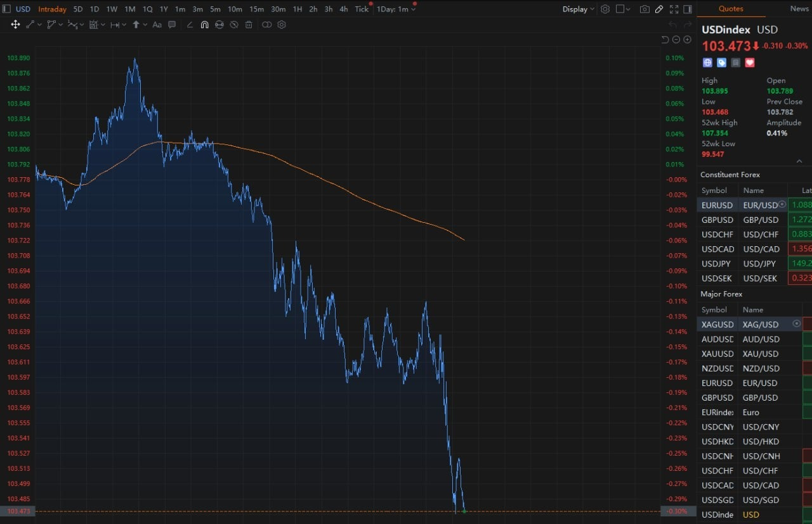
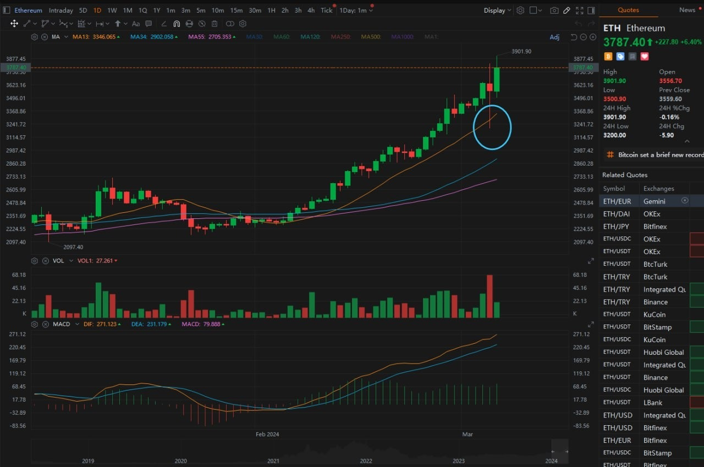
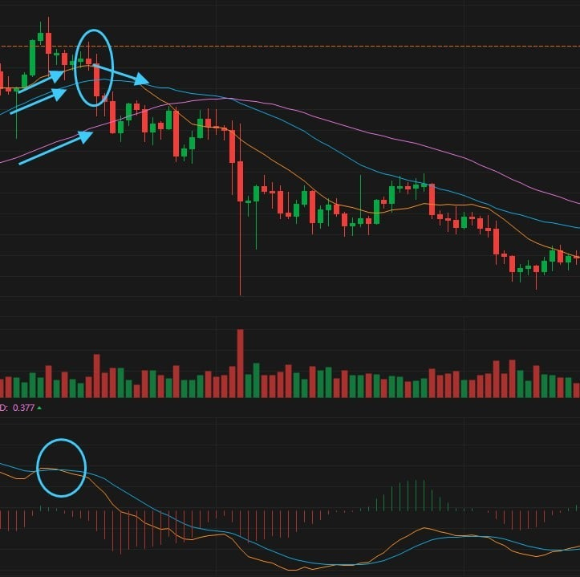
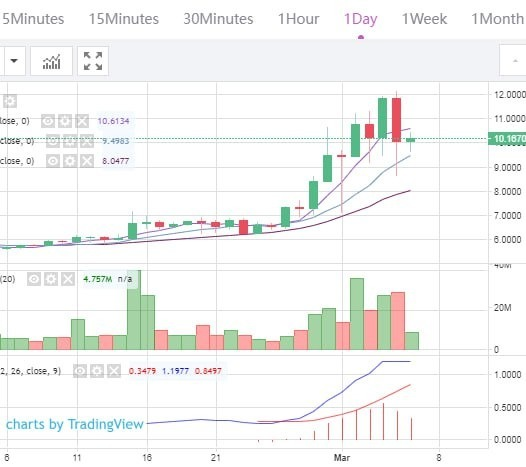
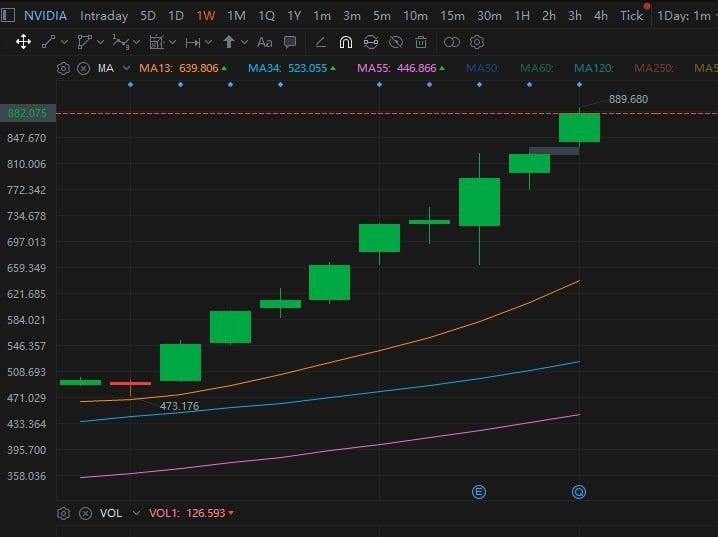
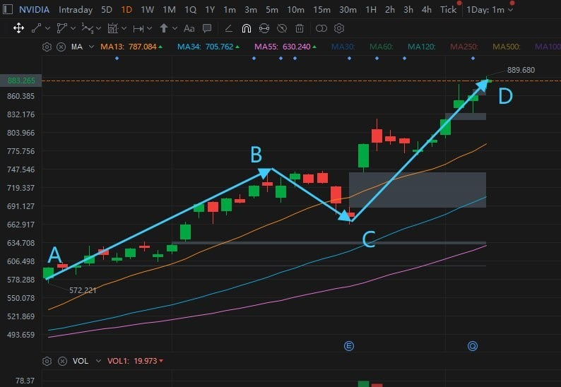
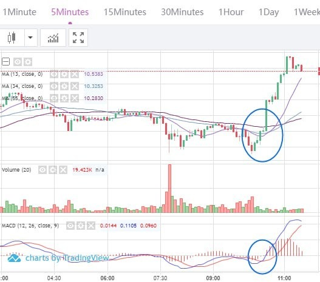
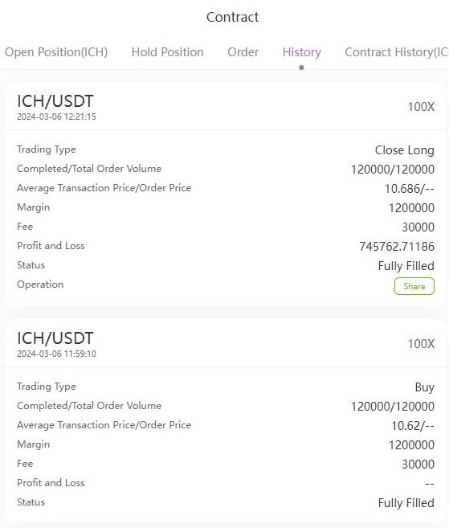

# Wednesday 20240306

## 07:49AM Evelyn Smith

### Dear friends, good morning💖

On this beautiful morning, I hope my greetings bring you joy for the day. Yesterday, Bitcoin (BTC) broke through an astonishing new high of $69K, and Ethereum wasn't far behind, surpassing $3900, reaching a new high since January 2022. These numbers are more than just digits; they prove that the cryptocurrency market is experiencing unprecedented heat.

In our wealth matrix, all three levels of trading groups have officially launched, with VIP2/3 groups achieving a remarkable 300% profit in large cycle level trades yesterday. This achievement is not just a victory in numbers but a symbol of our team's wisdom and hard work.

This coming Friday, with the release of the non-farm payroll data, the market will face another opportunity, expecting over 500% profit chances. This will be a moment to test our preparation and determination. Let's give it our all, fully prepare, and shine in this opportunity.

On this hopeful morning, I want to tell everyone that every day is full of possibilities, and nothing is impossible as long as we are prepared. Let's take yesterday's success to meet today's challenges, work together for our common dreams and future.

Wishing you a wonderful day, embracing each challenge with passion. Good morning, dear friends💕.

## 08:33AM Noah Johnson

### Morning Review （α&amp;β Strategy）

Ladies and gentlemen, good morning! Noah Johnson here. Yesterday, our mentor laid out a sophisticated plan for us: leveraging the benefits of the VIP group and savvy money management to achieve "low risk, high returns." He promised that our trust would be met with an equal measure of commitment from him. His attitude? It profoundly impacted us. We're filled with anticipation for the pre-halving cryptocurrency bull market and the opportunities presented by this week's non-farm payroll data. Yesterday, I mentioned the big news about ETH—expected to create significant waves. How shall we seize this wave of opportunity? That's what I want to dive into today. Are you ready?

## 08:46AM

Team, let's zero in on the recently released ADP report which fell short of expectations. Is it important? Absolutely crucial for both the Fed and us. The economic slowdown hinted at by ADP could signal that the Fed might implement easing policies to stimulate the economy. This report is a teaser for employment trends, a prelude to the non-farm payroll report. If non-farm mirrors ADP, imagine us riding the waves in the crypto market, effortlessly securing extraordinary profits. A 500% profit is within reach, isn't it? Let's stay tuned and prepare to make smart moves.

## 09:02AM

Like the starting gun of a race, the recent data release has sent the markets sprinting. Following the announcement, we observed the dollar and bond yields dipping, while the VIX index retreated. At the same time, stock indices, gold, crude oil, and cryptocurrencies all surged. These indicators, responding in concert to the announcement, underline the significance of this data, while market volatility has visibly increased. This week, with each passing day, the opportunities become more apparent, especially with Friday's non-farm payroll data looming large. Today is a day to *hold onto stocks, as opportunities in the cryptocurrency market surge; I'll be on the lookout for contract trading opportunities later. At this moment, as BTC and ETH prices rise, more robust trading signals require patience.

## 09:18AM

Facing the stocks we hold, what's our next strategy? Where lies the golden opportunity this week? Especially for us in the VIP group, how do we secure those extra gains? How to seize today's prime opportunities in real-time? These are the questions swirling in my mind, likely echoing in yours as well.

Here's my forecast for this week's market dynamics: The disappointing ADP data could be a harbinger for a dip in the non-farm payroll numbers. Both are pivotal to the job market, with ADP indicating a slowdown in private sector job growth, potentially signaling an overall employment growth deceleration. Moreover, many market investors and analysts might share this prediction, thereby adjusting their expectations for the non-farm payroll data downward.

Armed with such foresight, we've got a clear direction, making the strategy we adopt next all the more critical.

## 09:28AM

Let's start with a round of applause for the stellar performance of our star holdings—$NVDA and $MSTR today, exactly what we've been hoping for. Locking in those rich profits and then using the remaining positions to chase even more gains? It feels as carefree as a walk on the beach.

The SEC's delay in approving the institutional version of the ETH spot ETF, mirroring the journey once faced by BTC, signals *that before our expectations materialize*, there are ample opportunities to go long. Observing ETH's daily chart, the long lower shadow testing MA13, followed by today's rising engulfing candle covering yesterday's doji, is like the sunshine breaking through the clouds, showcasing the bulls overcoming the bears. Thus, we can hold onto our remaining $MSTR positions with peace of mind. So, how should we plan our sales moving forward? I'm about to reveal a core strategy to you all.

## 09:44AM

Imagine this: Through $MSTR's dazzling 160% profit, we've actually cashed out 80% of our position. What's left? A daring 20%—pure profit—riding the waves of future earnings. This move allows us to hold our positions with even more audacity.

It's a common scenario: many excel at finding the perfect entry points but hesitate at exits; that's the difference between the average and the masters. Now, let me share with you my α&amp;β-Long Strategy-Class I Sell Point. This strategy is your compass as you navigate the tumultuous seas ahead. Quantitative conditions include:

* MA13/34/55 in a bullish alignment.
* MA13 begins to pivot downward, the sharper the angle, the better.
* A medium to large bearish candle crosses below or settles under MA13.
* MACD's DEA/DIF shows a bearish crossover.

As long as MA13 shows no sign of pivoting, consider it a green light to boldly chase future profits.

## 10:02AM

Let's dive straight into the heart of this week's audacious 500% profit goal, and let me unveil a game-changing key point for you.

* **Key Point 1**: ICH/USDT far surpasses BTC and ETH in trading value.

    Why is this critical? It's like spotting a comet in the night sky that outshines the stars. Bigger leaps, smoother ascents, and a brighter future than any other token on the market. This isn't just an opportunity; it's our golden ticket. Since our first internal test began, most of our trades have revolved around this powerhouse, and guess what? Our win rate hit 100%. Many of us have seen our profits multiply several times over in just a couple of weeks. High stability, promising long-term trends, and rich short-term volatility—that's why ICH/USDT is the crown jewel of the α&amp;β strategy.

    

* **Key Point 2**: The essence of α&amp;β is to amplify short-term trading opportunities when a definite trend is established.

    This is precisely what our mentor emphasizes—the integration of mid and short-term trading opportunities. Has the mentor shared the concept of "trend decomposition" with you all? At its core lie two pivotal aspects: how to chase profits and how to control risks—eternal topics in trading.

    Take $NVDA as an example. Its daily chart is a deep dive into the N-shaped trend observed on the weekly chart, uncovering three trading opportunities on the daily, whereas the weekly chart presents only one. This showcases the magic of **decomposing trends**—our trading opportunities are multiplied, and buy/sell points can be pinpointed with greater precision.

## 10:30AM

Imagine, if instead of catching the wave right at its inception at point A, you seize the opportunity a bit later, at point B. It's a common scenario, isn't it? This is where the essence of contract trading really shines, illustrating how to delicately dance between ambition and caution.

Think about it: if you're too greedy at point A, overly heavy on your position, the dip from B to C could plunge you into the chilly waters of risk, or worse, into the abyss of loss.

This is where the advantage of the VIP group becomes crystal clear. It endows us with a dual advantage: seizing the rise from A to B and C to D, as well as the potential drop from B to C. Even if you start catching opportunities near point B, our strategic position planning ensures you won't be tripped up by risk.

## 10:41AM

Folks, this is precisely the essence of what our mentor conveyed yesterday: the finesse of capital management, unleashing the power of our funds, the dance between offense and defense, and the art of navigating broader trading cycles.

Imagine: Trend decomposition is like our treasure map, not just revealing a single treasure but offering us 10 to 40 golden opportunities every week. When we zoom out to capture the bigger picture, like yesterday's 15-minute chart strategy that brought us an astonishing 300% profit, delving into larger cycle strategies promises even higher returns. Do you see the profit pattern emerging?

With trend decomposition and the advantages of the VIP group, achieving our 200-500% profit target becomes a breeze. The VIP group essentially solves the puzzle of capital management, a strategy used by many large fund companies to manage traders and funds. Without a doubt, those who've joined the VIP group are fortunate. Let's collectively support EIF Business School's growth strategy and chart our course towards success.

## 10:52AM

Folks, take a look—the 5-minute chart for ICH/USDT has just showcased the α&amp;β-Long Strategy-Class I Buy Point, and it's on the brink of evolving into a Class II Buy Point. Get ready to move, and make sure you read the details of the trading signal.

## 10:58AM

### Trading Signal

Contract: ICH/USDT\
Leverage: 100X\
Order Type: Market Order\
Position Size: 10%\
Direction: Buy/Long\
Please strictly follow this trading signal. After closing the trade, please send your order process (e.g., screenshots) to the WhatsApp group for verification.

## 11:21AM

### Trading signals

Close the position at the current price and take profits.\
Close the position at the current price and take profits.

Folks, we just caught a wave on the 5-minute chart—a contract trading treasure suitable for all groups. A salute to all of you, as you've captured some sweet profits, with some even surpassing the 70% mark. Like surfers who've just conquered an exhilarating wave, let's make sure to secure our spoils of victory. After basking in the joy of our triumph, let's channel 50% of this trade's profits into a 30-day financial product, reinforcing our WEALTH MATRIX. This is our cornerstone for balancing risk, just like gearing up for the next big wave. This strategy isn't just a suggestion; it's our creed.

## 12:12PM

The tide is shifting in our favor, with a 500% profit opportunity from a single trade lurking beneath the surface this week. If you're ready for the next expedition, please allocate 20% of your funds to that 30-day financial haven and swiftly notify the mentor. He's poised to precisely plan our next treasure hunt.

How will our mentor guide us to further expand our spoils? Keep an eye on his share before the market closes. It's like waiting for the next big wave on the horizon—thrilling and hopeful. Let's ensure our execution is as sharp as our strategy, ready to navigate the market's waters with skill. That's all from me today.
