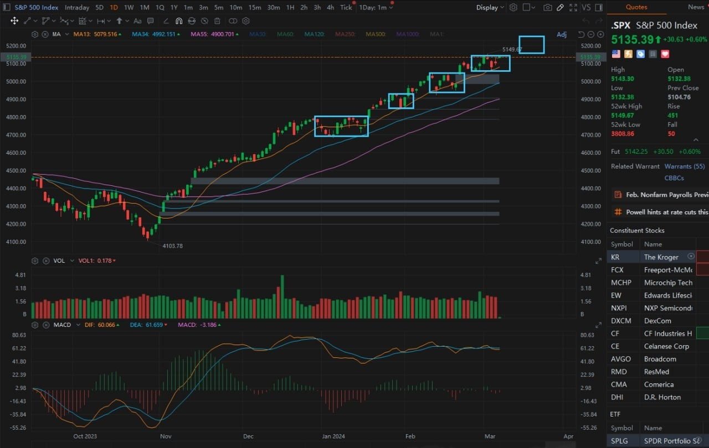
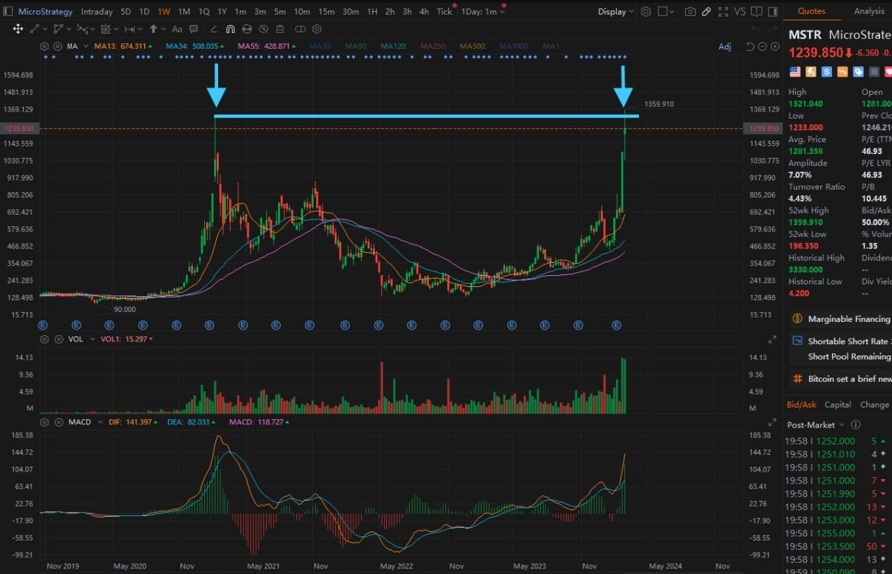
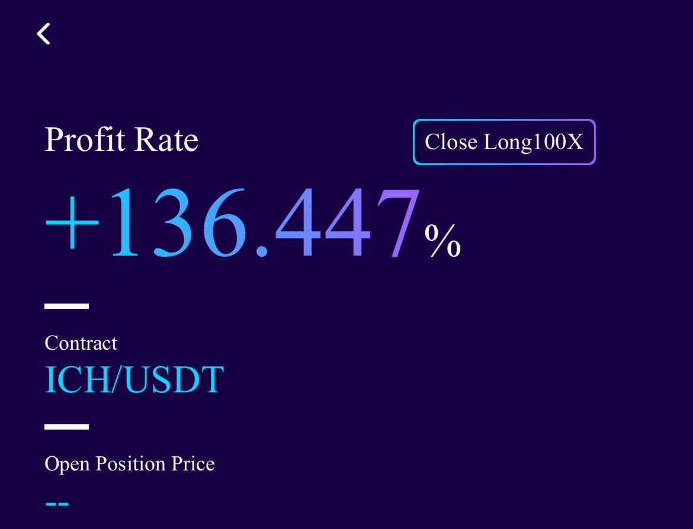
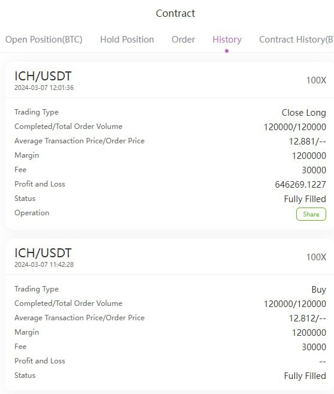
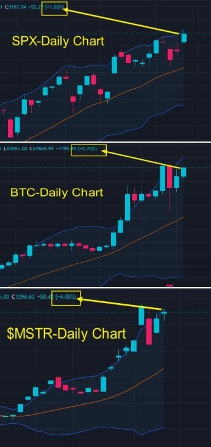
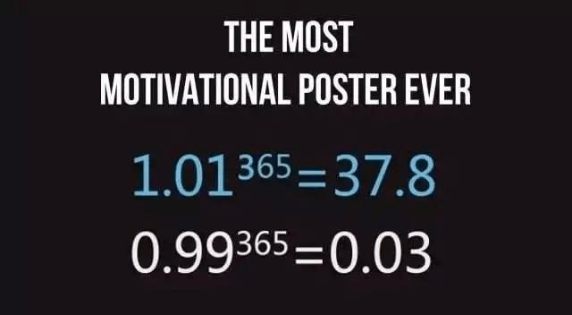
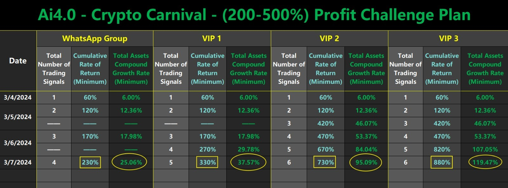
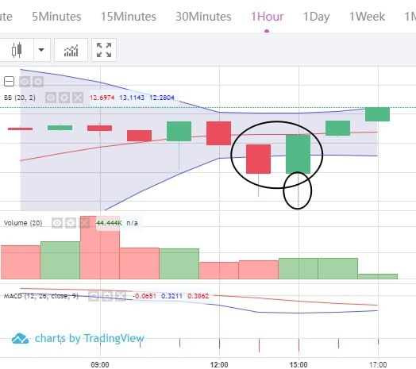
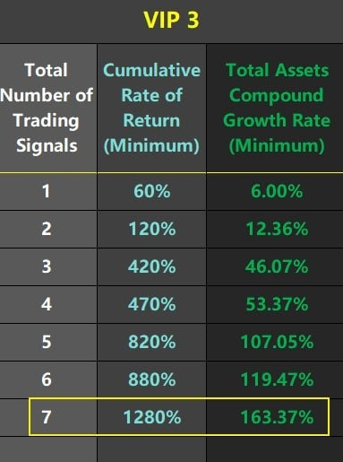
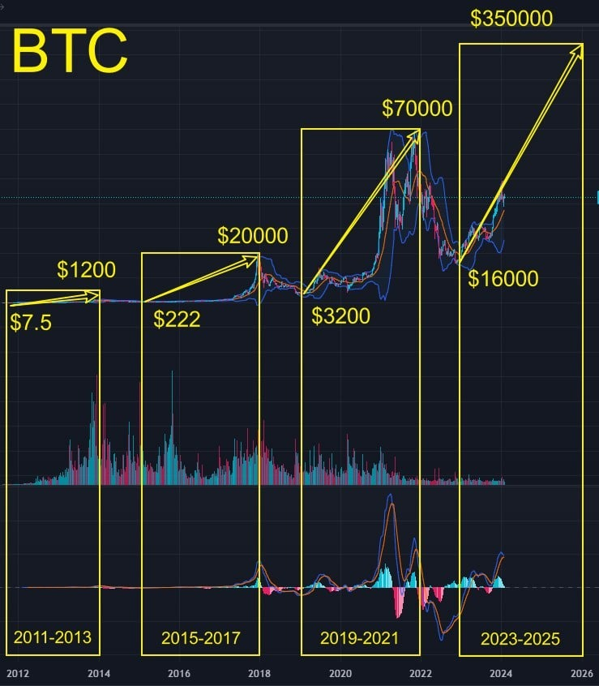

# Thursday 20240307

## 07:53AM Evelyn Smith

### Dear friends, good morning💖

As Bitcoin hits a new all-time high, we step into a March filled with changes and opportunities. The release of CPI data, Ethereum's Berlin upgrade, the Nvidia conference, and other significant events are coming one after another, each filled with challenges and opportunities, showcasing the vast potential of the cryptocurrency market.

These not only test our wisdom and decision-making but also offer numerous opportunities to make money. Especially the non-farm payroll data to be released on Friday night is a golden opportunity we cannot miss. The professor will lead us in a trade with an expected profit of up to 500%, which will be an exciting and promising journey.

For those students who haven't prepared their funds yet, now is the time to act. Opportunities always favor the prepared mind. Let's shine brightly in this market full of opportunities. Don't wait until it's too late to regret missing out.

On this beautiful morning, let's carry passion and anticipation, ready to embrace this challenge. Let's look forward to Friday, believing that under professor's guidance, we can achieve remarkable success.

Wishing you a day filled with sunshine and hope. Good morning, dear friends, let's look forward to a future full of gains together💕

## 08:39AM Noah Johnson

### Morning Review (α&amp;β Strategy)

Ladies and gentlemen, good morning!  Noah Johnson here.  On this hopeful morning, I greet you as the rising sun sets sail with us. Yesterday, our mentor adeptly unveiled how to leverage the nine major advantages of the VIP group to steadily grow profits, leading us to realize significant earnings of 100%, 200%, and 350% in crucial cycle trades.

As the release day of the non-farm payroll data draws near, today's market volatility signals new opportunities.  How shall we continue to advance on the success of yesterday and seize the opportunities of today?  Are you ready to explore with me?  Let's transform anticipation into action, action into achievement, and set forth.

## 08:57AM

Hey folks, let's dive into the data. The latest initial jobless claims data has just been released, holding steady from last week and slightly above Wall Street's expectations, which spells good news for stocks, gold, and cryptocurrencies. It looks like today's going to be another day filled with cheer, and tomorrow's non-farm payroll data release becomes even more intriguing. The Wall Street circus is back in town, with some folks out there crying "bubble." But I believe, as our mentor predicted, they're in for another disappointment. I find myself aligning more with our mentor's "slow rise pattern" perspective, and I hope you do too. Do you feel it? That optimism, confidence, and unity tell us we're on the right path, making each day memorable.

## 09:08AM

Following yesterday's trading closure under our mentor's guidance, I received a series of letters packed with very practical questions. Today, I want to share my personal insights on the common concerns among us.

First, regarding your questions about whether $MSTR and $NVDA will continue to rise after we sell them, I must say such questions don't quite hit the mark. The real key to investment wisdom isn't about predicting the future but positioning ourselves advantageously. Imagine standing on the shore at dawn, facing the vast and clear horizon, bathed in brilliant sunshine. In that light, everything is so clear and hopeful. Our investment decisions should mirror this scene—imbued with foresight and intelligence. This reminds us that with the right perspective, every decision we make is not just a step, but a leap towards a brighter future.

## 09:21AM

I believe our mentor's strategy on Monday was the art of gracefully avoiding risk. Selling before a major stock downturn is like finding shelter before the storm hits. Though the future is rife with uncertainties, witnessing the market plunge right after our sell-off confirmed that our decision was prudent. It highlighted our sensitivity to risk and our valuation of hard-earned gains.

This move not only spared us a heavy psychological burden but also mirrored heeding a doctor's advice to avert a potential ailment. In the investment world, maintaining a good mental state is as crucial as **keeping physically healthy**. Do you feel the sense of steadfastness and calm we're cultivating together?

## 09:32AM

Another crucial aspect to grasp is this: selling is not merely an action or a behavior, but a process. It's a journey from sowing to reaping. Throughout this process, we learn to cultivate, nurture, and wait. Opting to harvest the ripe fruits at the right moment, neither too early nor too late, epitomizes the wisdom in investing. Selling the profits and part of the principal of $MSTR and $NVDA is like picking the fruit when it's ripe, ensuring our storehouses are brimming.

Missed the mentor's sell signal on Monday? No worries, acting now is still seizing the right moment, especially for $MSTR, which is currently facing a historic pressure zone. I suggest those who haven't executed the strategy could still follow the original instruction to sell all profits and half the principal.

## 09:47AM

Hey, folks, investing is not just about buying in. Many know how to start but not how to end. leading to portfolios cluttered with dozens or even hundreds of holdings—a sign of inexperience. Our mentor's decision on Monday regarding $MSTR and $NVDA wasn't just a trade; it was a test of past learning and investment outcomes, a reward for our own courage and wisdom.

It's like mountaineers looking back after a successful summit, not just to admire the view but to prove they've reached the peak. It's like seeing one's own growth in the mirror. This is a validation of our investment philosophy and methods, and the best reward for our efforts.

## 10:08AM

This sell-off was not just a harvest but also a proof, don't you agree? Our core holding, $MSTR, achieving a 160% profit not only validates the value of AI RP 4.0 but also stands as testimony to our choices and utilization of excellent investment tools. Just as every wise choice in life deserves celebration, every successful investment merits praise. Even if it rises further, it still highlights the accuracy of our choices and timing. In the world of investing, having a mentor like AI RP 4.0 is akin to holding the keys to success.

## 10:16AM

Folks, trimming our holdings isn't the end but rather a new beginning. Redirecting the funds from selling into the CRYPTO CARNIVAL PROFIT PLAN perfectly captures the rhythm to seize new and more rapid profit growth opportunities. This isn't just a new chance for growth but also an extension and expansion of past successes.

Every moment in life is a new starting point, and it's with this mindset that we can be optimistic, healthy, and ambitious. As our mentor often says in a very simple yet profound manner: Investing is a lifelong journey.

Stay confident, be radiant with positivity, and embrace life. Don't fear the steps you've yet to take, because each one leads us closer to the light. Selling off most of our positions in $MSTR and $NVDA wasn't just a smart decision; it was a journey of self-improvement and affirmation. For those friends who haven't acted yet, now is still the prime time. Let's move boldly into the future together, surfing the waves with our mentor by our side!

## 10:31AM

Additionally, some friends have asked through private messages why small capital accounts are not suitable for participating in longer-term (mid-term) chart trading. This question is actually easier to understand.

In the trading world, your capital size dictates your strategy. Think about it: Will a soldier with $5,000 and a heavyweight with $5 million enter the battlefield in the same manner? Obviously not. Those of us who start small, myself included, often opt for the quick jabs of high-frequency trading to swiftly grow our accounts. It's this relentless drive that has propelled me from a humble beginning to where I stand today.

However, when you're commanding an army worth millions, the game changes to a steady advance, **seeking sustained territorial expansion**. So, it's not just a matter of account size; it's about strategy and tactics. Whether you're a fresh recruit or an experienced general, understanding your position and your goals is crucial.

## 10:38AM

Folks, diving deeper into the realms of risk and psychological endurance reveals stark distinctions. Larger trading cycles often come with greater price volatility. Small capital accounts might struggle to absorb the potential losses this volatility can inflict. Greater price swings necessitate broader stop-loss margins, which for small accounts, could mean a substantial portion of capital at risk.

Long-term investing requires a different kind of patience and psychological fortitude. Owners of small capital accounts, tending to seek quick returns, may find the prolonged holding periods and uncertainty cause unnecessary psychological stress, impacting the quality of their decisions.

I believe the purpose behind our mentor establishing the VIP group is twofold: not only to nurture more potential supporters of the AI RP 4.0 institutional version but also to adapt to the unique dynamics of the cryptocurrency market. This strategy isn't just about navigating financial volatility; it's about shaping warriors, equipping them with indestructible strategies and indomitable spirits, thriving in the tumultuous seas of market fluctuations.

## 10:39AM

### Trading Signal

Contract: ICH/USDT\
Leverage: 100X\
Order Type: Market Order\
Position Size: 10%\
Direction: Buy/Long\
Please strictly follow this trading signal. After closing the trade, please send your order process (e.g., screenshots) to the WhatsApp group for verification.

## 11:04AM

### Close Trading Signal

Close position at current market price for profit taking.\
Half of the profits from this contract trade should be used to purchase 30-day financial product.

## 11:18AM

## My Profit

## 11:31AM

Folks, now, I'm issuing a call you can't afford to miss—joining the VIP group is crucial for you.   It doesn't require leveraging all your capital;   I believe, just using some of your profits from the stock market is enough to cross this threshold.   Who wouldn't want to enter VIP3, right?

As we all yearn for our mentor to lead us in galloping through the crypto market, why not give ourselves a stronger backing?   With the assistance of AI RP 4.0, the profits earned will far exceed the amount paid for the subscription fee, making this a win-win, even a multi-win situation.

It's reported that the AI RP 4.0 system is as solid as a rock, with its launch expected to take place in June.   This means we have 3 months left.   In these 3 months, do you want to earn $1 million, or more?   It all depends on how much capital you're willing to invest.

## 12:09PM

Remember, free opportunities won't last forever, and in the future, even wanting to become a member might not be possible. What we're facing is not just a chance to make money but an opportunity for your wealth to take a qualitative leap.

Tomorrow is the day the non-farm payroll data gets released. Yesterday, our mentor led us to earn a 350% profit, what surprises will today bring? Could it exceed 500% tomorrow? I think it's very likely. And after the non-farm data is released, the opportunities will continue.

Letting the best profit-making period slip through your fingers is like wasting a goldmine. This is not just about joining a group; it's about joining a circle of winners that can define your future. Under the guidance of AI RP 4.0, it's not just about making money but writing our own legends in the waves of cryptocurrency.Please pay attention to our mentor's teachings before the stock market closes this afternoon, That's all from me today.

## 02:36PM Linton Quadros

### Closing Commentary

Dear future investment leaders of the EIF Business School, good afternoon to everyone!

First, let us extend our warmest thanks to Noah. He not only deeply analyzed the core value of this week's stock reduction strategy but also demonstrated his exceptional market insight. Even more exciting, he skillfully applied the 'α&amp;β-Long Strategy,' leading us to achieve about 60% profit in just a short 5-minute chart trading session, which is truly remarkable.

Today, I have a crucial development to announce to all of you—the latest progress on the Ai4.0 system and the upcoming investment opportunities. This is not just a sharing of a work report, but an important milestone in our joint wealth growth journey. Please pay the highest attention, deeply understand the investment benefits that will be unveiled, as it will be key to our collective success.

## 02:50PM

With great excitement and pride, I announce today a groundbreaking decision by the EIF Business School — our proudly developed Ai4.0 system has shown extraordinary performance after multiple stock trades, two rounds of internal testing in the cryptocurrency markets, and two profit challenge plans (with the second round still in progress).

According to preliminary statistics, we have successfully executed over 900,000 trades and tests, which is a clear testament to the history we are making at the EIF Business School.

After market research, in-depth discussions with professional teams in the industry, and a resolution by the EIF Business School Board of Directors, we have decided to initiate the launch plan for the Ai4.0 system ahead of schedule: We anticipate holding the world's first press conference in June this year.

The specific time and location are to be determined, and I will keep you updated with the latest progress.

## 03:08PM

Dear friends, at this moment, we are not just celebrating an achievement; this marks the entry of the EIF Business School into a new era of innovation and success in the field of financial technology.

I am full of anticipation for our upcoming global first press conference, and I look forward to embarking on this historic journey with all of you. Let us create history and shape the future together!

As the project progresses, I will establish a pre-sale group for the Ai4.0 system to ensure everyone can have early access and acquire this system. I thank every friend who has supported us; the number of participants in this internal sharing has reached a new historical high, providing an excellent platform for our practical tests.

For friends who have participated in the internal testing and those who have supported me throughout, I want to offer a special gift — a free one-year personal version for the Ai4.0 system. The key will be distributed in the pre-sale group in due course.

## 03:27PM

As we approach the launch, how will the Ai4.0 system bring us unprecedented major benefits? This is the core theme of today's sharing.

First, let's review the performance of our stock portfolio today. I want to congratulate everyone, as our holdings have once again achieved significant gains today, bringing more profit growth for our remaining positions.

However, there's a thought provoking question: With the dollar weakening today, and both stock indices and Bitcoin showing an upward trend, why didn’t our $MSTR experience a significant rise?

According to market logic, considering today's overall positive stock market environment and Bitcoin's rise of nearly 3%, $MSTR, as a leading stock in the market, should have easily achieved a gain of over 10% and broken through its highest point on Monday.

However, even though $MSTR did rise today, its performance seemed relatively weak compared to expectations. At the same time, we observed a divergence among cryptocurrency-related stocks, with mixed gains and losses, reflecting a dispersion of market sentiment, which is an adverse signal that cannot be ignored.

This phenomenon prompts us to deeply analyze and reflect on the underlying market dynamics and their impact on our investment strategy. Today's discussion is not just an observation of the market but an important revelation for future strategy formulation. Please stay tuned.

## 03:33PM

This morning, Noah's presentation was not only profound and brilliant but also provided an in-depth analysis of the strategy I suggested on Monday—selling off most stocks and retaining only small positions in $NVDA and $MSTR. I'm not sure if everyone has taken the time to read through it. Here, I've summarized several key points:

1. Monday's strategy showcased the elegant art of risk aversion, successfully avoiding major market downturns and the ensuing psychological stress.
2. The core of our strategy lies in protecting the gains we've made and having a keen insight into risk.
3. Selling is not just an action; it's a decision-making process filled with wisdom.
4. Even if we missed the initial signal to sell, taking action now is still the right timing.
5. The wisdom of investing is not only in buying but more importantly, in knowing when to sell.
6. A successful sale validates our past investment decisions and rewards our courage and wisdom.
7. Every successful investment proves the accuracy of our choices and timing.
8. Reducing positions is not the end, but the beginning of new growth opportunities.
9. Maintain an optimistic, healthy, and proactive mindset; investing is a journey for life.

## 03:54PM

Noah, once an ordinary individual, has achieved his current success through relentless learning and practice.
His viewpoints today fully demonstrate his profound insight into the market.

Today, I will discuss with you a more advanced practical topic: mastering the perfect trading rhythm and the journey of compound growth.

Please observe this poster: Increasing your principal by 1% daily can grow your investment by 37.8 times within a year; conversely, a daily loss of 1% would almost equate to a total loss after a year. This reveals the true essence of trading.

I am curious how many of you followed my previous advice and reinvested the funds from the recent stock sales into this week's profit plan? How has your return been so far?

Some of you might have missed the opportunity to achieve extraordinary returns because you did not pay close attention to the important investment strategies shared within the group.
If that's the case, I suggest you proactively contact my assistant. With the release of the non-farm payroll data tomorrow, our opportunity to double our principal could arise at any moment!

Let's stay vigilant and welcome the upcoming investment feast together.

## 04:20PM

Friends, I invite you to closely examine this chart, which presents the results of our 'Ai4.0 - Crypto Carnival - (200-500%) Profit Challenge Plan' launched this week in an extremely conservative manner.

1. This group conducted 4 trades this week, while our VIP1/2/3 groups executed 5, 6, and 6 trades, respectively, showcasing the active trading posture of each group.

2. Regarding this week's trading signals, this group achieved a cumulative return of +230%, while the VIP1/2/3 groups reached +330%, +730%, and +880% respectively, highlighting the outstanding effectiveness of our strategy.

3. Most notably, the total asset return rates reached +25.06%, +37.57%, +95.09%, and +119.47%, respectively. This is the result of our collective efforts.

Friends, what conclusions can we draw from these figures?
This is a testament to strategy, execution, and teamwork. It reveals the robust profit-making ability of the Ai4.0 system under the right strategy, doesn't it?

## 04:32PM

Indeed, these data not only represent our success but also contain profound implications.

Firstly, looking back at our trading rhythm this week, isn't it quite outstanding? Even our current group achieved an overall asset return rate of over 25%.
Imagine, if your principal was $100,000, you would have already made a net profit of $25,000. Are you satisfied with this investment efficiency?
As we continue to seize opportunities, I guarantee that our profit data will keep steadily rising.

Furthermore, the higher the group's level, thanks to the advantage of capital, the more significant advantages can be gained in trading, as I mentioned yesterday about the nine major advantages of large capital accounts.
Comparing the VIP3 group with our current group, the difference in return rates is as high as 3.7 times!

This not only highlights the unique advantages of the VIP groups but also shows the substantial benefits brought by combining large capital accounts with the Ai4.0 system strategy.
Over time, as different groups adopt different strategies and share different signals, this discrepancy will only widen.

## 04:52PM

I was just monitoring signals and issued a close position instruction in the VIP3 group.
This instruction is not only an exclusive trading signal for the VIP3 group but also a classic example in the 1-hour trading chart cycle.

In this trade, which lasted a total of 2 hours with a 5% position, we achieved an astonishing 400% return rate.
The logic behind the buy and sell points is simple and direct: when a long lower shadow bullish candle appears on the 1-hour chart, covering the candle to its left, it signifies a buying opportunity; when the price begins to rise rapidly, such as breaking through the upper Bollinger Band, it's time to consider selling to avoid potential pullback risks.

This trade once again proves the absolute advantage of large capital accounts in operation. By allocating positions reasonably, we can not only effectively withstand the market's erratic volatility but also reap substantial excess returns even at lower positions.
This is the true embodiment of the operational advantages of large capital accounts, as well as the indispensable wisdom and strategy on our path to wealth growth.

Let's hold off on posting profit screenshots for now; I'll continue to share more important insights to prevent others from missing out on these key pieces of information.

## 05:14PM

This trade has brought the total number of trade signals this week in the VIP3 group to 7, with a cumulative return rate of +1280% and an overall asset return rate of +163.37%.

Dear friends, at this moment, with incontrovertible facts before us, allow me to share two profound insights during this thrilling moment:

1. Under the premise that all conditions are mature, I strongly recommend everyone to consider joining a higher-level VIP group.
    There, superior strategies and signals await us, offering a broader trading perspective, easier operation process, a wider range of strategic choices, and finer risk control.
    All these undoubtedly will lead us to achieve higher returns. Just like a rolling snowball, let the stable compound interest become the force that realizes our dreams.

2. Beyond the excellent and stable profit data of the Ai4.0 system, what I sincerely want to express is that although our starting point might be ordinary, under the guidance of Ai4.0, our future is anything but ordinary！

## 05:45PM

Dear future investment leaders of the EIF Business School, today we delve deep into the significance of "compound interest" - the powerful engine of wealth growth.
We must understand that every action we take, every decision we make, is paving a golden path to a glorious future for us.

- The exceptional profit-making ability and stability of the Ai4.0 system is an undeniable fact, and it is based on this belief that we have decided to hold the world's first press conference in June.

- The opportunities of the cryptocurrency bull market, born from the "halving cycle," are evident.
The destinies of countless individuals have been changed through cryptocurrency investments, a unique opportunity bestowed upon our generation by the era, akin to the internet boom a decade ago.

- With macro-positive news such as the approval of BTC spot ETFs by the SEC, this bull market is unstoppable.
Opportunities like this occur every day. Tomorrow's market will be even more exciting, and as we approach the halving cycle next month, this excitement is set to intensify.

Have you truly pondered the possibilities that the aforementioned points will bring to us?
Is this not a precious starting point for you?

## 06:05PM

In this market, I have weathered over thirty years of storms, condensing all my experience and wisdom into these insights that I consider to be priceless treasures.
My wish is to awaken the dreams you had when you first entered the investment world, for this is the most precious spiritual wealth that each of us, and our entire nation, should take pride in.

Our generation is both fortunate and unfortunate.
Fortunate, because we have inherited the excellent traditions of our ancestors, becoming the backbone of our families, clans, and even our nation, enjoying the beauty of career and life.
Unfortunate, because we live in an era of rapid development, many feel lost and have missed too many opportunities. Whenever we look back on the past, regrets are inevitable!

I firmly believe that the combination of the Ai4.0 system and the cryptocurrency bull market provides each investor with an excellent opportunity to restart their lives — to live without regrets!
Now, it's time to seize the opportunities given by this era and redefine our lives and future!

## 06:20PM

In this passionate and challenging investment market, what can I do for all of you?
To express my gratitude for the support and help given by everyone during this internal sharing session, I mentioned offering specific benefits to every Ai4.0 supporter.
However, I believe my most important contribution is utilizing the soon to be launched Ai4.0 system APP to continue assisting those friends eager to realize their dreams in the investment market.

Let's assume a conservative target: achieving a 100% total asset return rate each month. If we can continue this momentum for the next three months, relying on the stable effect of compounding interest, then, before the official launch of the Ai4.0 system, our earnings could grow more than 8 times.
This expectation is based on a simple mathematical formula: 1+1=2, 2+2=4, 4+4=8. This calculation is straightforward, isn't it?

I consider this a conservative estimate, as I have reached a perfect integration stage with the performance of the Ai4.0 system.
Facing such expected results, how will each of us act?
Set your target, determine your investment capital, and that is the shortcut to success!

## 06:28PM

Ai4.0 is a gift bestowed upon me by God; whether it can become a tool to revolutionize the investment field, I am not yet certain.
However, I firmly believe that through our collective efforts, improving the quality of life, providing better education for our children; achieving a leap in wealth, starting a life of enjoying life; making freedom and luxury no longer just idle pursuits, and even gaining freedom... all of this becomes within reach!

What concerns me more is whether every one of our students can become users of the institutional version.
I look forward to seeing the institutional version becoming your indispensable choice; that is the more long-term, more valuable goal.
Therefore, earning a profit of 1 million dollars in the next three months should be the most basic goal for all of us!

## 06:36PM

The Ai4.0 system has given me the opportunity to touch the highest realms of life, and I hope that when we achieve our dreams, we can use some of our strength to make the world a better place.
This is where the true vitality and value of the Ai4.0 system lie!

Actions speak louder than words. In tomorrow's non-farm payroll data, I look forward to meeting you, making each day meaningful and exciting together.

Dear friends, students, and future investment titans of EIF Business School, I am in an exceptionally good mood today and hope to share this joy with you.
If my sharing today has touched you in any way, I sincerely invite you to share your thoughts with me and discuss the path to future wealth growth together.

Wish you a pleasant day, looking forward to seeing you tomorrow!

## 09:22PM Evelyn Smith

### Good evening, dear friends

Today, professor's lesson brought us profound insights, especially about the importance of "compound interest" and the tremendous opportunity we are about to face—the power of the Ai4.0 system. Professor emphasized that in the next three months, through the steady effect of compound interest, we could see our assets increase by more than eightfold. This is not just a dream, but a real possibility at our fingertips!

Moreover, what's most exciting is that tomorrow's non-farm payroll data will bring us an unprecedented investment opportunity. We are expecting returns of over 500%! I have made all the necessary preparations, ready to invest a portion of my funds to seize this rare opportunity. I sincerely hope you can also join in, so we can witness this miraculous moment together.

So, please be prepared, and don't miss out on this financial market feast. Remember, opportunities are for those who are prepared.

Finally, may you have a wonderful night. Good night, dear friends, looking forward to greeting tomorrow's victory together!
