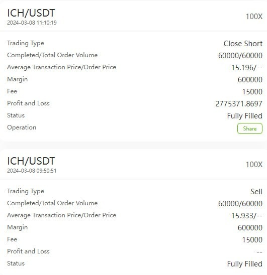

# Friday 20240308

## 07:44AM Evelyn Smith

### Good morning, dear friends💖

On this beautiful morning, I am thrilled to share with you an exhilarating piece of news, full of passion and anticipation. According to analysts from JPMorgan, a spot Bitcoin ETF could attract up to $62 billion in inflows over the next 2-3 years. This not only proves the booming cryptocurrency market but also shows the immense growth potential in the future.

What's even more exciting is the non-farm payroll data set to be released today, expected to cause significant market fluctuations. This represents a golden opportunity for us, potentially yielding returns of up to 500%. Therefore, I urge those who haven't yet prepared their funds to do so promptly, not to miss this crucial moment that could transform our investment journey.

Let's stay vigilant and ready to embrace the challenge. With our collective effort, today is bound to be another fruitful day.

Wishing you a wonderful day, facing each challenge and opportunity with anticipation and preparedness. Good morning, dear friends. Let's ride the waves of the cryptocurrency surge together💕.

## 08:23AM Noah Johnson

### Morning Review (α&β Strategy)

Good morning, ladies and gentlemen!  Noah Johnson here.  It's thrilling to spend this exciting day with you.  The non-farm payroll data is out, but what impact will it bring?  How much profit can we garner from the cryptocurrency market today?  The long-awaited moment has finally arrived.

Yesterday, our mentor laid out a roadmap for the June launch of AI RP 4.0, which was incredibly inspiring, calling on us to be its steadfast supporters and users: to steadily increase our assets using the compounding effect, setting a base target of $1 million in profits for each of us within three months.  I believe that today's non-farm payroll data is not just a number;  it's the starting point of our new journey towards profit growth.

## 08:49AM

### Folks, pay attention to two crucial pieces of information

* The newly released non-farm payroll data exceeded both the previous values and forecasts, which is good news for the dollar; however, the rise in the unemployment rate surpassed both the previous values and forecasts, posing a bearish signal for the dollar. Overall, today's data are more favorable to stock indices and the cryptocurrency market, but the market is expected to exhibit volatile movements.
* The SEC has postponed its decision on allowing the Chicago Options Exchange to list Bitcoin ETF options until the end of April, with no rule changes to be made until then.

This is undoubtedly positive news. The introduction of options trading will undoubtedly inject fresh vitality into the cryptocurrency market, likely further strengthening the bull market. As our mentor often says, the best time to profit is before expectations materialize. Think about this timing—the end of April, which will undoubtedly add fuel to the upcoming halving bull market! Let's capitalize on these insights and make the most of the upcoming opportunities.

## 08:51AM

### Friendly Reminder

Folks, please note, a trading signal has just been shared in the VIP3 group. Make sure to follow it.

## 09:20AM

Just when you think Wall Street's circus couldn't get any crazier, it opens up again. Some institutions are crying out loud, warning of a potential bubble due to the rise in Bitcoin and stock indices, claiming it could disrupt the Fed's plans for rate cuts, and according to them, that's bad news for the stock market.

But as our mentor always points out sharply - to understand whether the stock market will rise, you just need to look at $NVDA. These so-called experts really should learn from our mentor. Frankly, I think these "masters" are all talk and no action when it comes to actual trading. Look at the options market for $NVDA, with bets placed on a $1000 strike price showing a bullish sentiment. Our mentor's optimism about $MSTR, advising us to maintain certain positions, is not **unfounded. The cryptocurrency market is brimming with opportunities, with some people doubling their profits in just a week. This is no coincidence. It indicates that the real money is in the cryptocurrency market, and better opportunities are waving at us.

## 09:28AM

For me, the biggest impact from our mentor comes from his macro perspective, boundless optimism, and profound sense of social responsibility. Take his attitude towards his favored stocks; when the trajectory of a stock validates its fundamentals, he often says, "Well, its growth rate still can't keep up with its profitability." Sounds familiar, doesn't it? This is something we often hear during our profit-making journey with $NVDA. As for the 160% growth "bet" proposed when buying $MSTR, it also reflects his macro view and optimistic attitude, which I believe is a resonant memory for all of us, right?

## 09:35AM

Especially yesterday, when he boldly announced that making $1 million in profits before the June launch of the Ai4.0 system should be a goal for everyone. Imagine, folks, the level of courage and vision that requires.

So, do you think we can reach this target? Reflecting on our initial skepticism about the 160% surge in $MSTR, I firmly believe that outcomes tend to favor those who are optimistic, those filled with positive energy. Let's not just envy our mentor's broad vision and sunny disposition; let's put it into practice. Let optimism be our collective belief as we march towards that $1 million goal. After all, in the world of investing, it's the optimists who not only dream but also realize their dreams.

## 09:55AM

Folks, I've got to say, after drawing a few beautiful arcs in this investment game, I've deeply felt that to shine in any field, it's not just about luck or mere diligence. The key is to find that genius mentor, someone who can save you a lot of time going around in circles. I'm just one of the many folks our mentor has helped, and he always reminds us, as we invest and make money, not to forget to take a part of it and do some good, to contribute to society. Investing is not just about bulging our wallets; it's also our little way of making the world a better place. Thus, fully supporting our mentor's grand plan, whether it's AI RP 4.0 or the future EIF-Community Fund, not only makes our investment journey smoother but also turns our big family into a true part of giving back to society.

## 10:08AM

Our mentor always says, "Investing is a journey we take throughout our lives." This reveals his philosophy on investing—growing wealth quietly but steadily through the robust effect of compounding. So, how can we better enjoy the magic of compounding? Well, the benefits of the VIP group speak for themselves.

In the VIP group, we're not just investing; it's more like running a thrilling marathon of wealth growth. We refine our money management skills, follow the big trends, and with adequate capital and diversified strategies, we aim for low-risk, high-return investments.

What we get in the VIP group isn't just cutting-edge trading signals but also opportunities to participate in various trading cycles. Our goal is to find simple yet efficient ways to trade, maximizing returns while ensuring the safety of our funds and enjoying the process. Take today's trade, for example; many members in our VIP group have seen returns exceeding 100%, some even hitting 400%!

So, if you want your investment journey to be about more than just making money, to be filled with fun and a sense of achievement, you can find these treasures in the VIP group.

## 10:11AM

### Warm Reminder

Folks, please note that the closing signal has already been shared in the VIP1/2/3 groups. Make sure you execute it.
Big congratulations to our VIP1/2/3 group buddies who bagged profits over 90%, 210%, and an astonishing 510%! These achievements are simply amazing.

And don't forget, invest half of the profits from this trade into the 30-day highest fixed income financial product. This is our secret weapon for building an impregnable WEALTH MATRIX. This way, we can keep our wealth growing while enjoying a steady sense of happiness.

## 10:48AM

Today's market was absolutely thrilling, with BTC hitting $70,000 before experiencing dramatic fluctuations. Thankfully, we had AI RP 4.0 as our secret weapon, which foresaw this volatility in advance. I chose not to invite non-VIP buddies to participate today, mainly out of caution. The market's roller-coaster ride following the non-farm payroll data release is not something I'd want anyone to navigate without proper fund and position control, and I'm sure you can appreciate my concerns.

But hey, don't worry. Once the market stabilizes a bit more, safer opportunities will naturally emerge. The volatility is still there, and we can earn reliable profits with more robust trading signals.
Folks, our mentor's wisdom is like a lighthouse to us, illuminating our path to wealth growth and guiding us to do more good deeds and become better versions of ourselves. Don't forget to look out for opportunities in the market and our mentor's afternoon session. That's all from me today, keep up the good work!

## 11:00AM

### Then I was kicked for being poor

