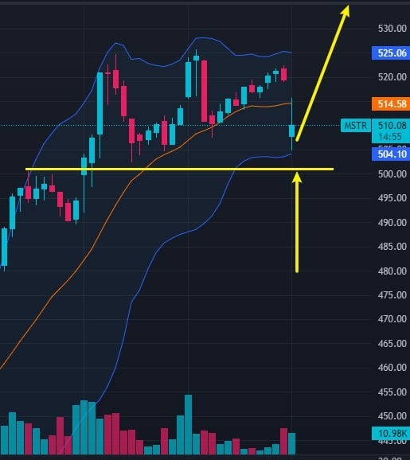
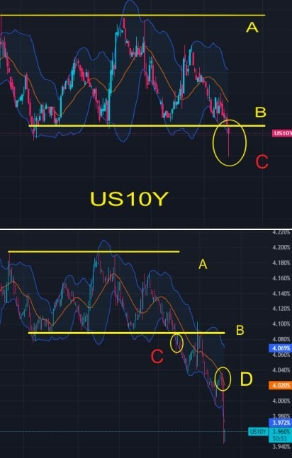
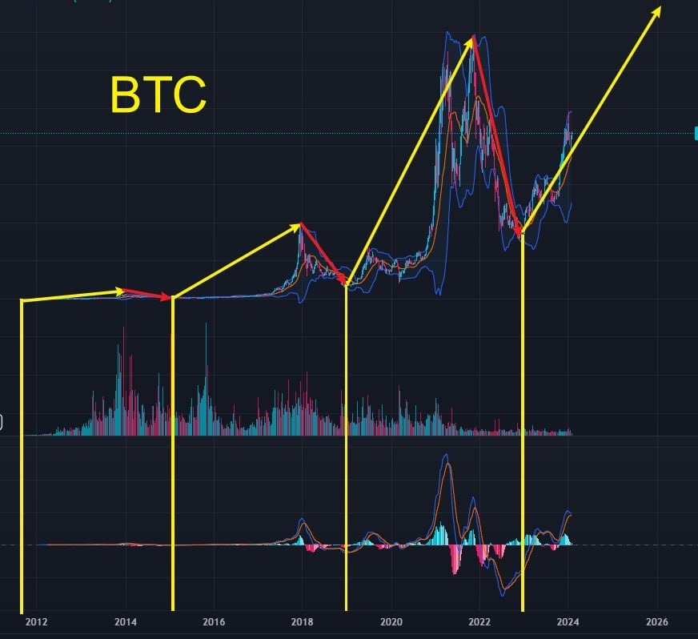
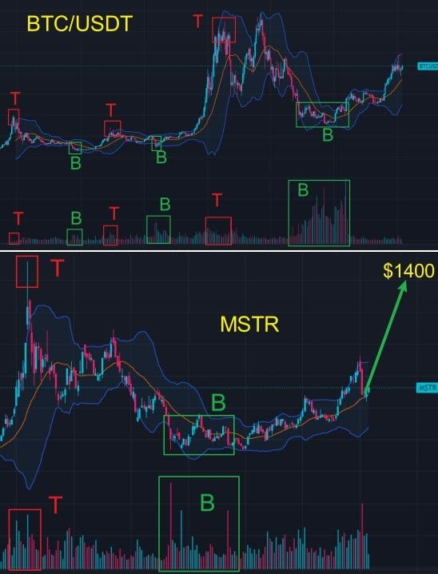
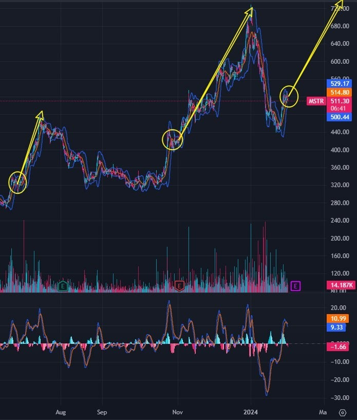
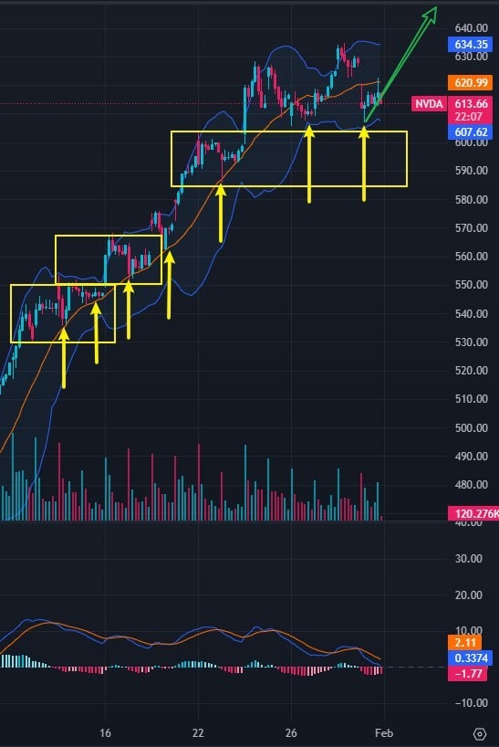
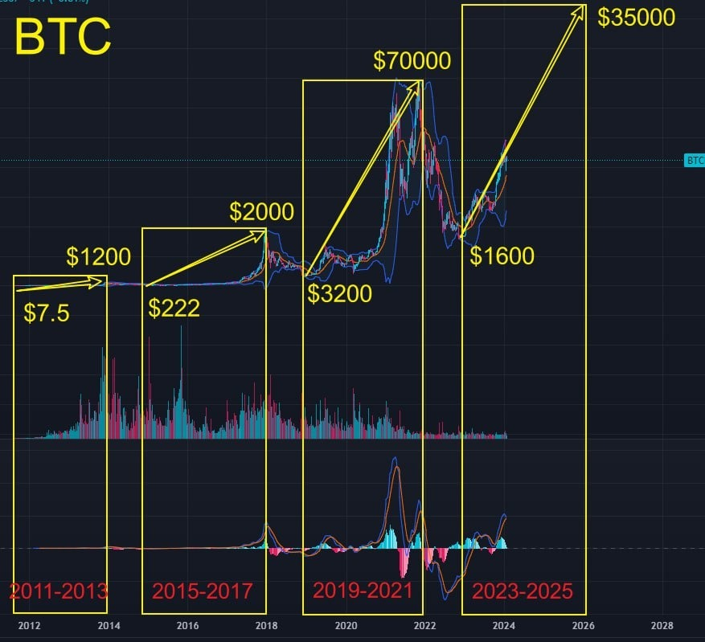
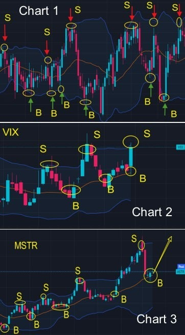

# Wednesday 20240131

## 08:21AM

### Morning Review

Good morning, dear friends. 

Welcome to the new members. This week, everyone has two chances to participate in our EIF Business School's lottery to win important investment targets with a 5x growth expectation for this year, as well as more gifts.

- How will the recently published ADP Employment Report affect the Federal Reserve's interest rate policy and the stock index? 
- Why am I so confident that $MSTR will reach $1400 in the short term? 
- What should friends who haven't bought it yet do?

I will share these two important topics shortly.

## 08:33AM

Today, the 'AI 4.0-Expert and Investment Advisory System' highlighted crucial data: 

The ADP Employment Report showed that in January of this year, the number of jobs in private enterprises in the US increased by 107,000 after seasonal adjustment. This is the smallest increase since November last year. It not only fell short of economists' expectation of 145,000 but also was lower than the revised previous value of 158,000.

Non-farm payroll data is one of the most critical economic indicators, serving as a barometer of economic health. It directly influences the Federal Reserve's interest rate policy (whether to cut or raise rates) and affects the actions of global investors. 

The ADP Employment Report, considered second only to the non-farm payroll data, is also seen as a leading indicator of the latter. 

Therefore, understanding today's data is essential. I will provide two critical interpretations next. Please read carefully!

## 08:50AM

### Important Information:

The retracement in the price of $MSTR presents an excellent buying opportunity. Friends who haven't purchased yet can buy at the current price.

- Position: 30% of total account assets
- Short-term growth expectation: $730, with an expected increase of Around 40%
- Medium-term growth expectation: $1400, with an expected increase of Around 160%
- Bull Market Target for This Round: $3300, with an expected increase of Around 540%.

This stock is the core focus of EIF Business School's 14th internal sharing session. During this cryptocurrency bull market phase, $MSTR will become one of the most significant beneficiaries. I will share a few key points of logic shortly!

## 09:08AM

### Continuing our analysis of the ADP Employment Report and its significant impacts:

1. Impact on Federal Reserve's Interest Rate Policy

    This report is a key indicator of employment in the U.S. non-farm private sector. A decrease in the report's figures could lessen the likelihood of the Federal Reserve increasing interest rates, as a weakening job market may indicate a slowdown in economic growth. 
    In extreme cases, the Fed might consider lowering interest rates to stimulate economic growth and boost employment.

2. A Leading Indicator for Non-Farm Payroll Data

    Although the ADP Employment Report and Non-Farm Payroll Report have different focuses, both are crucial tools for analyzing the state of the U.S. labor market and overall economic health. Analyzing these reports provides valuable insights into the employment situation in the U.S. Most of the time, the direction of the ADP data aligns with the Non-Farm Payroll data.

This data provides essential references, which is why I just announced a critical signal to buy stocks!

## 09:25AM

Some friends might wonder why the stock indices opened lower today. 

I believe there are two main reasons: tech giants (like Microsoft, Alphabet, AMD, etc.) reported earnings that fell short of Wall Street's high expectations, and the uncertainty brought by the Federal Reserve's first interest rate decision of the year.

However, it's important to understand a few key logics:

1. Last year, when the Federal Reserve stopped hiking interest rates, stocks began to rise. So, if the Fed starts to cut rates, isn't it likely that stocks will surge even more? \
The answer to this is both simple and affirmative.

2. The ADP employment data released today provides significant reference value, enhancing the possibility of the Fed cutting rates sooner, which is fundamentally a positive sign for stock indices. 

We observed a rapid decline in bond yields, consistent with the AI 4.0 system's prediction earlier this week. Therefore, today's slight pullback in stock prices presents a great entry opportunity. 

Do you all understand this perspective?

## 09:55AM

Indeed, the concerns of many friends are also my concerns. 

Yesterday, the reason I dared to engage in an entertaining wager agreement with everyone using $MSTR is because my research on this stock is as in-depth as that of $NVDA.

Next, I will share four important points of logic.

1. The halving mechanism ensures the scheduled arrival of the cryptocurrency bull market.

As I mentioned yesterday, blockchain technology has the greatest potential to lead the fourth industrial revolution, and the cryptocurrency industry is the masterpiece of blockchain technology!

The halving mechanism of BTC is a key feature in its design, which reduces the market supply of Bitcoin.

With the continuous increase in market demand, this mechanism causes prices to soar, giving birth to the unique characteristic of the cryptocurrency market's 'three years of bull market, one year of bear market'.

Everyone might want to consider a question: Based on this historical characteristic, to what extent will Bitcoin and $MSTR rise in price in this round of the cryptocurrency bull market?

## 10:13AM

2. Bitcoin and Ethereum spot ETFs become the second engine of the cryptocurrency bull market.
With the approval of Bitcoin spot ETF applications by several institutions from the United States Securities and Exchange Commission (SEC), it is expected that the approval of Ethereum spot ETFs will soon become a reality.
This means that the capital in the cryptocurrency market is set to surge, and friends who have invested in stocks should be very clear about such bull market logic.
If the halving period in April this year is considered the first engine of the bull market, then the continuous approval of spot ETFs will become the second engine!

3. Why can $MSTR become one of the biggest beneficiaries in this round of the cryptocurrency bull market?

If you have received the ‘Top 10 List of Hot Investment Targets in 2024’ through my assistant and read my stock selection logic, you would be very clear why $MSTR is one of the biggest beneficiaries: they have now become one of the company with the largest amount of Bitcoin spot in the world!

## 10:43AM

4. The weekly trend chart reveals an important 'wealth code'!

Look, the important pattern shown in the BTC/USDT weekly trend chart: in the past three bull markets, the trading volume B at each historical bottom is greater than the trading volume T at the previous top.

It's quite rare for the bottom's trading volume to exceed the top's. The secret behind this is: a large number of buy orders enter, establishing the bottom; when the bottom’s trading volume makes history, the price naturally makes history too, because the price is driven by capital!

So now, $MSTR also shows the same characteristic as Bitcoin. Is it highly probable that it will reach 1400 USD in the medium term?

This is why I am so confident in this profit expectation. Friends, would you like to join this entertaining wager agreement?

## 11:03AM

Lol, welcome everyone to join this entertaining feast:

- If within three months (before the close of April 30th), the price of $MSTR does not reach 1400 USD, I lose: I will compensate for this price difference and expected profits in some way (based on the $MSTR shares you currently hold).
- If it does reach, I win, and each of you who bought $MSTR will introduce 5 friends to follow this AI4.0 course and its future planning.

The reason I set up this entertaining wager agreement is to make myself and all friends pay more attention to this investment opportunity.
You should be able to see how much I value this trading opportunity, the sharing of this course, and the future planning of the AI4.0 investment system!

- If in this cryptocurrency bull market Bitcoin can rise to 350,000 USD, what price will $MSTR reach?
- How to use Bollinger Bands to determine buying and selling points?

I will share these two important topics at 3:30 PM Eastern Time.

## 02:34PM

### Closing Commentary

Dear friends, good afternoon.

As shown in the chart, the current price of $MSTR is in its first consolidation phase after establishing a mid-term bottom. Through the historical performance and characteristics of this stock, it can be seen that, apart from the bottom range, this is the second excellent opportunity to enter. If you haven't built a position yet, you can buy in at the current price to build an initial position!

- What message did the Federal Reserve meeting convey? Why is today another buying opportunity in the uptrend of the stock index?
- If in this cryptocurrency bull market Bitcoin can rise to 350,000 USD, what price will $MSTR reach?
- How to use Bollinger Bands to determine buying and selling points?

Later, I will share these important topics.

## 02:44PM

Today's stock index fell mainly because the market's hope for the possibility of an early interest rate cut mentioned in today's Federal Open Market Committee (FOMC) meeting was dashed, leading to some investors selling off.

While many institutions on Wall Street had a neutral stance on today's Federal Open Market Committee (FOMC) meeting, the ‘AI 4.0-Expert and Investment Advisory System’ today provided key insights:

1. The Federal Reserve maintained the interest rate unchanged for the fourth consecutive meeting, hinting at an open attitude towards rate cuts, but not necessarily taking immediate action.

2. The latest interest rate statement has removed the language about the possibility of rate hikes.

Friends, do you understand the meaning of these two statements?
This is obviously good news. Why do you say that?
The keywords 'open attitude' and 'removal' have already indicated that policymakers' attitudes are shifting in a direction favorable to the stock market.

## 03:00PM

Therefore, the market's decline is limited. It is very obvious that the stock index and the prices of key stocks are hesitant in their pullback. 

Take the 1-hour trend line of $NVDA in our investment portfolio as an example, the price has come close to the lower Bollinger Bands, which is near the support line below. 
Friends, please look at the trend of $NVDA, which shows important key points:

1. In the near term, when the price falls back to the middle Bollinger Bands, it constitutes multiple low-buy opportunities.
2. The price shows a step-like upward trend.
3. Currently, the price has fallen back near the lower Bollinger Bands, constituting a buying point.

Later, I will share the relationship between Bollinger Bands and buying and selling points.

$NVDA, as a barometer of tech stocks, U.S. stocks, and global stock markets, its refusal to fall is a reflection of the collective attitude of market investors.

Combining the earlier viewpoint, I therefore believe that today's pullback in the stock market constitutes a better short-term buying opportunity. Do you all agree?

## 03:37PM

Actually, the more important point I want to express here is the importance of obeying the overall situation (following the major trend).

Simply put, for traders with a medium to long-term trading style, when the major trend is bullish, local price pullbacks can be ignored; for traders with a medium to short-term trading style, when the major trend is bullish, the price pullbacks are buying opportunities.

For example, if $MSTR has an extremely positive medium to long-term trend and high expectations for gains in this bull market, what should we do?

Firstly, we need to establish how high Bitcoin will rise in this bull market. Isn't this very important?

In the discussion this morning, I shared the high correlation between $MSTR and Bitcoin: the bull market phase for Bitcoin has already arrived, and the 'halving mechanism' in April this year, along with the approval of Bitcoin spot ETF applications by the SEC for several institutions, are two engines of the bull market. $MSTR benefits from owning a large amount of Bitcoin!

## 04:07PM

I am very pleased to see the attendance and opinions of many friends today. I am sharing with you all a treasure map!

From the analysis of Bitcoin's weekly trend chart and past data, the following key conclusions can be drawn:

- The first halving cycle's bull market occurred from 2011 to 2013, when BTC's price rose from 7.5 USD to 1,200 USD, an increase of 15,900%.
- The second halving cycle's bull market occurred from 2015 to 2017, when BTC's price rose from 222 USD to 20,000 USD, an increase of 8,900%.
- The third halving cycle's bull market occurred from 2019 to 2021, when BTC's price rose from 3,200 USD to 70,000 USD, an increase of 2,187%.

This means that, in the first three bull markets, the minimum increase for BTC was 2,187%. Based on this rate of increase, in this bull market, starting from the end of 2022 and the beginning of 2023, with the price starting at around 16,000 USD, BTC will reach above 350,000 USD.

## 04:37PM

Lol, that's great, many friends have already seen the essence of the problem, we should learn from them.

The memoirs of the great master Jesse Livermore repeatedly emphasize this point: eliminate market noise and focus on the core events of company development.

Today, all my insights on $MSTR are about such core events. 
I suggest everyone pay attention to today's viewpoints and obtain today's course document through the business school's official website or my assistant, as this is crucial for our upcoming investments!

Indeed, the volatility of $COIN and $MSTR is much higher than that of BTC. This is why I have been researching and publishing important insights on these two bull stocks last year and this year.

Even calculated proportionally, 350,000 / 42,390 = x / 501, x equals 4,136 USD. 

Therefore, my conclusion today has two points:

1. BTC will rise to at least 350,000 USD in this round of the cryptocurrency bull market.
2. $MSTR will rise to at least 4,136 USD.

## 05:18PM

So, friends, faced with today's slight pullback in stock indexes and individual stocks, should we be happy or worried?

Without a doubt, isn't this what people who haven't entered the market would prefer to see? Isn't this a time we should consider increasing our positions?

As long as the overall position does not exceed 30%, I believe it is very safe.

So, friends, you can make more preparations for this, to win a great victory!

Of course, $NVDA is also one of the stock portfolios I am equally optimistic about, because I have been studying artificial intelligence for many years, which has led to the current development and prosperity of EIF Business School and the upcoming AI Robotics Profit 4.0 investment system application.

If you are new here, you can log on to our official website. Next, I will share some of my plans with everyone, hoping to help your investment even more.

## 05:44PM

Actually, we haven't focused much on building our website, our main focus is on the groups where we share internally. 
However, I believe many of our longstanding friends can see our changes from the redesigned homepage.

1. HOME\
Yes, this robot is quite attractive, isn't it?
Currently, this page features our promotional slogan. Through a video, you can see our vision for the future. There's also a letter I wrote in 2022 during the stock market's low to encourage everyone.

2. ABOUT US\
Here, you can get a general idea of our development history, a brief introduction to the AI4.0 Investment System, basic company information, and our education team, whom we thank for their dedication.

3. MARKET NEWS\
In this section, you can find major market news, including perspectives on currency. Many of these perspectives might be more important than the stock market because currency trends more directly reflect changes in national policies.

4. INVESTMENT KNOWLEDGE\
Here we have some important insights and learning materials about stocks, funds, bonds, forex, commodities, and cryptocurrencies.

## 06:01PM

5. EDUCATION\
Here we have a 14-year investment archive, documenting every important strategy and viewpoint we've had, including the unsuccessful cases.\
\
The 'New Course Archives' section records the courses shared in the current period, including every word I share in the group.
Therefore, if you missed a lesson on a particular day, you can find the record here.

6. WEALTH OPPORTUNITIES\
Every week, we select an investment target and upload our professional opinion. This section gathers the best investment types and suggestions.\
\
Additionally, in 2018, we issued EIF tokens to raise funds for developing the AI4.0 system. To give back to the community, we regularly allocate a portion of these tokens to those who have made significant contributions to the EIF Business School and for charitable donations.\
\
I believe the price of EIF tokens will surge as the AI Robotics Profit 4.0 (AI4.0) investment system application is gradually rolled out, with tremendous potential for the future.
Before the AI4.0 investment system application goes to market, I will post the download method on this page.

7. MEMBER BENEFITS\
This is the webpage for our weekly lottery. In the future, there will be more benefits to come. Creating a pleasant investment atmosphere has always been our goal. This week, each friend will have two chances in the lottery.

## 06:17PM

Thank you all once again for your support and attention.
Before the launch of the AI4.0 Investment System, whether it's accumulating market recognition or the upcoming internal testing, we need more friends to join and complete these tasks.

Therefore, I have convened everyone to participate in this internal sharing session, where I will introduce the composition and usage of the system one by one; and it will be applied in actual practical usage.

This not only allows everyone to understand its working principle, but most importantly, it enables us to test its profitability and stability in real-world scenarios and to profit from it. 

Because in my view, methods and tools that can't help us profit steadily are valueless.

Yesterday, I shared with you how Bollinger Bands dynamically assess the price movement space。

Today, what I want to share is 'Using Bollinger Bands to Determine Buy and Sell Points', which is a supplement and upgrade to yesterday's lesson.

## 06:33PM

Key points of the lesson: The support and resistance function of Bollinger Bands.

When we find evidence that constitutes support and resistance for prices, it becomes easier to determine buying and selling points.
Since prices mostly operate within the Bollinger Bands, often, the upper band forms a resistance line (sell point), and the lower band forms a support line (buy point).

When the Bollinger Bands are trending upwards, and the price is between the middle band and the upper band, then the support function of the middle and lower bands is stronger.

When the Bollinger Bands are trending downwards, and the price is between the middle band and the lower band, then the resistance function of the middle and upper bands is stronger.

- For example, in Chart 1, the buy point B and sell point S.
- For example, Chart 2 is the daily chart of the VIX Index, with prices near the upper band. Can we deduce that it is highly likely to fall, and therefore, is it highly likely that the stock index will rise?
- For example, Chart 3 shows the weekly trend chart of $MSTR, with a current buy point B.

## 06:44PM

Welcome again to the new friends joining us. Anyone participating in this week's group sharing session will have two chances to enter the lottery.

Participate in the learning activity, earn investment learning points, and through the 'Points Assistant', you can get the chance to win prizes worth $2,109 in the lottery!

- How will the stock market perform tomorrow? What judgment and strategy will the AI4.0 Investment System provide?
- Why is this bull market for $MSTR certain to be strong and powerful?
- How to use Bollinger Bands to judge trends?

Tomorrow, I will share these important topics.

Today's Achievement Verification Rewards:

1. In this bull market, what outstanding performances can be expected from Bitcoin and $MSTR, and why? (You can earn 20 points in investment learning points)
2. Draw and explain how to find buying and selling points using Bollinger Bands' resistance effect on prices. (You can earn 20 points in investment learning points)

Have a plesent day!
