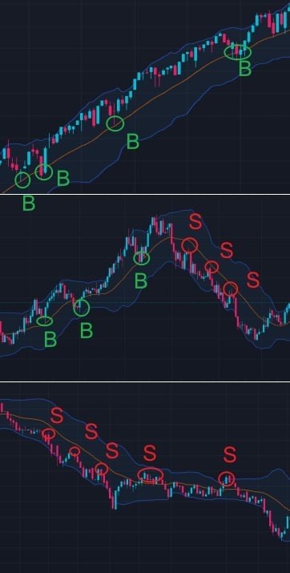

# Monday 20240205

## 08:38AM

### Morning Review

Good morning, dear friends.

A new week has begun, and last week we kicked off the luxurious feast of EIF Business School's 14th internal sharing session (AI Robotics Profit 4.0); our investment portfolio overall outperformed the market.

This week is an important one!

- The non-farm payroll data has altered the technical patterns of the US Dollar Index and bond yields. Do they adversely affect stock indices? How should we properly view the current market trend?
- Will we welcome new profit growth points? Can we achieve a 10% profit target this week? What's the current strategy for our investment portfolio?
- Last Friday, we conducted an important public opinion survey. What new significant arrangements might I have?

Later, I will share these important topics.

## 08:55AM

Let's look at a few important pieces of information displayed by the 'AI 4.0-Expert and Investment Advisory System':

1. Non-farm payroll data strengthened the US dollar.
2. $NVDA received an institutional target price upgrade to $800.
3. $MSTR received an institutional target price upgrade to $635.

Although last week's FOMC meeting changed its wording, a rate cut was not realized in March, and coupled with strong non-farm payroll data, this was favorable for the US dollar.

Therefore, this significant event kept the dollar strong, which is why the indices opened lower.

On last Friday, I already shared my important viewpoint: the market had already digested the adverse impact of this data that day.

However, understanding it objectively, this data increases the trading difficulty in the stock market. Do we have a chance to *achieve our set profit target of 10% this week? And how should we proceed?

## 09:05AM

Last week, we analyzed the trend of US dollar, which began to fall after touching the upper Bollinger Band at point S. Setting aside the impact of major events, the US Dollar Index was expected to continue falling; this was supported by a decline in the ADP employment report data at the time.

However, the unexpectedly strong non-farm payroll data changed the original trend of the dollar, and the daily chart subsequently formed a buy point B, with the direction of the Bollinger Bands' middle band continuing upward, and prices receiving support at the middle band.

This highlights the importance of non-farm payroll data, a crucial indicator for the Federal Reserve's interest rate decisions.

Objectively speaking, the current situation is that other central banks, such as the European Central Bank, may be pressured by economic conditions to initiate rate cuts ahead of the Federal Reserve, which could short-term benefit the US dollar.

## 09:34AM

With the US dollar strengthening in the short term, negatively impacting stock indices and changing market investment styles, what should we do?

First and foremost, we hold firm with $NVDA.
It's not just because its target price was raised to $800, but more importantly, artificial intelligence is changing the structure of the stock market.
$NVDA, $MSFT, $AMD, $TSM, and $AVGO, hailed as the 'AI 5', represent the new landscape of the stock market and one of the most definitive directions.

l often say, "$NVDA's profitability outpaces its stock price growth!"
In its recently published third quarter of the fiscal year 2024 (ending October 29, 2023), $NVDA's total revenue was $18.1 billion, a 206% year-over-year increase. Data center revenue accounted for $14.5 billion, a 279% year-over-year increase.

$NVDA has strongly broken through the upper Bollinger Band, indicating an intensifying trend. We can continue to hold and wait for the next opportunity to add positions when the price retraces.

## 09:57AM

$TSLA has today been the subject of unfavorable news regarding Elon Musk.

However, the veracity of this news is uncertain.

Regarding this stock, my stance is firm, unless I see confirmed credible statements.
The stock's previous negative news has already been digested by the market, and institutions are continually buying in. Our view is unanimous: it has been undervalued.

If I am wrong, I will admit my mistake and exit, but now is not the time.

I want to reemphasize that if you incur any losses by following my investment strategy or signals, I will take full responsibility.

This is the consistent practice of our EIF Business School, where we always prioritize the interests of our students over those of shareholders!

## 10:05AM

We must be cautious of those in the market who may spread rumors to deliberately suppress stock prices for their own gain.

For now, we continue to hold it and see what actually unfolds.

If it is confirmed to be a rumor, then the stock price will inevitably soar!

Looking at the medium-term trend, even if we judge based on the worst scenario - a downtrend, the current clear technical characteristics are:

1. The price has fallen to a support level.
2. The MACD indicator shows that the selling pressure at point B3 has exhausted, and buying power is increasing, similar to points B1 and B2.

If you are holding this stock, be sure to tell my assistant so she can help you closely monitor the movements of this stock; and when we truly make a decision, we move on to the next step of our plan according to the agreement.

## 10:19AM

There are no stocks that only rise and not fall, nor are there stocks that only fall and not rise; every price fluctuation has its reasons.

The strengthening of the US dollar has a certain impact on other investment markets, but its impact is limited!

- The VIX fear index has not seen significant increases, indicating that panic sentiment is being digested by the market.
- The price of US10Y and the US Dollar Index is near the resistance line.

This suggests that the market is likely to see a turnaround within the next three days, so for stocks with clear investment logic, a price drop today constitutes a better buying opportunity.

For example, stocks benefiting from artificial intelligence and cryptocurrency.

Next, I will focus on sharing some important potential logic behind $MSTR.

## 10:32AM

Let's first look at the latest views of the core force dominating the market - institutional investors.

- If only 1% of the global investable assets were allocated to Bitcoin, the price of this cryptocurrency could soar to $120,000 per coin.
- If allocated 4.8% of the funds according to the average maximum Sharpe ratio from 2015 to 2023, Bitcoin's price could reach an astonishing $550,000.
- Pushing more boldly, with ARK's recommended allocation of 19.4%, Bitcoin's value could skyrocket to $2.3 million per coin.

It seems my perspective was not broad enough; last week, I estimated that Bitcoin's price in this bull market would reach $350,000.

Friends, do you still remember my calculation formula?

## 10:43AM

Over the past seven years, Bitcoin has had an average annual return of 44%, while other assets have had an average annual return of just 5.7% during the same period. This stark contrast highlights the potential of Bitcoin as a lucrative investment choice.

If we don't understand the investment logic, even a stock with the potential to increase 10,000 times could be right in front of us, and we would still miss out on the tremendous wealth opportunity it presents. Do you agree with my viewpoint?
Haven't we all experienced such situations, friends?

Today, I won't spend too much time delving deeper into the logic. I hope everyone understands the above two points of view and related data well.

Believing in data is believing in science!

Next, let's take a closer look at the technical analysis charts for Bitcoin and $MSTR.

## 11:18AM

I'd like to share with you the simplest and most practical method to determine support and resistance lines: draw a line connecting the highest and lowest prices of multiple candles.

For example, in the daily trend chart of Bitcoin, the support line at the bottom of the box is made up of 23 candlesticks high and low points.
This indicates its effectiveness.

Moreover, this support line coincides with the middle Bollinger Band, and the direction of the middle Bollinger Band has shifted from falling to moving sideways, indicating that the trend is moving in a positive direction.

Technical aspect: The mid-term buying point in $MSTR's weekly chart is very clear.
Financial data: $MSTR's Earnings Before Interest and Taxes (EBIT) is expected to improve from a loss of $193.717 million to a positive $1.94 million.

This is a significant turnaround, suggesting $MSTR's operational efficiency and profitability are strongly recovering.

Therefore, Wall Street believes it is severely undervalued and has given it a higher rating!

## 11:34AM

This is the current state of $MSTR; it has successfully built a base. Rising and soaring only require a bit of patience.

Today, it was influenced by the stock index environment, which also indirectly proves its high volatility and active investment atmosphere, leading to rapid rises once they start!

Therefore, currently, buying and firmly holding is the greatest respect for it!
I hope all friends in our group can own $MSTR, even if it's just one share.

My expectations for it are much higher than for $NVDA!

Many friends spent 3 to 4 weeks earning over 20% or 30% returns in $NVDA.

If $MSTR's uptrend kicks off, it might only take three to four days to achieve such returns.

This is based on this stocks "personality" - judgment from historical trends.

## 11:50AM

Friends, as expected, the VIX fear index has turned from rise to fall, indicating that market sentiment has shifted from panic to calm and then to positive!

Friends who haven't bought in should seize the opportunity to build positions now!

Last Friday, I initiated a public opinion poll: friends interested in short-term trading strategies or signals, please leave a message for my assistant.
Currently, 20% of friends have messaged my assistant expressing interest in short-term trading and options trading.

If the proportion of people expressing this interest exceeds 30% before 3:30 PM Eastern Time, I will consider inviting a mystery guest to share some tips on short-term trading with everyone.

He is my most outstanding student, who, after learning my methods, created his own 'α&β' trading system.

Starting from the beginning of 2018, using the 'α&β' trading system and a capital of $3.7 million, by July 2022, his total assets accumulated to $152 million, with a total asset return of approximately 4000%.

## 11:57AM

Investing is like a journey full of unknowns.
On this journey, we will experience various scenes, sometimes smooth sailing, other times facing headwinds. Just like the clouds in the sky, sometimes sunny, sometimes suddenly pouring rain.

However, it is these ups and downs that make the journey of investment exciting.
They are challenges, but also opportunities.

Just as a rainbow appears after a storm, investing can also bring substantial returns. As long as we move forward firmly, continue to learn, and bravely face risks, we can find that precious wealth and growth.

No matter the path, the journey of investment is always a journey worth pursuing.
Maintain an optimistic attitude, and you can overcome anything!

Today's market sentiment is complex, and I have expressed several viewpoints, hoping they can help your investments!

Before the close, I will share two important topics:

1. Announce the latest public opinion poll results and decisions
2. Trading secrets of Bollinger Bands (1)

## 02:49PM

### Closing Commentary

Dear friends, good afternoon.

I was reading and replying to some friends' letters, so I'm here a bit late, and I apologize for keeping you waiting.

The public opinion poll data is still being compiled, thank you all for your active participation, and I will announce the results shortly.

I've seen a lot of enthusiasm from friends in learning and participating, like last week's study summary.

Although I cannot comment on each one of them individually, I have been moved by the atmosphere of this internal training session. With your support, I believe the launch process for the AI Robotics Profit 4.0 investment system application can be accelerated!

People are products of their environment, and choosing a positive, friendly environment is so important!
It not only brings joy and wellbeing but also fills one with energy, making progress every day, and getting closer to one's dreams!

Friends, thank you again for your return, joining, and support!

## 03:15PM

Many friends today might be asking one of the most pressing questions: Can we still achieve a 10% return this week?

Whether it's achievable and how to achieve it becomes one of the topics I am most eager to discuss with you all today.

First, let's objectively understand the short-term difficulties the current market is facing:

1. The Federal Reserve's expected rate cut this month did not materialize, pushing up the dollar market in the short term.
2. The unexpectedly strong non-farm payroll data is favorable for the dollar market.
3. Conflicts in the Middle East have led to a rebound in international oil prices during the day.

These factors could lead to an outflow of funds from the stock market, thereby indirectly affecting stock indices negatively.
As a result, we have seen a decrease in today's trading volume.
So, an important question arises: What direction will the stock indices take next?

## 03:46PM

Although we currently face these challenges, an objective analysis of stock indices and the VIX fear index allows us to draw relatively clear conclusions.

### SPX

- A: The volume during successful upward breakouts lays the foundation for sustained upward price movement.
- B: As prices gradually rise, the volume gently increases, indicating a healthy uptrend.
- C: The upward movement of the middle Bollinger Band signifies the current uptrend remains unchanged.

### VIX

1. Values below 20 are considered indicative of good market sentiment.
2. Currently, it is experiencing narrow-range oscillation and consolidation with an upward trend.
This is why stock indices can rise but not soar.

Combining these points, we can conclude that the stock indices' uptrend is healthy, but the near-term expectation is a consolidating upward movement.

## 04:03PM

As a token of appreciation for everyone - the core investment philosophy in the book I gifted to you, 'Reminiscences of a Stock Operator', includes: once a trend is established, it is hard to change - Rome wasn't built in a day, and significant trends don't end in a day or a week. The market needs time to fully comprehend a certain logic.

Friends, have you read up to this part?

Overall, while it might be challenging for stock indices to soar, the investment environment isn't too bad, so we can still firmly be bullish on the stock market.

However, it's a fact that the difficulty of trading has increased.

For those with a mid to long-term investment style, the concern might not be how much one can earn in a week but rather how to achieve long-term, stable profits.

But for those with a short-term trading style, the concern might be more about achieving excess returns within a limited time frame.
This was the question I pondered last week and is the investment theme I plan to pursue next.

Yes, it's important！

## 04:16PM

Why is pursuing short-term investment returns important? There are two main reasons:

1. Short-term investment styles require greater technical difficulty.\
\
As an investment tool striving for excellence, it must be versatile; otherwise, it would be considered flawed to me.
Its winning rate may not reach 90%, and it might even incur losses, but as long as it can help us profit consistently over multiple trades, that's sufficient!

2. All of us wish to accelerate the market launch of the 'AI Robotics Profit 4.0' investment system application - this is also a core point observed in the public opinion poll.\
\
Mid-term trading styles take too long to validate investment logic and the effectiveness of buy/sell points, making it crucial to verify through short-term trading styles.

Friends, I believe that at this moment, many people must be as eager as I am to see these data, right?

## 04:40PM

Thank you all for your responses. The issues you're considering are precisely what I'm pondering.

On one hand, it's to obtain more effective data; on the other hand, it's to achieve last week's profit target. Therefore, I think the inclusion of a short-term trading style is very important.

Moreover, I have many tasks to complete recently, such as our internal testing plan. My energy is limited, but I'm striving!
Additionally, considering the results of the public opinion poll: indeed, everyone's thoughts and needs align with my plans, and more than 40% of friends believe it's necessary to add a short-term trading style!

So today, I want to announce an important decision and a significant benefit:

Starting tomorrow, I will invite a mystery guest to share with the group some investment philosophies, methods, strategies, and signals for short-term trading styles!

## 05:01PM

He is my outstanding student, Mr. Noah Johnson.

I spoke with him on the phone, and his travels have now ended.
Achieving approximately 4000% returns in less than five years, I believe, is a very rare accomplishment in any market, and he has done it.

His uniquely created 'α&β' trading system is suitable for all markets, and his investment philosophy highly aligns with mine: pursuing mid to long-term trends while also considering opportunities in high volatility.

Therefore, the ability to choose investment targets becomes even more important.

His researched strategies on options arbitrage, satellite strategy for dealing with sudden events, and the α&β leverage strategy have achieved commendable results in many markets including gold, futures, cryptocurrencies, and forex.

In my view, he is a genius and one of my proudest students!

## 05:15PM

His achievements are commendable, and he is passionate about traveling. However, under my influence, he is willing to become a part of the EIF Business School. I hope he can become one of the trustees or practical teaching advisors at EIF Business School.

Starting tomorrow morning, I have invited him to share some of the workload with me, such as sharing some trading signals during the trading session.

Of course, I will continue to share with everyone daily.

Let's summarize the benefits, purpose, and plan of doing this:

1. To gain a comprehensive understanding of the market, add a short-term trading style, and strive for the weekly set goals.
2. Increasing trading frequency helps validate the effectiveness of methods and allows the AI4.0 system to gather more effective data.
3. The diversity of investment methods is more beneficial in helping each of us understand the importance of investing style and the necessity of establishing a system.

## 05:34PM

Tomorrow morning, you will be able to see Johnson's sharing, so you might want to make some preparations for it.

For example, set up a short-term trading account or allocate a portion of your portfolio for this purpose. Because hands-on practice is the best teacher.

Next, let's explore some trading secrets of Bollinger Bands.

Friends, have you noticed that there are many types of Bollinger Band patterns?

This is the magic of Bollinger Bands; different patterns convey different meanings, trading insights, and release different trading signals.

I categorize Bollinger Band patterns into five types, and today I'll share the first type with you: clear trends.

## 05:52PM

A great scholar of the past, Mr. Jesse Livermore's core investment philosophy—trend trading—is still widely used by traders around the globe today.

Its key points include:

1. Prices move in the direction of least resistance.
2. Prices move in the direction of the trend.
3. Once a trend is established, it is hard to change.

When all three bands of the Bollinger Bands move upward or downward, it indicates a clear trend characteristic. Therefore, prices are likely to continue in their original direction.

Hence, in trading, we can follow the trend:

- When prices are in a clear uptrend, buy on dips (go long).
- When prices are in a clear downtrend, sell on rallies (go short).

## 06:05PM

Apply and learn, Today's Achievement Verification Rewards:

1. Please use Bollinger Bands to identify patterns of 'clear trends' and attempt to develop a trading strategy. (can earn 20 investment learning points)
2. Why is it very necessary to add a short-term trading style? (can earn 20 investment learning points)

I am very pleased to see friends actively pursuing progress. I suggest everyone take good notes on key points in the course. Doing so not only allows you to earn investment learning points to exchange for valuable gifts and participate in drawings but also facilitates rapid improvement. This term, I will focus on and nurture some outstanding students. You can ask about your cumulative points daily through the Points Assistant.

Tomorrow morning, Mr. Noah Johnson will share with the group. What important trading signals will he share? Please pay attention to the group messages during trading hours.

See you tomorrow, have a pleasant day!

## 08:12PM

> Recording notes is also a promise for myself. It can prove my efforts and growth in learning and thinking, and it is also a kind of recognition and encouragement for myself. Ty Prof Quadros for letting me bring back the memories of my student days

I saw a great piece of art!

I believe this is not only a record of learning and growth, but also a testament to our friendship, an inspirational quote for us as confidants on the road of investment, guiding us towards the lighthouse of freedom.

I am convinced that in this bull market, we will not only gain wealth, but also inherit investment wisdom to pass on to the next generation!

I will pay close attention to your investment and learning, hoping you can become the owner of a one-year free institutional version of the Ai4.0 system.

Please look out for the summary video of the four basic functions of the Bollinger Bands I shared last week.

## 08:28PM

> Recording notes is so important. It not only helps me summarize and organize my thoughts but also makes it easier to review and learn new things in the future

You've moved me deeply; you are one of the most dedicated students I've encountered, much like Johnson in his early days.

In my over ten years of teaching, I've seen many traders with talent and strength, but I've discovered a steadfast rule: it's often the most diligent students, those who strictly adhere to keeping trading records, who ultimately achieve greater success! And, this has nothing to do with gender or age.

I will pay special attention to your investments and learning, hoping you can become one of the beneficiaries of a one-year free subscription to the institutional version of the AI4.0 system.

Please look forward to the summary video of the four basic functions of Bollinger Bands that I shared last week.

## 08:59PM

> With Prof Quadros’ teachings, I have improved my abilities and way of thinking during my studies.

If there is a shortcut to success, the shortcut to achieving success in the investment field is to directly use the methods of successful people.

If you want me to describe this learning attitude in words, I believe that in the short term, your investment notes are like a voting machine, and I trust that all friends in the group will give you likes. This is determined by popularity, just like the chips in the stock market。

But in my view, it is more like a scale. Given time, it turns into books, and the weigh of your wisdom wins!

I will pay close attention to your investment and learning, hoping you can become the owner of a one-year free institutional version of the Ai4.0 system.

Later please look out for the summary video of the four basic functions of the Bollinger Bands I shared last week.
