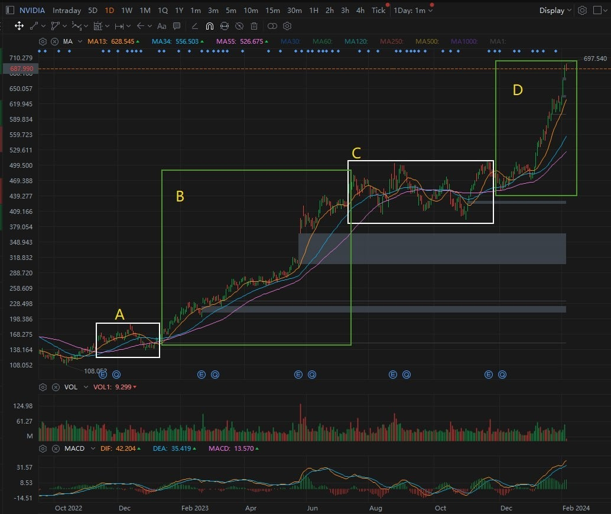
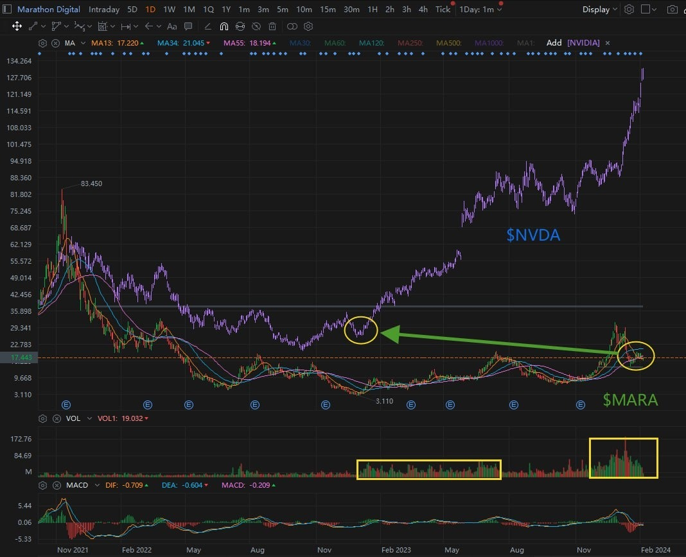
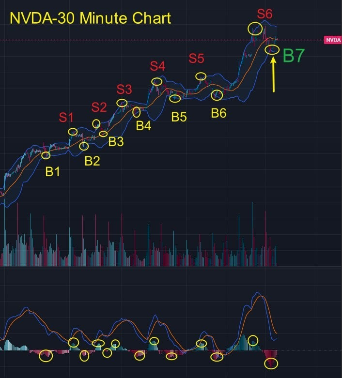
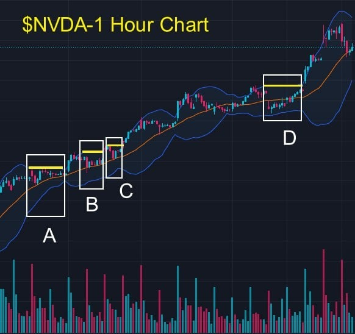
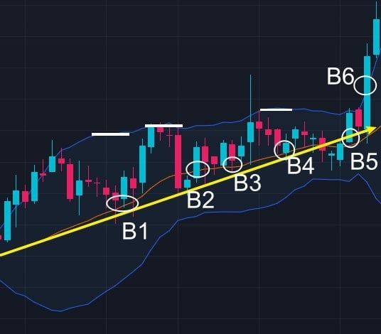

# Tuesday 20240206 (Special Guest: Noah Johnson)

EIF Business School Important Notice:

Noah Johnson was born on September 30, 1981, and currently resides in Long Island, New York. Noah Johnson witnessed Professor Linton Quadros's phoenix-like rebirth from the financial crisis in 2008 and later became a student of Professor Linton Quadros.

Noah Johnson is also an outstanding representative of EIF Business School's excellent students. After studying Professor Linton Quadros's Lazy Trading Method and various models of quantitative trading, Noah Johnson created his own 'α&β' trading system.

Starting from early 2018, Noah Johnson used the 'α&β' trading system with an initial capital of $3.7 million. By July 2022, the total assets accumulated to $152 million, with a total return on assets of approximately 4000%.

Today, Noah Johnson has come to EIF Business School to teach. Are you currently studying in a group at EIF Business School?

## 08:34AM

### Morning Review (α&β Strategy)

Ladies and gentlemen, good morning.

I'm Noah Johnson, and I'm deeply honored to have been asked by my mentor, Professor Quadros, to return to EIF Business School for the 14th session internal share. Thank you all for the warm welcome; it instantly takes me back to when I first started following Professor Quadros.

The difference is, back then, it was a bear market, but now, we're in a raging bull market.

That was in 2008, during the global financial crisis when the market was in chaos.

I was much younger, and the market's collapse and uncertainty left many investors in dire straits.

## 08:49AM

During my moments of lost, I was fortunate enough to witness the legendary deeds of my mentor, Professor Quadros. He is truly a courageous and wise man. I found an idol to follow and was lucky enough to become his student.

So, when I first started learning, it wasn't just about the techniques, but witnessing the transition of an era and how the trailblazers of that time navigated out of the mire to rebirth. From that moment on, I believed that anything is possible in the financial markets. That quickly helped me to define my direction and goals in life.

## 09:10AM

This strategy is one of the commonly used fundamental strategies: the α&β stock strategy.

Every stock has its unique trend and volatility. Alpha (α) represents the long-term trend, while Beta (β) represents volatility. Stocks with good medium to long-term trends and high volatility are considered the best for the α&β strategy, like $NVDA that my mentor shared at the beginning of January.

The approach to these kinds of stocks is straightforward. I use a separate account to trade them, essentially going all in. Half of the funds are allocated for medium to long-term holding, and the other half is used to capitalize on short-term scalping.

## 09:51AM

As shown in the chart, when the MA55 is trending upwards, I primarily hold a full position in stocks, like during segments B and D. When the MA55 hasn't turned downward and the MA13 is entwined with the MA34, I use the other half of the position for short-term trading and scalping, as seen in segments A and C.

After achieving multiple successes with the 'α&amp;β stock strategy,' I gradually started to use and confirm a few other sub reliable strategies: satellite strategy, hedging strategy, and leverage strategy. Fortunately, I've managed to achieve some results.

## 10:13AM

I'm not as outstanding as my mentor described; I simply followed his teachings.

The investment market is quite brutal, so it's truly an honor to encounter good teachers and friends. I believe my success is not only due to learning his methods but, more importantly, because I think his investment philosophy is very correct. He often says investing in stocks is like investing in the country, so we should embrace stocks that have value and dreams. I think his investment portfolio with $NVDA, $TSLA, $MSTR are all excellent choices. Their mid to long-term investment logic is very sound, and growth expectations are certain, so it's definite that one can achieve excess returns over time.

## 10:17AM

Of course, if you want to increase trading frequency, add short-term protective measures, enhance flexibility, and make trading more enjoyable, the α&amp;β strategy can achieve that.

Yesterday, my mentor mentioned how the current policy environment makes trading challenging, so incorporating a short-term trading style can help us better achieve our profit targets. Therefore, today I'll share a short-term trading target.

We are currently in a period dense with earnings reports, which presents many opportunities. Utilizing options arbitrage is also a fascinating choice.

## 10:27AM

Imagine I'm really bullish on a stock, and its mid-term buying opportunity has arrived, but short-term bearish factors might not be entirely off the table yet. So, my take on it would be: bullish in the mid to long term, but there could be a dip in the short term. Take $TSLA, for example, a stock that perfectly illustrates this scenario. I could add a short-term put option for protection. If the bearish news fades away, my stocks are poised for a handsome gain. If it dips, the stocks might not fall much, but the put option contract is likely to rake in a significant profit, controlling risk while often securing a tidy sum from the options trade itself.

## 10:40AM

Take $MSTR, for example, set to release its earnings report after today's close.

The data I've come across points to an earnings per share (EPS) of $0.21 (a year-over-year increase of 101.0%), with revenue expectations around $132.18 million (a year-over-year growth of 0.3%). Overall, the data leans positive, so I could totally go for a short-term call option. If luck's on my side, I could score a massive return, given the broader potential for short-term options.

Earnings season is a golden opportunity, offering us plenty of chances to profit. Employing such a strategy boosts the flexibility and diversity of our trades, provides a safety net, and injects a dose of fun into the whole process.

## 10:53AM

Lol, it's like walking my dog, which orbits around me but has a wider range of motion. When strangers approach (seen as risks), it protects me.

While option strategies are always at my disposal, I don't use them for all stocks at all times. Take $NVDA, for instance; I lean more towards the α&amp;β strategy because its trend is just too good. Even when I do use options, I mainly go for call options when the stock price dips, only considering put options moderately in particularly harsh conditions.

## 11:04AM

Responding to popular demand, today I'm sharing a stock I'm optimistic about - $MARA. This is a stock suitable for both mid and short-term strategies, and its current pattern resembles $NVDA's trajectory in January 2023. I'm also quite bullish on crypto concept stocks. This company is in the crypto mining business; if those mining Bitcoin aren't making money, who would be willing to mine? So, its investment logic differs from $MSTR's. $MSTR benefits from BTC price fluctuations, while $MARA enjoys long-term steady growth. This company has excellent performance, but it's not yet reflected in its stock price. The recent trading volume has started to surge, indicating a great opportunity to get involved. Plus, its volatility is higher than $MSTR's, making it particularly well-suited for short-term trading.

## 11:15AM

I've noticed some friends asking about EIF tokens. This is precisely the last piece of advice I'd like to offer everyone.

I've been following my mentor, Professor Linton Quadros, for over a decade now, and the growth and development of EIF Business School from its inception in 2011 fully reflect his values and vision.

In the realm of investor education, I've never seen anyone else adopt 'Students' interests first' and 'Practice is the best method of teaching' as their educational philosophy. This is the foundation upon which EIF Business School has flourished. I consider myself a representative of the EIF Business School student body, a testament to my mentor's meticulous guidance and my own efforts. I've also seen many others working hard and learning just as I have.

## 11:35AM

The issuance of EIF tokens was a visionary move; it solved the problem of funding for research and development and successfully nurtured the grand project AI ROBOTICS PROFIT 4.0. As the school grows and with the successful development of AI ROBOTICS PROFIT 4.0, along with its future listing, I believe the EIF token will turn into a golden egg. Currently priced at around $0.53, you might see its value climb to $1, $2, $5, or even $10 this year.

I feel I have the authority to speak on this because the α&amp;β trading system is just a tiny branch of AI ROBOTICS PROFIT 4.0. Therefore, the EIF token not only represents the commercial value of AI ROBOTICS PROFIT 4.0 but also reflects the bright future of EIF Business School! You are lucky to have received these gifts and should cherish them.

Thank you, everyone. My sharing for today is complete. Please pay more attention to the mentor's closing course.

## 02:38PM

### Closing Commentary

Dear friends, good afternoon.

Thanks to Noah for his excellent presentation this morning, where he shared his α&amp;β trading system and its four core strategies. He also shared some interesting trading patterns during earnings season, our bullish stock option strategies, expectations for $MSTR's financial reports, and introduced a low-priced but highly potential bullish stock, $MARA.

Years ago, like many friends, he was interested in investing but lacked a method. Now, not only has he created his own trading system, but more importantly, he has achieved commendable success, which is worth learning from by everyone.

There is no such thing as wealth that comes without effort, and there is nothing new on Wall Street. Every trade and investment is the fruit of hard work and intelligence. Today, I will share a few especially important topics, please read carefully.

## 02:58PM

First, let's reinforce a key lesson: using Bollinger Bands to identify support and resistance lines.

Since recommending $NVDA at the beginning of last month, its stock price has soared by +34%. However, during this process, the stock price fluctuated.

In the 30-minute trend chart, a clear pattern emerged, marked by buy points B1, B2, B3, B4, B5, B6, B7, and sell points S1, S2, S3, S4, S5, S6.

Did everyone notice that each time the price retraced to the middle or lower band, it often formed a new buying opportunity?

As mentioned in the course: when the Bollinger Bands are trending upwards, the middle and lower bands provide stronger support.

With the trend chart, have you all grasped this key lesson? Isn't it quite simple?

Of course, in future courses, I will share methods to precisely determine these buying and selling points.

## 03:12PM

Due to $NVDA's price drop in the morning market, it led to a pullback in the stock index; during the mid session, the price found support at the lower Bollinger Band on the 30-minute chart and rebounded, driving the stock index to continue its upward trajectory.
This demonstrates its strong leadership!

By employing reverse thinking, considering its strong leadership, if it continues to rise, it is highly likely to drive the stock index upward.

Today's trading volume did not show any particularly large patterns, and it appears to still be very healthy. Moving forward, we will focus on whether the price can continue to reach new highs.

Many friends have achieved exceptional returns with this bullish stock and may be concerned about when to sell.
My view is very clear: as long as the upward direction of the midline of the daily Bollinger Bands does not change, it can be firmly held!

Because the midline represents the trend, aren't Bollinger Bands both simple and practical, friends?

## 03:52PM

Returning to basic logic, if the stock index cannot continue to rise, discussing which bearish factors will gradually disappear and which bullish factors will continue to play a role is pointless.

Likewise, if a stock does not have strong bullish logic supporting it, discussing it every day after buying is also meaningless.

If we are in a bear market, where making a profit is extremely difficult, we might as well spend our time traveling with family, attending gatherings, visiting art exhibitions, listening to music etc... don't you agree?

The three bullish stocks we hold represent three important industries: artificial intelligence, sustainable energy, and cryptocurrency.

Many people are familiar with artificial intelligence and new energy vehicles because they are rapidly developing and can be seen everywhere in daily life, making their investment logic very clear.

## 04:07PM

However, for many friends, the concept of cryptocurrency is not very clear.

Moreover, $MSTR is one of the main stocks we hold.
Therefore, it is necessary for us to deeply understand the investment logic behind it.

Human evolution has gone through many stages, such as domesticating animals and cultivating crops, inventing the steam engine and electricity, developing gene editing and nanotechnology, etc. Each step has brought about the development of technology, economy, and civilization.

Historically, we have experienced the three main industrial revolutions, which have ushered in three eras: the steam engine era, the electricity era, and the internet era.

Which technology will create the fourth industrial revolution?

Isn't this question particularly important, friends?

This is not just an immensely important investment theme but also a theme that changes the way humans live. Do you all agree?

## 04:24PM

Everyone's answer might be different.

- Some might say it's artificial intelligence and machine learning. Because processing big data and performing complex tasks are the core functions of this technology, such as the Ai4.0 system, which is developed based on two major modules: big data analysis (summarizing the past) and machine learning (learning the future).

- Others might say it's the Internet of Things (IoT), achieving interconnectivity and sharing among all things to better manage society.

- Some might point to biotechnology, such as gene editing, which can improve the environment and extend life spans.

- Others might mention energy transition (sustainable energy) or quantum computing, as energy revolutions and cracking the codes of the future are vital for humanity's continuation!

I believe these answers are all very correct, but I have a different perspective.

## 04:40PM

I believe that with the rapid development of technology, humanity is losing something crucial: mutual trust.
It is precisely because of this lack of trust that invasions of privacy, criminal activities, social division, religious conflicts, and even wars occur...

Establishing trust is a core element in achieving cooperation, solidifying interpersonal relationships, improving efficiency, and driving social and economic development. Do you all agree?

Let me give a simple example to illustrate the importance of establishing trust.
Taking the launch of the 'AI Robotics Profit 4.0' investment system application as an example, we have set the price at $1 million per year for the institutional version and $50,000 per year for the personal version (the top ten outstanding students in this period can receive a free one-year subscription to either the institutional or personal version).

How should I establish trust and convince everyone of its value?

## 04:59PM

I've established a rule to collectively 'record trust' and 'prove value':

1. Through internal sharing via WhatsApp group, I explain the Ai4.0 system to everyone, letting everyone understand its structure and operating principles; and I enable each person to learn and use it, achieving stable profits.

2. Those who participate in proving this and engage in learning can also earn 'investment learning points' and receive rewards through the 'AI Robotics Profit 4.0 Internal Sharing Learning Incentive Mechanism'.

3. Participants who, through practice, verify the profitability and stability of the Ai4.0 system, choose to purchase and become users of the Ai4.0 investment system application.

If any user expresses dissatisfaction in the subsequent use process, I will refund the principal and compensate $50,000.

## 05:17PM

The following content is crucial.

1. Many people became interested and joined, recording this rule, which constitutes a 'distributed ledger'.
If I breach any part of it, the business venture fails.
Because the information is immutable, it ensures trust is unalterable. This is the essence of blockchain technology.

2. Participants who engage, record, and prove this matter can earn 'investment learning points' - akin to cryptocurrency miners.

3. The tools for recording include smartphones, computers, notebooks, and pens - these are equivalent to 'mining equipment'.

4. Rewards are obtained through points.
This reward is akin to 'Bitcoin', which is generated in a similar manner.\
So, have you earned your 'investment learning points' today?

5. Those who participate in proving and recording this matter are like a 'chain'.\
Multiple people together form a 'block'.\
Multiple blocks come together to form a 'blockchain'.

## 05:34PM

Returning to the topic, friends, is the sales plan I've outlined a simple, effective, and genuine way to prove value and establish trust?

Indeed, I am currently implementing this plan and intend to continue in the future.

So, have you understood blockchain technology?
Its essence is a distributed ledger - everyone records the event. This leads to immutable information, or in other words, unchangeable trust.

Doesn't this effectively solve the problem of trust?

The steam engine liberated human productivity, electricity solved basic human needs, and the internet completely changed the way information is transmitted.
Thus, as a technology that constructs trust, blockchain could fundamentally change the way value is transmitted in human society!

Yes, this is a profound conclusion!

## 05:53PM

Our ancestors admonished us to bestow kindness on the world for our own redemption, to fill society with justice and freedom.

This is the soul of our nation; in the face of faith, money is worthless. Our generation bears the mission of saving the world.

I believe blockchain is a technology that aligns with the values of our nation. Do you agree?

Cryptocurrency is a core application of blockchain technology, so the market's prospects are broad.
$MSTR, as one of the most authentic beneficiaries currently, does it deserve a place in our investment portfolio, friends?

This is the fundamental logic of investing.\
This is a return to the essence of investment.\
This is about embracing dreams and the future.\
This is the confidence with which I speak about it, and the fundamental significance of this matter.

## 06:01PM

To excel in investing, one must return to basic logic, making our investments more relaxed and effortless.

How can we minimize risk and maximize profit? Technical learning is essential.

Next, we move into today's course sharing segment.

Bollinger Bands Trading Secrets (2): The Strongest Adjustment Pattern.

In trading, we rarely encounter this pattern: when the upper Bollinger Bands is running horizontally, but the middle and lower bands are still trending upwards.

It represents that the price is in an adjustment phase.
This is an hourly trend chart for $NVDA. When segments A, B, C, and D exhibit such a pattern, the stock price slightly adjusts before continuing its strong upward trend.

## 06:14PM

If the price is in a long-term uptrend, this pattern indicates a strong adjustment during the rise.

After the adjustment, it's highly likely to continue the original trend.

Trading secrets are as follows:

1. Going long
   - Consider reducing positions when the price is near the upper Bollinger Band.
   - You can also continue to hold positions and add to them when the price retraces to the middle band, for example, buy points B1, B3 and B4.
   - If the price falls below the middle band, wait and observe; if the price breaks above the middle band again, it's a buying opportunity, for example, buy points B2, B5.
   - If the price strongly breaks through the upper band, treat it as an acceleration of the market trend, with the breakout moment constituting a buying point, for example, buy point B6.

2. Going short
   - The situation is just the opposite.

## 06:30PM

### Applying knowledge, today's Achievement Verification Rewards

1. Did my sales rules for Ai4.0 today effectively solve the trust issue? Do you agree with me that blockchain technology can well resolve trust issues? Could this technology potentially become a core technology of the fourth industrial revolution? Than how will $MSTR benefit? (can earn 30 investment learning points.)

2. Please use Bollinger Bands to identify the 'strongest adjustment pattern' and try to develop a trading strategy.(can earn 20 investment learning points.)

I am delighted to see friends actively pursuing progress. I suggest everyone take good notes on the key points in the course. This not only allows you to earn investment learning points to exchange for high-value gifts and participate in the lottery but also facilitates rapid improvement. This term, I will focus on and cultivate some outstanding students. You can inquire about your cumulative points daily through the points assistant.

Tomorrow morning, Noah will continue to share short-term live trading techniques with everyone, so please pay attention to the group messages during trading hours.
Have a pleasant day!
