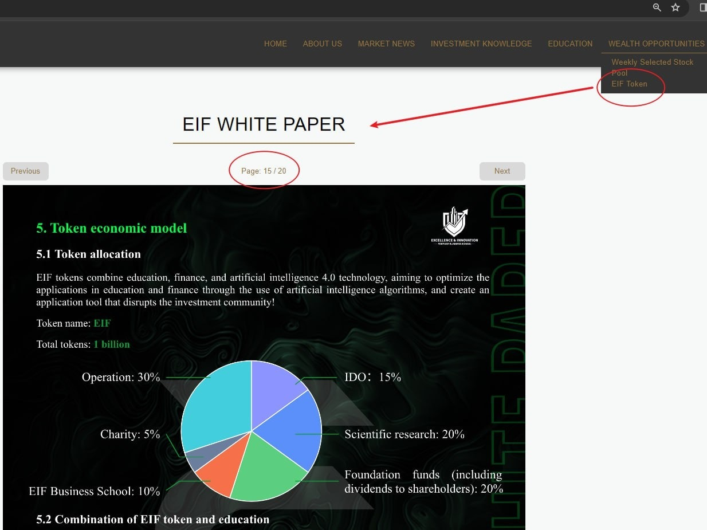

# Wednesday 20240207 (Guest: Noah Johnson)

## 08:29AM

### Morning Review (α&β Strategy)

Ladies and gentlemen, good morning.

I'm Noah Johnson, and I'm thrilled we could meet. Yesterday, Professor Quadros provided an objective analysis of the challenges faced by the US Dollar Index, the 10-year Treasury yield, the VIX fear index, and key points during the trading of our holdings in $TSLA and $NVDA. Today, I'll be focusing on these changes with you and seizing the trading opportunities that come our way during the session.

## 08:41AM

Looking at the broader environment, today's market sentiment is quite positive. The VIX index continues to fall and remains low, providing excellent trading conditions. Therefore, I'll continue to hold or buy stocks today. It's understood that our current portfolio mainly consists of $NADA, $TSLA, and $MSTR, and some of you have also bought into $MARA. It shows that there's a good level of recognition among us for stocks related to artificial intelligence and cryptocurrencies. So, let me share a few important pieces of information with you next.

## 08:57AM

**Key Information 1:** The U.S. Securities and Exchange Commission (SEC) has passed a significant rule that includes cryptocurrencies under federal securities laws.

This is of great importance. Bitcoin, as a crypto asset, has always had its legal status in contention. This legislation provides Bitcoin with a clear legal status, recognizing and protecting its legitimacy, and enhancing its international standing as it has become a mainstream investment asset. Furthermore, with the SEC as the top regulatory body, more transparent regulation will be provided, leading to a more standardized market development. This makes investors more willing and confident to participate, thereby bringing in additional capital. This move will likely drive up the price of Bitcoin, benefiting the cryptocurrency market and related stocks.

## 09:11AM

Given that this legislation is a key positive development, it's puzzling why the cryptocurrency market and $MSTR haven't seen a significant rise. Could a hedging strategy be the answer here?

**Key Information 2:** $MSTR's financial report is a mixed bag. Compared to the same period in 2022, total revenue for Q4 2023 fell by 6.1%. However, what's truly noteworthy is $MSTR's robust gross profit in the fourth quarter, hitting $96.3 million with a gross margin of 77.3%, which is impressively high.

So, my takeaway is that the stock has immense future potential with limited short-term downside, so there's no need to worry. Should the price face an unexpected downturn, like breaking below the daily support line, I believe that would be the prime moment for hedging.

## 09:35AM

**Key Information 3:** The SEC has delayed its decision on the Invesco Galaxy Ethereum ETF.

This explains why, even after the groundbreaking news of cryptocurrencies being included under federal securities law, we didn't see a massive surge in crypto prices.

But, let's not view this as bad news; on the contrary, it's another major positive.

Last year, I followed Prof. Quadros's $COIN trading strategy when Bitcoin and $COIN were priced around $26,000 and $80, respectively, and the SEC had postponed its decision on Bitcoin ETFs several times. And what happened next? Well, we all know the story.

I'm pretty confident about two things. First, a delay is not a denial, so it's not bad news. Second, it's the uncertainty of policy that can lead to greater market expectations. I've seen firsthand the tug-of-war over Bitcoin ETFs, which ultimately led to a bull market. So, this piece of news remains a key positive indicator, mirroring past events.

Ethereum's trend looks really strong, with MA13 already turning upwards. My judgment is that it will see a significant rise this week, especially as MA13 crosses above MA55. Let's watch and verify this together.

## 09:50AM

You might be curious about why the moving averages I use differ from others. To put it simply, I have a fondness for utilizing moving averages, and MA13/34/55 are the three most effective ones identified through testing with my mentor's quantitative model.

For instance, yesterday, Prof. Quadros pointed out that $NVDA hit a buy signal B7. Looking at the 1-hour chart, it was indeed the case. This also underscores the significance of moving averages turning and crossing, as seen in the previous instances where two moving averages crossing upwards led to a surge in stock prices. The current upward turn of MA13 and its subsequent crossing above MA34 are considered buy signals.

Thus, by analyzing the Ethereum daily chart, I pinpointed this opportunity, which is almost certain to occur this week. So, we can anticipate a collective surge in crypto-related stocks by next Monday, making this week an excellent time to buy in advance.

## 10:05AM

No matter the technical indicator, it's all just a piece of tangible data for technical analysis or quantitative trading. Throughout my learning journey with Prof Quadros, I've gained an immense wealth of knowledge. I've witnessed firsthand the creation and refinement of his Lazy Investor System and Quantitative Investment System, as well as the upgrades to the AI ROBOTICS PROFIT system, undoubtedly a magical tool benefiting investors. My 'α&β' trading system isn't a robotic trading system but rather one that relies on human decision-making. It was initially inspired by my mentor's quantitative model because I discovered within it a strategy with a very high success rate: the invaluable moving average system MA13/34/55.

I've noticed a passionate desire among us to learn and improve ourselves. In future shares, you can look forward to my application of these insights. Thank you, folks, for today's sharing session. Please pay more attention to Prof Quadros's closing course.

## 12:42PM

Folks, Bitcoin is poised for a significant volume surge today, signaling that the positive effects of the two key events I mentioned are kicking in, what an golden opportunity this is. Plus, the stock market is strengthening as anticipated, so don't hold back on buying $MSTR or $MARA. Their volatility is higher, and the buy orders are ramping up – now that's what I call great news.

## 02:33PM

### Closing Commentary

Dear friends, good afternoon.

Thanks to Noah for his excellent presentation this morning. During our portfolio's price dip, he not only accurately identified buying points but also provided important interpretations of the market investment atmosphere and three key pieces of information.
The market has validated his views.

Noah is one of my most outstanding students. I have witnessed his growth every step of the way. Like most successful individuals, his achievements are not due to intuition but to diligence.

In this session's sharing, I've noticed many students also possess such potential. In the future, you could benefit from interacting more with Noah.

Investment self-awareness is divided into four stages:

1. Not knowing what you don't know: Lacking fundamental awareness of the field.
2. Knowing what you don't know: Recognizing one's deficiencies and beginning to learn about investing.
3. Not knowing what you know: Through enhanced learning, knowledge and skills are stored in the subconscious.
4. Knowing what you know: Effortlessly applying knowledge and skills.

Friends, which stage do you think you are in?

## 02:49PM

For example, let me ask everyone a few questions, and you'll know which stage you're in.

- Why do the VIX fear index, US Dollar Index, international crude oil index, and 10-year Treasury yield often show a negative correlation with stock indices?
- What was the rationale for identifying the buying point through the 30-minute trend analysis chart of $NVDA yesterday?
- What subtle changes are present in the weekly chart of the EIF token, and how do they match with the Bollinger Bands techniques shared recently?
- Have you learned about the support line touched by today's lowest point in the $MSTR candlestick chart?
- Why does $MSTR have two bullish market engines?
- We often discuss 'halving'; what does it mean? Why is it so important?

---

If you can provide a full mark answer to the above questions, it indicates you have the potential to enter the fourth stage.

Friends, why not test your knowledge of investing?

## 03:17PM

At this moment, I believe many friends feel the same way I do: we are fortunate.

We live in a great nation, we are at the beginning of a bull market, we have created a pleasant investment learning environment, and every topic we discuss can lead to an increase in wealth...

Today, I will share with you in-depth on a few important topics. I believe that once you understand these, you will have a clearer perception of the current market, investment targets, and learning.

## 03:21PM

Yesterday, I mentioned that if we were in a bear market, making a profit would be incredibly difficult, and discussing stocks every day wouldn't be very meaningful. I also don't want to enrich myself by shorting the stocks of my own country, a lesson, experience, and realization from 2008.

Currently, we are at the beginning of a bull market, primarily because the expectation of the Federal Reserve cutting interest rates is certain, which is a fundamental concept.

The Federal Reserve cutting interest rates is seen as support for the economy, lowering borrowing costs for businesses and individuals, which is more conducive to business expansion and consumer spending, leading to a positive cycle in the overall economy.

The stock market is a barometer of the real economy. The real economy gets a substantial boost from the favorable action of the Federal Reserve's rate cuts, naturally increasing its value and investor enthusiasm, thereby driving the development of the bull market.

I believe friends can understand this basic logic, right?

## 03:34PM

For this reason, we should join the market earlier, which is the first reason I've gathered everyone as quickly as I have this year.

Therefore, I sincerely advise everyone to pay more attention to the current investment opportunities. A few months later, when the interest rate cuts officially begin, if you then increase your investments, you will certainly be far behind others.

In such a favorable environment, the three bullish stocks in our investment portfolio are leaders in their respective industries, and their future prospects are worth imagining.

As for me, I am not too worried about $NVDA and $TSLA. $NVDA has already provided many of our friends with returns of over 30% or even 40%; and $TSLA is developing in a good direction.

Conversely, I pay more attention to the trend of $MSTR, as it is one of our major holdings. We have high expectations for it, and I look forward to its exceeding expectations.

Do you share my thoughts?

## 03:53PM

However, I am very confident in my judgment, otherwise, I would not have shared the logic of blockchain yesterday: it solves trust issues, changes the way social values are transferred, and is most likely to become the technology that triggers the fourth industrial revolution, just like the internet did for the third.

In fact, as far as I know, many friends lack investment logic in this area.

This will not prevent you from seizing the dividends brought by this round of transformation. Compared to the average person, your investment results will certainly be excellent.

But this will make a significant difference between your wealth and that of extraordinary individuals; excellence cannot compare with exceptional.

Without the consciousness to pursue excellence, when you encounter a certain investment opportunity, you will always be hesitant. I believe everyone has had this kind of experience, right?

Each one of you can surpass Noah. The change starts now, with the investment logic of $MSTR, beginning with learning from the Ai4.0 course.

## 04:09PM

Why can the investment logic for $MSTR propel us towards exceptional is because it benefits not just from the stock market bull run triggered by interest rate cuts but, most importantly, from the cryptocurrency bull market brought about by 'halving'.

The halving mechanism of Bitcoin mining rewards is an immutable feature built into the Bitcoin protocol, aimed at controlling the issuance and circulation of new bitcoins.

The halving reduces the rate at which new bitcoins are introduced to the market, leading to a supply shock, especially when demand remains the same or increases.
The reality is that as the generation of bitcoins becomes increasingly scarce and the demand for them grows, they become more precious than gold.

The dates of the previous three halvings are: November 28, 2012, July 9, 2016, and May 11, 2020.

This chart should be familiar to you, right? What do you see happening? Do you remember how the $350,000 result was calculated?

And the fourth halving is happening this April!

## 04:20PM

When you need a piece of beef to make a steak, but the supermarket only has 100 pieces, and there are 1,000 or even 10,000 people who want it, what will happen?

For this reason, on January 11, the SEC approved the BTC spot ETF applications of 11 financial institutions; today, the SEC has incorporated BTC into federal securities law... These are all milestone events!

So, friends, is $MSTR not at a new starting point driven by two bull market engines?

Is it not one of the best choices to lead us towards exceptional?

Should we not hold onto it, or even keep adding to our positions?

Therefore, buying it recently is undoubtedly a wise choice, becoming the second profit growth point after $NVDA. This was my judgment last week, and we will soon see rapid profit growth, perhaps as early as tomorrow.

## 04:36PM

The cryptocurrency market is one of the best applications of blockchain technology, so I see this as a tremendous opportunity!

Coincidentally, around 2018, our EIF Business School also underwent two significant technological reforms.

The first was before 2018 when, upon realizing the profound impact of artificial intelligence, I began developing the 'AI Robotics Profit' trading system based on quantitative trading: quantitative trading is about summarizing the past, while artificial intelligence is about learning from the future!

The second reform occurred in 2018 when I faced even greater challenges because the development of Ai4.0 was more difficult than I had imagined, presenting me with issues related to talent and funding.

To better protect the value of participants, I chose not to raise funds like investment banks but instead opted to finance by issuing cryptocurrency, thus EIF token was born.

## 04:58PM

Every candlestick in the EIF token (EIF/USDT) chart narrates a fascinating story from the past.

The trend chart not only reveals how previous bull and bear markets impacted the price but also records the shifts in market sentiment following each technological success and failure.

Who is supporting its price? I believe it's those like-minded individuals who share my dreams.

Friends, from the perspectives of stock trading and social value, the EIF token encompasses financial, educational, and charitable attributes. Do you think it is undervalued?

In saying this, I am not insisting that you must support my EIF token, but I am responsibly expressing the future plans of our EIF Business School.

Consider this: if the 'AI Robotics Profit 4.0' system's current comprehensive internal testing is successful and it soon goes public, how should its value be estimated?

## 05:17PM

Therefore, this comprehensive internal testing plan is of utmost importance.

1. I need more people to pay attention and offer their support.\
One reason is to gather ample data to verify its stability and overall performance; another is to broadly accumulate popularity and reputation.\
I am working hard on this, and I thank you all once again for joining! I am truly very grateful to everyone!

2. I hope to enter the comprehensive testing phase as soon as possible.\
I believe, like me, you all are eagerly anticipating this day. I am working to expedite this process.

'AI Robotics Profit 4.0' is the culmination of my life's work!

The belief in professionalism as the sole content of one's calling, trusting that through hard work we can please God, and that diligence in wealth is the only means to rebirth. This is the revelation given to me by God!

Therefore, I am personally hosting this session, proclaiming to the world the original intent behind creating EIF Business School; although many say this is a revolutionary investment advisory tool, I am merely changing myself and dare not claim to change the world.

## 05:31PM

The EIF token and 'AI Robotics Profit 4.0' belong to society, including the tokens given away as part of the 'AI Robotics Profit 4.0 Internal Sharing Learning Incentive Mechanism' we've established, which are also within the scope of our planning.

You can learn about these through our official website and the published white paper.

If you, like me, recognize its value, please cherish it and hold onto it, because if the work progresses smoothly from here on out, its future value will be immense!

Of course, within the scope of our planning, I will give away more, so friends can acquire more rewards together through this pre-arranged learning mechanism.

Only when you understand the operating principles of Ai4.0, will you know what it consists of, and only then will you be able to use it with ease in the future.

This is why it's necessary for everyone to understand its basic structure now. Can friends understand this?

## 06:09PM

I believe you will soon witness the arrival of this series of plans. How are you preparing to welcome it?
Friends, are you willing to continue supporting these important actions of ours?

When I shared about the EIF token in the 'Top 10 List of Hot Investment Targets in 2024,' its price was around $0.62; now, it is about $0.75.
Many friends who have already obtained EIF tokens are concerned about its trend. Today, let's reinforce several important techniques through the EIF token:

1. The upward direction of the three bands in the weekly trend chart indicates a healthy uptrend.
2. The price moves up after testing the middle band (at point C), which is interpreted by Bollinger Bands basic application knowledge (2).
3. At point A, it presents the Bollinger Bands trading secret (2) - the strongest adjustment pattern.
4. At points B and C, the upward turn of the upper and middle bands indicates a strengthening trend.

These key points are all based on the Bollinger Bands knowledge and techniques I've already shared. Have you grasped them?

## 06:17PM

Practical experience is the best way to teach, whether with EIF tokens or the stocks we hold, all serving as excellent case studies for learning.

For example, yesterday I previewed a 30-minute buying point for $NVDA, and today we verified the effectiveness of the method. Which Bollinger Bands technique does this use?

Next, I will share a new lesson.

Bollinger Bands Trading Secret (3): Horizontal Movement of Bollinger Bands

- When all threeband of Bollinger Bands move horizontally, the main strategy is to sell high and buy low: sell near the upper band and buy near the lower band.
- This is especially effective the first time the price touches the upper or lower band.
- The larger the price difference between the upper and lower bands, the greater the volatility, the larger the profit range, and the greater the value of the trade.
- Many times, the upper and lower Bollinger Bands will not show a very complete horizontal movement pattern. As long as the middle band is in a horizontal state, this strategy can be used.

## 06:30PM

### Applying Knowledge, today's Achievement Verification Rewards

1. Would you like to support the future plans of our EIF Business School? For example, what are your thoughts on the comprehensive internal testing plan for the Ai4.0 investment system? Would you like this plan to commence sooner? (can earn 30 investment learning points.)

2. Please use Bollinger Bands to identify the 'Horizontal Movement of Bollinger Bands' pattern and try to develop a trading strategy. (can earn 20 investment learning points.)

I am delighted to see everyone actively pursuing progress. I suggest you all take good notes on the key points in the course, which will not only allow you to earn investment learning points to exchange for high-value gifts and participate in the lottery but also facilitate rapid improvement. This term, I will focus on and cultivate some outstanding students. You can inquire about your cumulative points daily through the points assistant.

Tomorrow morning, Noah will continue to share short-term live trading techniques with everyone, so please pay attention to the group messages during trading hours.

Have a pleasant day!
