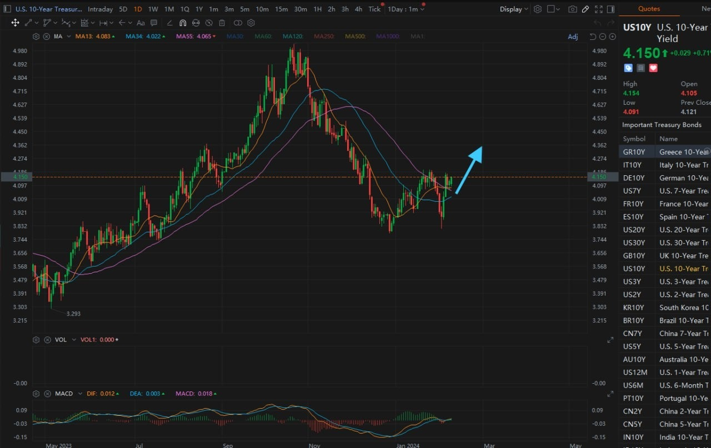
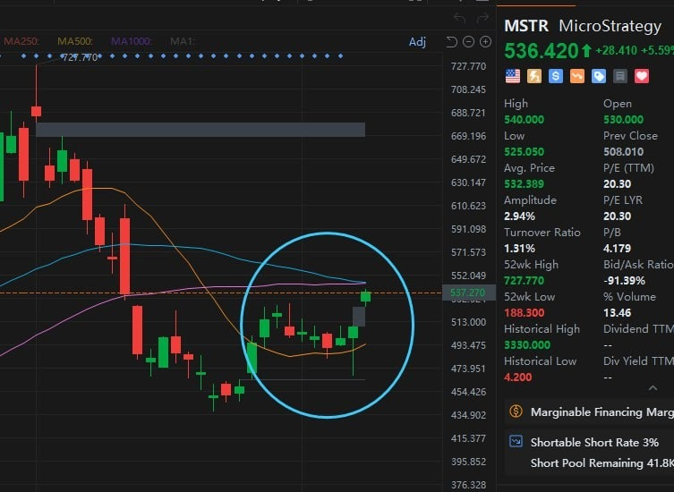
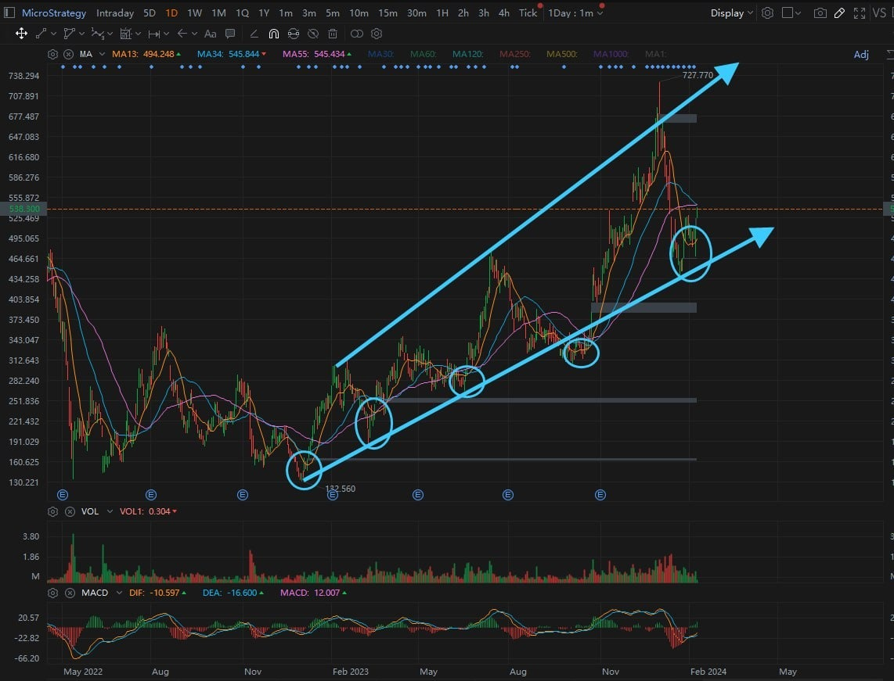
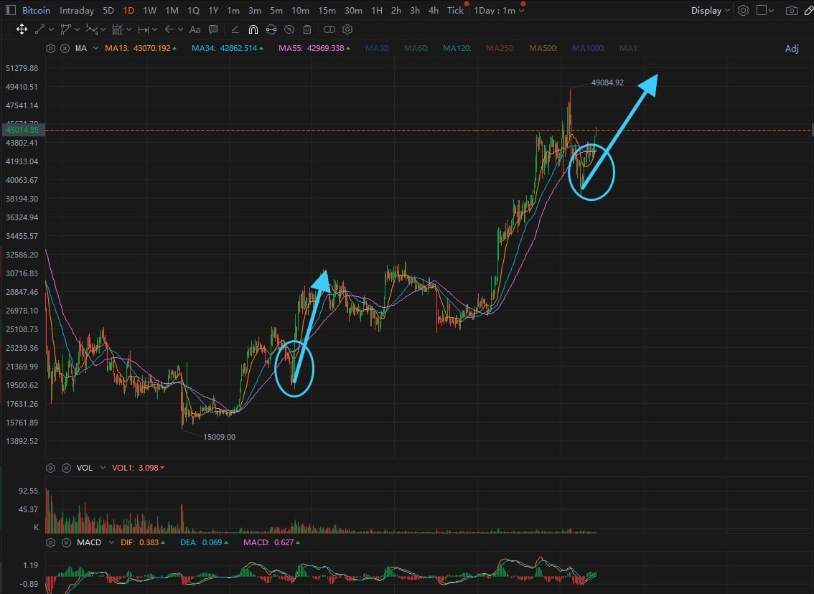
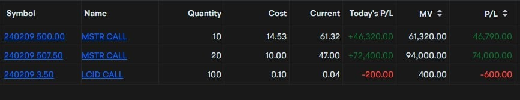
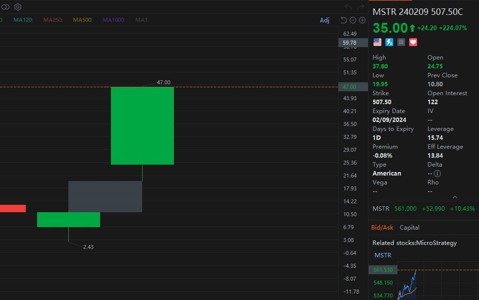
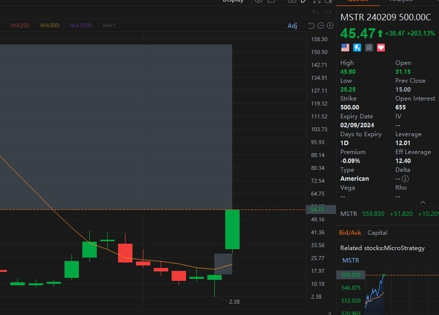
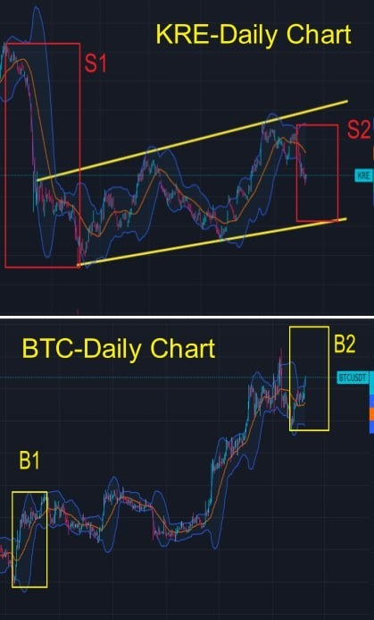
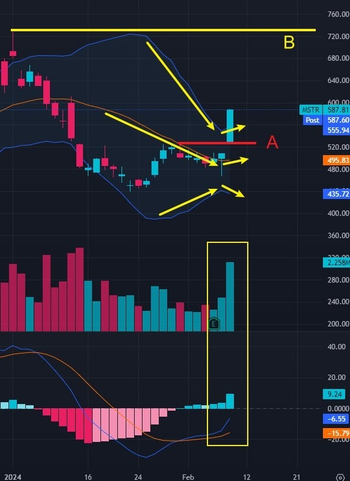
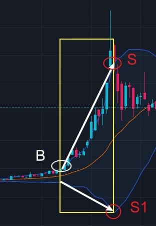

# Thursday 20240208 (Guest: Noah Johnson)

## 08:30AM

### Morning Review (α&β Strategy)

Ladies and gentlemen, good morning. I'm Noah Johnson, and I'm thrilled we're meeting again. Yesterday, Professor Quadros shared his unique insights into this bull market, so we need to boldly seize the opportunity and increase our positions in the stock market. I shared three key pieces of information yesterday, which were validated by the market, and the cryptocurrency market has begun to strengthen. What challenges will we face in today's session? What important technical signals have our beneficiary stocks released? Will they continue to strengthen today, and is it a good opportunity to increase our positions? I'll be closely watching these changes with you and seizing the trading opportunities during the session

## 08:40AM

The federal government sold a record $42 billion in 10-year U.S. Treasury bonds yesterday at a yield lower than expected. My goodness, the speed at which the federal government is printing money is simply astounding, isn't it? It's infuriating. The massive issuance of government bonds will lead to an increase in supply, a drop in bond prices, a rise in yields, and will also fuel inflation. This isn't good news for stock indices. So, from a super short-term trading perspective, I believe it makes sense to reduce holdings in $NVDA and $TSLA to capitalize on the price differences; mid-term trades can overlook this impact. Crypto-related stocks can also completely ignore this effect.

## 08:56AM

I've heard that many friends bought into $MSTR or $MARA yesterday at around -4%, and today, they've already racked up gains of over +10%. I think that's a pretty acceptable profit. Short-term trading is all about seizing those outsized gains, following your mentor to catch the mainstream direction, and nailing the operation of selected stocks for continuous surprises. Friends, are you ready to add to your positions? What are you waiting for? Especially those who don't own these stocks yet, hurry up and seize the moment because the opportunity for a strong reversal is already here!

## 09:13AM

Why is this considered a prime moment for a strong reversal? Let's look at $MSTR for instance. The candlestick from yesterday holds significant importance: its long lower shadow is interpreted as a reversal signal; the location of the lower shadow's lowest point precisely aligns with a support level on the left, seen as an indicator of buyers moving in; moreover, the trend history where lows are progressively rising signals a trend gaining strength. Therefore, yesterday's candle plays an incredibly vital role, not merely indicating a short-term trend reversal but also signifying a mid-term trend reinforcement. Hence, we can confidently buy, hold, even increase our positions.

## 09:35AM

\$MARA's volatility has been more favorable, so many friends have already seen a 15% gain in just two days. Have you managed to do the same? Isn't it incredibly straightforward and simple? That's the joy of trading in mainstream concept stocks.

Next, I'll share a crucial point. Looking back historically, the upward turn of MA13 in the daily chart of $MSTR is worth its weight in gold. Every time there's a swing low, it's marked by the price retracing back above MA13, followed by the commencement of MA13's upward turn; and almost every time, it has led to doubled profits. So, we'll soon see such outcomes again, not just because of the nature of these two stocks, but also due to the increasingly strong cryptocurrency market.

## 09:49AM

Yesterday, I made it clear that the cryptocurrency market and related genuine beneficiary stocks would experience a breakout this week. My judgment was based on the trend of MA13 in Ethereum's chart, and you can refer back to my viewpoint from yesterday.

Today, I'm sharing a technical key point with you, still related to MA13.

Yesterday, in Bitcoin's daily chart, MA13 nearly simultaneously crossed above MA34/55. History tends to repeat itself in remarkable ways. The impact of the regional bank crisis in March 2023 (the collapse of Silicon Valley Bank) highlighted and validated the advantages of cryptocurrency's decentralization, as traditional banks are centralized. The market at one point considered cryptocurrencies a substitute for the traditional financial system. And yesterday, the SEC's inclusion of Bitcoin under securities law only adds to this narrative. The candlestick patterns and moving average data highly coincide with significant events, so my conclusion is clear.

## 09:58AM

So, as I told you all at least twice yesterday to seize the opportunity quickly. And I advised against buying $MSTR put options. I set up two small $MSTR call option contracts, 240209 500.00C and 240209 507.50C, which today both hit around a 200% increase —that's my satellite strategy at work. The best opportunity has passed and it is not recommended to buy now.

## 10:09AM

## 10:10AM

I may not have the grand vision like my mentor, and many of us might not possess such a broad perspective. However, this doesn't hinder us from making significant profits in the market, as candlestick charts reveal everything. We just need to thoroughly learn these techniques, effectively use the tools at our disposal, and in the face of equal opportunities, anyone can achieve their dreams.

With the impending launch of the AI ROBOTICS PROFIT system, students of EIF Business School will not only receive unprecedented benefits but also witness the dawn of a new era.

This is a shortcut to closing the gap with success, and you're even luckier than I am. For those interested in short-term trading, we can share insights and grow together. I'll share my contact info later.

Thank you, folks, for today's session. Please pay more attention to my mentor's closing course.

## 02:29PM

### Closing Commentary

Dear friends, good afternoon.

Thanks to Noah for his excellent presentation this morning. The stock and options strategies he shared are currently yielding exceptional returns.

Many friends who followed his advice to buy $MARA have seen returns of over 25% in just three days, as he mentioned, due to the stock's higher volatility compared to $MSTR.

Moreover, his own options strategy has garnered about 500% in profits.

Large accounts aiming for stable growth in total asset returns should embrace value and dreams, choosing a portfolio of industry leaders is a wise choice.
Small accounts looking to grow rapidly can reasonably pursue frequency, Noah's α&amp;β strategy is one of the few short-term trading styles I've seen that is well-balanced in offense and defense.

Noah is one of my best students and has set a great example for everyone. You should all learn from him. He will be happy to help everyone, and if you are interested in his trading style, feel free to reach out to him for advice with an open mind.

## 02:42PM

Why did we get this excellent entry opportunity before the surge in cryptocurrency beneficiary stocks? Have you all understood the investment logic behind it?

As cryptocurrencies make a strong entry, can the momentum of related beneficiary stocks continue?

What significant changes occurred in today's market? What challenges will we face next?

In response to the latest public opinion polls, how should the progress of Ai4.0 work be effectively advanced?

What kind of trend will the daily Bollinger Bands of $MSTR show, and how should we grasp the subsequent short-term and medium-term selling points?

Today, I will share these important topics, so please read carefully, friends!

## 02:55PM

$MSTR, $MARA, $COIN, $RIOT, $MIGI... all of these are core beneficiaries of the cryptocurrency market.
On one hand, they benefit from the current development phase of the cryptocurrency bull market, which I have already discussed in terms of the 'halving event's' engine effect yesterday.

On the other hand, they have gained from the SEC's incorporation of Bitcoin into federal securities law, with Noah providing an interpretation for everyone in a timely manner.

Additionally, the Ai4.0 system has provided clear guidance in tracking related targets.

Therefore, we have recently gained multiple early advantages, a credit to all of us, and we should give ourselves some encouragement!

Friends, can the current favorable situation continue?
Next, I will share a very important investment logic.

## 03:09PM

This Tuesday, I explained how blockchain technology solves the trust issue using the future sales plan of the Ai4.0 system. Do you still clearly remember the logic?

The core feature of blockchain technology is the 'distributed ledger', which can be simply understood as everyone recording the rules, leading to a significant disruptive feature of blockchain: decentralization.

For example, the issuance of currency by central banks, government management, etc., are centralized.

The disadvantages of centralized management are undeniable, such as corruption, inefficiency, insecurity, high costs, and more.

The collapse of Silicon Valley Bank last March is a typical negative outcome of centralized management, with the objective cause attributed to interest rate hikes, but the main reason being poor management, ultimately leading to the system's collapse.

Why is this event so important? Please read on.

## 03:22PM

Cryptocurrency is a core, mature application of blockchain technology.

So, its advantage of decentralization becomes particularly evident, but why is that?
While there are many arguments to be made, I'll simply state two points:

1. It doesn't rely on centralized institutions (banks and governments) to record transaction information. Instead, everyone can record information (distributed ledger), increasing trust, reducing transaction costs and risks, and improving efficiency.

2. Unlike traditional banks, cryptocurrencies are not controlled by any single centralized institution. Since the transaction records of cryptocurrencies are saved on the blockchain and protected by encryption algorithms, they possess a higher level of security.

This means, by comparison, people find that the collapse of Silicon Valley Bank could have been completely avoided. But why wasn't it?

The main reason lies in the lack of financial and managerial transparency, which ultimately boils down to 'centralization'.

Isn’t it very simple to understand it this way, friends?

## 03:39PM

Therefore, at that time, the regional bank index KRE collapsed, with a decline of about 50% (in the S1 range); in comparison, Bitcoin rose by about 50%(in the B1 range).

The 'AI 4.0-Expert and Investment Advisory System' displays important information:

- Bad debts in commercial real estate loans in our country are expected to surge this year, potentially forcing US regional banks like NYCB to set aside more provisions for bad commercial real estate loan debts, leading to a significant decline in these banks' profitability.
- New regulatory requirements may force regional banks to increase bad debt provisions to address commercial real estate loan risks.
Summary: This will exacerbate the already weak capital adequacy ratio of small and medium-sized regional banks.

As a result, KRE has recently seen a decline of about -13% (in the S2 range), corresponding to a rise of about +17% in Bitcoin(in the B2 range).

## 03:49PM

The current adverse environment for regional banks wasn't created overnight, so naturally, the short-term bearish sentiment is difficult to eliminate.

The daily Bollinger Bands for KRE show the middle band trending downwards, indicating a very clear downward trend; the expansion of the upper and lower bands downwards signifies a strengthening of the bearish trend.
Even if the price stops falling at the lower support line, there is still a potential for a 15% decline, which could correspond to an even greater increase in the range for Bitcoin.

Therefore, from a trend perspective, the trends for $MSTR and $MARA are likely to continue, with short-term potential gains possibly exceeding 30%. We can hold with confidence.

If you have not entered the market yet, you can send a private message to my assistant to find an appropriate opportunity to buy.

Of course, this is just an analysis based on the impact of this event; other positive factors are also at play, and they are expected to perform even more positively!

Have you all understood the above logic?

## 04:12PM

Every rise and fall tells an unforgettable story. Just as I mentioned yesterday in my presentation on the future planning of Ai4.0, the candlestick chart of the EIF token also records every past event.

The recent performance of EIF/USDT has been quite impressive, with its gains far exceeding those of BTC, meaning that the interests of all of us are appreciating, which is what we like to see.

Of course, its value goes far beyond this. As future plans steadily progress, it will surely become even more beloved by us.

Later, I will share my plans, and then we can objectively analyze the challenges we currently face.

Important information displayed by the 'AI 4.0-Expert and Investment Advisory System':

1. The number of initial unemployment claims has decreased for the first time in three weeks.
2. This has eased investors' tense mood following recent sharp falls, and after the successful sale of 3-year and 10-year bonds, the Treasury is in the process of issuing a new round of longer-term bonds.

## 04:33PM

These are all bearish pieces of information, leading to today's stock index transaction volume not continuing to increase, with prices showing hesitation.

However, we should not fear this information because the market will accommodate and digest everything. Being in the early stages of a bull market, we should be more patient.

This week, we have already achieved last week's goals ahead of schedule, and our main portfolio holdings, $MSTR and $MARA, have performed very positively and excellently.

This shows that the Ai4.0 system and everyone's choices are very reasonable, allowing us to outperform over 80% of investors in the market.

However, this does not mean we have already entered the ranks of excellence.

If we compare the profit targets of this internal sharing session to climbing a mountain, we are just starting out!

So, friends, let's not be proud. We need to face each 'rest' and 'effort' calmly and objectively.

## 04:49PM

Yesterday, we conducted a public opinion poll, and many expressed strong support for the future plans of EIF Business School. They also showed a keen interest in participating in the comprehensive internal testing plan, with nearly everyone echoing the same sentiment: they hope the plan starts sooner!

Thank you once again for your strong support!

Before the 'AI Robotics Profit 4.0' investment system application goes to market, broader testing is crucial.
This will not only help us verify its profitability and stability but more importantly, identify any potential issues, thereby minimizing risk.

I will organize this matter as soon as possible.
Whether it's in response to the results of the public opinion poll, to accelerate the launch process of Ai4.0, or to lead everyone to the summit of greatness sooner, I believe starting the comprehensive internal testing plan as early as possible is necessary.

## 05:01PM

To thank everyone for their support, I promise: every friend participating in this testing will receive a one-year personal license to use the 'AI Robotics Profit 4.0' investment system application (valued at $50,000)!

Don't view its value statically.

If the upcoming testing plan is successful and it goes smoothly to market, its future value will be even higher because it's a tool that helps us make better investments.

Of course, I think no amount of money can adequately measure the value for the first batch of supporters, but this is our way of showing appreciation and a testament to our friendship, just like the book 'Reminiscences of a Stock Operator' that I gift to everyone.

Even as I soon launch the testing plan, I will gradually expand the audience to lower the risk.

Therefore, friends who want to get a head start can sign up in advance through my assistant.

## 05:12PM

Yes, all you need to do is sign up; no other preparation is necessary.

Because I wouldn't want anyone to take risks for my venture.

I truly feel fortunate; we have many sponsors who support our EIF Business School's business plan just like you do, and I will communicate with them this weekend.

Additionally, in the next few days, I will focus on observing Ai4.0 data to select a more suitable portfolio, which must outperform $MSTR.

The basic consideration logic includes: high volatility, stability, win rate, low risk, etc.

At the same time, I am very open to receiving valuable suggestions from all of my dear friends!

So, for friends who want to reach the summit with me, I suggest you prepare as quickly as possible, because it's undeniable that the better the opportunity, the rarer and more precious it is!

## 05:45PM

Yes, you read that correctly. Although $MSTR has already provided many friends with over 20% in profits, the portfolio we choose next will definitely outperform it.

Next, I'll use the daily chart of $MSTR to unfold today's key lesson.

- The price breaks through the short-term resistance line A, which turns into a support line.
- The middle Bollinger Bands transitions from a downward to an upward trend, indicating a strengthening trend.
- Both the trading volume and the positive values of the MACD Histogram have doubled, indicating very strong buying interest.
- The upper resistance line B is around $730.
The above is the information we have.

We don't know how strong the trend will be next; how we follow the trend will determine our profits.

For example, in our medium-term holding strategy for $NVDA, we continue to hold as long as the price doesn't fall below the daily middle band.

So, how should we grasp the short-term selling point for $MSTR? This is precisely the focus of today's lesson.

## 05:58PM

Bollinger Bands Trading Secret (4): Expansion of the Upper and Lower Bands.

When the upper and lower  Bollinger Bands move in opposite directions and the distance between them increases, this is called the expansion pattern. It's a typical trend acceleration pattern.

Joining a trend as it accelerates can significantly reduce the time of the trade, thereby increasing trading efficiency.

Short-term traders need to be decisive in buying and selling when capturing accelerated market movements, and the timing of entry is crucial.

Taking going long as an example:

- The moment of Bollinger Bands expansion, which is when the price breaks above the upper band, is the best buying point (B).
- The time to sell is when the Bollinger Bands can no longer expand (the distance between the upper and lower bands does not continue to widen) (S).

As shown, starting from S1, the distance between the lower and upper bands no longer expands, and the distance from S to S1 is the largest, with the distance decreasing thereafter.

Thus, if point B is the buying point for traders with a trend acceleration style, point S would be the optimal selling point.

## 06:06PM

### Applying Knowledge, today's Achievement Verification Rewards

1. If we immediately commence the comprehensive internal testing plan for the Ai4.0 system, evaluating based on criteria such as 'certainty, high volatility, stability, win rate, low risk,' which market or portfolio do you prefer? (can earn 50 investment learning points.)

2. Please use Bollinger Bands to identify the 'Expansion of the Upper and Lower Bands' pattern and try to develop a trading strategy. (can earn 20 investment learning points.)

I am delighted to see everyone actively pursuing progress. I suggest you all take good notes on the key points in the course, which will not only allow you to earn investment learning points to exchange for high-value gifts and participate in the lottery but also facilitate rapid improvement. This term, I will focus on and cultivate some outstanding students. You can inquire about your cumulative points daily through the points assistant.

Tomorrow morning, Noah will continue to share short-term live trading techniques with everyone, so please pay attention to the group messages during trading hours.

Have a pleasant day!
