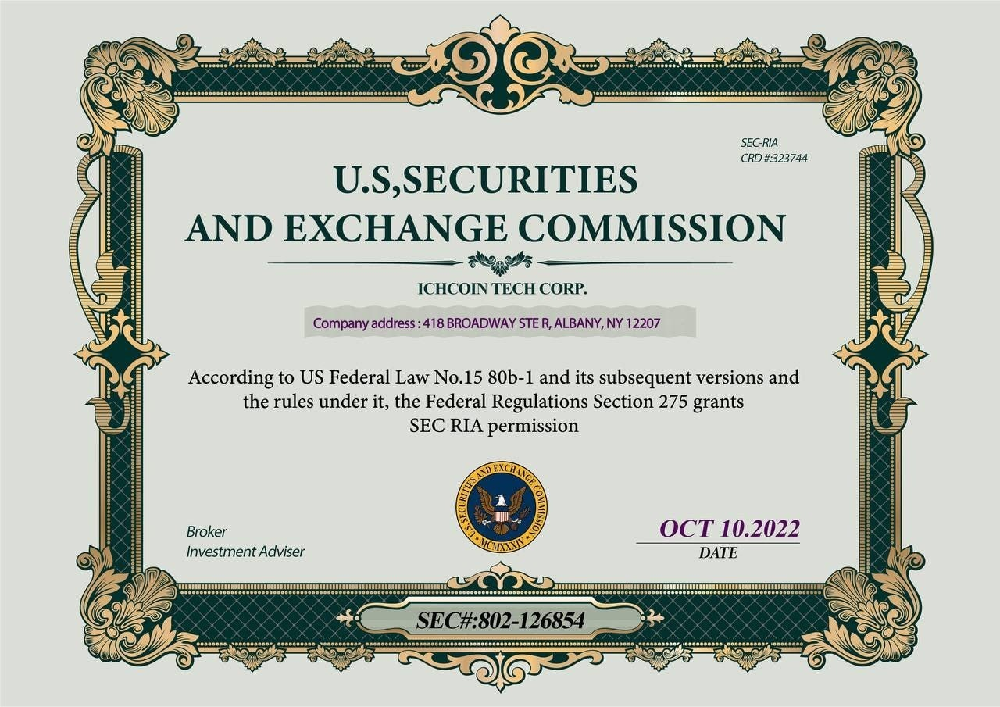
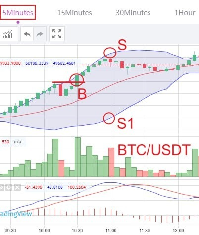

# Monday 20240212

## 08:36AM

A new week has started, and yesterday's Super Bowl was incredibly exciting. I believe this week will be just as thrilling for our investments and learning, as today we will commence the comprehensive internal testing and learning plan for the 'Ai Robotics Profit 4.0' investment system!

* What are the important strategies for our holdings today?
* Which portfolios will we choose for this internal testing plan? The 'AI 4.0-2024 Industry Outlook Report' will provide us with clear guidance!
* What are the duration and profit targets for this plan?
* Which friends will qualify for this round?
* How can those not selected keep up with this plan?
* What significant benefits will our strategic partners bring us?
* What is today's first internal testing trade signal?
* How can it be accessed?

Stay tuned, as I will share these important informations shortly.

## 08:48AM

Over the past decade, four major tech companies have collectively spent over a trillion dollars on stock buybacks. The substantial cash reserves imply more room for further buybacks. The cash these tech giants hold indicates that there are still hundreds of billions in positive news not yet released, so their stock prices are likely to continue rising.

This suggests the current investment environment is sound, and our AI leader $NVDA can be confidently held.

\$TSLA has also seen recent positive developments, making it a viable hold as well.

Furthermore, nine spot Bitcoin ETFs have purchased 216,309 bitcoins (valued at $10.3 billion) within 21 days of their launch, exceeding the 190,000 bitcoins currently held by $MSTR. This will drive the price growth of BTC, benefiting our holdings in $MSTR and $MARA.

In conclusion, we can confidently hold our stock portfolio!
Next, I'll focus on sharing the internal testing plan, starting with an excerpt from the **2024 Industry Outlook Report**.

## 09:11AM

Last week, I carefully reviewed the 'AI 4.0-Expert and Investment Advisory System' Annual Industry Research Report for 2024, which mainly summarized data across four categories and 12 industries. Key data highlights include:

1. Growth Industries
   1. Technology\
       Evaluation: Positive\
       Overview: Sectors such as AI, smartphones, and computers show good growth, while the automotive industry is average.\
       ETF: XLK\
       Representative Stocks: $NVDA, $MSTF

   2. Cryptocurrency\
       Evaluation: Positive\
       Overview: Bull markets born from halving cycles, stocks related to Bitcoin hoarding, mining companies, and cryptocurrency trading centers greatly benefit.\
       ETF: IBIT\
       Representative Stocks: $MSTR, $MARA, $CLSK, $RIOT, $COIN

   3. Industrial\
       Evaluation: Neutral\
       Overview: The aviation sector's profit growth is converging, but aircraft manufacturers have plenty of orders.\
       ETF: XLI\
       Representative Stocks: $BA, $DAL, $FDX

   4. Non-Essential Consumer Goods\
       Evaluation: Neutral\
       Overview: The e-commerce sector is confirmed to be recovering, while the car market is slightly weak.\
       ETF: XLY\
       Representative Stocks: $AMZN, $TSLA

2. Natural Resources
   1. Energy\
       Evaluation: Neutral\
       Overview: Factors like the Red Sea crisis and OPEC's production cuts support oil prices, but significant performance opportunities are challenging to come by.\
       ETF: XLE\
       Representative Stocks: $XOM, $CVX

   2. Materials\
       Evaluation: Neutral\
       Overview: Copper and gold see demand for a rise, with industrial gases in the chemical sector being the most stable, but significant gains are hard to come by.\
       ETF: XLB\
       Representative Stocks: $BHP, $LIN

3. Rate-Sensitive
   1. Real Estate\
       Evaluation: Neutral\
       Overview: Rate cuts are beneficial for REITs, but industrial land vacancy rates are rising.\
       ETF: XLRE\
       Representative Stocks: $VTR, $EQIX

   2. Finance\
       Evaluation: Neutral\
       Overview: Increased consumer spending benefits payment companies; banks face rising costs.\
       ETF: XLF\
       Representative Stocks: $JPM, $V

4. Non-Cyclical\
   1. Communication Services\
       Evaluation: Positive\
       Overview: Streaming, AI, etc., boost advertising.\
       ETF: XLC\
       Representative Stocks: $META, $NFLX

   2. Consumer Staples\
       Evaluation: Neutral\
       Overview: Inflation easing benefits the food, personal care, etc., industries.\
       ETF: XLP\
       Representative Stocks: $PG, $COST

   3. Healthcare\
       Evaluation: Neutral\
       Overview: Positive on pharmaceuticals and healthcare services, not on health insurance.\
       ETF: XLV\
       Representative Stocks: $LLY, $UNH

   4. Utilities\
       Evaluation: Neutral\
       Overview: AI development drives electricity demand, and power costs decrease.\
       ETF: XLU\
       Representative Stocks: $NEE, $SO

## 09:23AM

Overall, the technology, communication, and cryptocurrency industries are worth prioritizing, laying the foundation for increasing the success rate of the testing plan.

Relative to others, the cryptocurrency industry's certainty and volatility are even more appealing because we are currently in a bull market driven by seven catalysts!

1. The halving cycle arrives in April.\
This makes it more precious than gold, marking an irreversible bull market!

2. The robust growth of 11 Bitcoin spot ETFs.\
Continuously increasing market increments make the bull market healthier and more efficient.

3. Reports from top ETF providers indicate that the adoption of cryptocurrency ETFs by national financial advisory networks is increasing, making cryptocurrencies a mainstream investment.

4. The ongoing growth of the cryptocurrency mining industry, which is expanding in size and recently showed signs of increased financial stability.

5. The anticipated launch of functional second-layer networks in the fourth quarter of this year will once again improve the efficiency of crypto network transactions, thereby continually reducing usage costs.

6. Rate cuts have boosted the industry's outlook.

7. Historically, election years have been favorable for cryptocurrencies, which can serve as a political bargaining chip to gain votes.

## 09:31AM

Given these important insights, next, I'll share the entire content of the milestone event - the Ai4.0 internal testing plan.

1. The nature, components, and naming of the plan

    This plan primarily serves two major purposes.

    * The first is testing: It involves utilizing high-volatility trading instruments, high win-rate low-risk trading strategies, and seizing certain trading opportunities for extensive testing to gather more data.
    This data will validate the AI 4.0 system's profitability and stability.
    * The second purpose is to gain more practical trading opportunities through higher-frequency trades to solidify and learn from the AI 4.0 course system.
    This aims to rapidly advance the practical trading skills of this term's students to expert levels, serving as one way to give back to supporters.
    'Practice is the best method of teaching,' and I will timely summarize methods and experiences after each trade!

    Therefore, I've named this initiative: **AI Robotics Profit 4.0 Investment System Comprehensive Internal Testing and Learning Plan!**\
\

2. Target\
Due to the highest comprehensive rating of the cryptocurrency market and the optimal data obtained by AI 4.0 in this market, it rightfully becomes our preferred testing subject.

3. Testing Period and Profit Target\
3-7 days, aiming to achieve at least a 60% total asset return target!

4. Slots and Internal Testing Funds\
    1. The quota is for 1000 participants.\
    As can be seen from our business school's teaching philosophy and my daily shares, I am a conservative person.
    Considering this is the first internal test, I've adopted a conservative plan.
    Friends who did not make it into the quota can observe and learn together with us.
    Those who have signed up will be given priority for participation in the next significant plan.
    Those who haven't signed up yet, can continue to do so for better opportunities!\
\
\
\

    2. Each participant receives $500 in test experience funds, provided by sponsors.\
    \
    As I've said, I couldn't possibly let everyone bear the risk for my career, so I secured these opportunities through our sponsor, ICHCOIN Trading Center. ICHCOIN Trading Center is our strategic partner and a very high-quality enterprise.\
    \
    They have obtained regulatory and related financial licenses from the U.S. Securities and Exchange Commission (SEC), the U.S. Financial Crimes Enforcement Network (FinCEN), the National Futures Association (NFA), and the UK's Foundation, as shown in the diagram.
    Or you can learn more about the company's details in the 'Academy' section of their application homepage.\
    \
\
\
\
    \
    Most importantly, they plan to list on the NASDAQ; and they strive to create a high-quality ICO launchpad, offering us better investment and cooperation opportunities. For example, the EIF token was issued here.\
    \
    Moreover, we have a high degree of alignment in the AI field; they have plans for a $10 billion fund dedicated to AI-related projects, providing an excellent platform for many of our talented students to showcase their abilities.
    I'll share more about how to select a cryptocurrency trading center when time permits.

    3. Use and Allocation of Funds

        * After the test is complete, if there's a loss with the test experience funds, there's no need to repay the lost capital; just return the remaining funds.
        * If in a profitable state, you only need to return the principal; profits can be transferred to your cryptocurrency wallet or bank card at any time.

5. Execution Process

    1. My assistants have already notified the selected participants, provided them with accounts and test funds, and have taught everyone how to use them; if you have any questions, please contact her, or watch the instructional video obtained through ICHCOIN Trading Center that I'll share later.

    2. Once the plan starts, I will select the most robust trading strategies and signals based on AI 4.0 system prompts, with an expected frequency of no more than 2 trading signals per day.

    3. To ensure each trading signal is strictly followed, my assistant will share the trading signals with the selected participants via a Telegram channel.\
    For example, we just shared a trading signal; did everyone strictly follow it?\
    A profit of over 50% was achieved in a very short time.\
    The combination of certain opportunities and stable signals immediately catalyzes the profit effect!

    4. Participants involved in the testing must strictly follow the trading signals for buying and selling, and after executing, send a screenshot of the trade to the group or to my assistant for review.\
    Later, everyone can share screenshots of their trading process or profits.

6. Testing Criteria and Rewards

    1. Success Criteria\
    If the total capital achieves a profit of over 60% within 3-7 days, the plan is considered successful.

    2. Failure Criteria\
    Any instance of loss during trading indicates failure in the testing results.

    3. Rewards\
    If the test is successful, all participants will be rewarded with one year of free access to Ai4.0.

Have you all experienced the exceptional performance of the Ai4.0 investment system and the profit opportunities in the cryptocurrency market?
Congratulations to everyone who achieved 50-100% returns in a short period.

Feel free to share your profit process and screenshots.

## 10:59AM

I'm truly elated today, as our held stocks have once again garnered outsized returns, particularly $MSTR and $MARA, which performed exceptionally well, delivering over 40% and 50% profits for many friends!
Moreover, the price of $NVDA has hit a new all-time high, with a staggering 46% increase since the first day of sharing!

Most importantly, today our first AI 4.0 internal testing trade signal has achieved significant profits in a short period!

What preparation should the friends who did not qualify make?\
What techniques were used in the trade signals prompted by the AI 4.0 system in this trade?

Before the close, I'll share on the following topics:

1. A deep dive into the 'AI Robotics Profit 4.0' Investment System Comprehensive Internal Testing and Learning Plan.
2. Practical teaching: Summary of the first internal test trading process.
3. What is the second internal testing trading signal? What kind of profit will be gained?
4. Course sharing: Basic application of MACD and trading secrets 1-1.

## 02:34PM

### Closing Commentary

Dear friends, good afternoon.

This morning, I focused on sharing the preparation work for the Ai4.0 internal testing plan, including the evaluation and selection of various industries. The cryptocurrency market's current bull run has developed faster and stronger than I anticipated.

Confidence comes from in-depth research data and derived investment logic!

This morning, I summarized seven catalysts for the cryptocurrency market bull run, of course, that's not all.

The performance of our stock portfolio illustrates that we have captured the turning point in this bull market phase!

This further validates the effectiveness of the data, and the Ai4.0 system has more room to leverage its profitability in high volatility markets.

Today's first trade went quite well; later, I will summarize the buying and selling points indicated by Ai4.0 in this trade with everyone, so we can quickly improve ourselves!

## 02:48PM

Why say the current moment is a turning point in the cryptocurrency bull market's development phase?
Is it just because we're making money? If that's the interpretation, it's too simplistic.

I've never been worried about not making money from stocks; instead, I focus more on logic and data. Today, I will share a very, very important piece of data!

* What will the second trade signal of today's internal testing look like?
* What kind of returns will it achieve?
* What new course points will I share today?

Later, I will unfold these topics one by one.
Let's first review today's stock market and our investment portfolio together.

## 03:03PM

### Key Point 1

\$NVDA's market value surpasses $AMZN for the first time in the last 20 years.

Last week, rumors circulated that $NVDA would enter the custom chip market, further consolidating its leadership  in AI chips and even potentially 'recreating an $ARM' within the company.

This news continued to stimulate the latest surge in stock price. Wall Street's upward adjustment of target prices indirectly stimulated market sentiment.

Even with a slight increase in VIX fear index, it stabilized market sentiment and the direction of stock indices.

Therefore, I must reiterate a viewpoint: Its profitability far exceeds the speed of its stock price increase!

### Key Point 2

What similarities does $TSLA's current pattern have with $MSTR before its rise?

I encourage you to compare or review my investment notes. It may not have the explosive power of $MSTR, but how will short-term new buying points present themselves? You could try to find this answer.

## 03:16PM

### Key Point 3

Cryptocurrency-related stocks lead the market by a significant margin.

Noah's options strategy for cryptocurrency-related stocks has once again been highly successful. Tomorrow morning, I'll have him share with everyone and lead an internal test using the 'α&β' trading system (a part of Ai4.0).

Friends, let's take a look at an important piece of data from the 'Ai4.0-Expert and Investment Advisory System'. As shown in the figure: historically, Bitcoin performs best in February and October, with only two declines in 11-12 instances, hence these two months are referred to as lucky months.

Do you understand the value of this lucky February?

With the Bitcoin halving mechanism approaching in April, we can see from the strong performance of Bitcoin and our stock portfolio that we have captured the moment when the bull market begins to strengthen. Do you agree?

## 03:30PM

Observing BTC's daily chart, it smoothly breaks through the resistance line and completes eight consecutive days of gains, which is rare in history!

Taking $MSTR as an example, its rise has been significant each day recently, and the candlestick pattern is very strong.

What does this mean for our Ai4.0 internal testing plan, friends? Have you thought about this question?

Firstly, I believe it brings three benefits to our EIF Business School and the Ai4.0 system:

1. A more active market (phase) is conducive to increasing the frequency of tests, thus obtaining more extensive test data.
2. It is more conducive to verifying the stability of the Ai4.0 system.
3. Deepening cooperation with strategic partners.

## 03:43PM

I believe that friends will have a deep understanding of the first point. As investors, they naturally prefer more active markets.

If the distance between the upper and lower Bollinger Bands is used as a reference to understand the price fluctuation range, on the daily chart, SPX shows a fluctuation range of 6.77%, while BTC's fluctuation range is 27.08%.

If the volatility is greater and the certainty is stronger (the bull market logic is very authentic), then we can get more trading opportunities and profit opportunities, which is more conducive to the two key data in the test plan: the number of times and the stability of profitability. .

Simply put, the more times it is used, the more convincing it is; the more times it is profitable, the better the stability of its profitability is proved!
This is why we chose this market for internal testing, do you understand?

## 04:00PM

The decision to list EIF tokens on ICHCOIN Trading Center was made not only because of their qualifications (they are regulated and licensed by the SEC-RIA, MSB, NFA, and the UK Foundation) but also because their future plans are beneficial to us. There are four key points to note:

1. Their AI trading center aligns with my Ai4.0 system, which is advantageous for our future practice and promotion.
2. The billion-dollar special fund plan creates an excellent talent development platform, which is beneficial for many of our outstanding students.
3. Their plan to list on NASDAQ is favorable for the future prospects of our EIF tokens.
4. Their industry reputation helps promote the Ai4.0 system.

Of course, our extensive student body supports their potential user base.

This is why we have gradually reached a deep strategic cooperation, and it's why they can provide the funds for testing.

## 04:15PM

So, what direct or indirect relations and benefits does this matter have for everyone?

Objectively speaking, I've summarized the following points:

1. Earning Profits\
I believe in the profitability of the Ai4.0 system, and I trust you have all seen its recent performance, right?
While $500 in test funds may not seem like a lot, if we achieve a total asset return rate of more than 60% in the coming days, this profit will amount to at least $300, belonging to those who qualify.

2. Gaining a Solid Investment Portfolio\
Often, investment confidence stems from practice, similar to our recent stock portfolio practice.\
\
Making money boosts confidence, right?\
Diving into the cryptocurrency bull market allows us to truly own a good investment portfolio.\
\
It's a delightful occurrence, happening right now, isn't it?

3. Learn a Stable Profit Model\
As you've observed, my teaching approach is entirely practical, which truly aids student advancement; this represents a shortcut in learning.\
\
Later today, I will consolidate the day's trades and engage in new practices, so everyone should be ready to participate!

4. Witness and Acquire a Revolutionary Investment Tool\
My desire for the success of the upcoming test plan exceeds anyone else's, as it is the culmination of my life's work.\
\
As a gesture of gratitude, I am prepared to offer each supporter and qualifier future access rights.
If it successfully passes testing and launches, it will represent significant commercial value for us (and also enhance the valuation of EIF Business School and EIF tokens).\
\
For everyone, it becomes a tool that simplifies investing and carries disruptive significance.
Let's work together; will you help me achieve these critical milestones?

## 04:43PM

I want to emphasize two important things:

1. Friends who did not qualify for this test can still sign up.\
\
Opportunities in the investment market are everywhere, and if I have a new significant plan coming up, I will prioritize those friends who were not selected for this testing phase.

2. I do not recommend using your own funds to follow our tests.\
\
The reason I only need $500,000 (1,000 people, $500 each) to complete the first round of testing is to intentionally control the number of participants.
This is a consideration of risk control. Although ICHCOIN Trading Center is willing to provide a lot of sponsorship funds and I am very confident, we must always prepare for the worst-case scenario, can you understand that?\
\
Just like trading, we invest slowly and gradually seek opportunities for growth; this is my style of action.

For example, what is today's trade? What is a contract trade? Do you know how the profit in the table is generated? Starting tomorrow, I will take some time to share some investment knowledge.

Next, let's consolidate the techniques used in today's trade.

## 04:54PM

Today's Test and Practical Teaching Summary:

1. As shown in the 5-minute BTC chart, before the buy point B was formed, I was waiting for a pullback buy point, which is when the price pulls back to the middle Bollinger Band.

2. However, BTC's trend was too strong, and the Ai4.0 system did not signal a pullback buy point.
Subsequently, the price rose strongly, breaking through the downward candle to the left of point B, forming a breakout buy point B.\
The Ai4.0 system also signaled this buy point, which I immediately shared.\
Does this remind you of the buy point I signaled for $NVDA on January 8th, friends?

3. Afterwards, the price continued to rise, and we obtained excess profits.\
When the price reached point S, did the distance between S and S1 no longer continue to expand?\
So, based on Ai4.0's signal, I shared this sell point.

* Which Bollinger Band technique was applied here?
* Was it the sell point technique in the expansion pattern?

Isn't it very simple and effective?
Have you learned it?

## 05:33PM

Just now, my assistant has notified the shortlisted participants of the trading signals through the Telegram channel. Have you strictly followed them? If you have any questions, please contact her or watch the tutorial videos from the ICHCOIN Trading Center.

Next, let's discuss a new course.

**Moving Average Convergence Divergence (MACD)** is a moving average convergence/divergence indicator, which is a widely used technical analysis tool for judging the trend of stock or other financial asset prices and the buy and sell signals of the market.

MACD consists of four parts:

* **Fast Line (MACD Line):** Calculates the difference between the short-term (12-day) and long-term (26-day) exponential moving averages.
* **Slow Line (Signal Line):** Calculates the moving average of the fast line, usually for 9 days.
* **MACD Histogram:** Drawn from the difference between the fast and slow lines.
* **Zero Axis:** The positive and negative values of the MACD Histogram are separated by the zero axis.

## 06:23PM

The zero axis of MACD can be used to determine the turning points of price trends. Combining MACD with Bollinger Bands will produce a magical chemical reaction.
In "Basic Applications and Trading Secrets of MACD 1," I will focus on sharing how to use MACD to judge the start, continuation, strengthening, weakening, and end of trends.

Today, I have detailed the planning of this internal test and its significance for each of us. This is a historic step for the Ai4.0 system, and we look forward to bringing everyone a satisfactory outcome!

Thank you again for your participation and support, and let each of us reap our dreams in this bull market round!
Tomorrow, Noah will share short-term live trading techniques with everyone and lead everyone to participate in the internal test.

Please pay attention to the group information during trading hours. Currently, this order is still being held, so please wait patiently for the new trading signals and strictly execute them.

Have a great day!
