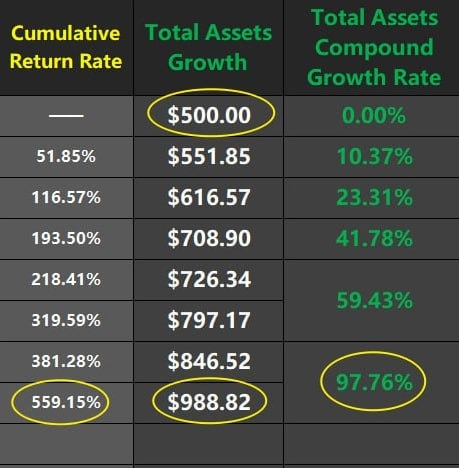
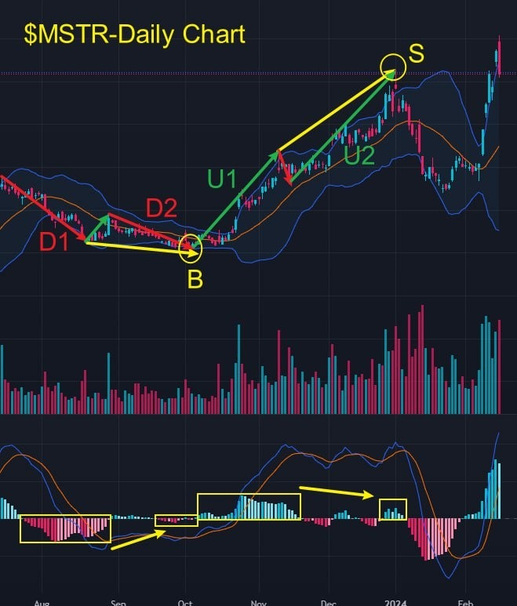

# Thursday 20240215 (Guest: Noah Johnson)

## 08:33AM

### Morning review (α&β Strategy)

Ladies and gentlemen, good morning. I’m Noah Johnson. Big congrats to those who made it into the AI ROBOTICS PROFIT 4.0 internal test. You guys doubled your money under some pretty tight conditions. Also, big shoutout to our mentor, Professor Linton Quadros, for making significant strides in his grand venture! Thanks to our mentor for bringing me into this incredible moment. It's an honor to share valuable insights with all you folks striving for excellence. Yesterday, mentor called our investment portfolio the 'four horsemen,' predicting significant paths for them this year. Our stocks are top-notch, so let's see how they perform today, shall we?

## 08:53AM

Alright, let's start things off with $CRSP. Our mentor laid down a bold prediction of tripling our return this year, showing we're all on the same page of investment logic when it comes to spotting solid stocks.

Gene editing isn't just about pushing the boundaries of life sciences or uncovering the mysteries of life. The most important part here is its power to tackle genetic diseases, save lives, boost health, and even add years to our lifespans. This tech is like playing God with the source code of life, tweaking the genome to fundamentally change what an organism is all about. It's pretty much like having the power to 'create' or 'shape' life itself.
\$CRSP has complete a breakthrough, signaling a strong uptrend. Those who followed the play the day before yesterday locked in a sweet 10% gain. We're sticking with it, doubling down. If you haven't jumped in yet, now's the time to get on board.

## 09:07AM

Yesterday, both $MSTR and $MARA saw a bit of a dip mid-session, but hold tight—today they're poised to hit new highs. I talked about some bullish crypto chatter from SEC and Fed bigwigs yesterday. Now, we've got Bitcoin ETFs seeing net inflows breaking the $4 billion mark. That means institutions gotta keep buying up Bitcoin spot, pushing prices for crypto and related stocks even higher. With inflation breathing down our necks, crypto's got this built-in hedge thanks to the halving mechanism, making it a hot commodity among investors. That's a solid mid-term investment strategy right there.

\$MSTR continues to breakout with healthy trading volume, let’s hold on firmly.

\$MARA has also reached the short-term target level of $30 that I mentioned. Let’s continue to hold it to see if it can successfully complete the breakthrough.

## 09:20AM

Let's break down how our investment portfolio has been performing since the mentor got us rolling with $NVDA on January 8th.

1. $NVDA  
   - Recommendation Date: January 8  
   - Initial Price: $505  
   - Current Gain: +43%

2. $TSLA  
   - Recommendation Dates: January 22, January 25  
   - Average Price: $195  
   - Current Gain: -0.3%

3. $MSTR (a heavy hitter)  
   - Recommendation Dates: January 17, January 23, January 30 to February 7  
   - Average Price: $489  
   - Current Gain: +61%

4. $MARA  
   - Recommendation Dates: February 6, 7  
   - Average Price: $17  
   - Current Gain: +76%

5. $CRSP  
   - Recommendation Date: February 13  
   - Average Price: $73  
   - Current Gain: +20%

## 09:50AM

Alright, I gotta ask everyone here: How much have you earned by following our strategies? What have you gotten out of being part of this group?
Based on the letters you've sent me and feedback from the mentor's assistant, I've noticed some pretty strange things. Some of you said you signed up but didn't make it into the 1000 spots for testing. I'm curious, how much have you made from your stocks? Have you compared your results to others? There are folks here who are not just actively trading with the mentor every day for extra gains, but also hitting the books hard, keeping a course diary, and answering questions. Do you see where you might be falling short?

And believe it or not, some of you missed out on the big stock picks we've been pushing. Like, the mentor mentioned early on that $MSTR is a key practical stock for this session. How much did you buy? If you're still holding onto dozens or hundreds of other stocks, how do your earnings compare with what $MSTR has brought in?

## 10:04AM

This world's pretty fair, you know. You don't get anything without putting in the work. The reason the mentor's made it this far is because he's helped a ton of people. Just look at ICHCOIN trading center willing to fork over cash and more for the mentor to test AI ROBOTICS PROFIT 4.0. That speaks volumes about the mentor's rep and the clout of EIF Business School in the industry!

I've gotta question for some of you: If you're not here to push yourself or make some money, why stick around in this group? Just to waste time? You think money's gonna fall from the sky right into your lap?

So, to those lagging behind, I'm saying catch up with the rest of us. If you're not proactive, you'll get left in the dust by this market sooner or later, always playing catch-up. Either get with the program or maybe it's time to step out and stop wasting our educational resources!

## 10:19AM

Our stocks and strategies are all thanks to AI ROBOTICS PROFIT 4.0, and that includes my α&β trading system, which is just one part of it. The course our mentor's sharing now? That's the core of the system. Master these techniques, and you all can pull steady profits just like me. If you're the aggressive type, you might even outdo me. I don't see myself as some big success story. Making 40 times the profit in 5 years? That's nothing to write home about in a market full of talent.

For example, the results from our mentor leading us through this internal test. This market's never short on opportunities to make big money or folks creating miracles. How are you gearing up for this round of crypto bull run? Did you tackle those two questions the mentor threw out at the end of yesterday's session?

## 10:38AM

I've gotten a bunch of questions about options, crypto contracts, ICH/USDT, and others. I was thinking of diving into those today, but I reckon it can wait till tomorrow. Today, I feel it's more important to use my experience to help you folks develop a healthy mindset towards learning and investing.

You can see the significance of the AI ROBOTICS PROFIT 4.0 test plan from how the EIF token's price shot past $1. After the first test ended yesterday, the professor launched two surveys: For those lucky enough to be part of the internal test, what are your thoughts on the experience? And for those who didn't make it this round, any thoughts or suggestions?

A lot of you have been asking if there'll be another chance to participate, and honestly, I'm not sure. But I'd recommend you take the initiative to respond to those two questions. Write to the mentor, the assistant, or leave me a message sharing your thoughts. I believe the mentor will consider the survey results and look out for everyone.

## 10:29AM

I've noticed a weird trend: there's a lot more focus on the morning sessions than on the afternoons. It seems like many are just taking the fish being handed to them instead of learning how to fish themselves. That's a dangerous sign, right?

Makes me wonder, have some of you already reached financial freedom that you're overlooking the essence of investing? The training will end eventually. Are you here to learn the methods of making money or just to scrape by with a little profit? What's your plan when there's no one around to help you after the training? How will you face the market?

Friends, mastering the mentor's methods is key to winning in the investment market. My achievements today are all thanks to learning from my mentor, Professor Linton Quadros.

Let's get moving, friends. Opportunities are not lottery tickets; they are reserved for those who are well-prepared. So, I know that every afternoon everyone has a lot of gatherings and wants to enjoy life and indulge themselves, but in our group, there are some people who are very diligent in studying. They make class notes and answer course questions. In the short term, you might not feel a big difference, but after this term, you will find that there is a big gap between those who love learning and those who do not. The MACD technical strategy we are currently learning plays a significant role in actual combat. The criteria for the tutor's stock selection are all derived from this technical analysis. So, as long as you learn it, you will be able to independently select stocks in the future, becoming someone who never needs crutches, able to earn substantial profits in the market on your own. Isn't this what you want? I urge everyone to pick up your pen and notebook and take action, attend the afternoon classes every day, ask if you don't understand, and apply what you learn. That's all for today's sharing. Tomorrow, at the same time, I will share with you again.

## 02:28PM

### Closing Commentary

Dear friends, good afternoon, and thank you for Noah's wonderful sharing this morning. He emphasized the importance of learning; the leader in gene editing recommended this Tuesday - $CRSP, led the market today, aligning with my initial prediction.

We once again welcome the wonderful moments of exchange and sharing. Learning is not just about accumulating knowledge; it is also a key that opens the door to our minds and explores the unknown world. It grants us the wisdom to solve problems and remain invincible in this rapidly changing world.

Now, let's focus together, learn from the market, and welcome the enlightenment of today's wisdom.

## 02:41PM

I constantly monitor the interactions within our group, especially the teachings of my student, Noah Johnson. Seeing him lead the course so brilliantly, far beyond my expectations, fills me with great satisfaction.

The significant achievements he has made in just a few short years are also top-notch within the industry, reflecting his diligence and insight. I look forward to EIF Business School nurturing more outstanding talents like him.

I have been closely following our group's discussions and have received feedback privately from many friends. Whether or not you participated in the milestone internal test of the Ai4.0 system, every sincere share from each friend has touched my heart.

Those genuine expressions convey a love for investment, a passion for life, and a pursuit of dreams!

## 02:52PM

Perhaps, the pursuit of dreams is a lonely journey, and I believe you feel the same.

The happiest thing in life is to have a dream in your heart, know how to act, and to have a group of like-minded people accompanying and walking with you during the process of action!

Being able to write our 'Struggle Autobiography' with so many outstanding companions makes me incredibly proud.

Thank you all for your trust and support. With you, the future of EIF Business School is filled with endless possibilities!

The success of this internal test could not have been achieved without the contribution of every participant.

Although the rewards for everyone may seem small, but they represent our shared honor and progress!

## 03:06PM

Next, I will address the concerns of many friends.
Even though the Ai4.0 system selected the cryptocurrency market for this internal test; even though we succeeded under very strict rules (one mistake was considered a failure); even though we obtained important data and learned a lot from this internal test. For many of us, it is still a new investment market.

I am cautious about the idea of continuing to seek more gains in the cryptocurrency market using the Ai 4.0 system and contract trading tools!

While daring to take risks and constantly striving forward is part of our excellent gene; I believe that blindly pursuing profit is not beneficial to the outcome!

We have already achieved commendable results in stock trading. While curious about new markets, I think there are still some uncertainties, and I feel we should maintain a robust trading strategy and a cautious attitude.

## 03:16PM

The essence of investment lies in continuously learning from the market, successful people, and methods. This is the foundation of EIF Business School's good reputation accumulated over more than a decade.

What I look forward to the most is that, after this course, I hope each friend will no longer need our help and can proceed independently.

I wish for every one of you to be able to discover high-quality stocks, devise perfect strategies, and make bull stocks like $NVDA, $MSTR, $MARA, $CRSP a normal part of your investment portfolio!

I hope to see more individuals like Noah emerge from this training!

Ai4.0 belongs to everyone and society; making everyone's investment easier and every family happier is the mission given to Ai4.0 by the era, as well as my personal values.

Therefore, I hope everyone respects my decision and follows the future learning path I have planned for everyone.

And without exaggeration, once you've learned the methods, you can make good use of Ai4.0, or it's as if you possess Ai4.0.

Let's welcome today's learning journey together.

## 03:51PM

First, let's consider a few key questions:

1. Why do stock indices rise instead of fall when initial jobless claims data is perceived as negative for the indices?
2. Why did cryptocurrency benefit stocks collectively plummet today? Will this downward trend continue?

Last week's initial jobless claims were lower than market expectations, indicating an improvement in the labor market condition, which is positive for the dollar and reduces the expectation of a Federal Reserve rate cut.

This should be negative for stock indices, so why did the dollar index and VIX fear index fall while stock indices rose?

Analysis by Ai4.0 - Expert and Investment Advisory System indicates: Since last year, the number of people continuing to claim unemployment benefits has been steadily increasing; the contradiction between the abnormally low initial jobless claims and the recent rise in continuing claims suggests that the job market is slowing down, making it harder for the unemployed to find new jobs.

Therefore, upon closer examination of today's data, we find that, in the long term, this is negative for the dollar and positive for stock indices!

## 04:11PM

Looking at the SPX daily chart, when the index fell back on Tuesday this week, I analyzed the reason $NVDA stabilized the index; today, the stock index's upward movement accompanied by an increase in trading volume is still very healthy!

Now, by applying the basic knowledge of Bollinger Bands and trading secrets to understand the trend chart again, will you gain a deeper understanding?

1. What is the relationship between prices and the middle Bollinger Bands in B1/2/3/4?

   - When the trend of the middle Bollinger Bands is upward, we mainly consider going long.
   - Prices retracing to the middle or lower band form buying points.
   - Prices falling below the middle band and then quickly rising above it form buying points.\
   For example, B1/2/3/4.

2. What pattern is presented at point A on the upper Bollinger Bands?\
   - Is it the strongest adjustment pattern?
   - How will prices move after this pattern appears?
   - So, did the stock index rise this week?

## 04:22PM

- Friends, aren't Bollinger Bands incredibly simple and practical?
- Have these patterns deeply etched into your minds?
- Have you learned these from recent practical cases and actual profits?

If not yet, what do you plan to do?

Is learning important? As my best student Noah said, have you noticed the gap between yourself and others?

Shouldn't you learn more from outstanding individuals like Noah?

Next, let's consider the important information related to the cryptocurrency market presented by Ai4.0-Expert and Investment Advisory System: After 11 months, the Federal Reserve will start testing on the banking industry's risk resilience!

What impact does this have on the cryptocurrency industry?

Do you remember the regional banking index KRE I shared, and its logic as a contrarian sentiment indicator for cryptocurrencies?

## 04:30PM

The traditional banking industry operates on a centralized management model, while cryptocurrency is decentralized. I shared the logic behind this in detail on February 8th.

On March 10th last year, the collapse of Silicon Valley Bank made investors realize the advantages of cryptocurrency's decentralization, leading to a significant rise in the cryptocurrency market.

If the results of the Federal Reserve's tests are unfavorable, it could benefit cryptocurrencies; conversely, it could be bearish for cryptocurrencies. This adds uncertainty to the market, causing short-term traders and profit-takers to sell, leading to today's collective decline in cryptocurrency benefit stocks.

However, from the perspective of medium-term trading, this is the first divergence in this round of uptrends, and with cryptocurrencies supported by more and significant positive factors and logic, there's no need to worry!

The daily chart of KRE shows that the direction of the middle Bollinger Band is downward, indicating that the downward trend has not changed; and there is no bottom divergence pattern in MACD.

In later lessons, I will share this technical point!

## 04:47PM

Taking the daily trend chart of $MSTR as an example, each time the price breaks through the left-side high, a volume spike and a decline candle appear, such as at points A, B, and C.

Afterward, the price adjusts above the middle Bollinger Bands and then rises again.

Therefore, we can understand today's market sentiment as the 'first divergence in the main rising phase,' which is also a divergence turning point for medium-term trading.

We will continue to monitor changes in this event, its impact, and changes in market sentiment.

Hence, these next few days are crucial, and everyone must pay close attention to group information.

Including $TSLA and $CRSP, their changes are anticipated, and we should pay close attention to them as well.

- $TSLA represents investors turning to star stocks with significant declines.
- $CRSP represents another hot sector that runs parallel to cryptocurrencies.

There are no rises or falls without reason; when we understand the logic, formulate a good strategy, and strictly execute it, profits will follow!

## 05:07PM

Taking $MSTR as an example, what kind of strategy should we formulate? This is precisely the focus of today's lesson I want to share.

Basic Application and Trading Secrets of MACD (1-3) - Divergence between MACD Histogram and Price:

- In an upward trend, when the price is making new highs while the area of the MACD Histogram is shrinking, this indicates a top divergence pattern, often signaling that the upward trend may soon end.
- In a downward trend, when the price is making new lows while the area of the MACD Histogram is shrinking, this indicates a bottom divergence pattern, often signaling that the downward trend may soon end.

In the daily chart of $MSTR:

- The MACD Histogram in segment D2 is smaller than in D1, ultimately forming the buy point B.
- The MACD Histogram in segment U2 is smaller than in U1, ultimately forming the sell point S.

Currently, there is no top divergence pattern, so from the perspective of medium-term trading, it is advisable to continue holding the position.

## 05:20PM

Practical experience and the market are always the best teachers, a teaching philosophy that EIF Business School has adhered to for over a decade.

I believe I don't need to say much for everyone to understand the benefits of portfolio investment. Today, $TSLA and $CRSP hedged against the temporary fall of cryptocurrency benefit stocks.

However, the logic behind each stock selection, the reason for holding positions, and the method of buying and selling are the core of our successful stock operations, so we must continue to learn and make progress!

Applying Knowledge, today's Achievement Verification Rewards:

1. Identify and understand the chart of 'Divergence between MACD Histogram and Price' shared today. (worth 20pts)
2. In the face of this cryptocurrency bull market, how can more profits be created? How can the investment portfolio be optimized? (worth 30pts)

If you would like help from me or Noah, please write to us. At the end of today's session, I will have my assistant share our business card.

Have a pleasant day!
