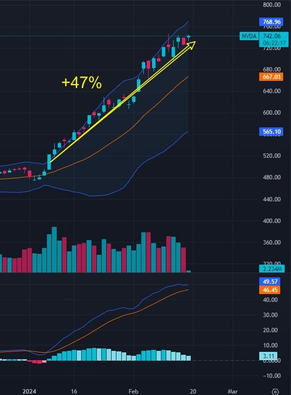
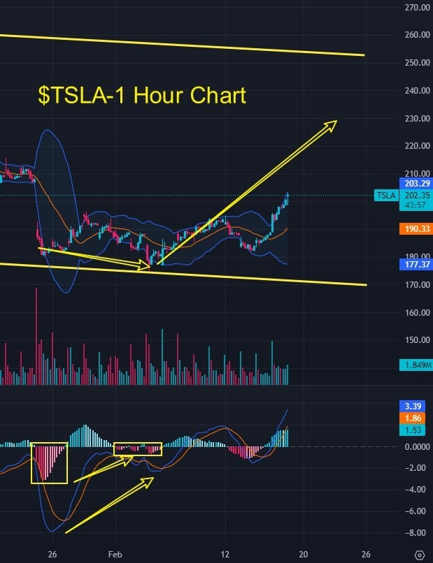
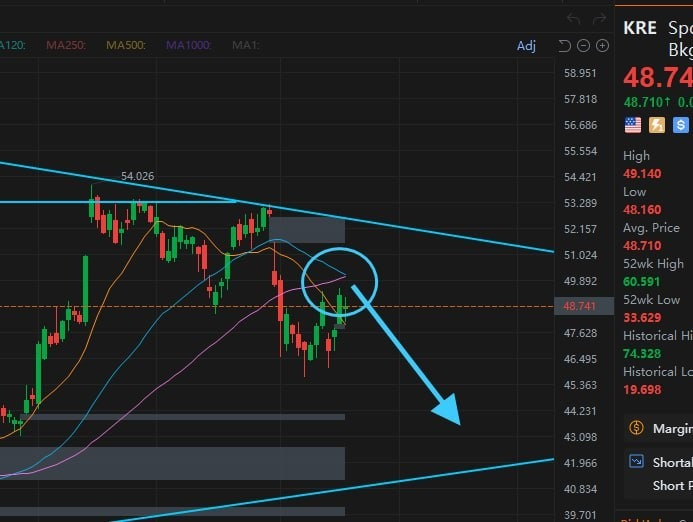

# Friday 20240216

## 08:32AM

### Good morning, dear friends

First, I must extend a special thank you to Evelyn. Last night, she handled many of your emails concerning our Ai4.0 testing plan and about how to make good investments at the moment. I have been reading your insights myself, up until 4 AM, almost sleepless... I am deeply grateful for Evelyn's dedication. This has given me a fresh understanding of your thoughts and ideas. I will share some thoughts on our investment learning journey with you all later.

Speaking of new insights, the PPI data for January was just released, showing a month-on-month increase of 0.3%, which is a bit more than people expected. This kind of news usually causes fluctuations in the stock market. But I'm curious, what do you think its impact is on the broader market? Let's discuss this topic together; perhaps we can explore its deeper meaning beyond the immediate market reaction.

## 08:44AM

When the Producer Price Index (PPI) rises, it means the cost of manufacturing goods is increasing. For consumers, this usually implies that the prices of goods might rise, which is not good news.

An increase in PPI might make the Federal Reserve hesitate to cut interest rates, which could strengthen the dollar and potentially cause fluctuations in the stock market.

From a broader perspective, although this may seem like a minor issue in the short term, its long-term impact is not significant.

There's also exciting news in the tech world: OpenAI has launched a new AI model named Sora, drawing widespread attention.

This is good news for major tech companies, especially industry leaders like $NVDA. It helps keep the stock indices stable, and since we haven't seen any signs of panic in the market (such as a significant jump in the VIX fear index), it indicates that holding stocks is safe.

## 08:58AM

Let's delve into a more meaningful topic.

Imagine $MSTR, the largest corporate holder of Bitcoin, gradually nearing eligibility to enter the S&P 500 index. This indeed marks a milestone worth discussing!
If $MSTR were included in the index, we would see cryptocurrencies subtly integrated into almost every investment portfolio.

This includes traditional 401(k)s, pension funds, and of course, every classic 60/40 investment strategy.
This is the magic of a positive feedback loop! Who wouldn't want to see this happen?

Looking at $TSLA, a bullish divergence pattern has appeared on the hourly chart, suggesting that prices are likely to rise.

I mentioned this at the beginning of the month. Does this confirm the key lesson points I shared yesterday? Did you learn from it?

So, friends, doesn't this highlight the importance of learning investment strategies?

Why not try using the hourly chart to predict: which patterns might indicate a short-term selling point?

## 09:17AM

Friends, after sharing views on the stock market and our holdings, let's have a sincere chat.

I know many of you are considering diving into the world of cryptocurrencies after seeing the data from the Ai4.0 internal test.

Yesterday, I shared my three main concerns:

- Even though we followed Ai4.0's selections and signals to achieve rare success under extremely harsh conditions and learned a lot of practical knowledge, for many of us, it's a new investment market.

- Regarding whether to continue using Ai4.0 in combination with cryptocurrency contract trading tools to pursue profits, I maintain a cautious attitude because blindly pursuing profit is not beneficial to the outcome!

- For many, this is an emerging market with uncertainties, so I lean towards being steady, conservative, and cautious.

## 09:33AM

### Directly speaking: What worries me the most? People pursuing quick money with a gambler's mindset

Those astonishing returns from our test? Achieving a 97.76% return with 20% of the portfolio. It looks great, but what you may see is just the tip of the iceberg.
No one would oppose getting rich slowly, but dreaming of striking it rich overnight in this market? That's playing with fire.

Cryptocurrencies are attractive, but the risks are real—not all is rosy and bright.

Some think that learning a bit more can solve all problems. True, education is crucial, but we must not forget: Greed can trip up the best of us, turning us into just another face in the crowd.

I've been in this industry for over thirty years and seen all sorts of people.

Some don't end up becoming savvy investors but turn into gamblers, treating the market as a casino rather than Wall Street.

This is exactly what I'm worried about.

## 09:45AM

Many friends are curious about whether there will be a second round of testing.

However, if the participation mindset is for fun, gambling, or dreaming of getting rich overnight, this does not help with our real and effective data collection and might even have a negative impact.

The fundamental purpose of conducting this test is to gather real and reliable data. This is key to deciding whether Ai4.0 is ready to be launched and is our primary task.

Although our sponsors have given us strong support, as investors, we all know that making money is not easy at all.

Simply put, I have to be responsible for our test funds, for those real and effective data, and for the reputation of EIF Business School.

So, I sincerely hope everyone can understand my position and hope this can encourage you to explore the infinite potential of Ai4.0 with me.

## 10:07AM

Another reason I remain cautious is about everyone's learning and execution capabilities.

For instance, do you understand what contract trading is? Do you know how to use it correctly?

While it may seem easy to learn, something you could grasp in a minute, I don't doubt everyone's attitude and enthusiasm for learning; I know everyone has dreams.
However, my concern is that there might not be enough time for everyone to learn.

In our recent internal test, we performed well, but not everyone's execution was optimal.

There's nothing perfect in the world, but high standards are set for high-quality data. Do you understand what I mean by this?

It's a win-win situation, and I hope everyone can benefit from it. However, how to set the relevant standards is something I've been pondering.

## 10:18AM

Seeing everyone's enthusiasm really moves me. I've taken note of everyone's needs and suggestions:

1. Everyone feels the cryptocurrency market presents a big opportunity, one that shouldn't be missed in this bull run, right?

2. Some want to include cryptocurrencies as part of their investment portfolio, like finding another basket to place their eggs in, which could hedge risks and increase returns.

3. Other friends think cryptocurrencies are even more precious than stocks and are willing to spend more time digging into and learning about them.

4. Some of you are already comparing various markets to develop plans and goals that suit you.

5. Many people have shown great interest in the recently concluded internal test; even though they weren't selected, they still hope for more such opportunities.

6. Through their experiences with stock investments, everyone is optimistic about the reliability of the Ai4.0 system and looks forward to its early market launch. If more tests are needed, everyone is willing to contribute time and even funds.

7. The trading signals issued by the Ai4.0 system have sparked great interest among everyone, and all believe it is very helpful for learning and mastering the course.

8. Everyone understands that they can't always rely on others to make choices for them; learning to judge independently is essential. Both course learning and hands-on practice are very popular.

9. Confident friends want more practical opportunities to learn and improve through practice.

I see everyone's enthusiasm and desire, which makes me both happy and feel a great sense of responsibility.
We will do our best to provide more opportunities for learning and practice, helping everyone find their path in this market full of possibilities.

Your support and understanding are my motivation to move forward, let's work hard together!

## 10:47AM

We indeed need more accurate test data to help the Ai4.0 system smoothly go to market. After all, no one wants to see an investment tool, which we've spent over five years developing, encounter issues during critical pre-launch testing stages or launch a flawed application.

After careful consideration, I believe that although I can't satisfy everyone, I can choose to work with like-minded individuals. If you:

- Recognize the value of the cryptocurrency market and are willing to treat it as a core part of your investment portfolio, just as seriously as you would with stock investments.
- Are willing to devote time to deeply learn about this field, allowing the Ai4.0 system and related courses to become your partner.
- Are not purely profit-driven and take the testing process seriously and responsibly.

Then, you are welcome to join our new testing plan and contribute together to the launch of the Ai4.0 system.

## 11:03AM

Because I've been up last night, I decided to share this news with everyone as soon as possible.

However, I must say, I cannot let everyone pay for my dream. So, today and over the weekend, I will continue to communicate with the senior management of the ICHCOIN Trading Center, hoping to secure more sponsorship and test accounts.

This afternoon's class will be led by Noah.

As for how many test accounts and financial support I can secure, I am not certain at this moment.
Once I've finalized the details, I will inform everyone in the group immediately.

If you want to join us in creating and witnessing the birth of a great and magical investment tool, please continue to register through my assistant.

We will still prioritize those friends with a high level of interest as the core criteria for selection.
Please be prepared by next Tuesday. If all goes well, we plan to launch a larger and more meaningful second round of Ai4.0 internal testing next Tuesday!

Thank you all for your support!

## 02:38PM

### Closing Commentary （α&β Strategy）

Good afternoon, folks! Noah Johnson here. Just like our beloved mentor always reminds us, learning truly opens the door to wisdom. So, what cool new discoveries and growth did you all experience this week? Despite the economic data not looking too stock market-friendly, our indexes held strong against the bearish winds. Doesn't this just scream that now's a prime time to dive into investing? Just imagine, once these clouds clear, how brilliant our investment portfolio will shine next week?

And here's something even more thrilling: This week, our EIF Business School hit a major milestone—the first internal test of AI RP 4.0 was a standout success. With our mentor on the lookout for more benefits for us, how should we embrace this groundbreaking learning opportunity? Let's dive into this topic today!

## 02:56PM

The big shots on Wall Street are finding themselves in a bit of a pickle this time. They were dead certain that the continuous non-farm payroll data, CPI, and PPI would put massive pressure on the stock market. Some were even shouting from the rooftops that the Fed was about to hike rates. Hearing all that, I felt like I was in a zoo with all sorts of noises coming at me. What do you folks think about this?

Our mentor always teaches us that the market can absorb and reflect everything. So, let's take a look at how we did this week—$NVDA, $MSTR, $TSLA, $MARA, $CRSP saw gains of +1.41%, +7.53%, +3.23%, +12.26%, and +18.47% respectively, with an average increase of a whopping +8.58%. Meanwhile, the indexes were just flatlining. This means we're far ahead of other investors in the market. How does that make you feel, friends?

## 03:18PM

Folks, what are your thoughts on the market next week? Let me kick things off with my take. From where I stand, the market's looking pretty good right now. Just look at the VIX index—it's been at a relatively low level, indicating that the market sentiment is pretty stable and loaded with positive vibes. So yeah, I'm pretty optimistic about our potential gains next week.
Our mentor often likens our investment portfolio to a "four-horse chariot." Among these, $TSLA hasn't risen much lately, but it's starting to gain more recognition from institutions; while the other three horses—leaders in artificial intelligence, cryptocurrency, and gene editing—are performing exceptionally well. Especially $MSTR and $MARA, many friends have heavy positions in them. Looking at the KRE index, it’s at resistance levels now, which means our portfolio might see some significant action next week. What do you guys think?

## 03:38PM

Of course, what we're really looking forward to next week is whether the second internal test plan for AI RP 4.0 can smoothly kick off. I think this is a more significant commercial progression for EIF Business School, but for many of us friends here, it's a fantastic learning opportunity. It's not just about getting a direct feel of the allure of the cryptocurrency market and learning the investment knowledge about contract trading. More importantly, it allows us to personally practice those strategies and methods with a high win rate—remember, the first internal test had a 100% success rate, and short-term trading is the real test of mettle.

As some friends have realized, we can't always rely on others to make choices for us. From my own investment journey, I can tell you that building your own investment model requires a case study! So, the process of learning from the mentor is a blessing, and my friends, you must cherish this rare opportunity and wonderful time.

## 03:54PM

I heard our mentor has started negotiations with ICHCOIN trading center, a company with big ambitions. I've done some research on them before and found out they have their own AI trading platform, a massive cryptocurrency market industry chain, and more future planning. That's exactly why EIF Business School could collaborate with them.

I think the outcome of these negotiations is going to be pretty good, for several straightforward reasons. First, ICHCOIN trading center really values our mentor's quality and capabilities, having already promised strong support; second, they also need EIF Business School, hoping to reach more users through us—we've got a large student body, which is a great opportunity for them. Plus, AI RP 4.0 requires a lot of real testing data, so I'm guessing we'll get more testing funds and accounts this time; and finally, with the professor himself stepping in, the results are bound to be satisfactory.

## 04:11PM

I know everyone's itching to grab this opportunity. Setting aside the profits from those test accounts and a whole year's free use of AI RP 4.0, for many, this could really be a chance to change their investment life.

Think about it—if you hadn't followed our stock recommendations recently and made some money, how could you have learned those crucial trading skills? So, this is a practical opportunity to apply some magical strategies and methods, more precious than gold or diamonds, wouldn't you agree?

What should we do next? After giving it some thought, I've got a few suggestions for everyone.

## 04:23PM

First piece of advice: make sure to sign up through Evelyn, the assistant.

- If you don't sign up, don't even think about getting a chance. Spots are definitely limited.
- If you've signed up before, I'd suggest signing up again to show your enthusiasm and determination.
- The more of you that sign up, the more likely it is our mentor could secure more testing funds and accounts for us.
- A higher number of sign-ups and participants will make our test results more beneficial.
- AI RP 4.0 is the professor's pride and effort; he needs our support. He's always been there for us, and now it's time to give back, right? So, I think everyone should go sign up asap.

## 04:42PM

Second piece of advice: claim your internal test account.
EIF tokens are listed on the ICHCOIN trading center, and some friends have received EIF tokens through investment learning points; others have recognized the value of AI RP 4.0 and the EIF token and have purchased EIF/USDT; they already own the application.

If the second internal test rolls out smoothly and you're lucky enough to be selected, the mentor's assistant will notify you. At that point, you need to be ready to claim your internal test account—download the application, receive test funds, etc.

The mentor mentioned he'd notify us of the negotiation results in the group asap, so after signing up, keep an eye on group messages or the assistant's updates. If things move quickly, we might hear something by tomorrow or the day after.

Third piece of advice: learn how to use the contract trading function.

You can get instructional videos on the trading center through the assistant, or directly get help from her.

## 05:02PM

Objectively speaking, helping EIF Business School and the mentor is essentially helping ourselves. I believe no one wants to miss out on such a win-win situation and opportunity, right?

Imagine, if due to our collective efforts, we further accelerate the launch process of AI RP 4.0. When it hits the market, I'm convinced that given the mentor's character and EIF Business School's educational philosophy, they won't forget the contribution of each and every one of us.

So, folks, this is fantastic news, an excellent opportunity for us to progress together and contribute to the professor's venture, isn't it? In my view, this isn't just a test; it's a milestone moment that can change the rules of the investment game for us. Let's give it our all, with no regrets!

Want to join? Remember to sign up through assistant Evelyn!

That's all from me; make the most of your time, and have a great weekend.
