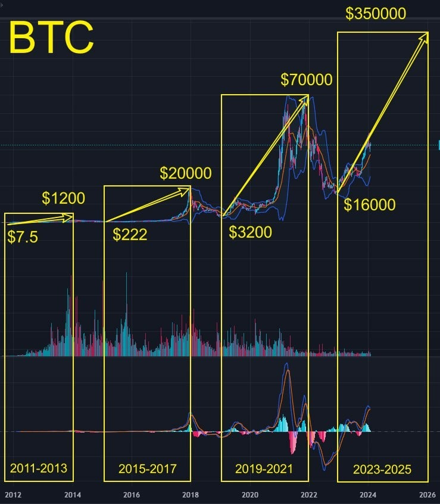
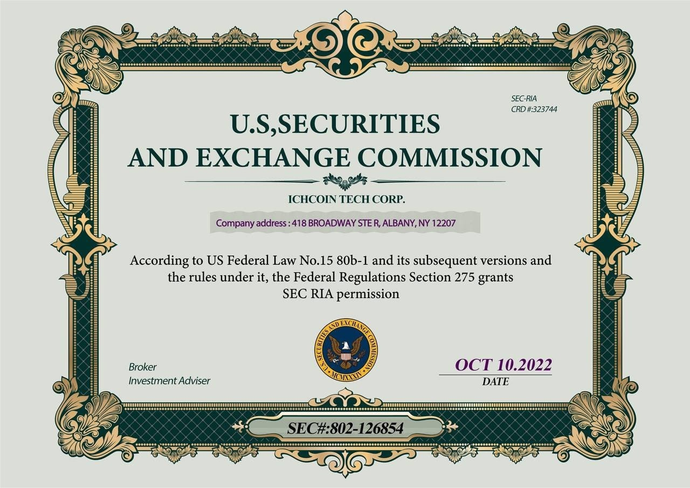

# Monday 20240219

## 10:46AM

### With passion in our hearts, on this day dedicated to honoring dreams, allow me to share with you in advance the detailed content of our plan

1. The nature, components, and naming of our plan.

    * **Objective 1:** Wider range testing.\
    We aim to employ high volatility trading varieties, high win-rate low-risk trading strategies, and seize certain trading opportunities for extensive testing, to acquire more test data to verify the profitability and stability of the Ai4.0 system.

    * **Objective 2:** To gain more practical opportunities through higher frequency trading, for consolidating and learning the Ai4.0 course system.\
    This initiative is intended to rapidly elevate everyone's actual trading skills to, or close to, expert level as a way to give back to our supporters.
    'Practice is the best method of teaching,' and I will timely summarize methods and experiences after each trade!\
    \
    Therefore, I have named this plan: The Second Internal Testing and Investment Learning Program of the Ai 4.0 Investment System!\
    \
    

2. Targets

    * The Ai4.0 system has shown optimal performance in the cryptocurrency market, undoubtedly making it our preferred test subject.
    * Based on the results of our last test, the ICH/USDT pair demonstrated greater volatility, more extensive test data, and stronger profitability. Hence, it is likely to be the primary target.

3. Testing Period and Profit Goals
Aim to achieve a total asset return rate of 60%-200% within 3-7 days!

4. Quota and Internal Testing Funds
    * The quota is set for 5,000 participants.

        Those who have not registered yet can continue to do so for a chance to be selected! Given the large number of participants, a conservative plan has been adopted. Those who are not selected will have the opportunity to observe and learn together.

        

    * Each participant will receive $500 in test experience funds, provided by our sponsor, the ICHCOIN cryptocurrency exchange center.

        They have obtained regulation and financial licenses from the U.S. Securities and Exchange Commission (SEC), the Financial Crimes Enforcement Network (FinCEN), the National Futures Association (NFA), and the UK Foundation... More detailed information about the company can be found on the 'Academy' section of the application's homepage.

    * Fund Use and Allocation Rights

        * After the test is completed, if the test experience funds incur losses, there is no need to repay the lost portion of the principal; only the remaining funds need to be returned.
        * If in a profitable state, only the principal needs to be returned; the profit portion can be transferred to your cryptocurrency wallet or bank card at any time.

    * Is it possible to operate with one's own funds?

        In principle, this is not allowed.
        Last Friday, I clearly stated that friends who meet three specific criteria could be guided by me to qualify.

        Those who have successfully completed the first internal test may voluntarily use their own funds.
        Friends who did not participate in the first internal test can only use the $500 funds provided by the sponsor for contract trading; I do not want you to take any risks for my venture!

        You may leave any excess funds (for example, funds you've transferred or EIF token rewards received) in the spot market, or purchase EIF tokens, as it's highly likely that EIF tokens will rise with the implementation of this plan.
        Making money should not be rushed; if this testing plan exceeds expectations, it's not too late to make further plans then!

5. Execution Process

    * My assistants have individually notified the selected participants who have received their accounts and test funds, and have started teaching everyone how to use them.

        If you have any questions, please contact her in advance to learn how to use it, to avoid any mistakes. Alternatively, you can watch the instructional videos I will share later, obtained through the ICHCOIN Trading Center.

        For example, after you obtain a test account, you can buy or sell a BTC/USDT contract by yourself, and then close the position immediately to confirm whether the process is familiar. If you are not familiar enough, please take the initiative to contact my assistant.

    * Once the plan starts, I will select the most robust trading strategies and signals based on the Ai4.0 system prompts, expecting no more than 2 trading signals per day.

    * To make each test more beneficial for data collection, we will continue to share trading signals with the selected participants in the Telegram channel. My assistant will register and invite the selected participants to join the group.

    * Participants involved in the test must strictly follow each trading signal and after executing, send a screenshot of the trade to the group or to my assistant for verification.

6. Standards of Success and Failure for the Test Results, and Rewards

    * Criteria for Success
    If the total test funds achieve a profit of over 60% within 3-7 days, the plan is considered successful.

    * Criteria for Failure
    The occurrence of even a single losing trade will be deemed a failure of the test results.

    * Rewards
    Should this test proceed successfully, I will gift all selected participants one year of free access to the institutional version of Ai4.0 (valued at $50,000).

Friends and comrades, without exaggeration, we stand at an unprecedented historical moment, ready to welcome the grand opening of the second internal test of the Ai4.0 investment system.
This is not merely a test but a splendid opportunity to delve deep into the fantastical world of cryptocurrencies, a golden moment for each of us to leap forward on the path of investment.

Here, I passionately urge everyone to focus all your attention on tomorrow's WhatsApp and Telegram group messages.
Each signal, each update, could be the key to unlocking new worlds. Together, let's firmly hold this key and unlock the unknown possibilities.

If you haven't yet joined this thrilling journey, act now. Signing up now is casting a vote of trust in your dreams and future.
The Ai4.0 system will be our guide, leading us on an enchanting journey through the captivating world of the cryptocurrency market!

## 11:18AM

I call upon every partner to make the most of this precious weekend, to prepare thoroughly. Review the courses, familiarize yourself with the operations, adjust your mindset, and face the challenges in the best possible state.
We stand our ground like warriors, driven not only by our desire for victory but by our belief that, united as one, nothing is impossible.

I wish us all resounding success in the upcoming Ai4.0 investment system internal test, making this plan a triumph of our collective effort and wisdom.
Hand in hand, let's create our future. Let's all look forward to the door to a fantastical world that the Ai4.0 system will open!

Eagerly anticipating meeting you tomorrow, as we step towards success together.

Best regards,
Linton Quadros
