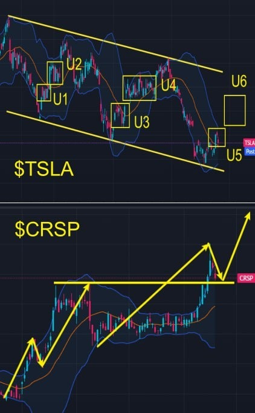
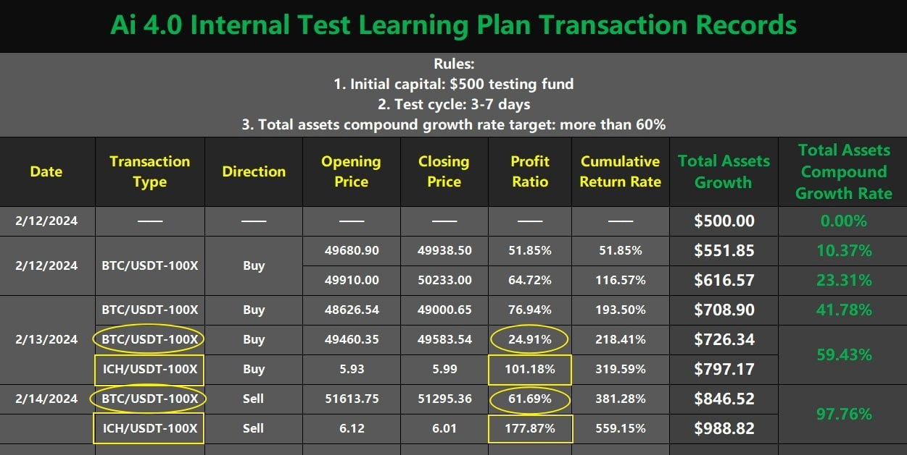

# Tuesday 20240220 (Guest: Noah Johnson)

## 08:32AM

### Morning Review (α&β Strategy）

Ladies and gentlemen, good morning! Noah Johnson here. Today marks the launch of the AI-RP 4.0's second testing plan, a moment we've all been eagerly awaiting! A big shoutout to our mentor and the EIF Business School team for their relentless efforts in kicking off this historic journey. Today, we're not just participants but witnesses to history, standing at a new starting point, ready to embrace the endless possibilities of the future.

Everyone, please stay highly engaged with our group. How will our holdings evolve? What spot investment opportunities will this testing plan reveal? A journey of wisdom and victory is about to unfold. Let's explore the future together and move forward hand in hand.

## 08:44AM

First off, I've got some great news to share with everyone.

* Wall Street has raised the target price for $NVDA again to $850.
* $CRSP's gene editing technology has been selected as one of the 'Nature' magazine's top seven technologies to watch in 2024, with institutional investors increasing their stakes.
* $TSLA CEO Elon Musk says producing ten million cars a year is not out of the question.
* AI-RP 4.0-Expert and Investment Advisory System: The likelihood of an Ethereum spot ETF being approved by May is around 50%, with a 100% chance within the next 12 months.

So, our portfolio strategy is to continue holding stocks, and I'll be sharing an important investment opportunity shortly.

## 08:59AM

I find it crucial to share the trend of BTC, given that $MSTR is one of our major holdings. The daily trend chart for BTC clearly shows the golden moving average combination MA13/34/55 in a bullish alignment, which is a classic sign of strong bullish momentum; the MA34 has already crossed above the MA55. Recently, the price has been moving sideways, with the MA13 nearing the candlesticks, similar to the left side's B1, anticipating an increase in volume today as BTC is expected to hit a new starting point B2. Therefore, in the medium to short term, even though $MSTR and $MARA have already seen significant rises and profits, they still have upward potential, and we can afford to hold patiently.

## 09:13AM

Many friends have been asking me about the future trend of EIF tokens. I believe we missed a chance to double our bag, and today, I'll focus on recommending this spot investment opportunity, especially for those who didn't make it into the second internal test plan of AI-RP 4.0. EIF/USDT is a cryptocurrency, and for comparison, let's assume EIF Business School is a Nasdaq-listed company, primarily focused on investor education, now developing an artificial intelligence investment advisory system. What kind of fundamental change would this bring to the company?

AI-RP 4.0 is an artificial intelligence investment advisory system, and I believe it's undoubtedly a revolutionary advancement that will have a significant positive impact on the company's fundamentals.

## 09:25AM

* AI-RP 4.0 represents a technological lead in the field of investor education, offering unprecedented personalized investment advice and solutions, making it truly unique.
* This breakthrough technology meets an urgent market need, possessing enormous market potential and vast room for growth.
* The launch of AI-RP 4.0 will create stable and predictable continuous revenue for EIF Business School, enhancing the company's profitability.
* The brand influence of EIF Business School will significantly increase, drawing more investor attention and further consolidating and expanding its market share.
* It will drive innovative development in the entire investment education industry towards more intelligent and personalized directions.

## 09:38AM

Given that AI-RP 4.0 not only helps investors make wiser investment decisions but also significantly improves their return on investment, it represents an important milestone for the company itself as well as a positive development for the entire investment education industry and the broader investment community. For investors seeking long-term stable growth and technology-driven investment opportunities, EIF Business School undoubtedly becomes an attractive investment choice. Considering all the above points, EIF tokens are poised for significant growth potential. Currently, with the implementation of the AI-RP 4.0 second internal testing plan, EIF tokens are in the spotlight, making now an optimal time for investment—the earlier, the better!

## 09:59AM

From the daily trend chart of EIF/USDT, we can clearly discern a few key pieces of information: When the EIF Business School's internal training session began, the price of EIF/USDT started to stabilize around $0.53. As the course progressed and the first internal testing plan succeeded, the price has doubled.

EIF/USDT, serving as the incubator for AI-RP 4.0, was used by the mentor for fundraising, addressing the two major bottlenecks of research funding and talent. With AI-RP 4.0 nearing its launch and the second internal testing plan underway, could its price double again? I think it's highly likely, and I believe everyone is as optimistic about the test results as I am. Therefore, I see it having explosive potential in the short to medium term, and it also holds great value as a spot investment in the medium to long term.

## 10:10AM

So today, I'm specifically recommending EIF/USDT as one of our investment portfolio options. You can purchase it by downloading and registering on the ICHCOIN cryptocurrency trading center app. Friends who need help can DM the mentor's assistant. If you're more inclined towards short-term trading, you should particularly consider investing in EIF/USDT.

It's understood that the 5000 spots sponsored this time by the mentor have already been filled. I know many friends couldn't sign up in time due to a busy weekend and missed this golden opportunity. However, don't be disheartened, because our mentor has once again shown his deep care for us by securing an additional 200 spots. Friends who have already signed up can reach out to the mentor's assistant to claim their spot, and those who haven't signed up can continue to do so to secure this valuable opportunity.

## 10:24AM

Trust me, opportunities like this are incredibly precious and rare; we must cherish them. This afternoon, our mentor will personally guide us into the exciting world of the internal test and announce the first trading signal. For those who have already received their accounts and test funds, please be fully prepared. Start getting familiar with the contract trading process now, such as how to place a contract order for BTC/USDT or ICH/USDT, and then immediately execute a sell order. If you have any questions about the process, don't hesitate to contact the mentor's assistant or watch the instructional videos from the ICHCOIN trading center. Time is of the essence, and preparation is crucial. Let's get ready to welcome the mentor's share before the stock market closes this afternoon.

## 02:35PM

### Closing Commentary

Dear future investment masters of EIF Business School,a wonderful afternoon to you all!

Today, the stock market's decline has brought us a sense of tension and unease. Just as we are trying to understand the reasons behind it, a surprise awaits us: the second internal test plan for Ai4.0 also chose today to launch.
Is this really just a coincidence? Perhaps, it's fate's way of reminding us to seek safe havens in turbulent markets and to emphasize the wisdom of embracing diversified investment strategies.

We are confident in the test but still need to pay attention to some details. We will focus all our efforts to ensure nothing goes amiss.
The first signal of the Ai4.0 test plan is about to be released, and we look forward to it opening new pathways to stable returns, marking the beginning of our joint exploration and growth.
Let's stay tuned, step into the future together, and look forward to witnessing this exciting moment with everyone!

## 02:51PM

First, let's discuss the reasons behind today's decline in the stock indices. The Ai4.0-Expert and Investment Advisory System indicates that $NVDA will announce its Q4 earnings data after the market closes on Wednesday this week.

$NVDA is not only a leader in artificial intelligence but also a barometer for the global stock market, so it's crucial for us to delve deeper today!

This data could potentially be a turning point for the market. The market relies on a few large growth stocks, and if their performance disappoints for any reason, there's a risk of a market pullback.

The selling pressure from profit-takers triggered market panic, with $NVDA experiencing a maximum drawdown of around -6% today.

However, friends, let's consider two questions:

1. Will the performance data of $NVDA be disappointing?
2. How should medium-term holders identify selling points?

## 03:06PM

The Ai4.0-Expert and Investment Advisory System indicates that $NVDA's quarterly revenue is expected to increase from $6.05 billion a year ago to $20.378 billion, with earnings per share (EPS) at $4.56, an increase of over 700% from the same period last year.
This is undoubtedly a significant reassurance.

Although the forecasted data is positive and we still maintain around a 40% return to date, the candlestick chart will reflect all the information.

I have been asked by friends early on how to sell medium-term holdings. My view is very simple: continue to hold as long as the price does not fall below the daily middle Bollinger Bands.

This requires not only a strong heart but also a big-picture view. You can still follow this strategy.

Moreover, today I add a new strategy:

1. Sell half of your position if the price falls below the daily middle Bollinger Bands.
2. Sell the other half of your position when a top divergence pattern appears on the daily trend chart.

## 03:19PM

Consider the following:

1. What is the current form of $MSTR daily Bollinger Bands?
2. Based on the course shared last week, consolidate the technical point: What is a top divergence pattern?

If you know the answers to these two questions, you'll be able to adeptly apply my second strategy. Congratulations, you're entering the ranks of practical experts.

Additionally, the VIX fear index has risen slightly in recent days. When the stock index continues to rise, this minor increase while maintaining a value below 20 is considered normal and healthy.

Next, let's discuss other holdings.

> Ps: I am monitoring the Ai4.0 data to obtain robust signals. I will release today's first trading signal at any moment and will notify you in real-time.

## 03:31PM

\$MSTR has remained strong even as the stock indices have fallen, mainly because it has become one of the most profitable companies among those benefiting from cryptocurrencies.

This morning, Noah shared that the probability of Ethereum spot ETF being approved by the SEC in May and within 12 months is 50% and 100%, respectively.
The impact of such an event is significant. Before the SEC approved the Bitcoin spot ETF in January this year, the cryptocurrency market experienced a rapid and significant increase due to the anticipation of this event.
As ETH, the second-ranked token in the cryptocurrency market, has recently outperformed BTC.
Therefore, it's easy to imagine that the leader, BTC, would not show weakness. Absolutely not!

Thus, the current price adjustment of $MSTR is entirely a mid-way build-up of strength, similar to the surge in trading volume seen at points A and B on the left. This turnover rate will bring more robust upward momentum!

## 03:43PM

Similarly, with the halving event approaching, $MARA, as a stock benefiting from cryptocurrencies, is expected to perform exceptionally well.
The significant pullback today highlights its volatility, indicating that its potential for explosive growth during a rally is even greater. Thus, we need not worry about diminishing profits; we can afford to hold patiently for larger gains.

\$TSLA, with improving fundamentals, looks bullish for the future, suggesting a patient hold is advisable. Currently, it is in the U5 stage. Without significant deviations, including the upcoming U6 stage, it can be compared to the previous U1, U2, U3, and U4 stages.

\$CRSP, retracing to its main support line, remains bullish for the future. As gene editing is a mainstream market direction, the outlook is decisively bullish, and everyone can hold patiently.

## 03:54PM

Overall, today's pullback in the stock indices has had some impact on market sentiment, but there is no need for panic; this is my stance!

Profit retracements in the stock portfolio are often normal, highlighting the importance of diversified strategies.

For instance, recently, many friends have increased their holdings in EIF tokens under Noah's advice, gaining more profits.
Therefore, EIF/USDT spot is very worthy of investment, and I will approach the second internal test plan for Ai4.0 with the fullest enthusiasm and the most pragmatic attitude.

I am fully confident in this plan, and objectively speaking, once the testing process goes smoothly, I believe the market will fairly grant EIF/USDT a higher price.
So, everyone can consider it as an important part of their investment portfolio！

## 04:10PM

It has come to our attention that many proactive friends have prepared exceptionally well, which is commendable!
This is not only a testing plan but also a learning and investment program, and I would like to emphasize a few key points.

1. About Learning
The Ai4.0 courses already shared are sufficient to handle over 80% of market scenarios. It's crucial to apply what we learn; this is more important than anything else.
I will timely consolidate the methods of each trade, so please plan your study time accordingly. I will share new knowledge after the completion of this plan.

2. About Investing
    * With 5,200 accounts, each receiving $500, this constitutes a $2.6 million investment plan. However, the profits belong to everyone, and there is no responsibility for losses, so please cherish this funding.
    * Friends who participate in the internal test for the second time do not have test funds and can only use their own funds for trades.

## 04:23PM

### Therefore, please note

1. Friends participating in the internal test for the first time are not allowed to use their own funds; I will not be responsible for anyone violating this rule.

2. Please pay attention to the information in the Telegram group - [AI4.0 2nd Testing-VIP](https://t.me/+m-m2epg4V0A4NzRh).
This group is specifically for sharing trading signals, as the current WhatsApp group contains a lot of information, and I am concerned that messages in this group might overshadow the trading signals.
Those few who have not yet joined the ‘AI4.0 2nd Testing-VIP’ group should do so promptly, as I will be releasing trading signals at any time.

3. Strictly follow the trading signals: Pay attention to selecting the correct token name, leverage, order type, contract quantity, trading direction, etc. This is key to ensuring the safety and reliability of each transaction (test) data, and it is also key to profitability!

## 04:38PM

During our last test, I began researching the ICH/USDT contract trading pair and continued this research for over a week.
As you can see, during the 13th and 14th of this month, we utilized this variety for contract trading, earning profits of +101.18% and +177.87% respectively. These returns significantly exceeded the returns of the BTC/USDT pair at the time, which outperformed by +76.27% and +116.18%.

This efficiency is undoubtedly remarkable, and these two high-volatility ICH/USDT contract trades laid the foundation for exceeding our +60% target expectation - ultimately, our total asset return rate nearly doubled!

I have shared before that ICH/USDT is the native token of ICHCOIN Trading Center, similar to Binance's native token BNB.
Only quality trading centers offer such investment options. It's like the star player of a team, making it scarce and highly valuable.
Historically, BNB's price increase reached up to 690000%!

## 04:58PM

## 05:04PM

To better achieve profits, today I will be trading the ICH/USDT pair.
Moving forward, I will pay close attention to the trends and opportunities of this pair, leveraging my understanding of ICHCOIN Trading Center's grand future plans. The future investment opportunities for this variety are immense!

Friends, have you located it in the contract trading market?
Also, make sure on the ‘Assets’ page, you have completed transferring all your ‘Capital Account’ funds of 500 USDT into the ‘Contract Account’.
If you are not yet prepared, please hurry and contact my assistant!

Later, I will share trading signals in real-time in the Telegram ‘AI4.0 2nd Testing-VIP’ group. I am currently observing the data, and so far, it's looking good.
After this trade is completed, please share your trading results in this group or with my assistant for verification purposes.

Friends, please pay attention to the signals in the ‘AI4.0 2nd Testing-VIP’ group!

## 07:30PM

Friends, wasn't this trade incredibly efficient? In about 45 minutes, we achieved over 50% in profits. Congratulations to those who followed through with this trading signal.

Applying Knowledge, today's Achievement Verification Rewards:

* How well do you understand investing in the cryptocurrency market?
* Was the operation of today's contract trade easy for you? Were there any challenges, such as it being time-consuming?
* Compared to traditional stock investments, what advantages or disadvantages do you think this type of trading has?
* What specific techniques from the Ai4.0 courses did we utilize in today's trade?

Answering the above questions can earn you 50 investment learning point.

## 07:46PM

Friends, are you all feeling joyful?

The second internal test of Ai4.0 has concluded one of its trading signals spectacularly, with a single trade achieving 50% profit in 45 minutes and a total asset return rate of over 10%.
This is a testament to our collective courage and wisdom！

Why were we able to realize so much profit in such a short period, and how can it be calculated?
Tomorrow, I will share this along with technical highlights.

For those who missed today's opportunity, please be prepared and seize the moment to join tomorrow's journey.
Opportunity favors the prepared, so take action immediately. Each test is a precious journey of growth, embarking on the journey with a longing for victory.

## 07:59PM

To ensure meticulous management, I will assign my assistant to periodically review everyone's trading records.
This is both a mark of respect for our precious test funds and a responsibility towards providing accurate trading data, as well as a testament to our deep care for everyone's learning and progress.

Tomorrow promises another day brimming with opportunities. I have already arranged for Noah to lead us on a new trading journey in the morning.

Please cherish this not easily come by opportunity. Under the guidance of the Ai4.0 system, each test signal is a gateway to the path of stable trading. Throughout this course, we need to tread carefully, considering each decision thoroughly.

Looking forward to tomorrow, may we all set sail together, to welcome every moment of growth and success! Let's take measured steps towards the pinnacle of victory. I look forward to connecting with you all in tomorrow's session!

Have a pleasant day.
