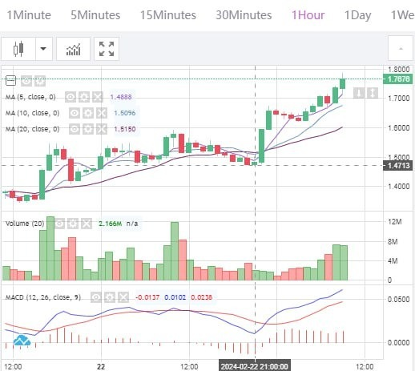
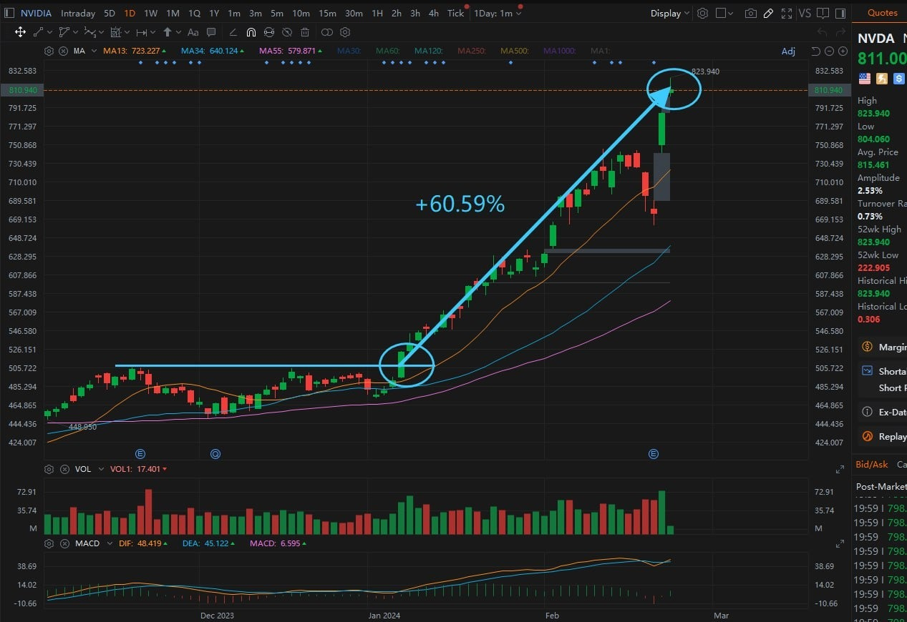
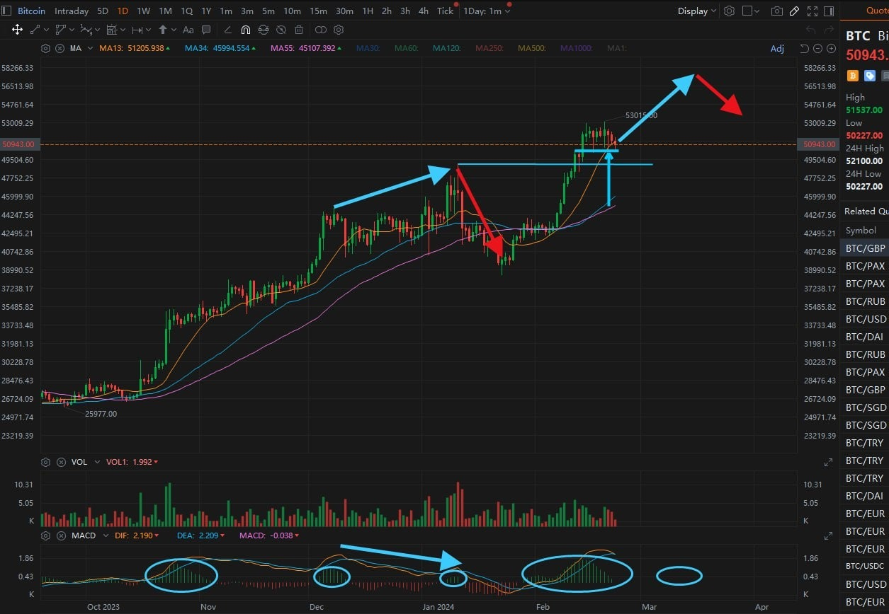
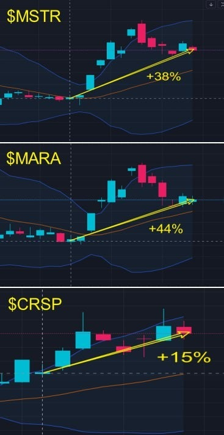
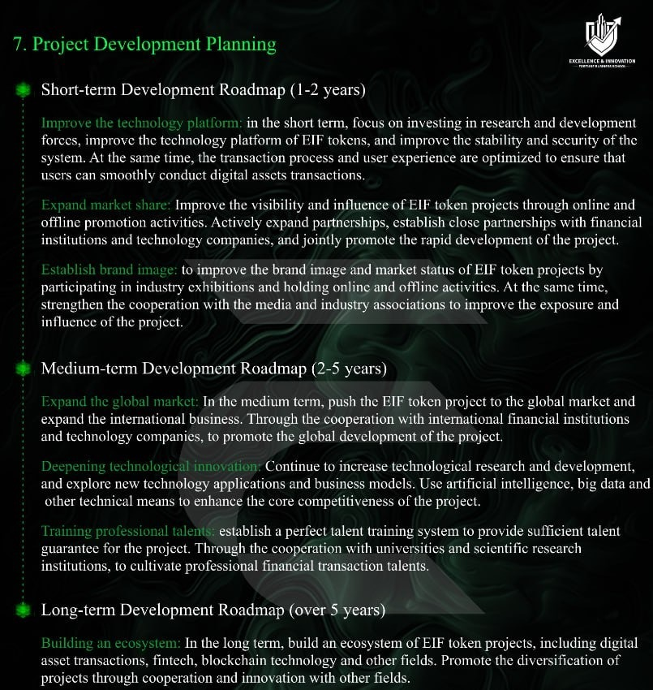

# Friday 20240223

## 08:40AM

### Morning Review （α&amp;β Strategy）

Good morning, ladies and gentlemen! Noah Johnson here.

I'm absolutely thrilled to see the magnificent success of the mentor's AI-RP 4.0 system's latest test and our investment learning journey! We're not just moving forward; we're leaping into the future of fintech. This round has truly opened the door to understanding how learning and applying the AI 4.0 system is a massive game-changer.

Every rock star participating in this test has contributed more than just their part; you've put AI-RP 4.0 on the path to becoming a market star. Your involvement is the loudest endorsement of its future potential. And I've seen many friends follow the mentor's advice to support children in need. Acts of kindness, big or small, can perhaps keep them from hunger or even dare them to dream!

## 08:51AM

First off, I need to quickly share an important piece of information: With the successful completion of the second internal test of the AI-RP 4.0 system, the price of EIF tokens has soared, revealing clear investment opportunities.

Yesterday, I solemnly incorporated EIF tokens into our investment portfolio. I shared my perspectives on various aspects such as technological innovation, brand impact, investment value, the effects of the second internal test, price stability, avoiding speculation, and long-term value, setting a mid to short-term target price of 3USDT. Did you take this seriously? If you claim to be a supporter of EIF Business School and missed this point, I think it's a mistake.

## 09:01AM

The price of EIF tokens is currently around $1.77. When I highlighted it yesterday, the price of EIF tokens was about $1.57, with the lowest price reaching around $1.47. Based on these two prices, the increases are: +12.74% and +20.41%, respectively. This jump not only showcases the sensitivity of smart capital but also highlights the significant boost major positive events give to EIF tokens. Its impact is even comparable to the frenzy $NVDA triggers in the stock market with its earnings exceeding expectations. This is a vivid portrayal of the volatility and opportunities that coexist in the cryptocurrency market. Let's compare it with $NVDA, the best performer in our portfolio yesterday and today; EIF/USDT's strength is no less significant. So, will this trend continue?

## 09:14AM

Today, I want to talk about three points: the strength of the strong, the impact of disruptive investment tools, and the efficiency of capital utilization.

When our mentor shared it in the "Top 10 List of Hot Investment Targets in 2024," the price was $0.6186, with a current increase of +186.04%. On January 8th, the mentor shared $NVDA, which has since increased by +60.59%. Compared to the strongest stocks, EIF tokens have come out on top.
As a disruptive investment tool, the AI-RP 4.0 system has not yet been launched, and the impact of the current internal testing is relatively modest. However, it has already led to an almost 200% increase in the price of EIF tokens. The continued progression of work will bring limitless prospects to EIF tokens.

## 09:33AM

Starting from yesterday, when I added EIF tokens to our portfolio, the current returns on our stock portfolio of $NVDA, $MSTR, $MARA, $CRSP, and $TSLA are +20%, +2%, +2.3%, +2.4%, and 0%, respectively, with an average increase of +5.34%. Although this outperforms the broader market, the return rate is far below that of EIF tokens.

Thus, EIF tokens provide us with a new spot investment profit growth point, wouldn't you agree? Suppose we allocate a portion of our portfolio funds or use recent profits to invest in EIF tokens; this would significantly enhance our capital utilization rate.

Most importantly, whether in the short to medium term or the medium term, this holds immense value. In my view, investing in EIF tokens is not just about chasing profits but also about collectively witnessing the infinite possibilities that this disruptive investment tool brings us. This is an investment in the future and intelligence.

Folks, $3 might be reached soon. Are you prepared to miss out? It's still a good time to get in.

## 09:55AM

Yesterday, our holding $NVDA—the market's brightest star—led the entire market to a climax. So today, there might be short-term traders taking profits, causing selling pressure, which is a normal occurrence. Therefore, we shouldn't be overly concerned. After this profit-taking phase, our holdings are likely to rise again. Currently, many of us still have significant positions in $MSTR, and looking at BTC's daily trend with the mentor's MACD technique, there's no sign of a top divergence yet. Hence, the current pullback is considered a consolidation phase, allowing us to continue holding. Of course, if you're looking to balance short-term and medium-term profits, I believe there's no better choice than spot investing in EIF tokens.

## 10:17AM

Combining Bollinger Bands with MACD? Pure genius. This isn't just about winning the second internal test; it's about rewriting perceptions of the AI-RP 4.0 system with a legendary 12-win streak. Seizing those clear opportunities in ultra-short trading is the pinnacle of trading mastery. It requires a combination of sharp market insight and swift action, leaving others in the dust. This is my summary of this internal test because I studied each trade carefully. You might think this seems simple after seeing the mentor's brilliant explanations, but it encompasses decades of investment expertise.

So, let's elevate this energy, gain a deeper grasp of the AI-RP 4.0 system, and master some advanced investment magic. Through relentless learning and application, we will continue to dominate our destiny, gain the ability to create wealth, and embark on the journey of wealth creation.

## 10:29AM

Folks, the investment market is full of variables and unknowns every day; no one knows whether tomorrow will bring sunshine or rain. But by learning, it's like having the ability to forecast the weather, preparing for the unknown challenges and enhancing our ability to respond.

As someone who has been through it, I went from being naive and ignorant to learning the mentor's methods and creating my own 'α&β' trading system. This journey is a testament to the desire for knowledge and relentless pursuit.

You are more fortunate than I was, catching up with the rapid development period of EIF Business School, with so many excellent resources available. So, I urge everyone who is striving for progress to complete the mentor's assignment from yesterday - the questionnaire survey, as it will be more beneficial for our upcoming investments.

## 10:38AM

Ai4.0 second internal test trading satisfaction survey questionnaire:

1. How satisfied are you with the investment test results of the Ai4.0 system combined with the cryptocurrency market? Any suggestions for improvements?
2. Following our recommendations, what are your recent gains in the stock market and cryptocurrency market?
3. Based on recent investment results and learning experience, please share your views on the importance of learning investment knowledge, and indicate the investment and learning areas that you are more interested in.
4. What are your investment plans this year? What revenue goals do you hope to achieve?
5. In your future investment journey, who, and what kind of help would you prefer?

## 10:48AM

Folks, this is not just a simple survey; it's a golden key to co-creating our future. It reflects EIF Business School's commitment to putting students' interests first and, more importantly, represents our responsibility and commitment to our investment future.

Imagine, with just a few minutes of your time, we can jointly reform the AI-RP 4.0 system, making it a super engine on your investment journey. Getting involved means you're giving wings to your investment destiny—based on your feedback, the mentor will carefully tailor a course feast and concoct the elixir of investment success, ensuring each of our investment journeys is more precise and efficient.

So, let's vote together, using our wisdom and decision-making to shape a more perfect AI 4.0 system. This is your commitment to your future and the best proof of your relentless pursuit of success. Let's take action together. This afternoon, let's once again listen to the mentor's insights.

## 02:34PM

### Closing Commentary

Dear future investment masters of EIF Business School, good afternoon!

This week, our Ai 4.0's second internal test was completed beyond expectations. Your active feedback and valuable suggestions have provided key guidance for our future investment and learning paths.
Faced with such inspiring results, I can't help but think about how we can better serve each one of you, helping you sail through the ocean of investment to reach the ideal shore.

In the past week, we have witnessed the market's enthusiastic response to $NVDA's better-than-expected earnings report. Are you satisfied with this week's achievements? With the backdrop of $NVDA's earnings surpassing expectations, how do you think the market will evolve next? This event not only proves the market's limitless potential again but also reminds us that we must always be ready to respond to every fluctuation in the future market.

More importantly, how should we plan our future investments and learning to ensure that every friend can achieve their investment goals in this market full of opportunities and challenges?
Let's share our views, discuss strategies, and plan for the future together.

## 03:02PM

This week, the stock market's focus was undoubtedly on $NVDA's better-than-expected earnings report, which had a stabilizing effect on market sentiment and effectively reduced the risk of a significant pullback in stock indices.
Against this backdrop, we need to calmly examine more macro factors, such as the potential impact of the Federal Reserve's interest rate policies on the market.

According to the latest analysis by the Ai4.0-Expert and Investment Advisory System, the possibility of starting to cut interest rates this year will be postponed to June, with four rate cuts expected throughout the year in June, July, September, and December.
This forecast provides us with an important reference, based on which we have sufficient reason to expect that the stock market will show a trend of steady growth in the coming period.

By deeply analyzing the financial data of important companies and macroeconomic policies, we can make more accurate market predictions and investment strategies, advancing steadily in the unpredictable stock market.

## 03:24PM

In academic discussions, when we talk about a "steady rise," we refer to a slow growth pattern. The most direct impact of this phenomenon is the significant increase in trading difficulty.
In other words, achieving returns of over 50% in the short term becomes more challenging, and this is an objective reality we must face.

Although our new portfolio, the EIF tokens, has performed exceptionally well recently, thanks to everyone's enthusiastic support for the internal testing plan, our stock portfolio's average return this week was slightly less impressive than the broader market. This represents the challenge we face.

From the letters we've received, it's clear that many friends highly value the concept and investment logic behind the "Four-horse Chariot" I am optimistic about the long-term investment logic among these.
However, chasing profits is something each of us is thinking about and doing because we have invested time and rightly expect more in return.
It's a common sentiment, and I believe everyone can agree with this point, right?

## 03:36PM

Our common goal in this process is to optimize investment strategies and achieve higher returns. By sharing knowledge and experience, we can overcome market challenges together and achieve our wealth growth goals.

So, what should we do?
In fact, we have two options before us: to wait patiently or to take action. Each choice has its unique advantages and challenges.
To make the best decision, I want to hear more from you, which is why I encourage everyone to participate in the survey—because everyone's opinion is crucial, and the group and EIF Business School belong to each of us.

Waiting means exchanging time for the potential upside in stock prices; taking action, on the other hand, requires us to flexibly adjust our investment strategies.
Recall the end of January to the beginning of February when our portfolio did not achieve the expected profit in one week. What measures did we take? How did we face the challenge together, adjust our strategy, and ultimately welcome a turnaround?

## 03:57PM

At that pivotal moment, we implemented measures to enhance our short-term trading strategies, and indeed, we immediately observed significant results: our selected three stocks with short-term potential - $MSTR, $MARA, $CRSP - have to date achieved remarkable gains of +38%, +44%, and +15% respectively, and continue to maintain a strong momentum.

This experience is an unforgettable treasure for every member of us. It not only proved our team's ability to collaborate and quickly adapt to changes but also witnessed our collective growth and progress.

The continuous pursuit of excellence, maintaining a vigorous spirit, and aspiring for greater achievements resonate deeply within each of us.
The success of the second internal test of the Ai 4.0 system has provided us with a solid foundation of confidence to face future challenges.
Now, it is time to engage in deeper thinking and jointly plan our next investment journey!

## 04:20PM

Few friends suggested that we should increase our position in $MSTR. The reason is the approaching halving cycle, and as a stock that benefits most from cryptocurrency, it is expected to gain even more!
This is indeed a good idea. Next week, if the performance of $TSLA is still not up to par, we can certainly consider shifting its position to $MSTR.

Another friend mentioned investing in Bitcoin because, although $MSTR is likely to rise, it will be influenced by the stock index, while the trend of Bitcoin will be smoother, as can be seen from the trend comparison over the past few days.

This is a sensible choice, understanding this point indicates that you have grasped the current mainstream investment direction. My expectation for the price of BTC in this cryptocurrency bull market is $350,000. Do you all remember the logic behind this?
This is why I have been strongly recommending stocks that benefit from cryptocurrencies recently.

## 04:32PM

Some friends have mentioned that we should invest in EIF tokens because Noah has given it a mid-short term growth expectation of 100%.

EIF is my enterprise, and of course, I welcome everyone to participate in EIF tokens.
Frankly speaking, the future listing of the Ai4.0 system and the global strategic planning (see EIF whitepaper) will happen sooner rather than later.
Based on the current functionality of Ai4.0 and the results of the internal testing plan, it supports my development plans.

Let's objectively look at the reasons for the recent rise in EIF tokens:

1. When the 14th session of our internal share started, the price of EIF began to stop falling.\
This is because when I called everyone to join and return to the internal share group at the beginning of January, I mentioned that there are two important tasks for this session - sharing the Ai4.0 course and the internal testing plan.

2. The success of the two internal testing plans.\
This has shown many investors the value of EIF tokens as the incubator of the Ai4.0 system.

## 04:47PM

If I have the fortune to expedite the listing plan of Ai4.0, it would be a tremendous boost to the price of EIF tokens.
Imagine, when the AI 4.0 system, a disruptive investment tool, officially takes the global stage, EIF tokens will become the focus of market attention, undoubtedly a scenario worth envisioning!

The logic and foreseeability are simple:

1. An early listing implies that our technological and market preparations have been completed ahead of schedule.
This first-mover advantage will greatly enhance investors' confidence in EIF tokens just like BTC in 2009.
2. The moment the listing news is announced, the eyes of global investors will be on EIF tokens, whose value will continue to climb as the AI 4.0 system is promoted and applied.

I can clearly tell you that I am planning in this direction, and it is what the public expects.
Therefore, we can consider EIF tokens as an investment portfolio more important than $NVDA and $MSTR. I believe that EIF will not disappoint you, whether in terms of short-term or medium-term returns.

## 05:10PM

Indeed, some friends have mentioned that we should continue using the Ai4.0 system for contract trading.
The reason is that cryptocurrency contract trading, as a flexible strategy in the cryptocurrency market, not only provides an opportunity to leverage small amounts for larger gains but also offers a perfect platform for us to pursue certain opportunities.

This trading model allows us to achieve substantial profits, even dozens or hundreds of times the return, under a controlled risk premise.

Correct, as everyone knows, the charm of the cryptocurrency market lies in its limitless possibilities. Just as some friends have been reminiscing about the story of Bitcoin and pizza, that's just the return on spot trading.
Contract trading, as a strategy in the market, offers us similar opportunities, allowing us to find our own wealth stories amidst the volatility of cryptocurrencies.

## 05:24PM

Contract trading is just one of the trading functions within the cryptocurrency market, and the investment opportunities in the cryptocurrency market extend far beyond this.
When considering incorporating contract trading into our investment portfolio, we need to collectively establish a deep understanding and broad recognition of this investment method.

This requires not only good execution, as demonstrated in the internal testing of the AI 4.0 system, but also a proper balance of risk and reward during the investment process.
I invite everyone to deeply explore and consider whether you are ready to embrace this efficient and flexible investment method.

Let's maintain this positive spirit of exploration. I sincerely invite every future investment masters to think actively and contribute their insights, making it essential to complete the survey.

## 05:37PM

Participating in the survey is actually an opportunity for profound reflection on your own investment attitude:

* Are you fully committed?
* Do you maintain a humble attitude towards learning?
* Do you have your own unique insights?
* Are you able to keenly grasp the mainstream investment opportunities in the market?
* Are you planning for your investment future, rather than just going with the flow?

We especially value those friends who show outstanding quality in the survey responses. I promise to give them special attention and cultivation, just like Noah.

Our future learning and investment plans will be optimized based on your general will and suggestions, ensuring that the Ai4.0 system can provide us with more accurate support and services.

In fact, the testing and optimization of Ai4.0 is an ongoing process.
One of the core goals of our internal sharing this session is to ensure that each participant can achieve profits exceeding the value of the institutional version ($1 million/year).

## 05:49PM

1. How satisfied are you with the investment test results of the Ai4.0 system in combination with the cryptocurrency market? Do you have any suggestions for improvement?

2. Based on our recommendations, how have your recent earnings been in the stock market and cryptocurrency market?

3. Considering your recent investment results and learning experiences, please share your views on the importance of learning investment knowledge and indicate the areas of investment and learning that interest you most.

4. What are your investment plans for this year? What profit goals do you hope to achieve?

5. In your future investment journey, what kind of support do you wish to receive from me, Noah, or my assistant, and Ai4.0?

## 05:56PM

Please remember to promptly return the test funds to ICHCOIN. Some friends might have missed this message yesterday, and we hope you can take action as soon as possible.

During the return process, don't forget to extend our deepest thanks to the ICHCOIN offline customer service team. Their selfless support was key to our ability to conduct the tests smoothly.

Through this small gesture, we not only showcase the noble qualities of EIF Business School members but also acknowledge their hard work.
After today's share, my assistant will share their contact information, please cherish and utilize this valuable resource.

After returning the test funds, the remaining profits can be used to purchase EIF tokens, withdrawn, or donated to charity.

For those who have spontaneously responded to my call to donate to charity, I want to say, your every act of kindness brings more light and hope to this world. Investing in the future, especially the future of children, is the deepest pursuit and vision for a better life.

## 06:08PM

Our team is not just an investment group but a large family filled with love, mutual aid, and win-win cooperation.
I will lead every friend who encounters Ai4.0 and chooses to walk with us to discover their potential and build achievable dreams.
Let every member walk further on the path of investment, making every family happier because of our existence.

In the blink of an eye, it's the weekend again, time to temporarily set aside the busy investments and spend time with our dearest family.
In these peaceful moments, enjoy quality time with friends we long to connect with deeply, listen to each other's hearts, and share the joy of life.
At the same time, this is a golden opportunity to calm down, think, and plan our investment strategies for the coming week.
Let's enrich ourselves with love and wisdom, injecting more vitality and anticipation into the new week.

May your weekend be filled with warmth and joy, letting love and thought go hand in hand, making life and investment equally splendid.
